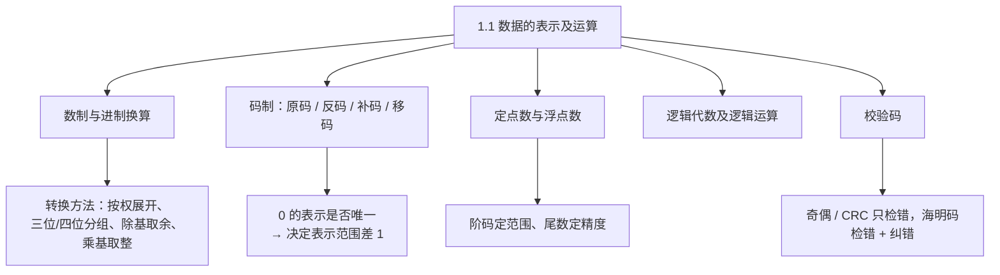
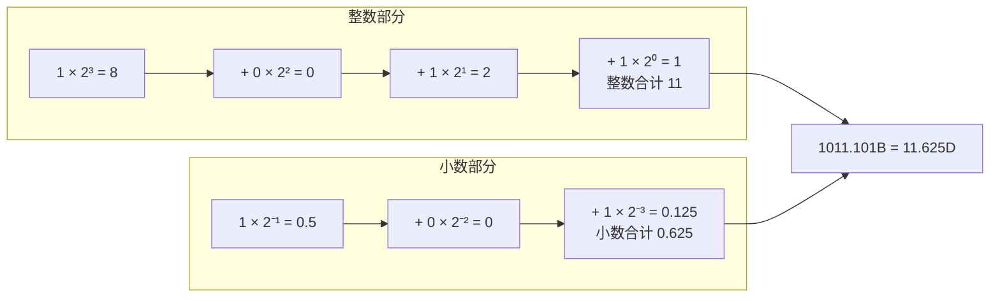
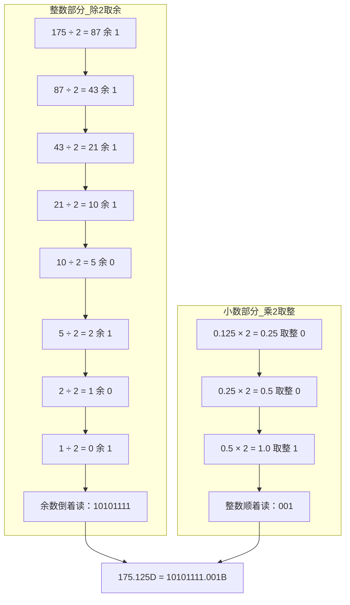
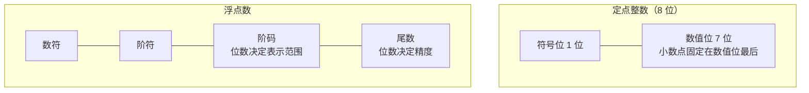
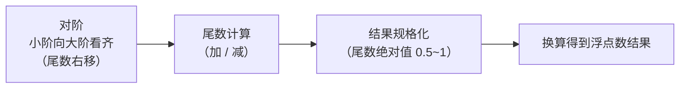

课程链接：视频《1.1 数据的表示及运算》（软考程序员系列课程）

视频链接：

## 本节概述

本节是系列课程的第一节课，进入教材第 1 章「计算机系统基础知识」，本节讲解「数据的表示及运算」，是软考程序员上午题的核心基础。视频讲师强调：软考知识点覆盖面很广，但**考点有侧重**——本节中详细展开的内容都是重点和历年考点，一笔带过或标注"了解"的内容只需留个印象即可。本节脉络依次是：数制及进制换算 → 码制（原码、反码、补码、移码）→ 定点数与浮点数 → 逻辑运算 → 校验码。

先看一张本节知识地图，对整个 1.1 节有个全景印象：

## 数制及其表示

计算机中常见的进制有四种，它们都是"按基数进位"的计数法：

| 进制 | 基数 | 进位规则 | 表示符 |
|---|---|---|---|
| 二进制 | 2 | 逢二进一 | B |
| 八进制 | 8 | 逢八进一 | O |
| 十进制 | 10 | 逢十进一 | D |
| 十六进制 | 16 | 逢十六进一 | H |

> [!NOTE]
> 考试时题目不一定写明"二进制""八进制"，而可能直接给数字加后缀或用下标表示，例如 `1011B`、`(257)O`、`AFH`。看到这些表示符要能认出它属于哪种进制。

十六进制的数码要注意：前九位是 1-9，从第十位（10）开始改用字母 **A-F** 表示（A=10、B=11、C=12、D=13、E=14、F=15）。

## 进制转换之二进制转十进制

二进制转十进制采用**按权展开法**：以小数点为原点，每一位数字乘以它所在位的"权值"，再全部相加。小数点左边是整数位，第一位权值为 **2⁰**，往左依次是 2¹、2²、2³……；小数点右边是小数位，第一位权值为 **2⁻¹**，往右依次是 2⁻²、2⁻³……。

> [!TIP] 通俗理解
> "权值"就是这一位代表的"面额"：个位是 2⁰=1，往左每一位翻倍，往右每一位减半。每位数字乘以自己位上的面额，最后加总即可。

例如 `1011.101B`：整数部分 1×2³+0×2²+1×2¹+1×2⁰ = 8+0+2+1 = 11；小数部分 1×2⁻¹+0×2⁻²+1×2⁻³ = 0.5+0+0.125 = 0.625；合起来就是 11.625D。

下面这张图展示了每一位"面额"与相乘求和的过程，看一遍就能记住按权展开法：

## 进制转换之二进制与八/十六进制互转

二进制转八进制用**三位分组法**：以小数点为界，整数部分从右往左、小数部分从左往右，每三位二进制数为一组；不足三位就补 0——整数部分在**最左边**补 0，小数部分在**最右边**补 0。然后每组对照"二进制—八进制"对照表换成等值的八进制数码，按原顺序写出即可。二进制转十六进制同理，只是改成**每四位为一组**。

| 二进制 | 八进制 | 十六进制 | 二进制 | 八进制 | 十六进制 |
|---|---|---|---|---|---|
| 0000 | 0 | 0 | 1000 | 10 | 8 |
| 0001 | 1 | 1 | 1001 | 11 | 9 |
| 0010 | 2 | 2 | 1010 | 12 | A |
| 0011 | 3 | 3 | 1011 | 13 | B |
| 0100 | 4 | 4 | 1100 | 14 | C |
| 0101 | 5 | 5 | 1101 | 15 | D |
| 0110 | 6 | 6 | 1110 | 16 | E |
| 0111 | 7 | 7 | 1111 | 17 | F |

> [!NOTE]
> 这张对照表最好背下来，因为分组换算全靠它。视频中强调：**忘了也别慌，可以在考场现场推**——用按权展开法把每组算出来。例如四位二进制 `0110`：0×2⁰+1×2¹+1×2²+0×2³ = 2+4 = 6；`1100`：0×2⁰+0×2¹+1×2²+1×2³ = 4+8 = 12，12 超过 9，按"10 是 A、11 是 B、12 是 C"的规则，得 **C**。上午题考试时间足够，现场推导也来得及。

视频讲解的示例：将 `10101111.001B` 转八进制——整数部分从右往左每三位一组得 `10|101|111`，最左边不足三位补 0 得 `010|101|111`，查表为 2、5、7；小数部分 `001` 正好三位，查表为 1。所以结果是 `257.1O`。

同一个数转十六进制：整数部分每四位一组得 `1010|1111`，查表为 A、F；小数 `001` 不足四位，最右边补 0 得 `0010`，查表为 2，结果 `AF.2H`。

反向转换（八/十六进制转二进制）是上述过程的逆运算：**每一位八进制数码展开成三位二进制，每一位十六进制数码展开成四位二进制**，展开不足位数时在左边补 0（此为教材内容，与分组法相对）。

## 进制转换之十进制转二/八/十六进制

十进制转其他进制要**整数、小数分开处理**。整数部分用**除基取余法（短除法）**：反复除以基数，每步记下余数，直到商为 0，把余数**倒过来写**就是结果。基数即进制数：二进制基数 2、八进制基数 8、十六进制基数 16。小数部分用**乘基取整法**：反复乘以基数，每步取出整数部分（取出的整数不再参与下一次乘法），直到小数部分为 0，把取出的整数**从上往下顺次写**。

> [!TIP] 通俗理解
> 整数"除"、小数"乘"，方向正好相反，记成口诀：**整数余数倒着读，小数整数顺着读**。

视频讲解的完整示例：175.125D 转二进制。整数部分 175 连续除以 2，余数依次为 1、1、1、1、0、1、0、1，倒过来写就是 `10101111`；小数部分 0.125×2=0.25 取整 0，0.25×2=0.5 取整 0，0.5×2=1.0 取整 1，从上往下读得 `001`。合起来正是 `10101111.001B`（与上一节的例子互为印证）。

> [!NOTE]
> 考试中的小数部分常取 1/2、1/4、1/8、1/16、1/32 这类"干净"的数，乘几次就能乘到 1，方便口算。

## 二进制数的运算

二进制数的基本运算规则与十进制相似，只是进位规则变成了"二"：加法**逢二进一**，减法**借一当二**，乘法按位相乘（1×1=1，含 0 即为 0）。这些规则在后面码制和机器数运算中会反复用到。

## 码制：原码、反码、补码、移码

码制解决的核心问题是：**如何在计算机中表示带正负号的数**。以下均以八位二进制为例，规定**首位是符号位：0 表示正数，1 表示负数**，其余七位为数值位。

**原码**：直接写"符号位 + 数值的绝对值"即可。但原码有个致命问题——用它做加减运算结果会出错。视频演示：按原码逐位相加计算"1-1"，得到的结果与期待的 0 并不吻合。这正是引入反码、补码的动机。

**反码**：正数的反码与原码完全相同；负数的反码是**符号位不变、数值位以原码为基准逐位取反**（每位 0↔1，所以叫"反"码）。

**补码**：正数的补码与原码、反码相同；负数的补码是在反码的**最后一位加 1**。补码的妙处在于：正数与负数按补码相加能直接得到正确结果——"1-1"用补码算恰好等于 0，与运算的期待值完全吻合。所以计算机内部统一用补码做加减运算。

**移码**：符号位与原码、反码、补码的**符号位相反**，数值位与补码相同（即在补码基础上把首位反过来）。移码主要用于浮点数的阶码。

> [!NOTE]
> 一句话串联四种码：负数从原码出发，**数值取反得反码，末位加 1 得补码，符号位反过来得移码**；正数则是原码 = 反码 = 补码，只有移码的符号位不同。

0 的表示是码制的一个重要考点。原码和反码都存在 +0 和 -0 两个 0（原码 `00000000` 与 `10000000`，反码 `00000000` 与 `11111111`）；而**补码的 +0 和 -0 相等**（都是 `00000000`，-0 从 `11111111` 末位加 1 后进位溢出回 `00000000`），移码的 +0 和 -0 也相等（`10000000`）。正因为补码、移码让 0 的表示唯一，多腾出了一个编码位置，它们的表示范围才比原码、反码多"1"。

| 数值 | 原码 | 反码 | 补码 | 移码 |
|---|---|---|---|---|
| +1 | 00000001 | 00000001 | 00000001 | 10000001 |
| -1 | 10000001 | 11111110 | 11111111 | 01111111 |
| +0 | 00000000 | 00000000 | 00000000 | 10000000 |
| -0 | 10000000 | 11111111 | 00000000 | 10000000 |

## 定点数的表示范围

定点数就是小数点位置固定的数，分为**定点整数**（小数点固定在数值位最后）和**定点小数**（小数点固定在符号位之后，即纯小数）。以八位（1 位符号位 + 7 位数值位）为例，各码制的取值范围如下：

| 码制 | 定点整数 | 定点小数 |
|---|---|---|
| 原码 / 反码 | -(2⁷-1) ~ +(2⁷-1)，即 -127 ~ +127 | -(1-2⁻⁷) ~ +(1-2⁻⁷) |
| 补码 / 移码 | -2⁷ ~ +(2⁷-1)，即 -128 ~ +127 | -1 ~ +(1-2⁻⁷) |

> [!TIP]
> 范围公式不用死记，记住"**两种范围相差 1**"就够了：补码、移码因为 0 的表示唯一，负数方向多出 1 个编码。给定位数 n，定点整数补码范围就是 -2ⁿ⁻¹ ~ +(2ⁿ⁻¹-1)，其他范围现场类推即可。

## 浮点数及其运算

浮点数就是小数点位置可以浮动的数，用来表示更大范围的数据，其科学记数法形式为 **N = 尾数 × 基数^指数**。在计算机中的结构化表示通常为：**数符 | 阶符 | 阶码 | 尾数**（尾数即数值部分，阶码即指数部分）。

下面把定点数与浮点数的"存储布局"放在一起对比，图上看结构一目了然：

> [!WARNING] 历年考点
> **阶码的位数决定数的表示范围，尾数的位数决定数值的精度**。这一条已经考过真题（选择题），务必记住。

**规格化**：将尾数的绝对值限制在 0.5 ~ 1 之间（即尾数最高位为有效数字位），这个过程称为规格化。

浮点数的加减运算分三步：**对阶 → 尾数运算 → 结果规格化**。对阶的规则是**小数向大数看齐**——把阶小的数的尾数右移、阶码加 1，直到两数阶码相等，再对尾数做加减。

> [!NOTE]
> 为什么必须"小数向大数靠近"而不是反过来？视频用两个阶码不同的数说明：要让两个数的小数点对齐到同一个位置，只能通过**移动较小数的尾数**（右移）来实现；如果让大阶去迁就小阶，就会丢大数最左边的有效高位。

**溢出**：只有当**两个同符号的数相加**、或**两个异符号的数相减**时，运算结果才可能溢出；其余情况（异号相加、同号相减）结果的绝对值只会变小，绝无溢出可能。这个结论历年也出过选择题。

## 其他常用编码

除上述编码外，教材还列举了几种常见编码，本节只需了解即可。

**BCD 码**：用四位二进制表示一位十进制数字（即二—十进制编码）。**余三码**：在 BCD 码的基础上每个编码加 3（0011）得到。**格雷码**：相邻两个编码只有一位不同，可减少计数时的瞬态错误。**ASCII 码**：用七位二进制表示西文字符、数字和符号的国际标准编码。**汉字编码**：汉字数量多，需要输入码、机内码、字形码等多层编码配合使用。**Unicode**：为世界上几乎所有文字统一编码的国际标准。

## 逻辑代数及逻辑运算

逻辑运算是机器数运算的基础，基本运算为**与、或、非、异或**。常用的运算定律有：交换律、结合律、分配律、反演律（德·摩根律）、互补律、吸收律等。

视频特别用韦恩图讲解了两道历年考过的公式：集合 A 与 A 以外的区域**并**起来是整个全集，对应 **A + Ā = 1**（Ā 表示 A 取反）；A 与 A 以外的区域**交**起来是空集，对应 **A · Ā = 0**。这两条属于互补律。吸收律常用的还有 **A + A·B = A**、**A·(A + B) = A**（"吸收"指多余项被合并掉）。这些公式记住即可，答题时直接套用。

> [!TIP] 通俗理解
> 韦恩图法：把 A 想成纸上的一个圆圈，"A + Ā = 1"就是圆内加圆外等于整张纸（全集 1）；"A · Ā = 0"就是圆内与圆外没有公共部分（空集 0）。图像比公式更好记。

## 校验码

校验码用于检测（甚至纠正）数据在存储或传输中出现的错误。本节介绍三种：奇偶校验、海明码、循环冗余校验（CRC）。

**奇偶校验**是最简单的一种校验方式。做法是在数据位之外增加校验位，使整个码中"1"的个数恒为奇数（奇校验）或偶数（偶校验）。按校验位的排列方式分为**水平奇偶校验**（在每一行的末尾加校验位）和**垂直奇偶校验**（在每一列的末尾加校验位）。奇偶校验只能检错，不能纠错。

**海明码**不仅能检错，还能**纠错**。其构造思想是：把校验位插在编号为 **2 的幂**的位置上——2⁰=1 号位插第 1 个校验位，2¹=2 号位插第 2 个，2²=4 号位插第 3 个，以此类推，其余位置放数据位。检错、纠错的原理是：每个校验位只与特定位置的数据位相关，出错时由各校验位的结果组合即可定位到具体哪一位出错。

> [!NOTE] 考点：校验位需要几位？
> 视频给出过一道典型例题：校验 4 位数据位需要几位校验位？由教材公式 **2ʳ ≥ k + r + 1**（k 为数据位数，r 为校验位数）求解：r=3 时 2³=8 ≥ 4+3+1=8 成立，所以需要 3 位校验位（插在 1、2、4 号位）。

**循环冗余校验（CRC）**通过增加冗余校验位实现检错功能，同样只能检错、不能纠错。其规律是：**校验位（生成多项式）的位数越长，校验能力越强**。CRC 是信息传递中使用最广泛的校验码——因为传输场景下发现错误只要请求对方**重传一次**即可，重传的效率远高于"定位到哪一位出错再修复"，所以日常使用中常选 CRC。

| 校验码 | 检错 / 纠错能力 | 特点与应用 |
|---|---|---|
| 奇偶校验 | 只能检错 | 最简单；分水平/垂直校验 |
| 海明码 | 能检错 + 纠错 | 校验位插在 2 的幂次号位上 |
| CRC | 只能检错 | 校验位位数越长能力越强；传输中使用最广 |

## 本节小结

本节是第 1 章的第一块基石，围绕"计算机如何表示和运算数据"展开，关键结论如下：

① **进制换算**：二进制转十进制用按权展开法；二进制与八/十六进制互转用三位/四位分组法（不足补 0，整数在左边补、小数在右边补）；十进制转其他进制，整数除基取余（倒序写）、小数乘基取整（顺序写）。

② **码制**：负数原码数值位取反得反码，反码末位加 1 得补码，补码符号位取反得移码；正数原、反、补码相同。补码使 +0 和 -0 表示唯一，因此范围比原码、反码多 1。

③ **定点与浮点**：定点数范围记住"两种码制相差 1"即可现场推出；浮点数中**阶码位数决定表示范围、尾数位数决定精度**（真题考点）；运算步骤为对阶（小阶向大阶看齐）→ 尾数运算 → 结果规格化；只有同号相加或异号相减才可能溢出（真题考点）。

④ **逻辑与校验**：互补律 A + Ā = 1、A · Ā = 0 是真题考点；奇偶校验与 CRC 只能检错，海明码能检错且能纠错；传输场景首选 CRC。

