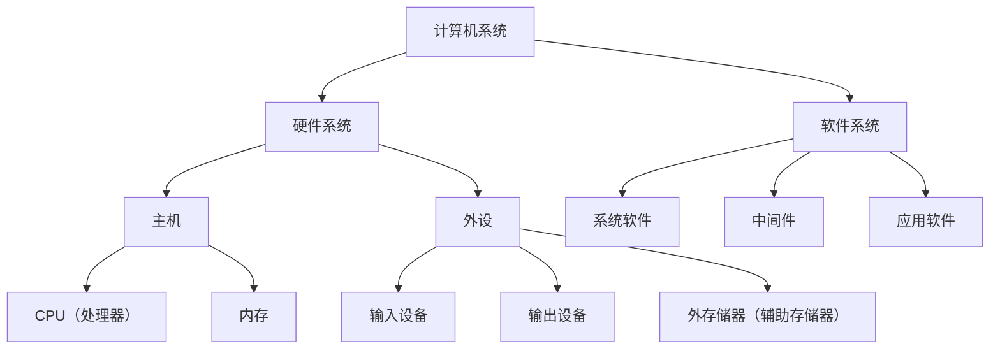
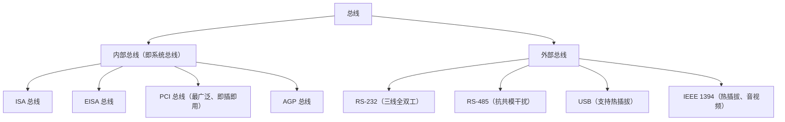
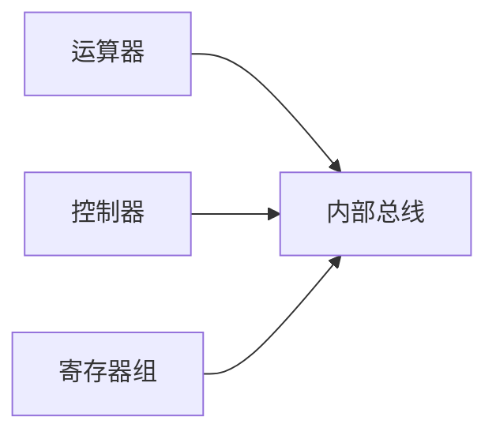
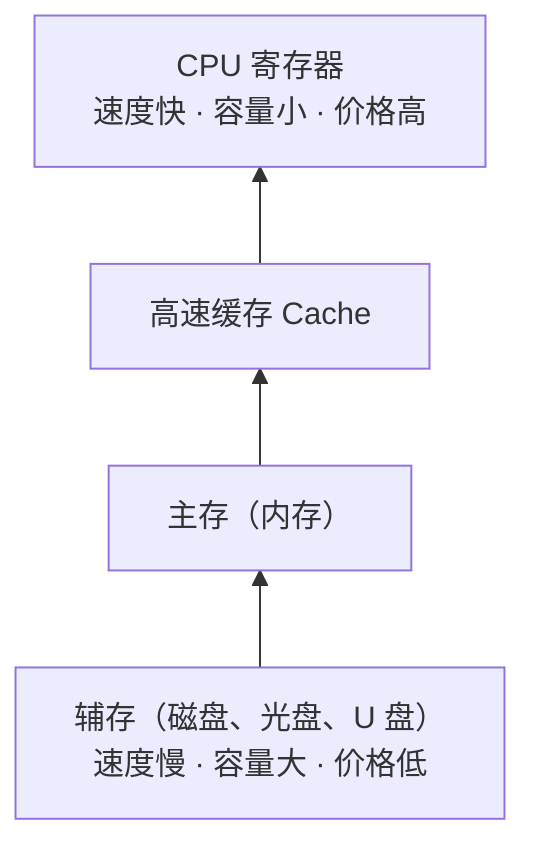
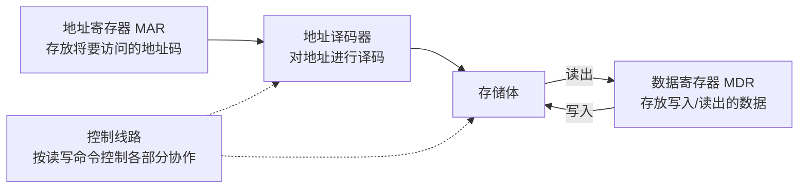
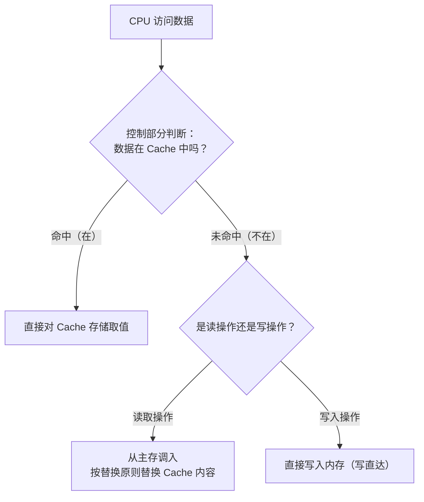
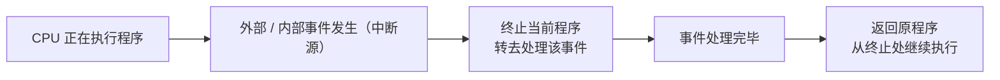

课程链接：视频《1.2 计算机系统基础知识》（软考程序员系列课程）

视频链接：

## 本节概述

本课是系列课程的第二节课，主题"计算机系统基础知识"，对应教材 1.1 节「计算机系统的基本组成」与 1.3 节「计算机的基本组成及工作原理」两部分内容，视频重点在硬件系统。本节的脉络依次是：计算机的分类 → 硬件/软件系统组成 → 总线 → CPU → 存储器（分类、主存、Cache、外存）→ 输入输出技术。视频讲师特别提醒：CPU 结构图考试时可能要求填写部件名称，务必熟悉各寄存器的简称与归属。

## 计算机系统的分类

视频将计算机按形态和用途分为六类，了解即可：**移动设备**（手机、平板电脑等）、**普通计算机/PC**（台式机、笔记本电脑）、**服务器**（中心机房中的服务器）、**计算机集群**（通过集群技术把多台计算机连接起来协同工作）、**超级计算机**（具有超强运算能力的计算机）和**嵌入式计算机**（洗衣机、空调等家用电器内部嵌入的计算机）。

## 计算机系统之组成

计算机系统由**硬件系统**和**软件系统**两大部分组成。硬件系统是本节课的重点，分为主机和外设：主机包括 CPU（处理器）和内存；外设包括输入设备、输出设备和外存储器（辅助存储器）。

CPU 即处理器，按核心数可分为单核处理器、双核处理器和多核处理器；CPU 内部又分为运算器、控制器和寄存器组（视频口误"计算器组"）。

软件系统自内向外像洋葱一样分层：最中间是计算机硬件，外面包裹一层**系统软件**（如 Windows XP、Windows 7、Windows 10），再外面一层是**中间件**（如 .NET、Java 运行环境），最外层是**应用软件**。这三层共同构成软件系统。

## 总线之分类与性能指标

总线是连接多个设备的信息传送通道。按视频口径，总线先分为**内部总线（也就是系统总线）**和**外部总线**；系统总线又可以分为 **ISA 总线、EISA 总线、PCI 总线、AGP 总线**等。

总线的性能指标有三个：**带宽、位宽和工作频率**。

> [!WARNING] 重点：PCI 总线
> **PCI 总线是目前使用最广泛的总线**，它有两种标准：32 位/124 个信号的标准，以及 64 位/188 个信号的标准。PCI 总线在设备上支持**即插即用**。

外部总线方面需要掌握几种常见总线：**RS-232 总线**的特点是传输线少——只需要三条线（一条发送、一条接收、一条地线）即可实现**全双工通信**（可以同时接收、同时发送）；**RS-485 总线**具有抑制共模干扰的能力；**USB 总线**的特点是支持**热插拔**；**IEEE 1394 总线**同样支持热插拔，主要用于音频和视频数据的传输。

## CPU：运算器、控制器、寄存器组与内部总线

CPU 包括**运算器、控制器、寄存器组和内部总线**四部分。这张结构图一定要了解，因为考试可能让考生填写图上的部件名称，常考部件如下表：

| 缩写 | 部件名称 | 归属 |
|---|---|---|
| ALU | 算术逻辑运算单元 | 运算器 |
| AC | 累加器 | 运算器 / 寄存器组 |
| PSW | 状态字寄存器 | 运算器 / 控制器 |
| PC | 程序计数器 | 控制器 |
| IR | 指令寄存器 | 控制器 / 寄存器组 |
| MAR | 地址寄存器 | 寄存器组 |
| MDR | 数据缓冲寄存器 | 寄存器组 |

**运算器**包括算术逻辑运算单元（ALU）、累加器（AC）、状态字寄存器（PSW）、通用寄存器组和多路转换器等，主要用来完成算术运算和逻辑运算，实现对数据的加工与处理。

**控制器**包括程序计数器（PC）、指令寄存器（IR）、指令译码器、时序部件、状态字寄存器（PSW）和微操作信号发生器等，负责控制指令的执行。

**寄存器组**包括累加器、通用寄存器组、标志寄存器、指令寄存器、数据缓冲寄存器（MDR）和地址寄存器（MAR）。

**内部总线**是 CPU 内部把运算器、控制器和寄存器组连接在一起的总线。

**双核与多核**：双核指在一个处理器上集成两个运算核心，从而提高运算能力；多核指在一个处理器上集成两个或多个完整的计算引擎（内核），并采取分治的策略，在特定时间内执行更多的任务。

## 存储器之分类

存储器按**工作方式**分为两类（简写要记住）：**RAM 为读写存储器**（即可读可写的随机存取存储器），**ROM 为只读存储器**。记法上，ROM 中的 O 代表 Only（只读）。

只读存储器又分为五种：

| 类型 | 名称 | 说明 |
|---|---|---|
| 固定 ROM（掩膜 ROM） | 固定只读存储器 | 出厂时内容已固定 |
| PROM | 可编程只读存储器 | 用户可一次性写入 |
| EPROM | 可擦除可编程只读存储器 | 可擦除后重写 |
| EEPROM | 电擦除可编程只读存储器 | 可电擦除后重写 |
| Flash | 闪速存储器 | 即 U 盘所用的存储芯片 |

按**寻址方式**分三种：**随机存储器 RAM**——可以对任何存储单元存入或读取数据，访问任何存储单元所需时间相同；**顺序存储器 SAM**——典型代表是磁带，磁带便宜（视频讲师举例约五元一盒）、稳定性好，现在银行等机构仍用它存放历史数据；**直接存储器 DAM**——介于随机与顺序之间的一种寻址方式，典型代表是磁盘：对磁道的寻址是随机的，但在一个磁道内的寻址是顺序的。

## 存储器之层次结构

存储器的层次从低到高依次是：辅存（外存）→ 主存 → 高速缓存（Cache）→ CPU。它们的规律是：速度**从下而上逐渐变快**，价格**从上往下逐渐降低**，存储容量**从下而上逐渐减小**。视频提示，CPU 当中还有一个寄存器的概念——**寄存器的速度高于高速缓存**。如果把 CPU 也看作存储器的一个层次，整个存储系统可划分为四层结构。

| 层次（自上而下） | 速度 | 容量 | 价格 |
|---|---|---|---|
| CPU 寄存器 | 最快 | 最小 | 最高 |
| 高速缓存 Cache | 快 | 小 | 高 |
| 主存 | 较快 | 较大 | 中 |
| 辅存（磁盘等） | 慢 | 最大 | 低 |

## 主存之结构与性能指标

主存的结构也要记一下，它由**地址寄存器、数据寄存器、存储体、地址译码器和控制线路**组成。

**地址寄存器（MAR）**：存放地址总线提供的、将要访问的存储单元的地址码。主存可寻址单元的个数等于 **2 的"地址寄存器位数"次方**。

**数据寄存器（MDR）**：存放写入存储体的数据，或从存储器中读取出来的数据。

**地址译码器**：对地址寄存器中的地址进行译码。

**控制线路**：根据读写命令控制主存储器各部分协作完成操作。

主存的性能指标包括：**内存容量**；**存取时间**——指存储器从接到读或写的命令起，到读写操作完成止所需的时间；**带宽**——每秒传输的位数，计算公式为"一个存取周期中的读写位数 W ÷ 一个存取周期"；**可靠性**——用平均故障间隔时间 **MTBF** 衡量，MTBF 越长，可靠性越高。

> [!TIP] 了解
> 可靠性计算中还有串联系统与并联系统的可靠性计算方法（并联可靠性高于串联），视频提示了解一下即可，属于可能的计算题素材。

## 高速缓存 Cache

**Cache 是为了解决 CPU 与主存的速度和性能不一致的现象而产生的**。它的原理是程序执行的**局部性原理**，包括两种局部性：

**时间局部性**：程序中某条指令一旦被执行，不久后该条指令很可能再次被执行；某个数据一旦被访问，不久后很可能再次被访问（分别针对指令和数据）。

**空间局部性**：一旦程序访问了某个存储单元，不久后其附近的存储单元也很可能被访问（针对存储单元）。

Cache 的特点：**容量小**——介于 CPU 与主存之间，一般是几千字节到几兆字节；**速度快**——比主存快 5 到 10 倍；**透明性**——对使用者（程序员）透明，感觉不到它的存在。

Cache 一般包括**控制部分和存储部分**。CPU 访问数据时，由控制部分判断所访问的数据是否在 Cache 存储内：**命中**（在）就直接对 Cache 存储取值；**未命中**（不在）又分两种情况——读取操作按**替换原则**替换掉 Cache 存储的内容，写入操作则**直接写入内存**。

> [!WARNING] 可能出计算题
> 由命中率计算未命中及相关指标可能出计算题。教材口径：平均访问时间 = 命中率 × Cache 访问时间 + 未命中率 × 主存访问时间，命中率是 Cache 考点的核心。

## 外部存储器

外部存储器包括磁盘、硬盘、光盘、U 盘、云盘等。

**磁盘**由盘片、驱动器、控制器和接口组成，是目前广泛使用的外部存储器。**硬盘**按介质分为固态硬盘、机械硬盘和混合硬盘。

硬盘的存储容量需要记公式，包括**格式化容量与非格式化容量**的计算：非格式化容量 = 位密度 × 内圈周长（π × 最内圈直径）× 磁道总数；格式化容量 = 每个扇区的容量 × 每道扇区数 × 磁道总数 × 盘面数。

**平均访问时间 = 平均寻道时间 + 平均等待时间**。寻道时间是磁头移到目标磁道所需的时间；平均等待时间取磁道旋转一周所用时间的一半（即平均等待半圈）。数据传输率分外部传输率和内部传输率，内部传输率是磁头找到数据地址后，单位时间内写入或读出的字节数。

> [!WARNING] 真题计算：磁盘读取优化
> 这是历年出过真题的计算型考点。例如一块磁盘上有 10 个位块，读完第一个块用了若干时间（如 3ms），此时磁头已经转过目标位置，若按顺序读下一个块，必须等磁盘整整旋转一周。**优化的思路是"先读哪一块"**——读完第一块后不去读相邻块，而是**间隔跳块去读**（如直接跳读后续的块），让旋转节奏与读取节奏匹配，这样优化后的读取速率会高很多。

**光盘**按读写能力分为只读型光盘（最典型的在中间，CD-ROM）、只写一次的光盘（WORM）和可擦除型光盘。光盘的特点是耐用、非接触性读写、可靠性高、无需防震和除尘，但读取速度较慢，比硬盘和磁盘要慢一点。

**U 盘**包括 USB 移动硬盘和闪存盘（Flash Memory，即前面 ROM 分类中的闪速存储器），特点是支持热插拔，取代了最初的软盘（软盘容量比 U 盘小很多）。**云存储**是运用云计算技术实现的数据存储管理的云计算系统，本质上是一种数据存储的访问服务，了解即可。

## 输入输出技术之接口

接口是为了解决两个相对独立的子系统之间的连接问题而设立的连接界面，在 I/O 系统中解决的是主机与 I/O 设备之间的连接，它是主机与 I/O 设备之间的转换机构。接口的主要功能有：地址译码；交换数据、指令与状态信息；支持程序查询、中断和 DMA 等访问方式；提供缓冲、暂存和驱动的能力，满足一定的负载要求；进行数据类型和数据格式的转换。

接口的分类有三种角度：从**传送方式**分，有**串行接口**和**并行接口**——串行接口采用串行传输方式，数据所有位按顺序逐位输入输出；并行接口一次把一个字节或一个字的所有位同时输入输出。从**访问控制方式**分，有程序查询接口、中断接口、DMA 接口、通道控制器和 I/O 处理机。从**时序**上分，有同步接口和异步接口。另外值得注意：软件的驱动模块也作为 I/O 接口（I/O 系统）的一部分。

I/O 系统的连接方式有**总线型、星型、通道型和 I/O 处理器型**，其中**总线型是使用最广泛的连接方式**，它实现分时性共享，必须遵循总线协议；总线协议包括信号线的定义、数据格式、时序关系、信号电平和控制逻辑等。

I/O 的编址方式有两种：**与内存单元统一编址**——将 I/O 接口中有关的寄存器和存储部件视为主存中的存储单元统一编址，优点是把内存中的指令全部用于接口，增强了对接口的操作，缺点是把地址空间划分成接口和内存存储两部分，会导致内存地址不连续；**I/O 接口单独编址**——设置单独的 I/O 地址空间，为接口中的有关寄存器和存储部件分配地址码，必须设置专门的 I/O 指令进行访问，优点是不占用主存地址空间，缺点是访问主存的指令和访问接口的指令各不相同，在程序中很难辨认与使用。

## 数据交互方式：I/O 控制方式

CPU 与外设交互数据的方式有：直接程序控制、中断方式、直接存储器存取（DMA）、通道控制方式等。

**直接程序控制**包括立即（无条件）程序传送方式和程序查询方式。

**中断方式**：CPU 在执行程序的过程中，若发生某个外部事件或 CPU 内部事件，就终止正在执行的程序，转去处理这个事件；事件处理完毕后再回到原先终止的程序，接着终止前的状态继续执行。引起中断的事件称为中断源，由 CPU 内部事件引起的中断叫内部中断源，由 CPU 外部事件引起的中断叫外部中断源。中断是 CPU 分片分时执行的一种特点。

**DMA（直接存储器存取）方式**：主要通过硬件控制实现主存与 I/O 设备之间的直接数据传送，数据传送过程由 DMA 控制器进行控制，**无需 CPU 干预**（这条可考真题：DMA 无需 CPU 干预，直接实现主存与 I/O 设备间的数据传输）。

**通道控制方式**：通道是一种专用的控制器，通过执行通道程序进行 I/O 操作管理。需要进行 I/O 操作时，CPU 只需按约定格式准备好命令和数据，启动通道即可，由通道执行相应的通道程序完成所要求的操作。

| 控制方式 | 数据传送由谁控制 | 特点 |
|---|---|---|
| 直接程序控制 | CPU 直接控制（立即传送 / 查询） | CPU 全程参与，效率低 |
| 中断方式 | 事件驱动，CPU 响应处理 | CPU 分片分时执行，效率提高 |
| DMA | DMA 控制器（硬件） | 主存与外设直接传数据，无需 CPU 干预 |
| 通道控制方式 | 通道（专用控制器）执行通道程序 | CPU 只需准备命令数据并启动通道 |

## 本节小结

本节覆盖教材 1.1 与 1.3 两节内容，围绕"计算机系统由什么构成、各部件如何协作"展开，关键结论如下：

① **系统组成**：计算机 = 硬件系统 + 软件系统；软件自内向外依次是系统软件、中间件、应用软件。主机 = CPU + 内存，外设 = 输入设备、输出设备与外存。

② **总线**：ISA、EISA、PCI、AGP 属系统总线，PCI 使用最广泛、支持即插即用（32 位/124 个信号与 64 位/188 个信号两种标准）；外部总线 RS-232（三条线全双工）、RS-485（抗共模干扰）、USB（热插拔）、IEEE 1394（热插拔、音视频）。性能指标为带宽、位宽、工作频率。

③ **CPU**：由运算器（ALU、AC、PSW 等）、控制器（PC、IR、译码器等）、寄存器组（MDR、MAR 等）和内部总线组成，各部件名称要能填图；双核/多核即一个处理器集成多个核心。

④ **存储**：RAM 读写、ROM 只读（含 PROM、EPROM、EEPROM、Flash）；层次为寄存器 → Cache → 主存 → 辅存，越靠上速度越快、容量越小、价格越高；主存可寻址单元数 = 2 的"MAR 位数"次方；带宽 = 一个存取周期的读写位数 ÷ 存取周期；可靠性看 MTBF。

⑤ **Cache 与磁盘**：Cache 依据局部性原理（时间/空间）解决 CPU 与主存速度不匹配的问题，命中率相关指标可能出计算题；硬盘平均访问时间 = 寻道时间 + 等待时间（半圈），"跳块读"优化是真题计算题。

⑥ **输入输出**：接口五项功能；串行/并行、同步/异步等分类；总线型连接最广泛；统一编址与单独编址各有优缺点；数据交互方式中 DMA 由硬件完成、无需 CPU 干预（真题考点）。

