课程链接：视频《1.3 多媒体系统》（软考程序员系列课程）

视频链接：

## 本节概述

本节是系列课程的第三节课，进入教材第 1 章「计算机系统基础知识」，本节标题为"多媒体系统"，实际包含两大块内容：**指令系统**（对应教材 1.4 节「指令系统简介」）和**多媒体系统**（对应教材 1.5 节「多媒体系统简介」）。本节脉络依次是：指令格式 → 寻址方式 → 指令种类 → 媒体分类 → 声音 → 图形与图像 → 色彩 → 动画与视频。

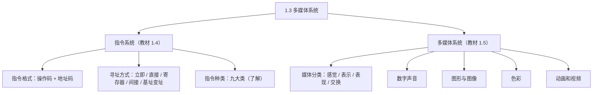

> [!WARNING] 本课真题考点多
> 视频明确提示历年考过的点：媒体分类中**表示媒体与表现媒体的区别**、**H.261 标准**（会混在图像文件格式选项中出题）、**MPEG-7 是多媒体内容描述接口标准**、**JPEG 是静态图像的压缩标准**。这四个点务必记住。

## 指令系统之格式

指令一般包括两个部分：**操作码 OP**（表示做什么操作）和**地址码 A**（表示操作对象在哪里）。按地址码的个数，指令格式分为四种：

| 格式 | 组成 | 说明 |
|---|---|---|
| 三地址格式 | OP + A1 + A2 + A3 | A1、A2 通常为两个源操作数，A3 为结果 |
| 二地址格式 | OP + A1 + A2 | 一个操作数同时兼任结果 |
| 一地址格式 | OP + A1 | 分两种情况（见下） |
| 零地址格式 | 只有 OP | 一般用于空操作、停机指令 |

一地址指令有两种表示：一种是把操作后的结果**填回自身地址码**中；另一种是把操作后的结果**填入累加器（AC）**中。

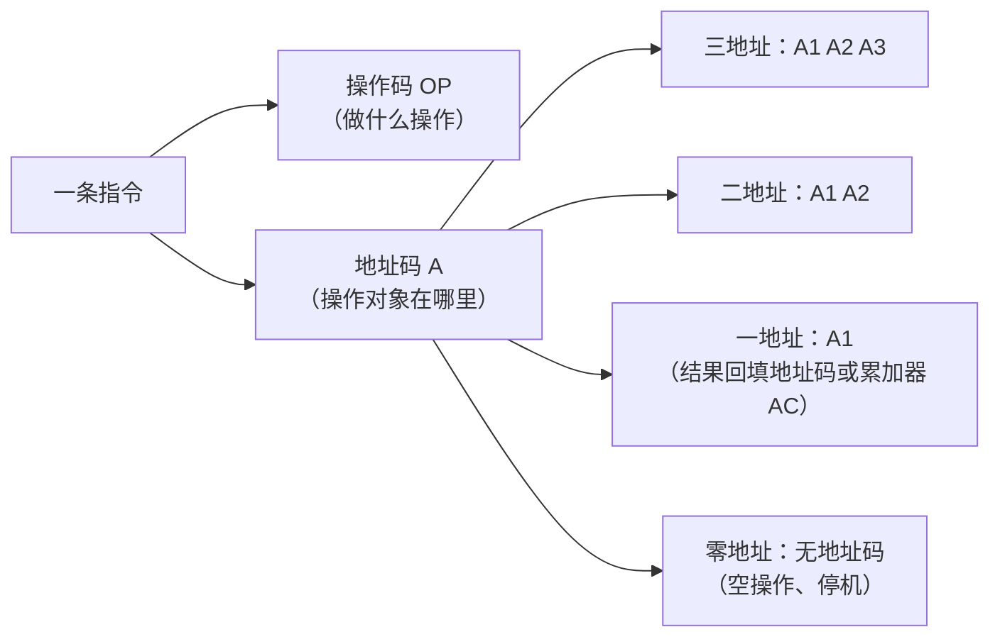

## 指令之寻址方式

寻址方式解决的是"操作数在哪里"的问题。视频小结：**立即寻址**的操作数存放在指令中；**寄存器寻址**的操作数存放在寄存器中；其他寻址方式的操作数均放在内存单元中。

五种主要寻址方式的记忆要点：**立即寻址**——立即数跟在操作码后面，操作数就在指令里；**直接寻址**——指令中直接提供存储单元的地址；**寄存器寻址**——指令中提供寄存器的名字；**间接寻址**——指令中提供的是"操作数地址的地址"，因此有**两次访问内存**的操作；**基址寻址 / 变址寻址**——分别是基址（或变址）寄存器内容加上一个正负偏移量的值。

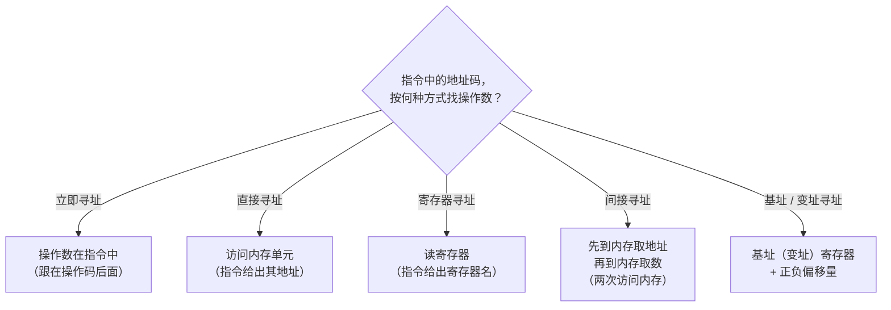

## 指令之种类

指令的种类包括九大类，了解各自代表性指令即可：

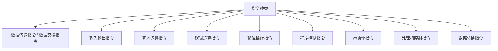

**数据传送与交换指令**：数据在立即数、寄存器和存储单元之间的传送与交换。**输入输出指令**：数据的输入输出、主机向外设发出控制指令，以及它们之间的状态信息。**算术运算指令**：加、减、乘、除和比较。**逻辑运算指令**：与、或、非、异或、取反。**移位操作指令**：算术移位、逻辑移位、循环移位，注意它们的移出进位。**程序控制指令**：包括跳转指令、子程序调用与返回指令和陷阱指令（陷阱指令用于异常处理）。**串操作指令**：串的传送、比较、搜索、替换、转换、抽取等。**处理机控制指令**：置位、清零、停机、中断、空操作等。**数据转换指令**：如十进制转二进制、定点数转浮点数、浮点数转定点数的指令。

## 多媒体之媒体分类

多媒体系统的考查重点是媒体的分类，要会区分五种媒体：

| 媒体 | 含义 | 例子 |
|---|---|---|
| 感觉媒体 | 人的感官能直接感觉到的 | 声音、图像、视频 |
| 表示媒体 | 用来进行编码的媒体 | 图形编码、音频编码 |
| 表现媒体 | 信息的输入输出设备 | 键盘、鼠标、打印机 |
| 存储媒体 | 存放信息的载体 | 硬盘、磁盘、光盘 |
| 传输媒体 | 传输信息的载体 | 电缆、电磁波 |

其中**存储媒体和传输媒体合称交换媒体**。

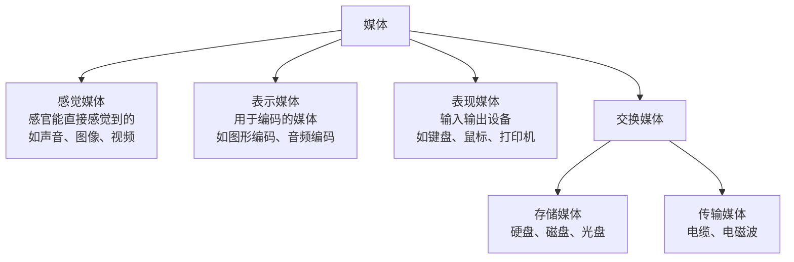

> [!WARNING] 真题考点
> 考试重点是**表示媒体与表现媒体的区别**（历年真题考过）：表示媒体是"编码"，表现媒体是"输入输出设备"。注意区分这两个概念。

## 数字声音

声音按频率范围分：**人耳能辨识的声音**是 20Hz ~ 20kHz；**数字化音（电话语音）**是 300Hz ~ 3400Hz；**CD 乐音**与人耳一致，为 20Hz ~ 20kHz（视频提示这应该是采样过后的频率范围）。

了解概念：**泛音**是指物体振动声音的可变性不高的成分，**基音**是可变性高的成分；泛音除以基音为整数倍的声音称为**乐音**，非整数倍关系的称为**噪音**。了解即可。

声音的数字化一般包括**采样、量化和编码**三步：

> [!NOTE]
> 为了保证采样后的声音质量，必须使**采样频率大于声音信号最高频率的 2 倍**（采样定理）。

声音数据量的计算（本课典型例题）：采样频率 8000Hz、量化精度 8 位、单声道，求每秒产生的数据量——直接用 8000Hz × 8 位 × 单声道 ×1（单声道乘 1，双声道乘 2）× 1 秒，即 8000 × 8 × 1 = 64000 bit/s。若要算 1 小时的数据量，再乘以 3600 秒。

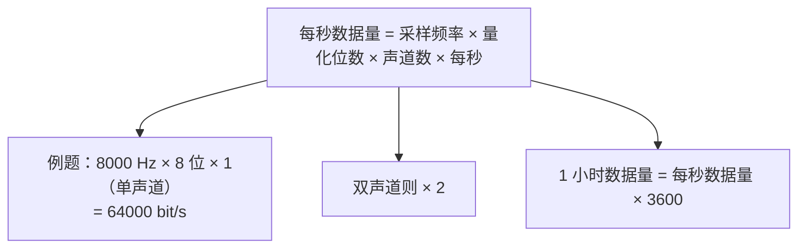

声音的主要参数：**采样频率**——每秒内采样的次数，常见三种频率（44.1kHz、22.05kHz、11.025kHz 等）；**量化位数**——用来度量声音波形的精度，包括 8 位、12 位和 16 位；**声道数目**——单声道一次产生一组波形数据，双声道一次产生两组波形数据；**数据率**——每秒的数据量，以 bps 为基本单位；**压缩比**——未压缩的音频数据与压缩后的音频数据量的比值。

常见声音文件格式：

| 格式 | 说明 |
|---|---|
| WAVE（.wav） | Windows 的标准音频格式，质量高、数据量大 |
| SND | 支持压缩 |
| AUDIO | Linux 系统的声音文件 |
| AIFF | 苹果电脑的音频文件 |
| VOC（Voice） | 由文件头和音频数据块组成 |
| MP3（MPEG-1 Layer 3） | 压缩比例大，音质高、接近 CD 音质，非常流行 |
| RealAudio | 强调压缩量（体积小），适合网络传输 |
| MIDI | 乐器数字接口的国际标准，文件长度很小、可编辑 |

## 图形与图像

**图形**以矢量表示，如用专业制图软件画出来的三角形、长方形等；**图像**用像素点表示，如照片。

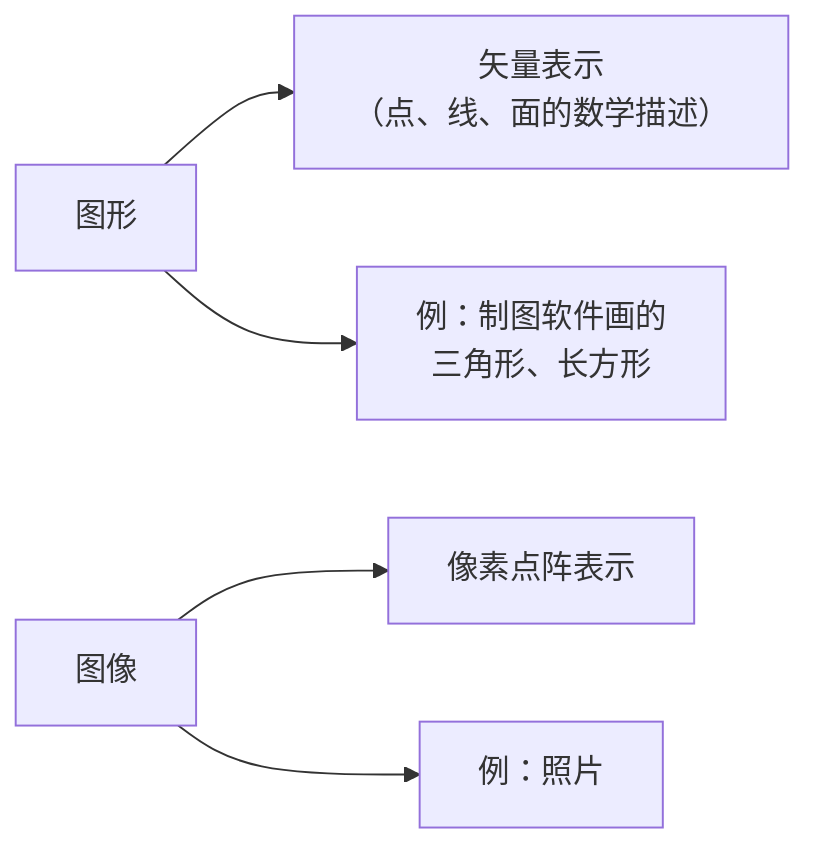

图像分为黑白图像（又称二值图像）、灰度图像和彩色图像；彩色图像又分为真彩色图像、伪彩色图像（要通过调色板和色彩对照值换算出来的图像）和直接彩色图像。

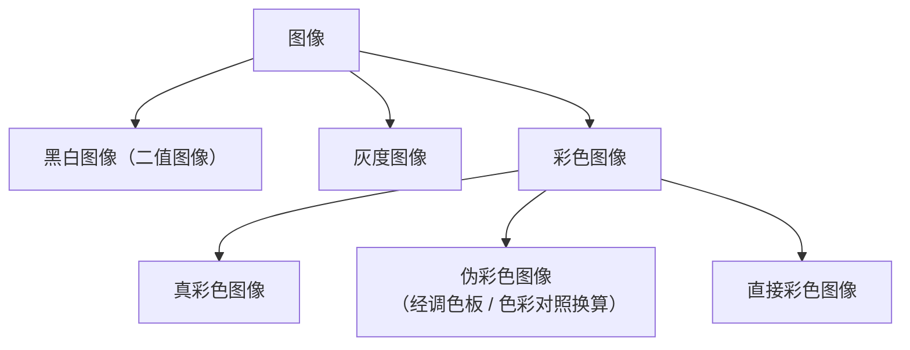

图形与图像的转换在工程制图中比较常见，也就是**图像的矢量化操作**：先把一张图片放进制图软件中，对照图片勾出它的轮廓，从而把图像转换为图形。

图像的数据量比较大，也要会算：例如 640×480 像素、256 色的图像，数据量 = 640 × 480 × 2⁸（256 色即 2⁸ = 8 位）= 640×480×8 bit，除以 8 换算成字节约为 300KB。

> [!NOTE]
> 数据量通式：**像素总数 × 每个像素的位数 ÷ 8 = 字节数**。256 色 = 2⁸ = 8 位，65536 色 = 2¹⁶ = 16 位，依此类推。

图像压缩分为**无损压缩**和**有损压缩**：无损压缩包括熵编码、行程编码、无损预测编码和词典编码技术；有损压缩是考虑到数据空间的冗余性进行的压缩。

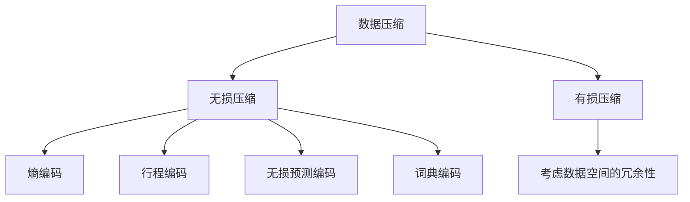

> [!WARNING] 真题考点
> **JPEG 是静态图像的压缩标准**（视频口误念作"GPEG"）。注意与 MPEG 区分：JPEG 管静态图像，MPEG 管动态图像（视频）。

常见图像文件格式：

| 格式 | 说明 |
|---|---|
| BMP | Windows 采取的图像文件格式，不压缩、占用空间大，支持 1/4/8/24 位深度（黑白、256 色、真彩色） |
| GIF | 无损压缩，可以有动画效果，1~8 位、支持 256 色 |
| PNG | GIF 的替代品，灰度图像深度达 16 位、彩色图像达 48 位，支持无损压缩 |
| TIFF | 用于扫描仪和桌面出版系统，支持二维图像：黑白图像、灰度图像和彩色图像 |
| PCX | PC 画板的文件格式，采取行程编码压缩，不支持真彩色 |
| JPEG | 一种有损压缩格式（静态图像压缩标准） |
| WMF | 仅用于 Windows，文件结构好、具有设备无关性，解码复杂、效率较低 |

## 色彩三要素与色彩模型

颜色的三要素：**色调**——颜色的区分（如红黄蓝）；**饱和度**——颜色的深浅程度，可用"某纯色中加入白色的比例"来度量；**亮度**——颜色明暗的程度，取决于吸收和反射光功率的大小。

**色彩模型（色彩空间）**以三维空间形式组织，常见三种：

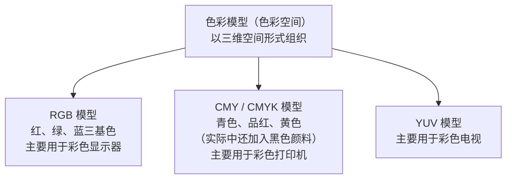

> [!NOTE]
> 记一个概念：**两种色光混合得到白光，则这两种色光互为互补色**。

## 色彩之属性

色彩的属性包括**分辨率、像素深度、真色彩和伪色彩**。

**分辨率**：要记住——分辨率越高，图像质量越高。分辨率又分显示分辨率和图像分辨率：显示分辨率指屏幕显示的像素；图像分辨率指图像中所显示的像素的密度。

**像素深度**：度量图像色彩分辨率的指标，像素的位数越多，能表达的颜色数目越多，其深度也就越深。

**真色彩**：每个基色的分量直接决定显示设备的基色强度，这样产生的色彩称为真色彩。**伪色彩**：保存一个色彩查找表（也称为调色板），通过色彩查找表来查找对应的色彩，这称为伪色彩。

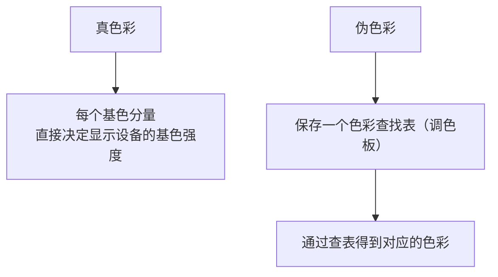

> [!NOTE]
> 图像的获取与声音类似，也包括采样、量化和编码三个步骤。

## 动画和视频

**动画**是将静态的图形、图像按照一定的顺序显示成连续的动态画面。

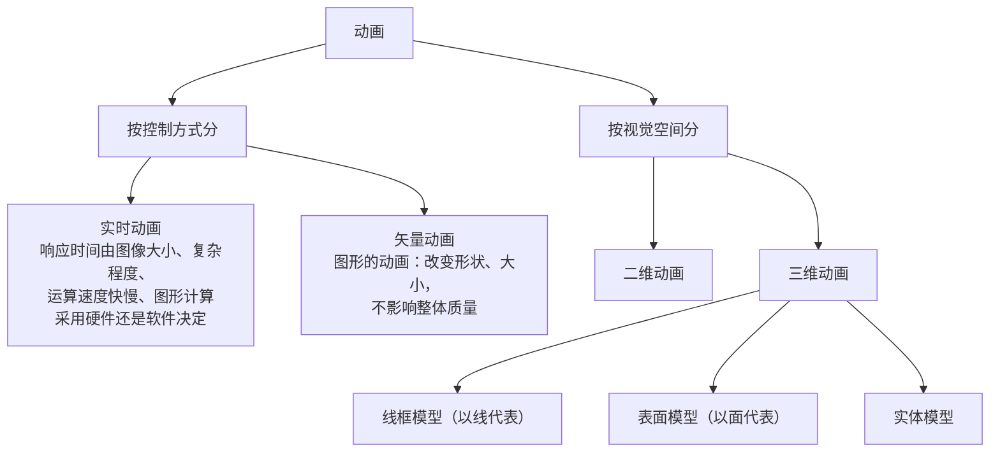

**视频**分模拟视频（以模拟信号传输的视频）和数字视频（以数字信号传输的视频）。模拟视频要注意三种彩色电视制式：**NTSC 制、PAL 制、SECAM 制**。数字视频要注意数字化的统一标准 **ITU-R BT.601**，它能满足这三种电视制式的数字化。

数字化的两种方式（按教材口径）：**复合数字化**——对复合彩色信号直接数字化；**分量数字化**——先把彩色信号分离出亮度与色差等分量，再分别数字化。二者只是先后顺序的差别，考试爱考这种区分。

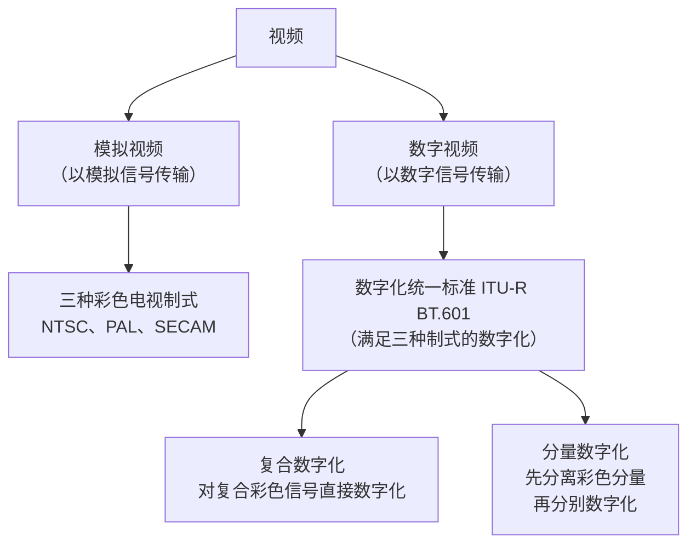

视频压缩编码包括**帧内压缩**和**帧间压缩**：帧内压缩是对**空间冗余**的一个压缩，帧间压缩是对**时间冗余**的一个压缩。

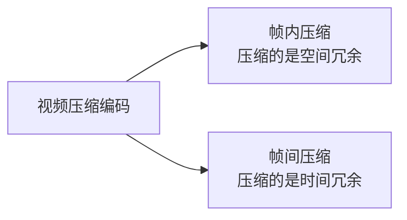

视频标准与格式（本课重点，考过真题）：

| 标准 / 格式 | 说明 |
|---|---|
| H.261 | 会议电视（可视电话）标准。**真题陷阱**：混在图像文件格式选项中考查，它其实是会议电视标准 |
| MPEG 系列 | MPEG-1、MPEG-2、MPEG-4、MPEG-7、MPEG-21 等标准 |
| MPEG-7 | 多媒体内容描述接口标准（真题考点） |
| FLIC | 2D/3D 动画制作软件中采取的彩色动画文件格式，无损压缩 |
| AVI | 微软公司的数字音频和视频文件 |
| QuickTime | 苹果公司的视频音频文件 |
| MPEG（MPG） | 以 MPEG 压缩标准压缩的一种标准格式的视频音频文件，兼容性好 |
| RealVideo（RM / RMVB） | 实时在线播放的低速广域网实时视频文件 |

## 本节小结

① **指令系统**：指令 = 操作码 OP + 地址码 A；按地址码个数分三地址、二地址、一地址、零地址格式（零地址用于空操作、停机）；一地址的结果可回填自身地址码或累加器 AC。寻址方式中立即寻址操作数在指令中、寄存器寻址在寄存器中、其余在内存（间接寻址需两次访问内存，基址/变址 = 寄存器 + 偏移量）。指令种类九大类，了解即可。

② **媒体分类**：感觉媒体 = 感官直接感受（声音、图像、视频）；表示媒体 = 编码；表现媒体 = 输入输出设备；存储媒体 + 传输媒体 = 交换媒体。**表示媒体 vs 表现媒体的区别是真题考点**。

③ **声音**：数字化三步 = 采样、量化、编码；采样频率须大于信号最高频率的 2 倍；每秒数据量 = 采样频率 × 量化位数 × 声道数；常见格式 WAVE（质量高）、MP3（音质接近 CD）、MIDI（体积小可编辑）等。

④ **图形图像与色彩**：图形 = 矢量、图像 = 像素；图像转图形称矢量化操作；图像数据量 = 像素总数 × 每像素位数 ÷ 8；压缩分无损/有损，**JPEG 是静态图像压缩标准（真题）**；色彩三要素 = 色调、饱和度、亮度；RGB 用于显示器、CMY/CMYK 用于打印机、YUV 用于电视。

⑤ **动画与视频**：动画按控制方式分实时/矢量，按空间分二维/三维（线框、表面、实体模型）；模拟视频三种制式 NTSC/PAL/SECAM；数字视频统一标准 ITU-R BT.601；帧内压缩 = 空间冗余、帧间压缩 = 时间冗余；**H.261 与 MPEG-7 是真题考点**。

