课程链接：视频《1.4 Office 办公软件》（软考程序员系列课程）

视频链接：

## 本节概述

本节是系列课程的第四节课，进入教材第 1 章「计算机系统基础知识」，本节内容为办公软件的补充知识。办公软件在软件系统中属于**应用软件**层面，这类题看似简单，但以笔试形式考察，主要强调程序员对文档的重视程度；软考信息处理员考试中也有相关的 Office 内容。本部分每年占分比例约**两分**。本节脉络依次是：Word 文档编辑与排版 → 表格制作 → 图文混合排版 → 样式、目录、题注等高效排版功能。

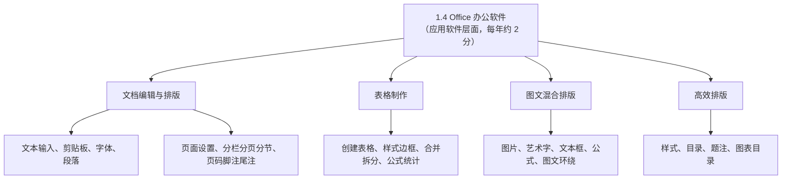

## Word 之文档编辑

首先讲文本的输入要点：文本输入时可以**自动换行**，段落结尾用 **Enter 键**隔开；对齐时可以采用缩进式对齐。

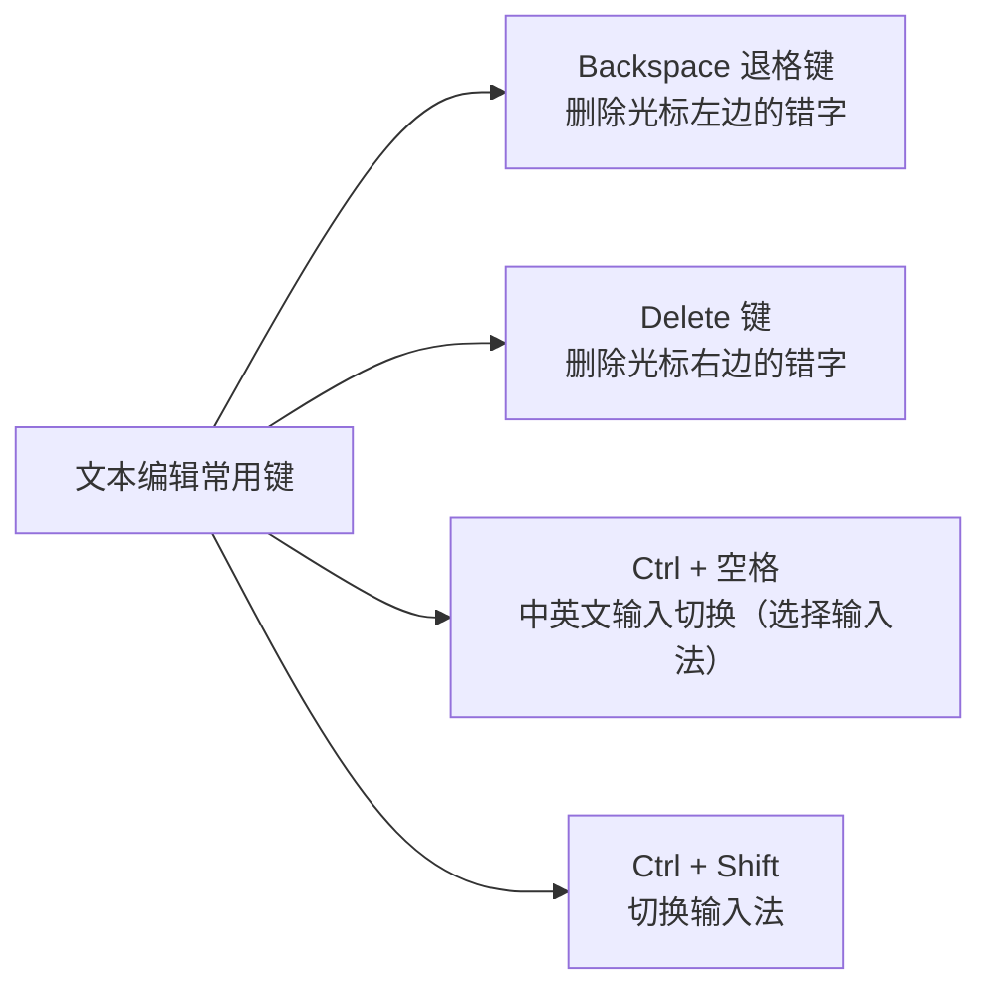

漏了内容时，把光标插入到该位置再输入，输入的内容会插进去；但如果状态栏显示为**"改写"**状态，光标定位后敲入的内容会把后面的内容**覆盖**掉。

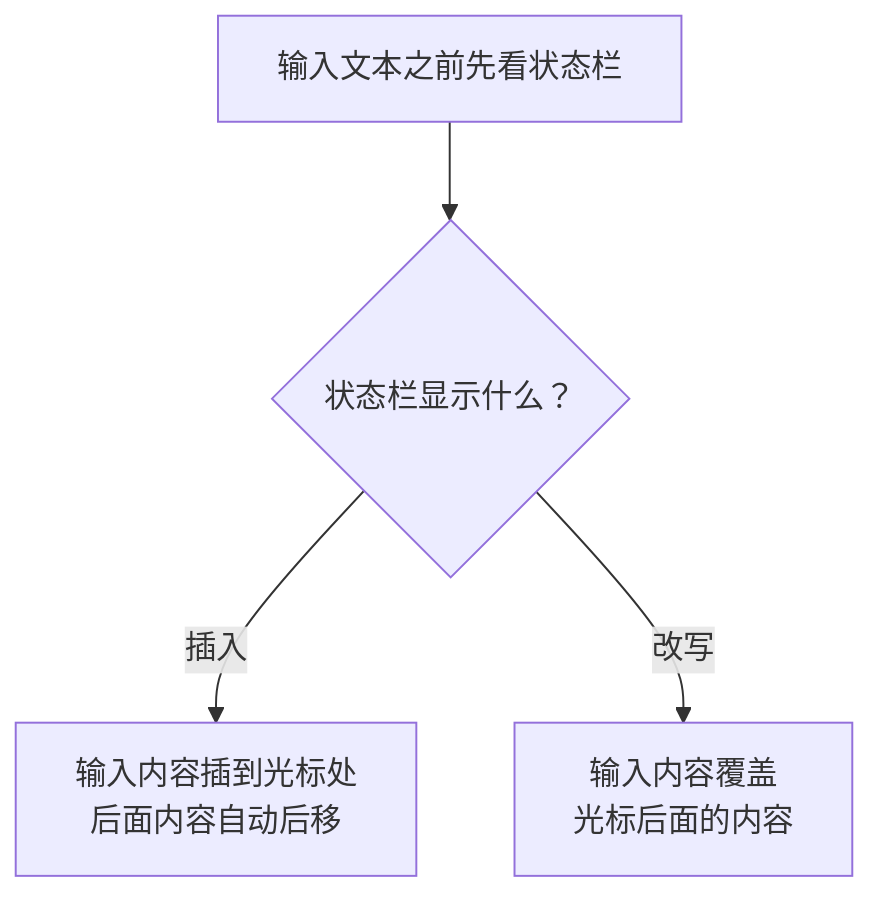

**剪贴板**：2010 版的 Word 支持 **24 次复制和剪切**，它们全部存在剪贴板里。单击开始功能区（剪贴板组右下角）的小箭头打开剪贴板，可以单击剪贴板上的某一条内容进行粘贴，也可以选择"全部粘贴"按钮进行全部粘贴。

保留原格式有两种方法：一是单击开始选项卡"粘贴"按钮下面的小三角，在粘贴选项菜单中选择"保留原格式"；二是在复制文件文字以后，弹出的粘贴选项中选择"保留原格式"。这样复制文字的格式就不会改变。

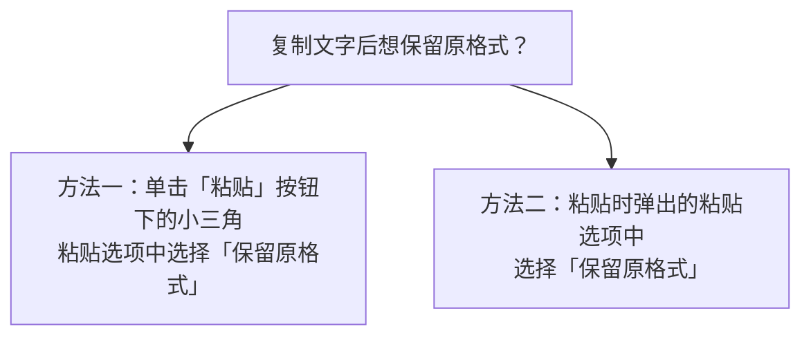

**拼写与字数统计**：在审阅选项卡的校对功能区有"拼写和语法"按钮，可对文字的拼写和语法进行检查；单击"字数统计"可以对文章文字进行统计，显示字数、页数、不计空格的字数等。写论文（如高级软考要求 2500 字）时，选中文字后点字数统计，即可掌握自己所写的字数是否达到题目要求。

## Word 之字体与段落

**字体**：开始选项卡的字体功能区可以设置字体的显示效果（如字体、字号等）；单击字体组右下角的小按键会弹出一个对话框，可设置更多的字体效果；也可以通过选中文字后点右键，在快捷菜单中选择"字体"，弹出字体对话框来设置。

**段落**：段落设置包括段落的边框和底纹等，用得比较少的是"中文版式"按钮，它包括几种类型：**纵横混排**（例如一排字中的某几个字竖排在横排文字里占一行显示）、**字符合并**（把两个字符合并到一个字符的位置）、**双行合一**、**字符缩放**等功能。段落对话框中可以进行缩进、间距、换行、分页和中文版式的详细设置。

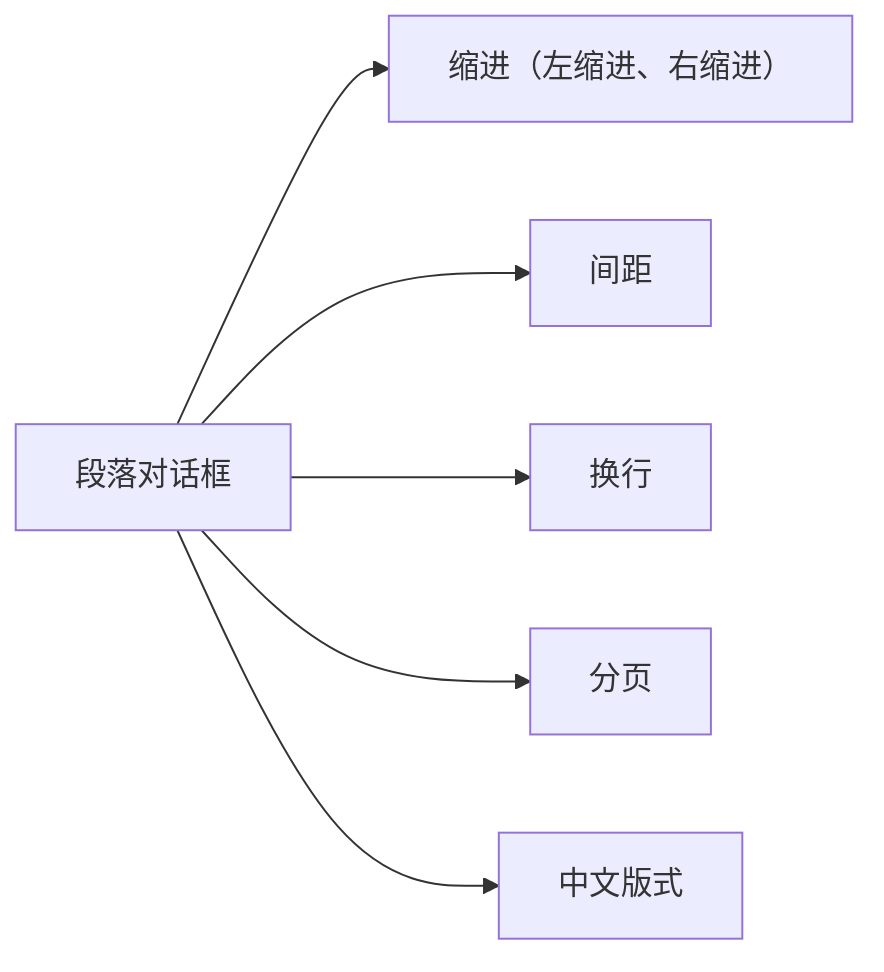

## 项目符号、编号与首字下沉

**项目符号和编号**是为了便于阅读、使文章具有层次感，可以使用自动编号功能，在选中的项目前添加项目符号和编号。在开始选项卡的段落功能区单击"编号"按钮或"项目符号"按钮，可在各段添加简单的编号和项目符号——编号就是 1、2、3（或一、二、三），项目符号就是圆圈、勾、三角等符号；单击按钮旁边的小三角可弹出编号库和项目符号库，选择其他符号。选中一段文字时它会自动在前面加 1234。

**首字下沉**：第一个字写得非常大，可能占 2 到 3 行字的内容，从而引起注意。它有两种方式：**下沉式**和**悬挂式**；还可以对下沉的行数、距正文的距离进行设置。注意一点：**在分栏操作时，不要将首字下沉的首字选中**——如果处于选中状态下，分栏是无法进行操作的。

## 页面排版之页面设置与背景

页面的排版就是在打印之前，以页为单位对文档作进一步整体性的版面调整。页面设置主要包括：**纸张大小、页边距（上、下、左、右边距及装订线）、页面方向（横向、纵向）、版式（页眉页脚等）**，以及下面要讲到的强行翻页、分节和分栏、插入页码、脚注、尾注和打印文档。页边距、纸张都可以通过功能区"页面设置"（对话框）进行设置，其中对话框包括页边距、纸张和版式等。

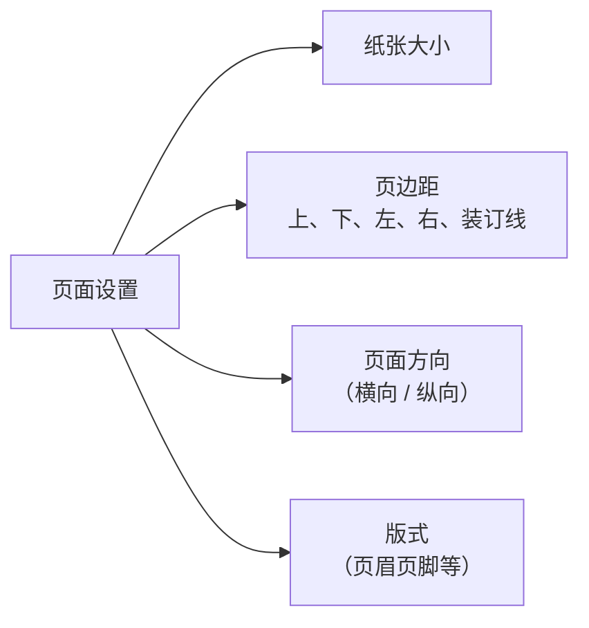

页面的排版还包括**水印、页面背景颜色和页面边框**：可以为页面设置背景颜色，也可以插入图片作为页面的背景，一般背景图片设置为**水印**。

## 分栏、分页与分节

**分栏**是为了修饰文档版面（主要见于杂志报刊），一页的内容以两栏或三栏显示，使版面更加生动、具有可读性。分栏对话框中可以设置分一栏、两栏、三栏以及每一栏的宽度。

看不到分栏效果的几种情形：第一种是处于**草稿（视图）状态**下，草稿视图是看不到分栏效果的；第二种是在页面视图下仍看不到分栏效果或分栏布局不均匀——这是因为分栏时 Word 会根据纸张的高度从左到右布局，如果分栏的内容比较少就会出现这种情况。解决办法是在分栏的文档结束处插入一个**回车符**，增加一个空的段落。

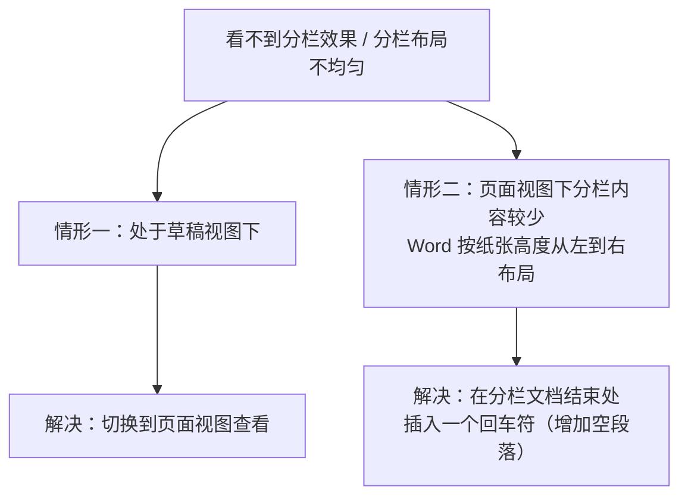

**分页**：一般情况下录满一页后系统会自动跳到下一页；但内容没满却需要另起一页书写时（如下一章节的文字录入），就要强行分页。强行分页通过页面布局选项卡的"分隔符"按钮插入**分页符**来实现（分隔符包括分页符和分节符）。分页符是**非打印字符**，不会打印出来，可以用 **Delete 键**将其删除。

**分节**：这里的"节"与普通理解不同，它是指一个**独立的编辑单位**，对每一个节可以进行不同的页面设置——它不同于文章中"章节"的定义，可以根据需要在文中相应位置插入分节符。它能达到的效果是：一篇文章中正文部分的页码是 123 这种形式，但如果需要其他部分的页码以另一种形式显示，就必须在正文部分的前面插入一个分节符，然后这个分节符代表的那一段内容（节）就可以采取不同形式的页码。

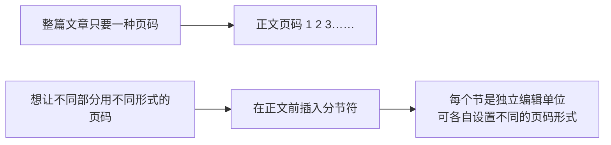

## 页码、脚注、尾注与打印

**插入页码**有两种渠道：一是插入选项卡的页眉页脚功能区里的"页码"按钮；二是通过"页码格式"对话框设置编号的格式和页码的编号（是否续前节等）。

**脚注和尾注**：脚注位于**页面的底端**（本页下面），是对文档内容进行注释说明（如论文第一页的作者、邮箱）；尾注位于**文档的结尾处**（如最后一页），是对文档引用的文献进行注释。脚注和尾注均由两个相互连接的部分组成：**注释引用标记**与其对应的**注释文本**。

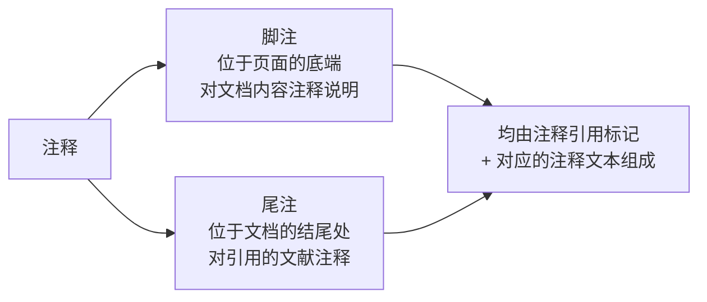

**打印**：在文件里面有打印功能，可以选择（网络的）打印机、打印的份数、纸张方向（纵向、横向）、纸张大小等，设置完参数后点击打印即可，有内容时还可以预览效果。

## 表格的制作与统计

快速创建表格：在插入选项卡的表格功能区点"插入表格"即可快速创建一张表。表格功能包括**插入表格、绘制表格、文本转表格**等。

选中表格后，上方会出现一个**表格工具**（2010 或 2020 版本的 Word），它包括**设计**和**布局**两个部分。在设计里可以选择表格的样式和边框，还可以通过对话框（点组右下角小按键弹出，或右键表格）对边框、底纹等作详细设置；布局包括增加行和列、合并与拆分单元格、单元格对齐方式等。

**表格的统计功能**：比如在表格中算"语文成绩加数学成绩求和"这类总成绩。步骤是：首先定位在存放计算结果的单元格并把它选中，然后选择表格工具选项卡的数据功能区里的"公式"按钮，弹出公式对话框，输入函数或公式来计算。表格的单元格表示方式是**列号 + 行号**，如 B4 表示第二列、第四行。

## 插入图片、文字、艺术字与公式

插入图片是经常使用的操作；插入一段文字可以用**文本框**（横排、竖排文本框），使用文本框可以制作特殊的标题，如文中标题、栏间标题、竖排文本等效果；还有**艺术字**（有不同字体的图标样式）。

插入文中的图片和文字一样，可以进行复制、移动、删除，也可以进行尺寸调整、裁剪、旋转等操作。对于部分图片还可以进行**组合 / 取消组合**处理：选中两个图片进行组合后，组合起来的图片会有一个虚线包裹，可以同时拖拽、放大、缩小，两张图片的相对位置和大小会同时改变，这叫图片的组合；取消组合后，两个图片的相对位置和大小不会随着整个区域的变化而变化。点击图片会弹出图片工具功能区，可对图片设置立体效果（样式）、颜色、背景、旋转、裁剪等实时操作。

**插入公式**：在插入选项卡的符号功能区单击"公式"按钮，选择插入新公式，会弹出公式工具选项卡，选择合适的按钮即可编辑公式（包括各种符号和上下标结构）。虽然输入法和一些公式编辑软件提供了丰富的公式编辑功能，但 Word 里也提供了强大的公式编辑功能。

**自选图形与绘图画布**：需要组合多个图形时，可以先绘制一个**画布**，再把多个图形放在绘图画布里。绘图画布提供图形和文档其余部分之间的边界；默认情况下绘图画布没有边界和背景，但可以像任何图形一样对绘图画布应用格式。

## 图文混排

图文混排有三种方式：**浮于文字上方、衬于文字下方、与文字同一层**——这就是图层的三层关系。只有图文位于同一层时正文才会"让路"（文字环绕图片）；图片衬于文字下方时，图片上面可以写字；图片在文字上方时，图片可以覆盖在文字上。

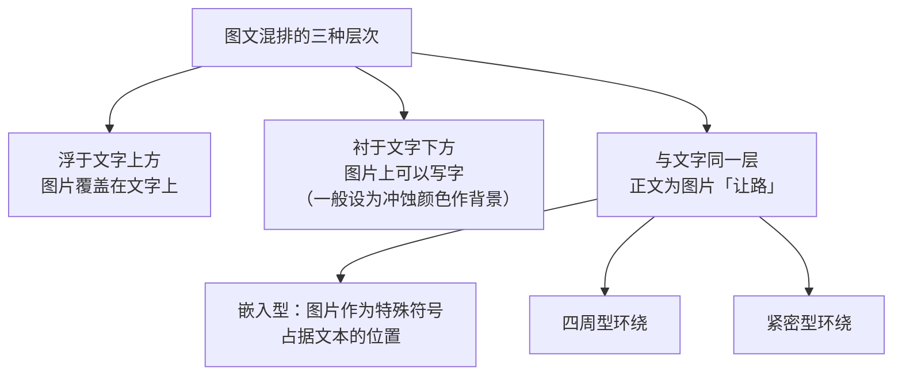

具体操作：在绘图工具选项卡的排列功能区点"位置"按钮选择一个文字环绕方法；或者选择"其他布局选项"，在弹出的对话框中选择更多的文字环绕方式；也可以单击页面布局的排列功能区的"位置"或"自动换行"按钮设置文字环绕方式。其中衬于文字下方的图片一般设置成**冲蚀**颜色，以突出图片的背景效果（视频中"充足颜色"为口误）。

**嵌入式和浮动式**的区别：嵌入式的图片直接放入文本插入点处，占据文本的位置，选中该图片时四周会出现八个**实心**小方块——把图片变小后可以作为文本的一个特殊符号或标记，移动它的操作同于文本的移动；而浮动式图片可以插入图形层，在文本或其他对象前面或后面，选中时四周会出现八个**空心**小方块，此时图片独立于文本，可以用鼠标在文本中随意拖动。

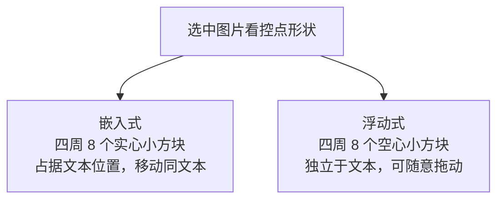

## 样式

所谓**样式**是一组已命名的字符格式或段落格式。应用样式格式化文档，可以大大提高文档的质量和工作效率。Word 中提供了近百种内部样式，用户也可以修改已有的样式或建立新的样式来满足自己的需要。应用样式在开始选项卡的样式功能区——选择一种样式即可，单击滚动条可以选择更多的样式；修改和删除样式时，在样式工作区选中一个样式名，其右侧会出现一个下拉按钮，可以选择修改其样式或删除其样式。

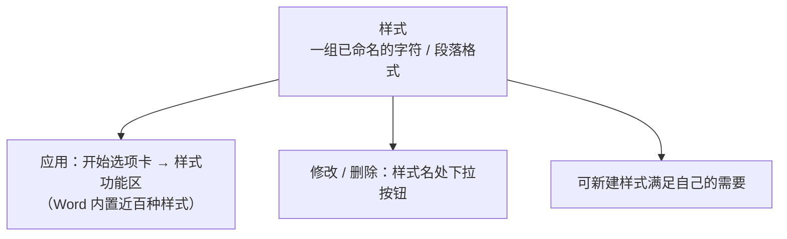

## 目录与图表目录

**目录**的生成有一个前提：这篇文章必须是以大纲的形式进行编排（标题使用了大纲级别的样式，如一级标题、二级标题），这样才可以自动生成目录。目录是文档中标题的列表，可以将其插入指定的位置，通过目录可以了解一篇文章论述了哪些主题并快速定位到这些主题；打印出来的文档以及在 Word 中查找的文档都可以编制目录。显示文档时目录包括标题及对应的页号，按住 **Ctrl 键**将鼠标移到目录项上会变成手型光标，标题将变成超链接，单击即可直接跳转到该标题。

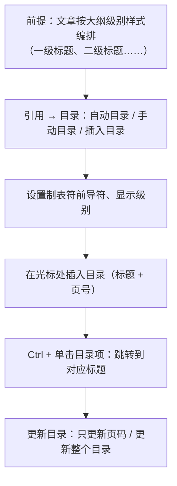

**题注**：是向文档中插入表格、图、公式等对象时，在对象的上方或下方加一个"图 1""图 1.1""图 2"等说明的文字。题注是生成图表目录和交叉引用的前提——建立图表目录时能自动搜索文档中的题注。题注可以手动添加，也可以针对某种对象自动添加，有两种方式。题注的编号是自动变化的：每插入一个题注，后续的题注编号会自动更新；删除图表或题注后，只要右键单击其他题注标号，在快捷菜单中选择"更新域"命令，题注标号就可以自动更新。

手动添加题注：在引用选项卡的题注功能区单击"插入题注"，在弹出的题注对话框中选择对象标签或选择新建标签，再选择其他选项。自动添加题注：在题注对话框中单击"自动添加题注"按钮，可以选择在哪些对象上自动添加题注。注意：**自动添加题注对自选图形不起作用**，所以一般采取手动添加题注的方法。

**图表目录**：长篇的文章中含有大量的图形、表格和公式时，为了让读者方便地找到某个对象，可以为这些对象编制图表目录。插入方法：先对各对象添加题注（前提），然后在引用选项卡的题注功能区点"插入表目录"（插入图表目录）按钮，在弹出的对话框中选择题注标签来区分不同的目录——题注标签为"图"则插入图的目录，标签为"表格"则插入表的目录。

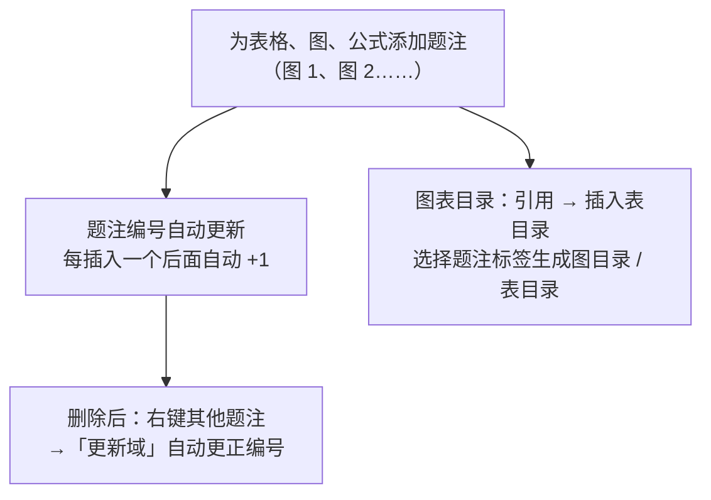

视频最后留的三道思考题（也是常考小点）：从网上获取文字素材粘贴到 Word 中，直接粘贴可能出现格式问题（是保留原格式还是匹配 Word 上文格式）与编码不一致的问题，所以要用"保留原格式"等粘贴选项处理；把一篇文档中的文字连到另一篇文档时，想保证格式样式不变，同样选择保留原格式粘贴；**保存与另存为的区别**——保存会覆盖现有的文件，另存为则现有的不变，并把内容存到另外一个地方、另起一个名字；不希望某文件被别人打开浏览，可以设置**文档密码**，不希望别人修改则可以设置修改权限。

## 本节小结

① **编辑与格式**：Enter 键分段、自动换行；Backspace 删光标左边、Delete 删光标右边；Ctrl+空格切换中英文、Ctrl+Shift 切换输入法；插入状态插进去、改写状态覆盖；2010 版剪贴板支持 24 次复制剪切；保留原格式粘贴两种方法。

② **排版**：页面设置含纸张、页边距（上下左右+装订线）、方向、版式；分栏在草稿视图看不到，内容少时布局不均可在文档结束处加回车符解决；强行分页用分页符（非打印字符，Delete 可删）；**分节 = 独立编辑单位，可让不同部分用不同页码**；脚注在页面底端注释内容、尾注在文档结尾注释文献；目录生成的前提是大纲级别样式，Ctrl+单击跳转，更新目录分"只更新页码"和"更新整个目录"。

③ **表格**：插入/绘制/文本转表格三种创建方式；选中出现表格工具（设计+布局）；统计用"公式"按钮，单元格按列号+行号引用（如 B4）。

④ **图文混排**：三层关系——浮于文字上方、衬于文字下方（常设冲蚀色）、与文字同一层（嵌入型、四周型、紧密型）；嵌入式选中是 8 个实心方块（同文本移动），浮动式是 8 个空心方块（随意拖动）；多图形组合可先绘制绘图画布。

⑤ **高效排版**：样式提升文档质量与效率；题注是图表目录和交叉引用的前提、编号自动更新（删除后右键"更新域"）、自动题注对自选图形不起作用；保存覆盖原文件、另存为另起名字与位置。