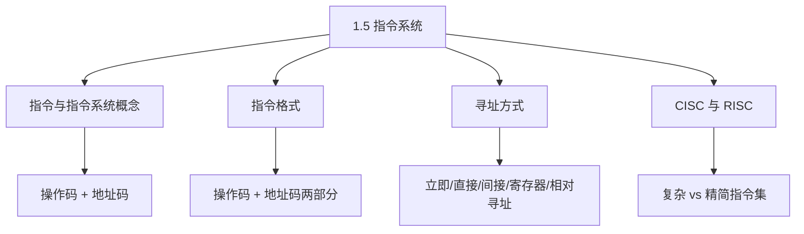
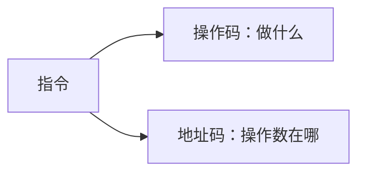
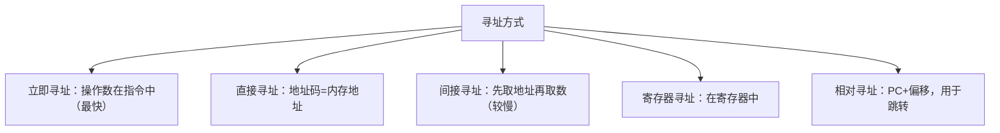

课程链接：视频《1.5 指令系统》（软考程序员系列课程）

视频链接：

## 本节概述

本节是系列课程的第三十四节课，补全**第一章 计算机系统基础知识**中缺失的**指令系统**部分。前面的课程讲了计算机的组成（总线、CPU、存储器、I/O），其中的 CPU 要执行程序，靠的就是**指令**；本节讲CPU是如何"看懂并执行"指令的。本节脉络依次是：指令与指令系统的概念 → 指令的格式（操作码+地址码）→ 指令的寻址方式 → CISC 与 RISC 结构。

先看一张本节的知识地图，把整节内容装进脑子里：

## 指令与指令系统

**指令（Instruction）** 是**规定计算机执行某种操作的命令**，是计算机**执行程序的最小单位**。一台计算机的所有指令的集合称为**指令系统（Instruction Set）**。

- **指令系统**是 CPU 能识别的全部指令。
- 程序由一条条指令组成，CPU 一条条取来并执行。

> [!NOTE]
> 指令系统是机器能懂的"语言"，不同 CPU 配有其不同的指令系统。

## 指令的格式

一条指令通常由**操作码（opcode）** 和 **地址码（操作数）** 两部分组成：

| 字段 | 作用 |
|---|---|
| **操作码** | 指明**做什么操作**（如加、减、传送、跳转） |
| **地址码** | 指明**操作对象（操作数）在哪儿**（寄存器编号或内存地址） |

**指令的分类**（按功能划分）：
- **数据传送指令**：把数据从一个地方搬到另一处。
- **算术运算指令**：加、减、乘、除等。
- **逻辑运算指令**：与、或、非、移位。
- **控制转移指令**：改变程序执行顺序（跳转、调用）。
- **输入输出指令**：主机与外设之间交换数据。

> [!NOTE]
> 指令格式记两字段：**操作码 + 地址码**。指令按其动作分为传送、算术、逻辑、控制转移、I/O 等几类。

## 寻址方式

**寻址方式**指**如何找到操作数在内存或寄存器中的位置**。常见的寻址方式：

| 寻址方式 | 操作数位置 | 说明 |
|---|---|---|
| **立即寻址** | **指令本身**里直接给出操作数 | 最快，操作数在指令中 |
| **直接寻址** | 地址码给出**内存地址** | 直接从该地址取操作数 |
| **间接寻址** | 地址码指向**存放地址的地址** | 先取地址再按地址取数，多一次访存 |
| **寄存器寻址** | 操作数在**寄存器**中 | 速度快 |
| **寄存器间接寻址** | 寄存器中存的是**地址** | 经寄存器间接定位操作数 |
| **相对寻址** | **当前指令地址 + 偏移量** | 用于程序跳转/循环 |
| **变址寻址** | 基址/变址寄存器 + 偏移 | 便于数组等连续访问 |

> [!WARNING] 真题考点
> 高频区分：**立即寻址（操作数在指令中）、直接寻址（地址码就是内存地址）、间接寻址（多一道间接取址）、相对寻址（PC+偏移用于跳转）**。常考"下列寻址方式中，操作数最快获得/速度最慢的是"——**立即寻址最快，间接寻址因多访存一次最慢**。

> [!TIP] 通俗理解
> 立即寻址像"把要用的钱直接写在便条上"；直接寻址像"便条上写着存钱柜的门牌号"；间接寻址像"先到门牌号那取下第二张便条，按第二张便条去找钱柜"。多绕一道就慢一次。

## CISC 与 RISC

指令系统按**指令的复杂程度**分为两大流派：

| 对比 | **CISC**（复杂指令集） | **RISC**（精简指令集） |
|---|---|---|
| 全称 | Complex Instruction Set Computer | Reduced Instruction Set Computer |
| 指令 | **多而复杂**，一条指令功能很强 | **少而精简**，指令格式规整 |
| 指令格式/长度 | 不固定、复杂 | 固定、简单 |
| 寻址方式 | 方式多 | 方式少 |
| 执行 | 部分指令**微程序控制**、周期长 | **绝大部分单周期完成** |
| 适合 | 老式通用机 | 现代高性能CPU、精简高效 |

- **CISC**：指令功能强大、种类繁多，但控制复杂、执行慢。
- **RISC**：指令精简易统一，多为单周期执行，靠**编译优化**和**流水线**提高性能。

> [!WARNING] 真题考点
> CISC/RISC 识别常考：**RISC=精简指令、格式固定、单周期、寻址方式少；CISC=指令复杂多样、寻址方式多、相对慢**。判断某 CPU 属于哪类只需对应特征。

> [!NOTE]
> 记口诀：**RISC"少快规"（指令少、执行快、格式规整）**；**CISC"多杂慢"（指令多、功能复杂、执行较慢）**。

## 本节小结

① **指令与指令系统**：**指令=规定 CPU 执行某种操作的命令，是程序执行的最小单位**；一台计算机全部指令的集合就是**指令系统**。

② **指令格式**：由**操作码（做什么）+ 地址码（操作数在哪）**两部分组成；按功能分传送、算术、逻辑、控制转移、IO 等几类。

③ **寻址方式（重点）**：**立即寻址=操作数在指令中（最快）；直接寻址=地址码即内存地址；间接寻址=多一道间接取址（较慢）；寄存器寻址=在寄存器中；相对寻址=PC+偏移用于跳转**。

④ **CISC 与 RISC**：**RISC=精简指令、固定格式、单周期、寻址方式少、高效；CISC=指令复杂多样、寻址方式多、执行较慢**。口诀：RISC"少快规"、CISC"多杂慢"。