课程链接：视频《7.1 计算机网络基础知识》（软考程序员系列课程）

视频链接：

## 本节概述

本节是系列课程的第二十节课，进入教材第 7 章「网络与信息安全基础知识」，本节讲解计算机网络的基础知识。网络这块在软考上午题里每年都有好几道选择题，其中"设备能不能隔离广播""协议在哪个层""哪个协议可靠哪个不可靠"是高频考点。本节脉络依次是：网络基本概念 → 网络的组成 → 网络协议 → 网络的分类（局域网/城域网/广域网）→ 三种交换技术 → 三种拓扑结构 → 网络硬件（互联设备与传输介质）→ OSI 七层参考模型 → 局域网标准（802.3 / 802.11）→ TCP/IP 协议族。

先看一张本节的知识地图，把整节内容装进脑子里：

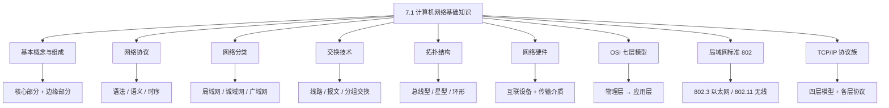

## 计算机网络的概念

**计算机网络是由具有独立功能的多台计算机组成的、能实现远程信息处理和资源共享的系统**。

这样定义比较绕，拆开看三个要点：

- **多台具有独立功能的计算机**——不是一台机器，是多台各自能独立工作的机器连在一起。
- 能**远程信息处理**——相距很远也能交换、处理信息。
- 能**资源共享**——硬件、软件、数据都能供网络上的其他机器使用。

满足以上特点的系统，具有**资源丰富、功能强大、使用方式透明**等特点，就称为计算机网络。

> [!TIP] 通俗理解
> 计算机网络就是"把多台各自能独立工作的电脑，通过某种方式连起来，让它们能远程通信、能互相借用彼此的资源"。

## 计算机网络的组成

从**功能**上看，一个网络分两部分：**核心部分**和**边缘部分**。

- **边缘部分**：由**主机**（又称**端系统**）构成。主机就是各自的计算机及其终端（如 PC、手机、服务器等），它负责运行各种应用，是让用户真正"用起来"的部分。
- **核心部分**：由**路由器**和**网络**构成。它负责把边缘的主机连接起来，起到转发、路由的作用，是网络的心脏。

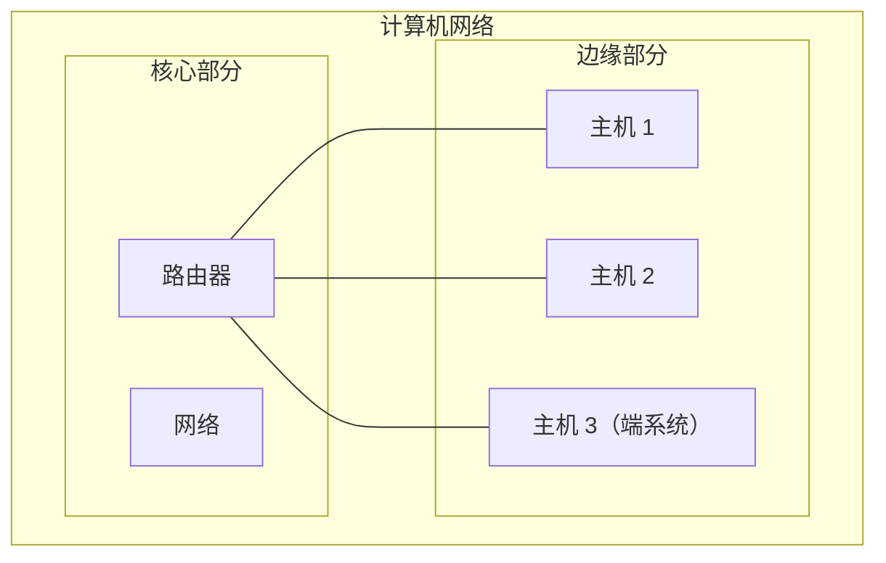

> [!TIP] 通俗理解
> 边缘部分就是"大家手里的电脑、手机"，真正干活用；核心部分就是"中间的交换机和路由器们"，负责把所有人连起来并帮忙转达数据。

## 网络协议

要让不同计算机之间能正常通信，必须有大家共同遵守的"规矩"，这个规矩就是**协议**。一个协议由**三个要素**构成：**语法、语义、时序（同步关系）**。

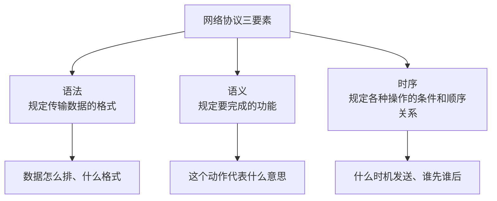

- **语法**：规定**传输数据的格式**——数据怎么排列、字段怎么组织。就好比写信要按"称呼—正文—落款"的格式来写。
- **语义**：规定**要完成的功能**——每种报文或控制字段表示什么意思。就好比"点头"表示同意、"摇头"表示反对。
- **时序（同步关系）**：规定**各种操作的条件和顺序关系**——什么时候发、谁先发谁后发、收发要有先后次序。

> [!TIP] 通俗理解
> 协议三要素可以记一句话：**格式对不对（语法）、意思是什么（语义）、顺序及时机如何（时序）**。

## 网络的分类

按**分布范围**从小到大，网络分为**局域网、城域网、广域网**。记数量级和特征即可区分。

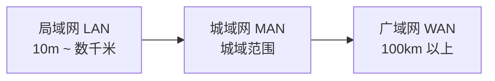

### 局域网（LAN）

**分布范围很有限**，一般在 **10 米到 1000 米**左右（比如一间办公室、一栋楼、一个园区）。它的特点有：

- **数据传输速率很高**，占有较大带宽，常为**千兆位每秒 1 Gb/s**（字幕里讲的"一兆/千兆"量级）。
- 数据传输的**可靠性高**（差错率低）。
- **拓扑结构比较简单**，系统**易于配置和管理**。
- 传输介质通常采用**同轴电缆、双绞线**，也采用**光纤**。

### 广域网（WAN）

**分布范围很广**，一般在 **100 千米（100km）以上**，可跨越城市、国家甚至全球。它的特点与局域网正好相反：

- **数据传输速率低**，一般为每秒几十兆。
- **传输可靠性随传输介质的不同而不同**。
- 拓扑结构**复杂**。
- 一般**借助传统公共网进行传输**（如公用电话网）。
- 通信控制比较复杂。

### 城域网（MAN）

**介于局域网与广域网之间的一种大范围高速网络**，覆盖范围通常是一个城市。

> [!WARNING] 真题考点
> 记清楚局域网/广域网的关键差异：局域网**范围小、速率高、可靠**；广域网**范围大、速率低、复杂**。给一个场景能判断是哪种网络。

## 交换技术

按**交换方式**，网络可分为**线路交换、报文交换、分组交换**三种，这是数据如何"在网络里被传递"的技术，也是常考点。

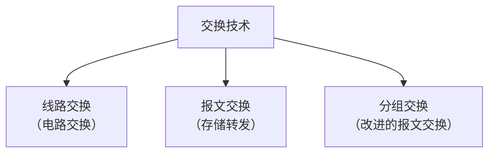

### 线路交换（电路交换）

**线路交换的过程包括三步：建立连接 → 传输数据 → 断开连接**。

- 优点：数据**直接传送**，**延时非常小**（仿佛直线拨通专线）。
- 缺点：**利用率低**，不能充分利用线路容量，**不便于进行差错控制**。

> [!TIP] 通俗理解
> 线路交换像**打电话**：先拨号建立连接，接通后独享这条线路通话，说完再挂断。全程占着这条线，其他人不能同时用，所以利用率低。

### 报文交换

**报文交换**在数据上**加上原地址、目的地址、长度和校验码**，将其**封装成报文**发送给**下一节点**，由节点转发。这种网络又称 **存储转发网络**。

- 优点：能利用线路容量；**实现不同链路之间不同数据率的传输**；能实现**一对多、多对一**的访问；能**实现差错控制**；能实现**格式转换**。
- 缺点：会**增加资源的开销**、**增加缓冲（存储）延迟**、**缓冲区难以管理**。

### 分组交换

针对报文交换的缺点，产生了**分组交换**——它是**将数据分成较短的、固定长度的数据块（分组）**来传输。分组的出现是为了**迎合数字化发展的需要**。

- 优点：**缓冲区易于管理**、**包延时更小**、**更加标准化**、更适用于各种应用。

> [!NOTE]
> 从**线路交换到报文交换再到分组交换**，是一个**逐步发展**的过程。三者对比可记：线路交换独占、报文交换整条报文存储转发、分组交换把数据拆成小包。

## 拓扑结构

按**网络拓扑结构**，可分为**总线型、星型、环形**三种。

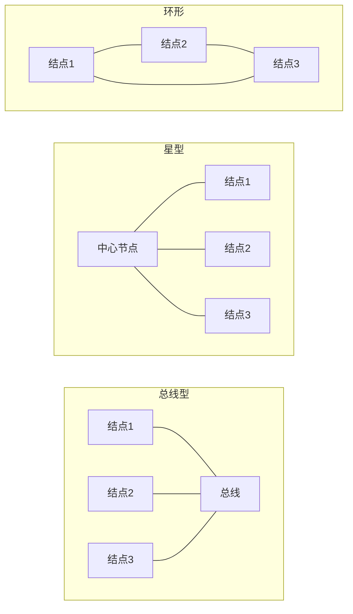

### 总线型

**一条总线上挂着多个站点，大家一起共享这一条总线**。它的传输介质主要是**同轴电缆**，分为**基带同轴电缆**和**宽带同轴电缆**。

### 星型

**中间有一个中心节点，所有站点都连接在这个中心节点上**。服务器/客户端模式的架构**一般采取星型连接**。中心节点在星型网络中起着**控制和交换**的作用，是网络中的**关键**。

- **缺点**：可靠性较低——如果这个中心服务器（中心节点）**断掉，周围所有客户端都无法运作**。

### 环形

把各站点**连成一个环**，数据沿环传递。

> [!TIP] 通俗理解
> 总线型像"一条晾衣杆上挂多件衣服"，都挤在这根杆上；星型像"一个老板管多个手下"，老板一出事全员瘫；环形象"手拉手围成一圈"。

## 网络硬件

计算机网络的硬件可从两个角度划分：**互联设备**和**传输设备（传输介质）**。

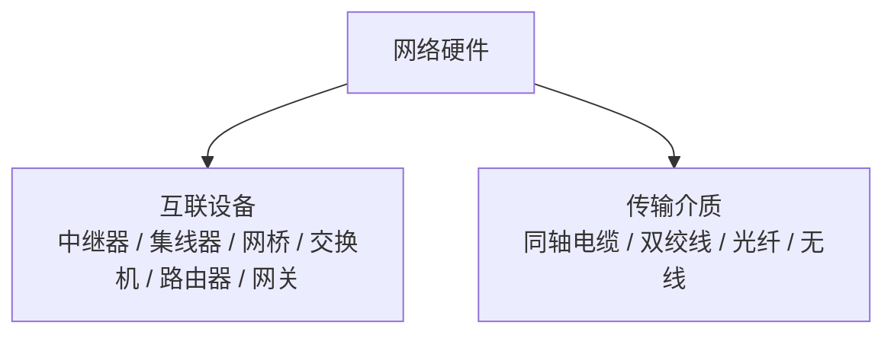

### 互联设备

六大互联设备从低到高分别是**中继器、集线器、网桥、交换机、路由器、网关**，它们的"聪明程度"和隔离能力逐级提升。这个顺序本身常考。

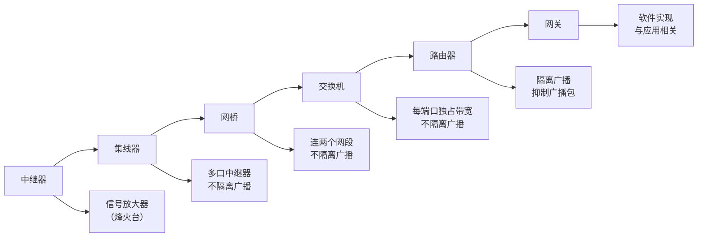

- **中继器**：本质是**信号放大器**，把衰减的信号放大后继续传送。可以理解为古代的**烽火台**——一站传一站，把"狼烟"接力传下去。
- **集线器（Hub）**：**一种特殊的中继器**，提供**多个端口**的服务。分为**无源集线器**（对传输信号不做任何处理）、**有源集线器**（对信号进行整形、放大和转发）、**智能集线器**（在有源基础上还能做**网络管理和路径选择**）。注意：**集线器不隔离广播**，所有端口数据都会被广播出去。
- **网桥**：**连接两个网段**的设备，使多个局域网互连、实现局域网之间的通信。但**网桥没有流量控制功能**，只适合**用户数不多、通信量不大**的局域网。
- **交换机**：核心特点是**每个端口能独占整个带宽**，能大大提高网络的传输效率。
- **路由器**：具有**广播包抑制和子网隔离**功能（网桥没有），能做路由选择。
- **网关**：**不能完全归属于一个网络硬件**，可以设在服务器、微型机和大型机上，**具有强大的功能，并且大多数时候和应用有关**，如**电子邮件网关、IBM 主机网关、英特尔网关、局域网网关**。

> [!WARNING] 真题考点（隔离广播）
> **谁隔离广播？**路由器**隔离**广播，而**网桥、集线器、交换机都不隔离广播**。这是本节最常考的判断点。

### 真题：判断广播分组能否通过

某 IP 网络中，判断广播分组能否在下列计算机之间通过，关键是看路径上有没有**隔离广播**的路由器。

- **P 与 Q**：路径上只隔**网桥**，网桥不隔离广播 → **可以通过**。
- **P 与 S**：路径上经过**路由器**，路由器隔离广播 → **不能通过**。
- **Q 与 R**：经过**集线器和网桥**，两者都不隔离广播 → **可以通过**。
- **S 与 T**：经过**交换机**，交换机不隔离广播 → **可以通过**。

**所以"不能通过"的路径是 P 与 S，选 B。**

> [!NOTE]
> 记一个通用结论：**路径中只要出现路由器，广播就过不去；只有网桥/集线器/交换机则能通过**。

### 传输介质

传输介质分为**有线**和**无线**。有线有**同轴电缆、双绞线、光纤**；无线上有**无线电、微波、红外线、可见光**。

**同轴电缆**分为**粗缆**和**细缆**：

- 粗缆：用于 **10Base-5 以太网**，**最大干线长度为 500 米**。
- 细缆：用于 **10Base-2 以太网**，**最大干线长度为 185 米**。
- 同轴电缆**绝缘效果好、频带较宽，数据传输稳定、价格适中、性价比高**。

**双绞线**分为**屏蔽双绞线**和**非屏蔽双绞线**。使用双绞线组网时，双绞线与网卡、与集线器的**接口为 RJ45（俗称水晶头）**。

**光纤**分为**单模光纤**和**多模光纤**：

- **单模光纤**：接收信号和输入信号**最为接近**（信号保真度好）。
- **多模光纤**：信号**散射比较严重**，**获取速率比较低**。

**无线传输**主要有**无线电、微波、红外线和可见光**。**微波传输**一般采取**天线塔**或**卫星通信**等方式；**红外传输**的**缺点是使用范围一般比较近**。

## OSI 七层参考模型

OSI（开放系统互连）参考模型把网络分为 **7 层**，从低到高是：**物理层、数据链路层、网络层、传输层、会话层、表示层、应用层**。虽然实际中基本不用 OSI，但它是**一切网络模型的基础，必须认识**。

记 7 层顺序有个口诀：**物（物理）→ 数（数据链路）→ 网（网络）→ 传（传输）→ 会（会话）→ 表（表示）→ 应（应用）**，从下往上。

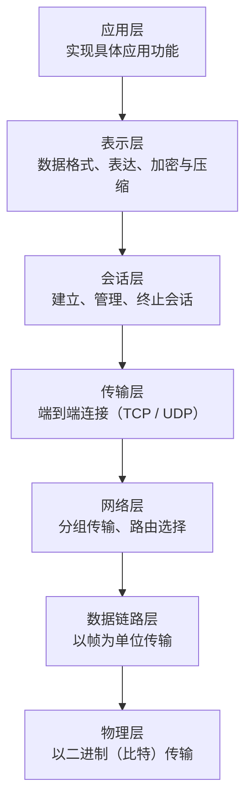

**OSI 各层要点**（层、职责、典型设备/协议，软考常考"哪台设备在哪一层"）：

| 层 | 职责（干什么） | 典型设备 | 典型协议 |
|---|---|---|---|
| 应用层 | 实现具体应用功能 | — | FTP、HTTP、SMTP、DHCP、TFTP、SNMP、DNS 等 |
| 表示层 | 数据格式、表达、加密与压缩 | — | （数据表示） |
| 会话层 | 建立、管理、终止会话 | — | （会话管理） |
| 传输层 | 端到端连接，提供 TCP/UDP | — | TCP、UDP |
| 网络层 | 分组传输、路由选择 | **路由器、三层交换机** | ARP、RARP、IP、ICMP、IGMP |
| 数据链路层 | 以帧为单位传输 | **网桥、交换机、网卡** | PPP、SLIP（数据链路协议） |
| 物理层 | 以二进制（比特）传输 | **中继器、集线器** | （电气规范） |

> [!WARNING] 真题考点
> **设备对应哪一层**是重中之重：物理层→中继器、集线器；数据链路层→网桥、交换机、网卡；网络层→路由器、三层交换机。这个映射必须记牢。

**物理层四大特性**：**机械特性、电气特性、功能特性、规程特性**。这个也是识记点。

**各层真正"干活"的功能**：

- **数据链路层**：实现**差错控制**和**流量控制**。
- **网络层**：进行**路由选择、拥塞控制、顺序控制、传送包**，并**保证报文的正确性**。

## 局域网标准（IEEE 802）

局域网基础是在 OSI 模型的基础上发展起来的。IEEE 802 标准定义了局域网，其中**物理层**和**数据链路层**与标准相关，物理层的协议是 **IEEE 802**。

**IEEE 802 的物理层功能**：信号的**编码与解码**、**前导码的生成与去除**、**比特的发送与接收**。

**IEEE 802 的数据链路层**又分为两层：**逻辑链路控制层（LLC）** 和 **媒体访问控制层（MAC）**。

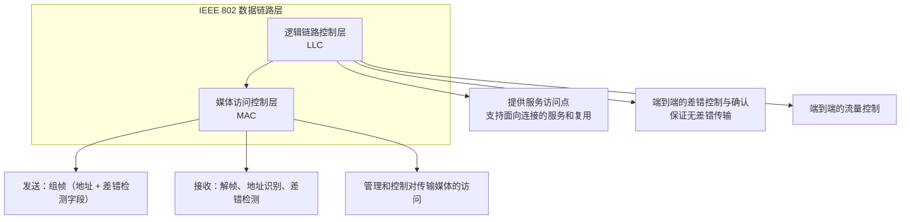

- **媒体访问控制层（MAC）** 的功能：**发送时**，把要发送的数据**组装成帧**（帧中包括**地址和差错检测字段**）；**接收时**，把收到的帧**解包**，进行**地址识别与差错检测**；并**管理和控制对局域网传输媒体的访问**。
- **逻辑链路控制层（LLC）** 的功能：提供**一个或多个服务访问点（SAP）**，通过这些服务访问点支持**面向连接的服务**和**复用能力**；进行**端到端的差错控制与确认**（保证无差错传输）；进行**端到端的流量控制**。

**IEEE 802 制定的标准有近 20 个，但要记住两个**（软考高频）：

- **802.3**：**带碰撞检测的载波侦听多路访问（CSMA/CD）**方法和物理层规范——这是**以太网**的标准。
- **802.11**：**带冲突避免的载波侦听多路访问（CSMA/CA）**方法——这是**无线局域网**的标准。

**为什么无线局域网不能用 CSMA/CD、只能用 CSMA/CA？** 因为 802.11 采用 CSMA/CA 是基于无线传输的特殊性：在无线传输环境中，**侦听载波和冲突检测是不可靠**的——无线电波通过天线发送出去，**自己无法监视到自己发的波**，因此**冲突检测实际上做不到**。所以 802.11 用"**实际侦听有没有电波在传 + 虚拟载波侦听**（告知大家多久之后再传，以防止冲突）"来**避免**冲突，而不是像以太网那样"边发边**检测**冲突"。

> [!WARNING] 真题考点
> 记牢这两个：**802.3 = 以太网 = CSMA/CD（检测冲突）**；**802.11 = 无线局域网 = CSMA/CA（避免冲突）**，以及"无线网络为何不用 CSMA/CD"的理由。

## TCP/IP 协议族

### TCP/IP 模型与 OSI 对应

TCP/IP 是实际应用中最广的协议族，它有**五个方面的特性：逻辑编址、路由选择、域名解析、错误检测、流量控制**。TCP/IP 用一个**四层模型**与 OSI 七层对应：

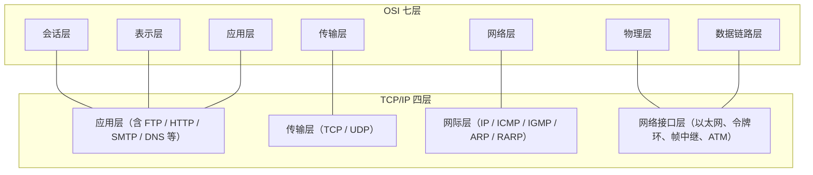

对应的映射关系：**OSI 的应用层、表示层、会话层** → TCP/IP 的**应用层**；**传输层** → **传输层**；**网络层** → **网际层（网络层）**；**数据链路层、物理层** → **网络接口层**。

- **网络接口层**：负责**为物理网络准备数据所需的全部程序和功能**，包含**以太网、令牌环、帧中继、ATM**。
- **网际层**（含 IP 协议）：包含 **IP、ICMP、IGMP、ARP、RARP** 协议。
- **传输层**：包含 **TCP、UDP** 协议。
- **应用层**：包含 **POP3、FTP、HTTP、TFTP、Telnet、SMTP、DNS、DHCP、SNMP** 等众多协议。

### 可靠与不可靠：TCP vs UDP

看一个协议是可靠还是不可靠，关键看它是**基于 TCP 还是 UDP**。

- **TCP（面向连接、可靠）**：为应用提供**可靠的、面向连接的、全双工的数据流**，采用**重发技术**保证传输可靠性，并用**三次握手**实现原主机与目的主机达成同步。**基于 TCP 的应用层协议是可靠的**。
- **UDP（面向无连接、不可靠）**：是不可靠的无连接协议，但开销小、快捷。**基于 UDP 的应用层协议是不可靠的**。

**三次握手**：就是"A 先传→ B 确认传回来 → A 再传一次"，共三次。**为什么要三次**？为了**达到传输同步**，所以必须做三次。

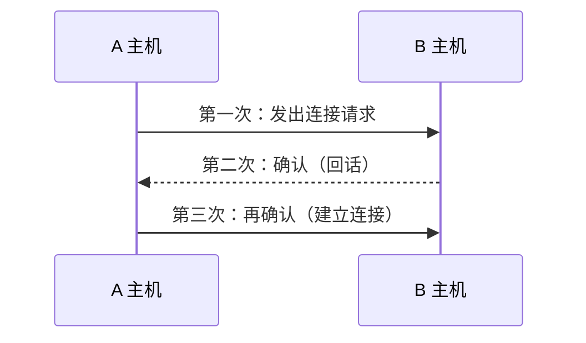

**哪些应用层协议可靠（基于 TCP），哪些不可靠（基于 UDP）？** 字幕里列出：

- 可靠（TCP 延续）：**POP3、FTP、HTTP、Telnet、SMTP**（这些划线都是 TCP 协议的延伸，即可靠的）。
- 不可靠（UDP）：**DHCP、TFTP、SNMP、DNS** 等。

> [!WARNING] 真题考点
> **哪个协议可靠、哪个不可靠**是高频考点。记规律：**靠 TCP 的可靠（FTP/HTTP/SMTP/POP3/Telnet），靠 UDP 的不可靠（DHCP/TFTP/SNMP/DNS）**。

**应用层需要注意的协议**：**NFS、CIFS、SNMP** 等都属于应用层协议，要知道**每个协议属于哪一层**。

### 关键协议逐个看

**IP 协议**：将上层数据（如 TCP、UDP 数据或网络层其他数据）**封装到数据包（数据报）**并**传送到目的地**；为使数据能在不同链路上传输而**对数据进行分段**；**确定数据报到达其他网络中目的地的路径**。IP 是**无连接、不可靠**的：

- **无连接**：在确定目标系统**尚未做好接收数据的准备之前**就先发送数据。
- **不可靠**：目标系统**不对成功接收的分组进行确认**，IP 只是尽可能地使数据传输成功，属于**尽力而为**的服务。

**ARP 与 RARP**：**ARP 是将 IP 地址转换为物理（MAC）地址**；**RARP 是反向过程**（把物理地址转回 IP 地址）。

**ICMP（网际控制报文协议）**：用于 **IP 主机、路由器之间传输控制信息**，一般是一种**确认信息**的协议。

**TCP**：可靠、面向连接、全双工，采用重发技术，用三次握手同步。

**UDP**：不可靠、无连接。**交互性会话应用如 FTP 通常用 TCP**；而**自己进行错误检测的应用**（如 **DNS、SNMP**）通常采用 **UDP**。

### DHCP（动态主机配置协议）

**DHCP** 采用**客户端 / 服务器模式**：客户机去**申请** DHCP 服务器上的 IP 地址，服务器**动态分配** IP 给客户端。

- **租期**通常默认为 **8 天**（字幕"38 天"为读音误值，标准值 8 天）。
- 当租期**过半**时，客户机需向原 DHCP 服务器**申请续租**。
- 当租约用到**87.5%** 仍没有和当初分配 IP 的 DHCP 服务器联系上，则开始**联系其他 DHCP 服务器**。

> [!NOTE] 校对说明
> 字幕此处读音为"38 天"，为保证内容准确，采用教材标准的 **8 天**默认租期，处理比例仍为 1/2、7/8（87.5%）两档。

### DNS（域名系统）

**DNS 负责把域名解析成 IP 地址**。域名解析中，**主机向本地域名服务器**查询采用**递归查询**，**本地域名服务器向根域名服务器**查询采用**迭代查询**。

- **递归查询**：被查询的服务器**必须给出"目的 IP 与域名之间的映射关系"这一最终答案**。可以这么理解：客户端问服务器，服务器负责去问别人、但**由它负责把最终答案告诉客户端**。
- **迭代查询**：被查询的服务器**每收到一次查询就回复一次结果**，但这个结果**不一定是最终映射关系**，**也可能是其他域名服务器的地址**——即"我可以告诉你，你该去问谁最可能知道答案"。

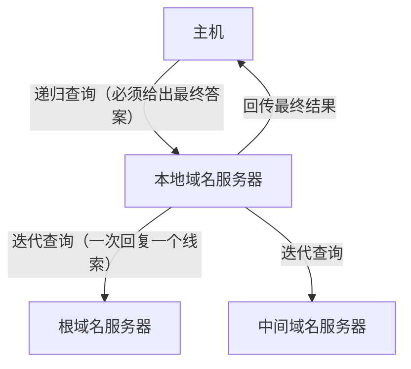

**为什么根域名服务器采用迭代查询？** 因为**根域名服务器的负担比较重、效率比较低**，所以**很少采用递归，而采用迭代查询**。

### 真题：DNS 查询方式判断

某题中，主机 1 和主机 2 进行域名查询，问"下列哪项说法正确"：

- 题干提到"**根域名服务器采取递归查询**"是**错误**的说法——根域名服务器采取的是**迭代**查询。
- "该域名服务器与中间域名服务器**均采用迭代查询**"也是**错误**——正确应为：**本地/中间域名服务器采取递归查询，根域名服务器采取迭代查询**。
- 因此正确答案为 A。

> [!NOTE]
> 记住一个对应关系就能做对这类题：**客户端 → 本地域名服务器 = 递归；本地域名服务器 → 根/中间域名服务器 = 迭代**。

## 本节小结

① **网络基本概念与组成**：计算机网络 = 多台独立功能的计算机互连，能远程信息处理、资源共享。组成上分**核心部分（路由器 + 网络）**和**边缘部分（主机/端系统）**。网络协议三要素=**语法（数据格式）、语义（功能含义）、时序（操作条件与顺序）**。

② **网络分类与交换**：按范围分**局域网（10m~数 km、速率高、可靠、易管理）、城域网（介于两者）、广域网（100km 以上、速率低、复杂、靠公共网）**。按交换分**线路交换（建立/传输/断开，延时小、利用率低）、报文交换（存储转发网络，可做差错控制但缓冲管理难）、分组交换（拆成定长小包，缓冲区易管理、延时小）**。

③ **拓扑结构**：**总线型（一条总线共享，用同轴电缆，分基带/宽带）、星型（中心节点控制交换，服务器/客户端常用，中心挂则全瘫、可靠性低）、环形（连成环）**。

④ **网络硬件——互联设备**：**中继器（信号放大器/烽火台）→ 集线器（多口中继，分无源/有源/智能，不隔离广播）→ 网桥（连两网段、无流量控制、不隔离广播）→ 交换机（每端口独占带宽、不隔离广播）→ 路由器（隔离广播、抑制广播包）→ 网关（软件实现、与应用相关）**。**记住：隔离广播的只有路由器**。

⑤ **传输介质**：有线=**同轴电缆（粗缆 10Base-5 500m / 细缆 10Base-2 185m）、双绞线（屏蔽/非屏蔽，接口 RJ45 水晶头）、光纤（单模信号最接近输入 / 多模散射严重速率低）**；无线=**无线电、微波（天线塔/卫星，红外范围近）**。

⑥ **OSI 七层**：**物理、数据链路、网络、传输、会话、表示、应用**。**物理层设备=中继器/集线器；数据链路层=网桥/交换机/网卡；网络层=路由器/三层交换机**。物理层四特性=机械、电气、功能、规程。局域网 802 标准：**802.3=以太网=CSMA/CD（检测冲突）、802.11=无线=CSMA/CA（避免冲突，因无线无法侦听/检测冲突）**。

⑦ **TCP/IP 协议族**：四层映射（应用/传输/网际/网络接口，对应 OSI 7 层）。**可靠=TCP 类（FTP、HTTP、SMTP、POP3、Telnet），不可靠=UDP 类（DHCP、TFTP、SNMP、DNS）**，TCP 三次握手实现同步。**IP 无连接不可靠（尽力而为）**；**ARP=IP→物理地址，RARP 反之**；**ICMP 传控制/确认信息；DHCP 动态分配 IP（租期 8 天，1/2 续租、7/8 换服务器）**；**DNS 域名解析：本机→本地 DNS 递归，本地→根 DNS 迭代（因根服务器负担重）**。