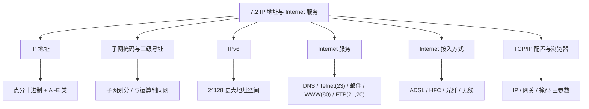
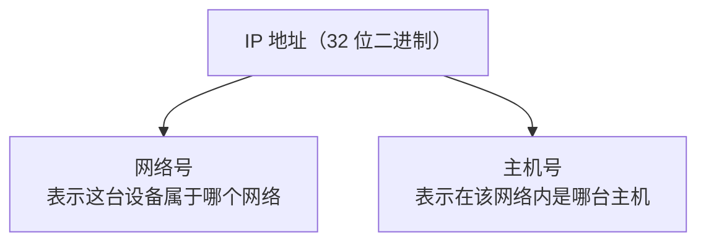
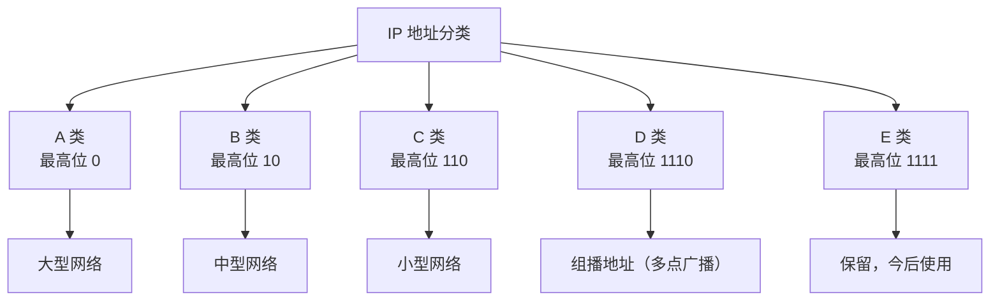
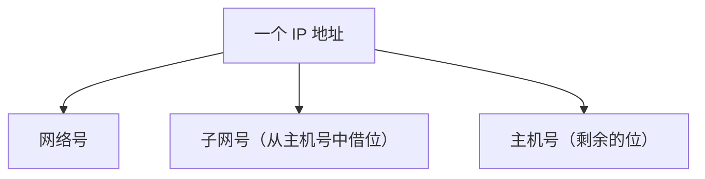
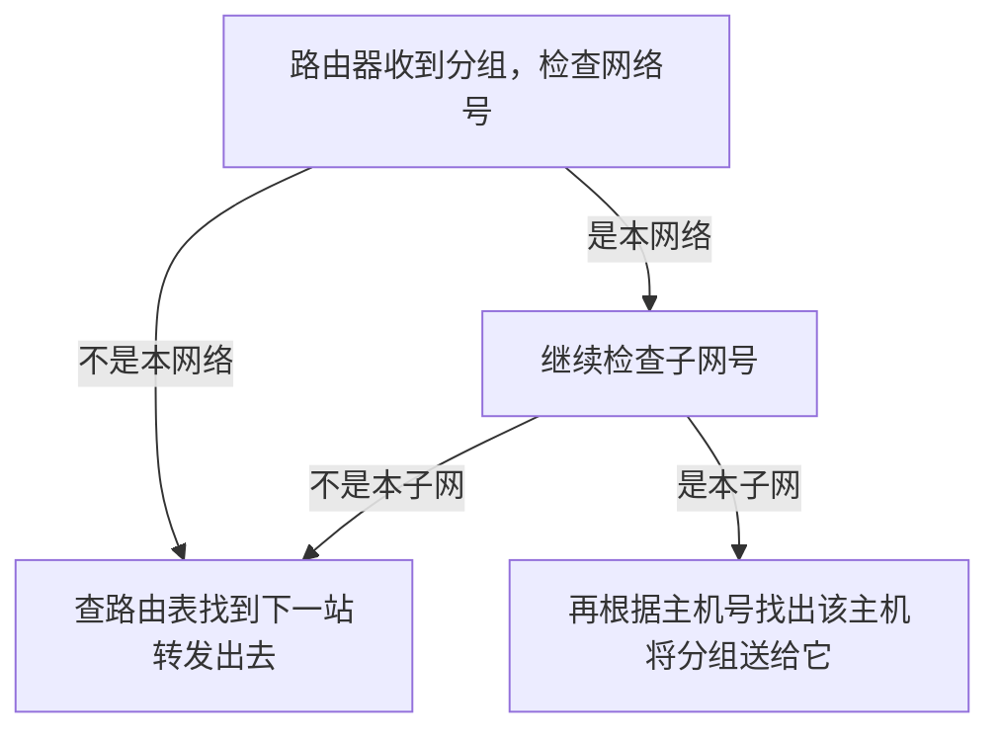
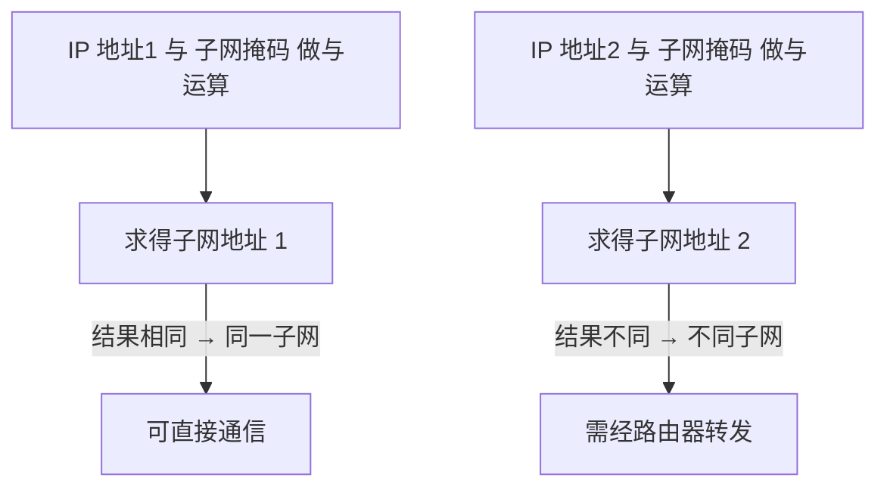
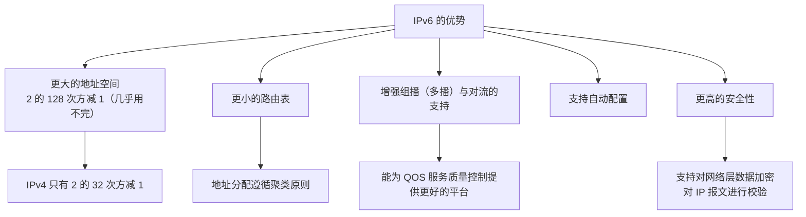
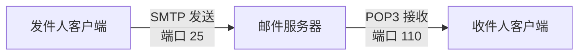
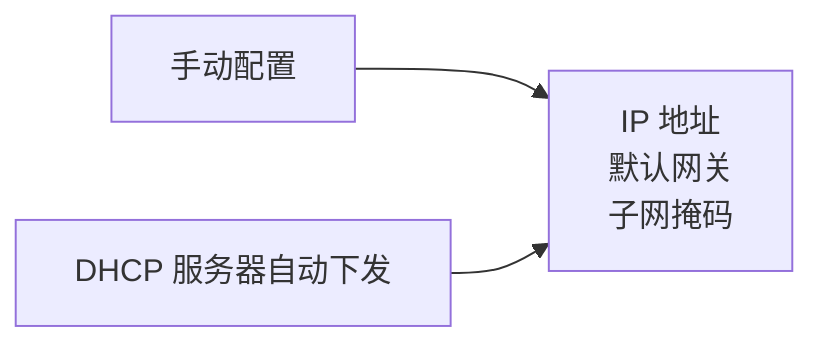

课程链接：视频《7.2 IP 地址与 Internet 服务》（软考程序员系列课程）

视频链接：

## 本节概述

本节是系列课程的第二十一节课，进入教材第 7 章「网络与信息安全基础知识」，本节讲解 **IP 地址** 和 **Internet 基础知识**，对应教材 7.3.3 节「IP 地址」与 7.4 节「Internet 基础知识」这两块内容。IP 地址的分类、子网掩码的计算、各服务的端口号是软考的高频考点。本节脉络依次是：IP 地址的表示与分类（A/B/C/D/E 类）→ 子网掩码与三级寻址 → IPv6 → Internet 服务（DNS/Telnet/电子邮件/WWW/FTP）→ Internet 接入方式 → TCP/IP 的配置 → 浏览器的设置。

先看一张本节的知识地图，把整节内容装进脑子里：



## IP 地址的基本概念

**IP 地址是指每台计算机和路由器都由授权机构分配的一个号码**，用来在网络中唯一标识一台设备。打个比方：授权机构有点像电信公司，它给每个手机或固定电话分配号码——电话号由**区号**和**电话号码**组成，采用**分层的结构**。IP 地址也是如此，通常由**网络号**和**主机号**两部分组成。



**IP 地址的表示**：IP 地址是 **32 位的二进制**数，被划分为**四个字节**，每个字节 **8 位**，字节之间用**点**分隔。用每段十进制（0~255）来表示，这种表示法叫 **点分十进制表示法**。例如 `192.168.1.1` 就是一个典型的 IP 地址。

> [!NOTE]
> 32 位分 4 段、每段 8 位，用点的分隔 + 十进制书写 = **点分十进制**。这一基本常识要记住。

## IP 地址的分类

按**网络的规模**（网络号、主机号位数不同），把 IP 地址分为 **A、B、C、D、E 五类**。分类的关键看**最高位（开头几位二进制）**：



| 类别 | 最高位 | 网络号 | 主机号 | 可容纳主机数 | 网络规模 | 主要用途 |
|---|---|---|---|---|---|---|
| A 类 | 0 | 1 字节（8 位） | 3 字节（24 位） | 约 2²⁴ 减 2，约 1600 万台 | 大型网络 | 大型网络/主干网 |
| B 类 | 10 | 2 字节（16 位） | 2 字节（16 位） | 2¹⁶ 减 2，约 6 万多台 | 中等 | 中大型单位 |
| C 类 | 110 | 3 字节（24 位） | 1 字节（8 位） | 2⁸ 减 2 = 254 台 | 小型网络 | 小型局域网 |
| D 类 | 1110 | — | — | — | — | 组播（多播）地址 |
| E 类 | 1111 | — | — | — | — | 保留，今后使用 |

- **A 类**：网络号占 **1 字节（8 位，实际可用 7 位）**，主机号占 **3 字节（24 位）**。可表示的主机数约为 **2 的 24 次方减 2 ≈ 1600 万台**，主要用于**大型网络**。
- **B 类**：前**两个字节作为网络号**，最高位 `10`。最大网络数约 2¹⁴ 减 2，可容纳主机数约 **2¹⁶ 减 2，即 6 万多台**。B 类地址区间为 **`128.0.0.1` 到 `191.255.255.254`**。
- **C 类**：最高位 `110`，前 3 字节为网络号。网络数约 **2²¹ 减 2**，主机数 **2⁸ 减 2 = 254 台**，用于**小型网络**。
- **D 类**：最高位 `1110`，用于**组播（多播）地址**。这个要记一下。
- **E 类**：最高位 `1111`，**保留给今后使用**。

> [!WARNING] 真题考点
> 五类的开头位是识记重点：**A=0、B=10、C=110、D=1110、E=1111**；**D 类是组播地址**；A/B/C 对应大/中/小型网络。给一个 IP 首字节范围要能判断属于哪一类。

## 子网掩码

**为什么需要子网掩码？** 因为 IP 地址使用过程中，**主机位存在大量浪费**，于是增加了**子网的划分**：在主机号这里，**用一部分主机号作为子网号**，把一个大的网络再分成若干小的子网。



**子网掩码**就是用来指明"网络号 + 子网号"占了哪几位、主机号占了哪几位的数字化表示。把网络位和子网位对应的掩码位置成 **1**、把主机位对应的位置成 **0**，再转成十进制。

例如一个 A 类地址的子网掩码常写作 `255.255.255.0`——前三个字节全为 1（对应网络号+子网号），最后一字节为 0（对应主机号）。

> [!NOTE]
> 掩码中：**255 = 全 1**（表示网络/子网位），**0 = 全 0**（表示主机位）。例如 `255.255.255.0` 表示前 24 位是网络位、后 8 位是主机位。

### 三级寻址

引入子网后，寻址就变成**三级**了：**网络号 → 子网号 → 主机号**。每个路由器收到一个分组时，按下面的顺序处理：



- 先检查网络号：**若不是本网络**，则从路由表找到下一站，**转发过去**。
- 若是本网络，则**检查子网号**：若不是本子网，同样转发；若是本子网，**再根据主机号**找到对应主机，把分组交给它。

**如何判断两台主机是否在同一子网？** 把两台主机的 **IP 地址与子网掩码分别做按位与（AND）运算**，**如果结果相同，就表示它们在同一子网**；不同则不在同一子网。



> [!TIP] 通俗理解
> 把 IP 和掩码对齐，掩码是 1 的地方保留 IP 的对应位，掩码是 0 的地方清零。这样"只留网络/子网号、去掉主机号"，得到的就是"子网地址"。两台机器如果子网地址一模一样，就在同一个子网里。

### 子网掩码计算（真题）

题目常给"`/n`"这种写法（斜杠加前缀长度），表示**网络号 + 子网号共占 n 位**，剩下 `32 - n` 位是主机位。例如：

- `32 - 22 = 10`，代表有 **10 个主机位**，那么网络位就是 `22` 位、主机位 10 位。
- 把这 32 位写出来看掩码：前 **22 位是 1**，后 **10 位是 0**。前三个字节 24 位里，前 22 位是 1（前两字节全 1 + 第三字节前 6 位是 1），所以前两个字节是 `255.255`，第三字节前 6 位是 1、后 2 位是 0：`11111100` = **252**，最后一字节 8 位全 0 = **0**。
- 因此掩码是 **`255.255.252.0`**。

> [!WARNING] 真题考点
> 会算 `255.255.252.0` 这类掩码：`/22` → 网络位 22、主机位 10，第三字节 `11111100` = 252。思路是"前缀位数 → 写 1 的个数 → 转十进制"。

## IPv6

**IPv6 是为了解决 IPv4 地址不够用而产生的解决方案**。IPv4 采用 32 位、最多约 2³² 个地址，且**主要分布在美国，地址不足严重制约了因特网的发展**，因此推出了 IPv6。它有以下优势：



- **更大的地址空间**：IPv6 是 **2 的 128 次方减 1**，而 IPv4 是 2 的 32 次方减 1，所以 IPv6 的地址空间几乎没有用完的可能。
- **更小的路由表**：地址分配时遵循**聚类原则**，路由表更小。
- **增强组播（多播）和对流的支持**，能够为**服务质量（QOS）控制**提供更好的网络平台。
- 加入了对**自动配置**的支持。
- 具有**更高的安全性**：支持对**网络层数据加密**和对 **IP 报文进行校验**。

> [!NOTE]
> IPv6 的优势属于了解级，重点记：**IPv6 地址长 128 位（2¹²⁸），空间远大于 IPv4（2³²）**，以及"自动配置、更高安全性"两点即可。

## Internet 服务

Internet 提供了丰富的网络服务，本节介绍几个常用的。**各服务的端口号是高频考点**。

### Telnet（远程登录服务）

**Telnet 用于远程登录**，使用 **TCP 的端口，端口号是 23**，通过它实现**用户主机与远程主机的连接**。它是**客户端 / 服务器模式**：**客户端是用户的主机，远程主机是服务器**。

### 电子邮件服务（E-mail）

电子邮件地址的格式是 **用户名 @ 主机名**（中间用 `@` 符号连接）。主要有两个协议：

- **SMTP**：用于**发送**邮件，**端口号 25**。
- **POP3**：用于**接收/存放**邮件（新邮件），**端口号 110**。



> [!WARNING] 真题考点
> 记端口号：**SMTP 发送=25，POP3 接收=110**。这是上午题的常考数字。

### WWW（万维网）服务

平时用 Foxmail 等客户端收发邮件走的是 SMTP/POP3；但**在网页上发送和接收邮件**用的是 **WWW 服务**。WWW 服务使用 **HTTP 协议**，**默认端口号是 80**（字幕提到的"8080"是阅读误差，规范是 80），端口号一般不显示在 URL 中，属于可任选但默认 80。

WWW 服务相关三个名词要分清：

- **HTTP**：超文本传输协议，浏览器程序用来传输数据的协议。
- **HTML**：超文本标记语言，描述网页内容的语言。
- **URL**：统一资源定位符，用来定位资源、进行超文本链接，指向远程服务器上的域名和一个外部页面。

**URL（统一资源定位符）** 的一般组成包括：

```
协议:// 主机域名 :端口号 / 目录 / 文件名
```

> [!NOTE]
> 例如 `http://www.sina.com:80/index.html`：协议是 HTTP、主机域名是 `www.sina.com`、默认端口 80、后面是目录和文件名。**WWW 端口规范是 80**。

### FTP（文件传输协议）

**FTP 用于文件传输**，在客户端和服务器端**建立两条 TCP 连接**，使用两个端口：

- **21 端口**：用于**传输命令和参数**（控制连接）。
- **20 端口**：用于**数据连接和传送文件**（数据连接）。

出于**安全考虑**，架设防火墙时（防火墙主要隔绝外部数据请求），**数据连接可以由 FTP 服务器发起**，这样外部的数据请求无法直接穿过防火墙找到内部的 FTP 服务器。

> [!WARNING] 真题考点
> FTP 双端口要记清：**21 控制（命令）、20 数据（文件）**。这是经典的端口号考点。

## Internet 接入方式

用户的计算机接入 Internet 有几种主流方式：**ADSL、HFC（有线电视）、光纤接入、无线接入**。

### ADSL（非对称数字用户线路）

基于电话线。**ADSL 提供上下行非对称的传输服务：上行 1 兆、下行 8 兆**（下行快、上行慢，符合大多数用户"下载多、上传少"的习惯）。它同时提供**数据线路和语音线路**两条线路，通过**分离器**将**话机**与**入户线**分割开——所以接电话和上网可以同时进行。

### HFC（有线电视 / 同轴电缆）

基于有线电视网（同轴电缆）。其**下行一般以广播方式**，**混合传输模拟信号和数字信号**。

> [!NOTE]
> 辨析模拟/数字信号：我们说话的声音是**模拟信号**；通过设备采集后变成 `0 / 1` 来表示的是**数字信号**。之所以要转换，是**为了在长距离传输过程中不失真**。

### 光纤接入

分为**有源系统**和**无源系统**。无源系统：

- **下行**：点到多点；
- **上行**：多点到一点，上行多采用 **时分多址（TDMA）** 技术（按时间划分）。

用**光纤到小区（FTTX）** + **网线到户**，可以实现 **千兆到小区、百兆到大楼、十兆到户** 的 Internet 接入方案。

### 无线接入

无线接入技术主要来自**无绳电话、蜂窝移动通信、微波、卫星通信**，工作方式为**点到多点**。多址接入方式有三种：

- **频分多址（FDMA）**：按**信号频率**划分。
- **时分多址（TDMA）**：按**时间**划分。
- **码分多址（CDMA）**：按**码（正弦/编码）**划分。

> [!NOTE]
> 三种多址只需记住按什么划分：**频分按频率、时分按时间、码分按编码**。

## TCP/IP 的配置

在一台计算机上配置 TCP/IP，需要设置**三个参数：IP 地址、默认网关、子网掩码**。配置了 DHCP 服务器后，就可以**从 DHCP 服务器自动获得这几个 TCP/IP 参数**。



## 浏览器的设置与使用

常用的浏览器有 **IE、火狐（Firefox）、谷歌（Chrome）** 等。浏览器的不同会导致**程序的兼容性**不同。下面以 IE 浏览器为例介绍设置项：

- **常规设置**：设置**主页**（打开浏览器默认的页面）、管理存放在磁盘硬盘上的文件、管理浏览器产生的**历史记录**等。
- **安全设置**：分为**四个区域**：
  - **Internet 区域**：安全级别为**中**；
  - **本地 Internet 区域**：安全级别为**中**；
  - **受信任的站点区域**：安全级别为**低**；
  - **受限制的站点区域**：安全级别为**高**。
- **隐私配置**：主要针对 **cookies**，有**阻止所有 cookies、高、中、低、接受所有 cookies** 等设置。
- **内容配置**：主要有**分级审查**、通过**证书**保护个人识别信息、**配置文件助理**来简化重复输入信息。
- **连接配置**：通过 **ISP（Internet 服务提供商）** 列表和信息，创建 Internet 连接。
- **程序配置**：指定浏览器应使用的**电子邮件、新闻组、日历**的默认程序。
- **其他配置**：如网页播放声音、视频、动画的速度，以及对无效证书发出警告的**收藏功能**（如何把网页加入收藏、整理收藏夹、浏览被收藏的网站）。

> [!NOTE]
> 浏览器设置属了解级，重点记安全性的**四个区域安全级别**：Internet=中、本地 Intranet=中、受信任站点=低、受限制站点=高。

## 本节小结

① **IP 地址**：32 位二进制，分 4 字节每字节 8 位，用点分十进制表示，由**网络号 + 主机号**组成。分五类：**A=0（大型，主机位 24，约 1600 万台）、B=10（中型，区间 128~191）、C=110（小型，主机数 254）、D=1110（组播地址）、E=1111（保留）**。

② **子网掩码与三级寻址**：为解决主机位浪费而把主机号借位成分**子网号**；掩码网络位为 1、主机位为 0（255 全 1、0 全 0）。三级寻址顺序=**网络号 → 子网号 → 主机号**。**判断是否同子网=把 IP 与掩码按位与，结果相同则同网**。**`/n` = 网络+子网共 n 位，主机位 `32-n`**（如 `/22` → 主机 10 位 → 掩码 `255.255.252.0`）。

③ **IPv6**：解决 IPv4（2³²）地址不足，地址空间为 **2¹²⁸**，更小路由表（聚类原则）、增强组播与流支持、支持自动配置、更高安全性。

④ **Internet 服务（记端口）**：**Telnet=23**；**邮件=SMTP 发送 25 / POP3 接收 110**；**WWW=HTTP 默认 80**（URL=协议://主机域名:端口/目录/文件）；**FTP=21 控制（命令） / 20 数据（文件）**，为安全数据连接可由 FTP 服务器发起。

⑤ **Internet 接入方式**：**ADSL**（电话线，上下行非对称，上行 1M/下行 8M，分离器分语音与数据）；**HFC**（有线电视/同轴，下行广播，混合模拟+数字信号）；**光纤接入**（无源系统下行点到多点、上行多点到一点用时分多址，千兆到小区/百兆到大楼/十兆到户）；**无线接入**（无绳电话、蜂窝、微波、卫星，多点接入分频分 FDMA/时分 TDMA/码分 CDMA）。

⑥ **TCP/IP 配置与浏览器**：配置三参数=**IP 地址、默认网关、子网掩码**（可经 DHCP 自动获得）。浏览器安全四区域级别=**Internet 中、本地 Intranet 中、受信任站点低、受限制站点高**。