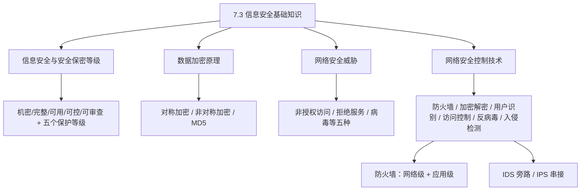
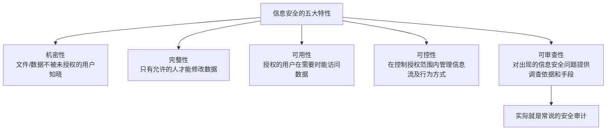
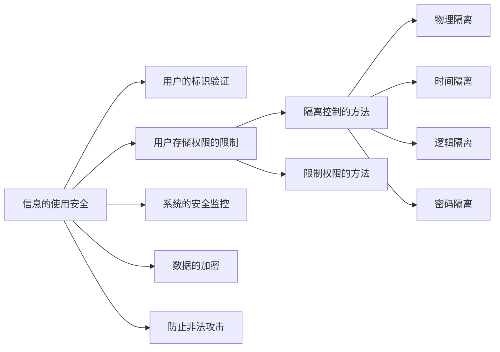
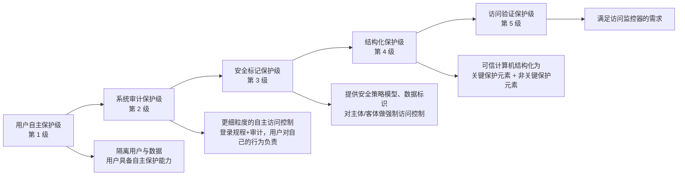
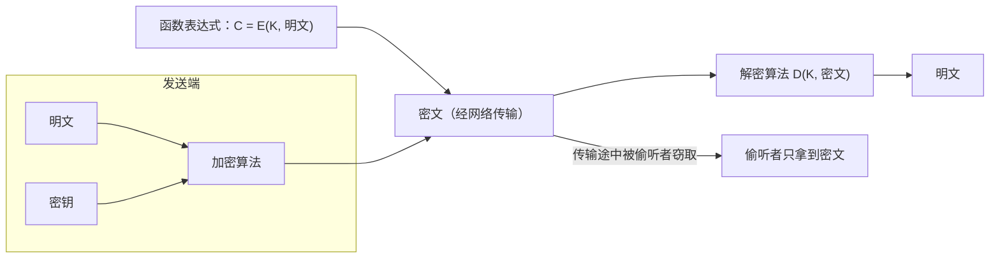
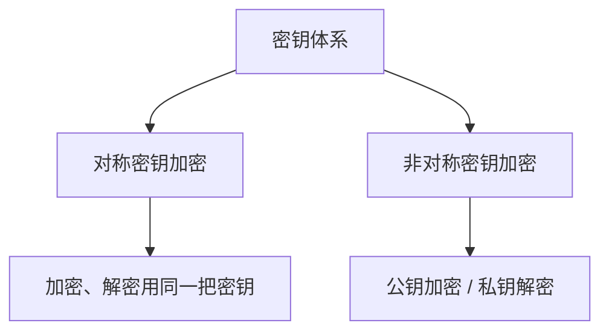
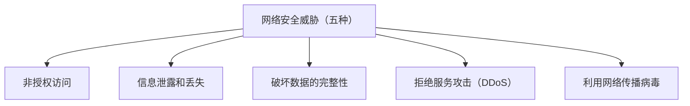
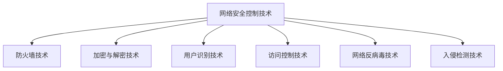
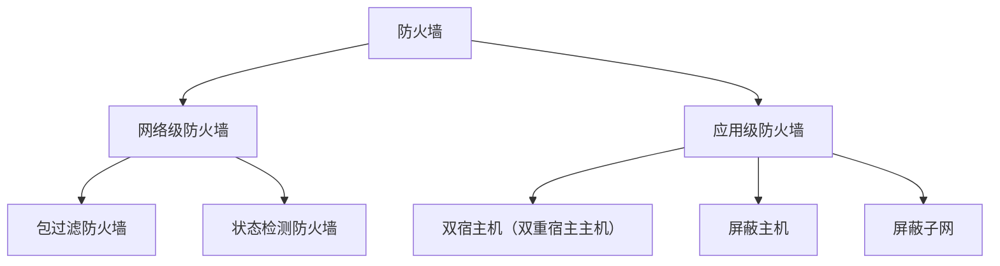

课程链接：视频《7.3 信息安全基础知识》（软考程序员系列课程）

视频链接：

## 本节概述

本节是系列课程的第二十二节课，进入教材第 7 章「网络与信息安全基础知识」，本节讲解**信息安全基础知识**。学习目标是把"信息安全包括哪几项特性""加密分哪两类、谁快谁安全""拒绝服务攻击是什么""木马的服务端装在哪里""防火墙分几类""IDS 和 IPS 的区别"这些考点搞清楚。本节脉络依次是：信息安全与安全保密等级 → 数据加密原理（对称/非对称加密）→ 网络安全威胁 → 网络安全控制技术 → 防火墙技术 → 入侵检测与防御（IDS/IPS）→ 用户识别、访问控制、反病毒与漏洞扫描。

先看一张本节的知识地图，把整节内容装进脑子里：

## 信息安全与安全保密等级

### 信息安全的五个特性

**信息安全**包括五个方面的特性：**机密性、完整性、可用性、可控性和可审查性**。这是本节最基础的考点，五个词要能对号入座。

- **机密性**：指**文件或数据不被未授权的用户所知晓**。
- **完整性**：指**只有允许的人才能修改这个数据**。
- **可用性**：指**已授权的用户在需要时能访问数据**。
- **可控性**：指在**控制授权的范围内**管理信息流及行为方式（也就是能掌控谁、在什么范围内、用了哪些信息）。
- **可审查性**：指能够对出现的信息安全问题**提供调查的依据和手段**，即我们常说的**安全审计**。

### 信息使用的安全控制

信息存储安全与信息使用安全。其中**信息的使用安全**又包括：

- **用户的标识验证（识别）**：确认是谁在使用系统。
- **用户存储权限的限制**：限制用户能访问哪些数据。它又包括**隔离控制**和**限制权限**两种方法。
  - **隔离控制**包括**物理隔离**（各进程使用不同的物理目标，是一种有效的方式）、**时间隔离、逻辑隔离、密码隔离**四种。
  - **限制权限法**：有效限制进入系统的用户所能进行的操作——对用户**进行分类管理、安全级别授权**，把不同的用户分到不同的类别。
- **系统的安全监控、数据的加密、防止非法攻击**等，共同构成信息使用安全。

## 计算机信息系统的安全保护等级

我国将计算机信息系统的安全保护分为**五个等级，逐级增强**：**用户自主保护级、系统审计保护级、安全标记保护级、结构化保护级、访问验证保护级**。

- **第 1 级（用户自主保护级）**：通过**隔离用户与数据**，使用户具备**自主保护能力**。
- **第 2 级（系统审计保护级）**：能进行**更细粒度的自主访问控制**，通过**登录规程**审计与安全相关的事件、**隔离资源**，使用户对自己的行为负责。
- **第 3 级（安全标记保护级）**：提供有关**安全策略模型、数据标识**以及**主体对客体强制访问控制**的非形式化描述。
- **第 4 级（结构化保护级）**：本级的可信计算机必须**结构化为关键保护元素**和**非关键保护元素**。
- **第 5 级（访问验证保护级）**：本级的可信计算机必须满足**访问监控器**的需求。

> [!NOTE]
> 五个等级**逐级增强**是识记点：一级隔离用户与数据，二级加审计，三级加强制访问控制，四级结构化，五级访问监控器。了解即可。

## 数据加密原理

### 加密解密的基本过程

**加密解密原理**：发送端用**加密算法**把**明文（原始数据）**和**密钥**封装成**密文**，通过网络传送；接收端收到密文后，用**密钥**解开密文，从而恢复出明文。窃听者在传输过程中窃取到的是**密文**。

注意一点：**加密体系的安全性是在"给定的计算费用"条件下的安全**——它是计算上的安全，而非理论上的安全。因为对方在获取密文后，只要付出的计算代价足够大，"破解"就变得不可行。

### 对称密钥 vs 非对称密钥

密钥体系分为**对称密钥**和**非对称密钥**两类，它们的差别是核心考点：

| 对比项 | 对称密钥 | 非对称密钥 |
|---|---|---|
| 安全性 | **较低** | **较高** |
| 加密速度 | **快** | **慢** |
| 常用场景 | 加密**量大**的正文数据 | 加密**量小**但关键的密钥 |

- **从安全性上讲**：**对称密钥比非对称密钥安全性低**。
- **从加密速度上讲**：**对称密钥比非对称密钥加密速度快**。

所以实际使用时要权衡：**数据量小但最关键的"密钥本身"用非对称加密；数据量大的"正文"用对称加密**。这样既能保证密钥不泄露，又能保证大量数据的加密速度。

> [!NOTE]
> 通俗理解：一扇门用**两把锁**。门很重（正文数据量大），用普通快锁（对称）；但开门的总钥匙（密钥）很小却最要紧，用保险柜级别的锁（非对称）把它封死。只要钥匙没被偷，门就开不了。

**具体配合策略**：先用**非对称加密对"密钥"进行加密**，密钥小巧但一旦被窃取就能打开密文，所以必须用高强度加密保护；再对**整个明文用对称加密**。这样既利用对称加密的快，又利用非对称加密的安全，保证相对的安全性。这就是常见的数据加密过程。

### MD5 单向散列摘要

在用户识别 / 密码技术中常提到 **MD5 验证**。**MD5 实际上是一种单向散列摘要算法**：

- **摘要（Digest）**：从明文（文件）中选取一段用于生成摘要，作为整段数据的"指纹"。
- **单向散列**：这个过程**不可逆**——知道摘要，**无法还原出真正的明文内容**。
- 它的作用：通过加密形成摘要，**用来验证这一段数据是否确实是该用户发出的**（身份校验、防篡改）。

> [!TIP] 通俗理解
> MD5 像是给一段数据做"**指纹提取**"：从数据里提取出一个固定长度的摘要。指纹能用来"对笔迹"确认是本人，但光看指纹推导不出完整的原文。

## 网络安全威胁

教材给出了网络安全的**五大威胁**：

### 拒绝服务攻击（DDoS）

**拒绝服务（Denial of Service，DoS）** 是一个热门考点。它可以理解为：

> [!TIP] 通俗理解
> 相当于开了一家**座位有限的酒吧**。一个团伙来"收保护费"：你不交，我就每天派一群小弟进酒吧，每人只点一杯啤酒就占一整个座位坐到打烊。结果**真正的顾客进不来、坐不下**，酒吧的服务无法针对正常客户——这就是拒绝服务攻击。

**攻击表现**：攻击发生时，会观察到**大量非正常的 IP 同时登录服务**，导致服务拥堵、**无法正常提供资源**。

**防御措施**：

- 通过**防火墙阻断部分"非法 IP"的访问**——把访问次数多、访问量大的那个区域的 IP 关掉，以**均衡服务资源**。
- 将**主要的关键服务保留**，把**次要的服务关闭**。

### 计算机病毒的种类

利用网络传播病毒是第五类威胁。病毒的种类有**系统引导型、文件外壳型（文件型）、目录型病毒、蠕虫病毒**等；还有**宏病毒**、**木马**等。几个常考的特例要记住：

- **木马（远程控制特洛伊木马）**：它的**客户端**安装在**黑客的主机上**，**服务器端**安装在**受害者的主机上**，通过远程操控受害者的主机来窃取数据。木马**隐蔽性很好**：窃取数据后会**关闭注册程序**、**清空注册表痕迹**，防止被发现。
- **宏病毒**：常见于 **Office 办公软件**上的一种病毒。
- **CIH 病毒**：一种**比较特殊、能破坏硬件**的病毒——它是**唯一能破坏硬件**的病毒，这个很特殊，值得记。

> [!WARNING] 真题考点
> **木马的服务端装在被攻击的主机上、客户端装在黑客主机上**（服务端→受害者，客户端→黑客），方向千万别弄反；**CIH 是唯一能破坏硬件的病毒**。

## 网络安全控制技术

网络安全的控制技术主要包括：**防火墙技术、加密与解密技术、用户识别技术、访问控制技术、网络反病毒技术和入侵检测技术**。

### 防火墙技术

**防火墙技术分为两大类：网络级防火墙和应用级防火墙**。

**网络级防火墙**又包括**包过滤防火墙**和**状态检测防火墙**：

- **包过滤防火墙**：在**内部网络的屏蔽路由器**处对外部网络的威胁进行隔离。它对**数据包进行检测**，能拦截和检查所有出站和进站的数据。处理过程是：**打开包、取出包头，根据包头信息判断该包是否符合包过滤规则**并记录；**对不符合规则的包进行报警并丢弃**。
- **状态检测防火墙**：**结合了代理防火墙的安全性和包过滤防火墙高速的优点**，在不损害安全性的前提下，**提高代理防火墙的性能**。

**应用级防火墙**包括**双宿主机（双重宿主主机）、屏蔽主机、屏蔽子网**几种：

- **双宿主机**：具有两个网络接口的主机，分别连接内部网络和外部网络。
- **屏蔽主机**：在内部网络与外部网络之间安置一台**堡垒主机**。
- **屏蔽子网**：将**堡垒主机**接到**被屏蔽的子网**上。

> [!NOTE]
> 防火墙技术整体了解即可。重点记分类：防火墙分**网络级（包过滤、状态检测）**和**应用级（双宿主机、屏蔽主机、屏蔽子网）**。

### 入侵检测（IDS）与入侵防御（IPS）

这部分要分清 **IDS 和 IPS 的"接入方式"**，是较常见考点：

| 项目 | IDS（入侵检测） | IPS（入侵防御） |
|---|---|---|
| 功能 | **实时监控入侵事件**，改进和增强抵抗入侵的能力 | 不仅**检测**攻击，还主动**发出响应、进行防御** |
| 接入方式 | **旁路接入** | **串接（串联）** |

- **入侵检测（IDS）**：**实时监控入侵事件**，用于改进和增强抵抗入侵的能力。因为**只检测、不拦截**，它的接入方式是**旁路接入**（像监控摄像头，挂在旁边观察）。
- **入侵防御（IPS）**：不仅能**检测**网络上的攻击行为，同时能对攻击行为**发出响应、进行防御**。因为要**拦截数据**，它必须以**串接（串联）**的方式接入——数据必须"穿过去"才能被拦下来。

> [!WARNING] 真题考点
> **IDS 是旁路接入（只管监控）、IPS 是串接接入（能拦截防御）**。为什么不同？因为 IPS 要"挡"攻击，必须先让数据经过它，所以必须串在链路中；IDS 只在旁边看，旁路即可。

### 用户识别、访问控制、反病毒与漏洞扫描

- **用户识别技术**：采用**高强度的密码进行身份验证**（如结合 MD5 单向散列摘要做校验）。
- **访问控制技术**：可根据**安全策略对信息资源进行集中管理**。对资源控制的力度有**粗粒度**和**细粒度**两种。
- **计算机反病毒技术**：主要就是**杀毒软件**。
- **网络安全漏洞扫描技术**：能够**评估软件的风险**，对可能的风险提出**安全建议和改进措施**，可借助应用软件进行扫描。

## 本节小结

① **信息安全五大特性**：**机密性（不被未授权用户知晓）、完整性（只有允许的人能改）、可用性（授权用户在需要时能访问）、可控性（掌控信息流与行为）、可审查性（提供调查依据=安全审计）**。信息使用安全含用户标识验证、存储权限限制（隔离=物理/时间/逻辑/密码 + 限制权限法）、系统安全监控、数据加密、防非法攻击。

② **安全保护五等级（逐级增强）**：用户自主保护级（隔离用户与数据）→ 系统审计保护级（细粒度访问控制+审计）→ 安全标记保护级（安全策略模型+强制访问控制）→ 结构化保护级（可信计算机结构化为关键/非关键元素）→ 访问验证保护级（满足访问监控器需求）。

③ **数据加密原理**：发送端用密钥把明文加密成密文，接收端用密钥解密。**效率在"计算费用"条件下且为计算上的安全**。**对称密钥：安全性低但加密快；非对称密钥：安全性高但慢**。策略=**密钥本身用非对称加密、大量明文用对称加密**，兼顾安全与速度。

④ **网络安全威胁（五种）**：非授权访问、信息泄露和丢失、破坏数据完整性、**拒绝服务攻击（DDoS，好比占满酒吧座位不让真客人进门，防御用防火墙阻断异常 IP 访问+保住关键服务）**、利用网络传播病毒。病毒中**木马的服务端装在受害者主机、客户端在黑客主机**，**宏病毒常见于 Office、CIH 是唯一能破坏硬件的病毒**。

⑤ **防火墙技术**：分**网络级**（包过滤防火墙=照包头规则放行/丢弃；状态检测防火墙=兼有代理安全性与包过滤高速）和**应用级**（双宿主机、屏蔽主机=放堡垒主机、屏蔽子网=堡垒主机接被屏蔽子网）两类。

⑥ **IDS 与 IPS**：**IDS（入侵检测）旁路接入，只监控不改机；IPS（入侵防御）串接接入，检测并拦截防御**。除此还有**用户识别（高强度密码验证+MD5 单向散列摘要）、访问控制（对资源集中管理，分粗/细粒度）、网络反病毒（杀毒软件）、漏洞扫描（评估风险提建议）**。