课程链接：视频《3.1 程序设计语言基础知识（上）》（软考程序员系列课程）

视频链接：

## 本节概述

本节是系列课程的第九节课，进入教材第 3 章「程序设计语言基础知识」，对应教材 3.1 节「程序设计语言概述」。本节脉络依次是：程序设计语言的分类与特点 → 编译与解释 → 语言的定义（语法、语义、语用、语境）→ 语言的发展历程 → 程序设计的范型 → 程序语言的基本成分（数据、运算、控制、函数）。

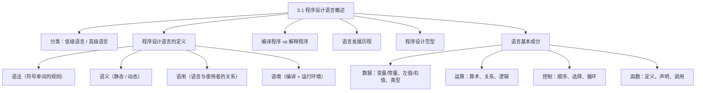

## 程序设计语言的分类

程序设计语言在分类上可以分为**低级语言和高级语言**：低级语言有**汇编语言和机器语言**，主要是一些指令性的语言；高级语言更接近人们的自然语言，有 C 语言以及 C 语言衍生出来的 **C++ 语言、Java 语言、C# 语言**，以及一些脚本语言，比如 **PHP 语言、Python 语言**等。

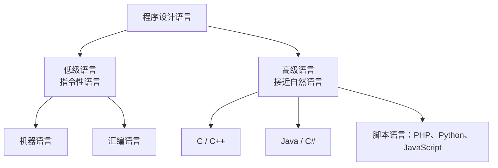

## 程序设计语言的定义：语法、语义、语用、语境

程序设计语言的定义涉及到**语法、语义和语用**三部分，同时还涉及到**语境**的问题。

**语境**：从语境上来讲，就是程序所运行的**编译环境**和**运行环境**的统称。这也符合我们所讲解的一个顺序：计算机系统（硬件）→ 外面包裹操作系统 → 操作系统外面包裹程序设计语言 → 最外层是应用系统，共同构成语言的生存环境——语言的运行环境和编译环境，统称为**语境**。

**语法**：由符号或单词构成语法成分的规则——由符号和单词构成的一些规则，我们称为语法。

**语义**：由语法规则构成的语法成分的**含义**称为语义。语义又分为**静态语义和动态语义**：静态语义是指**编译时**可以确定的语法成分的含义；动态语义是指**运行时**可以确定的含义。

**语用**：语用是指构成语言的各个记号与**使用者**之间的关系，包括符号的来源、使用和影响。

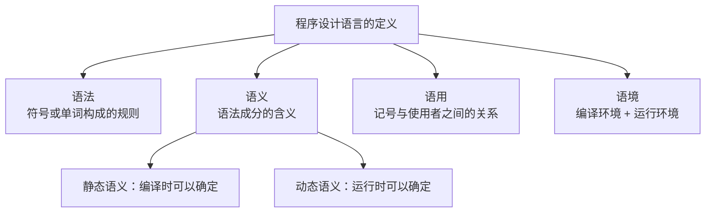

## 编译程序与解释程序

我们在程序上编辑的代码称为**源程序**，它来自机器语言和汇编语言的指令性代码，或高级语言编写的代码。

**解释**：源程序通过解释程序进行解释，得到**中间表示**，然后再加以执行。

**编译**：源程序通过编译程序得到**目标程序**，目标程序通过**链接**得到**可执行程序**，可执行程序再执行。

两者之间的区别：
1. **执行的过程**：解释程序需要**源程序、解释程序和中间表示共同参与**执行过程；而编译程序只需要**可执行程序参与**执行。
2. **产出**：解释程序生成的是**中间表示**，编译程序生成的是**目标程序**。

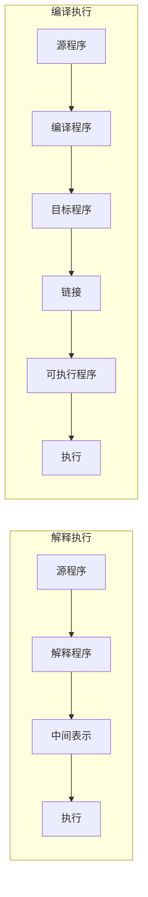

## 语言的发展历程

程序设计语言的发展（大致了解即可）：

| 年代 / 语言 | 特点 |
|---|---|
| 1957 年 FORTRAN | 最早的语言，最接近数学公式，常用于并行计算和高性能计算 |
| 20 世纪 60 年代 ALGOL 60 | 引进了许多新概念：局部性概念、动态和递归 |
| Pascal | 一门结构性的语言，主要用于教学 |
| C 语言 | 高级语言，面向过程的结构化语言，主要用于 UNIX 操作系统上的编程、驱动软件开发和嵌入式软件开发 |
| C++ | 在 C 的基础上引入类的概念，面向对象的语言，表达能力强、不亚于 C 的运行速度，常用于图形化编程 |
| Java | 主要用于服务器后端，也用于安卓平台、大数据 Hadoop |
| C#（C Sharp） | 微软的语言，运行在 .NET Framework 上，类似 Java，能提供 Web 应用服务 |
| Objective-C | 苹果平台，主要用于 iPhone 和苹果电脑的开发 |
| Ruby | 日本设计，任何东西都是对象、每个过程和函数都是方法、变量没有类型，体现更精炼的开发思想 |
| PHP / JavaScript / Python | 脚本语言：PHP 服务器端脚本、JavaScript 客户端脚本、Python 主要用于深度学习人工智能 |
| XML / HTML | 标记性语言 |
| VB.NET | 微软公司运行在 .NET Framework 上的一门语言，现在又有回升趋势 |

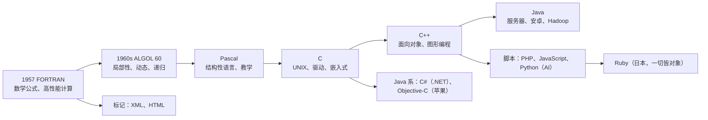

## 程序设计的范型

从程序设计的方法上来分，程序设计范型分为**命令型（面向过程）程序设计语言、面向对象的语言、函数式语言和逻辑程序设计语言**。

**命令型语言（面向过程）**：在这门语言中，计算被看作**动作的序列**，程序是用语言提供的操作命令书写的操作序列。它又称**结构化语言**——主要采用**自顶向下**的编程、**按模块组装**的方法，包括顺序、判断、循环等结构，且每种结构只允许**单入口、单出口**，体现了程序设计的最初的工程化思想。这类语言有 FORTRAN、ALGOL、C、Pascal 等。

**面向对象的语言**：主要有 C++、Java、Smalltalk 等。

**函数式语言**：代表有 List，主要是为**人工智能**应用而设计的一门语言。

**逻辑性语言**：有 **Prolog** 语言，主要用于编写自动定理证明、专家系统、自然语言理解的程序。

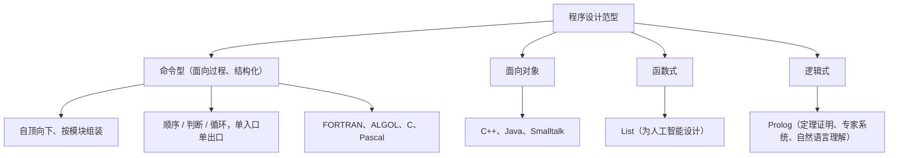

## 程序语言的基本成分：数据

程序语言的基本成分有**数据、运算、控制**成分，另外还包括函数。**数据的值按程序运行是否可以改变**划分：可以改变的称为**变量**，不可以改变的称为**常量**。

**左值与右值**：数据对象分为左值和右值——**左值**是指物理的存储单元（包括地址和容器），**右值**是指值的内容。**变量具有左值和右值**，在运行过程中它的右值（内容）是可以改变的；**常量只有右值**，在运行过程中右值是不能改变的。

> [!NOTE]
> 左值右值值得关注：变量既有"存储位置（左值）"又有"存储内容（右值）"，且内容可改变；常量只有右值，且不能改变。

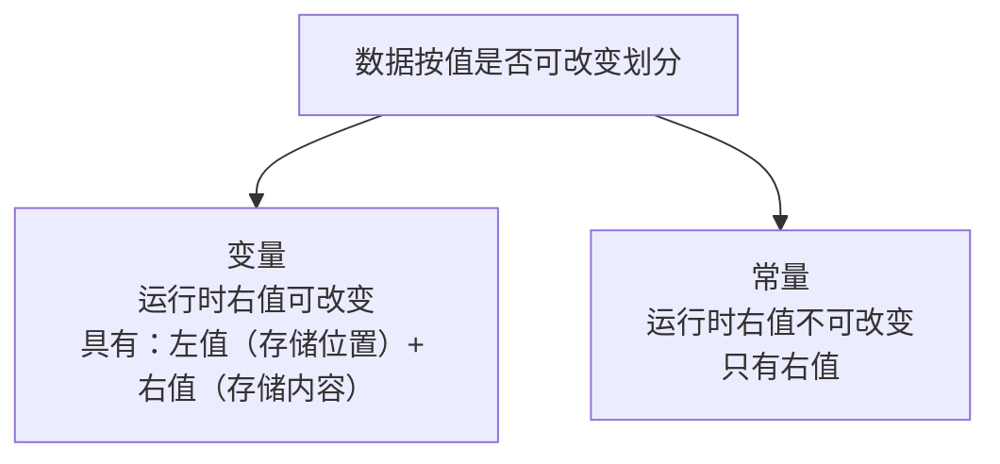

**全局量和局部量**是通过**作用域**来划分的：全局变量的作用域是**整个程序片**（在程序运行过程中一般不会改变）；局部变量的作用域是**某个局部的程序块**（在其分配的存储单元中可以动态改变）。

**数据类型**可以分为：**基本数据类型**——整型、字符型、实型（浮点型）、布尔型；**特殊类型、空类型**；**用户自定义的类型**——枚举型；**构造类型**——数组、结构、联合（共用体）；**指针类型**——C 语言特有的类型；**抽象数据类型**。其中基本数据类型当中的**布尔类型**和**抽象数据类型（类类型）**是 C++ 语言在 C 语言上的扩充。

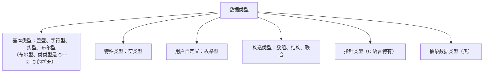

## 程序语言的基本成分：运算

运算包括一些**数据运算**——加减乘除、关系运算符，还有**与或非逻辑运算**。它的运算成分与**数据类型**密切相关：比如将一个整型（int）与实型（float）相加，它的数据类型会发生改变（提升为浮点型）。另外，运算符号要有一些**优先级**，比如先乘除后加减，必要的时候需要通过**括号**来区分，括号里面的先执行（圆括号）。

## 程序语言的基本成分：控制

程序设计的控制成分有**顺序结构、选择结构和循环结构**。

**顺序结构**：程序按照所描述的操作依次执行后续的操作，直至执行到最后一个操作。

**选择结构**：在两种或多种分支中选择**一种**逻辑执行的结构。以 C/C++ 语言为例：**if 语句**主要用于**双分支结构**——如果某个条件成立执行什么结果，否则执行什么结果；若 else 后面为空，也可以只写"如果条件发生，执行什么语句"。**switch 语句**又称为**多分支结构**——根据假设条件的值等于哪个常量就执行对应语句，最后必须有 **default（默认值分支）**：当表达式的值不与任何常量匹配时，给出默认的处理。

**循环结构**：描述了**重复计算**的过程（这也体现了程序的局部性原理）。循环结构的三种形式：
- **while 循环**：先判断循环条件，条件成立才执行循环体语句；
- **do...while 循环**：先执行循环体语句，再判断是否满足条件——无论如何都会先执行一次循环体；
- **for 循环**：for 有三个表达式（赋初值、条件判断、步进），三条缺一不可——可以空置，但必须用分号隔开写三条；例如 `for (i=1; i<6; i++)` 就是给 i 赋初值 1、条件 i<6、每次 i 加 1。

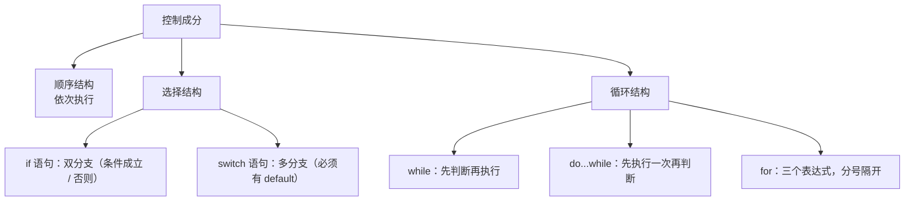

## 程序语言的基本成分：函数

函数涉及到**函数的定义、函数的声明和函数的调用**三个概念。

**函数的定义**包括两个部分：**函数首部**和**函数体**。函数首部有返回值的类型、函数的名字以及形参（表达式、形参表）。

**函数的声明**：注意要记住一点——**函数必须先声明后引用（先声明后使用）**。声明的格式有：返回的类型、函数名和形式参数表。

**函数的调用**包括两种类型：**传值调用**和**引用调用**（历年真题考过）。

**传值调用**：实参向形参传递相对应的类型的值。例如交换函数传入 X、Y 的值，定义临时变量进行交换——X 和 Y 的值都经过了交换，但调用处的实参 A 和 B 的值并没有交换过来（传值不改变实参）。在 C 语言里我们有指针的概念：交换 X 与 Y 的指针（传入的是地址），通过指针间接交换，这时候实际上交换了 A 和 B 的值（传地址可以改变实参）。

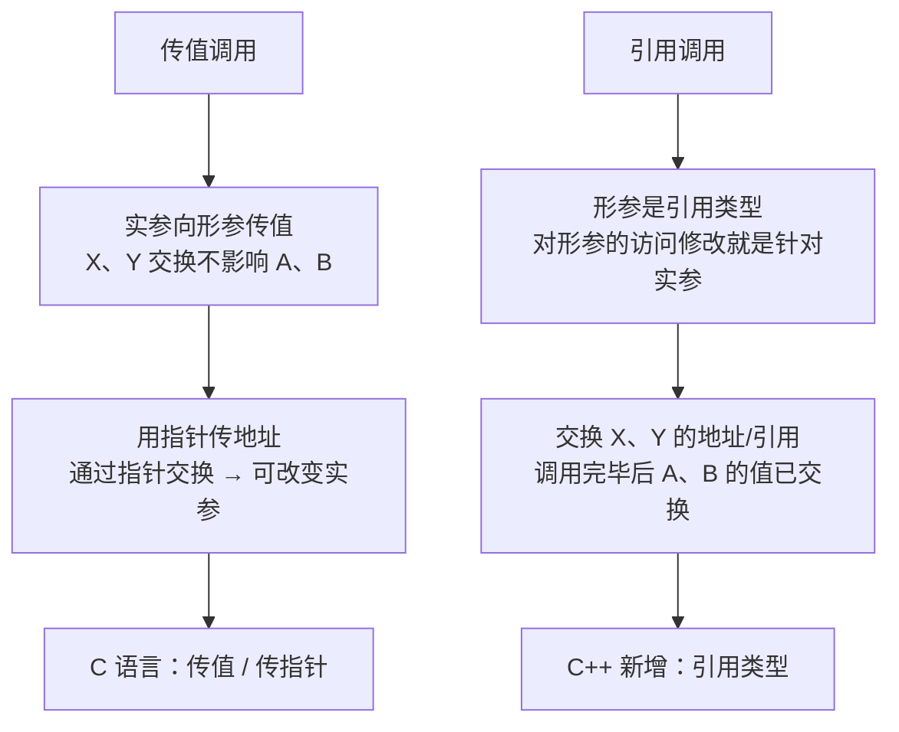

**引用调用**是 C++ 中增加的数据类型——当形参是**引用类型**时，函数对形参的访问和修改，实际上是针对相应**实参**所做的访问和改变；也就是说函数中交换 X、Y（引用），调用完毕以后，实际上是交换了 A 的值和 B 的值。

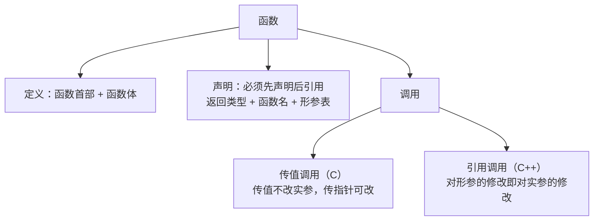

## 本节小结

① **分类**：低级语言（机器语言、汇编语言，指令性）与高级语言（接近自然语言：C/C++、Java、C#、PHP、Python、JavaScript 等）。

② **定义四要素**：语法 = 符号/单词构成的规则；语义 = 语法成分的含义（静态语义编译时可确定、动态语义运行时确定）；语用 = 记号与使用者的关系；语境 = 编译环境 + 运行环境的统称。

③ **编译 vs 解释**：解释 = 源程序 → 中间表示 → 执行（源程序与中间表示共同参与）；编译 = 源程序 → 编译 → 目标程序 → 链接 → 可执行程序 → 执行（只有可执行程序参与执行）。

④ **发展历程**：1957 FORTRAN（数学公式、高性能计算）→ ALGOL 60（局部性、动态、递归）→ Pascal（结构化教学）→ C（UNIX、驱动、嵌入式）→ C++（面向对象、图形编程）→ Java（服务器、安卓、Hadoop）、C#（.NET）、Objective-C（苹果）、Ruby（一切皆对象）、脚本语言 PHP/JavaScript/Python（AI）、VB.NET。

⑤ **范型**：命令型/面向过程（自顶向下、模块化、单入口单出口，FORTRAN/ALGOL/C/Pascal）、面向对象（C++/Java/Smalltalk）、函数式（Lisp，人工智能）、逻辑式（Prolog，定理证明/专家系统/自然语言理解）。

⑥ **基本成分**：数据（变量有左值+右值且右值可变，常量只有右值不可变；全局/局部看作用域；指针类型是 C 特有，布尔、类类型是 C++ 扩充）；运算（与数据类型相关，优先级先乘除后加减）；控制（顺序、选择[if 双分支/switch 多分支必须有 default]、循环[while 先判断、do...while 先执行、for 三个表达式]）；函数（先声明后引用；传值调用不改变实参、传指针/引用调用可改变实参——**C++ 的引用是新增类型，真题考过**）。