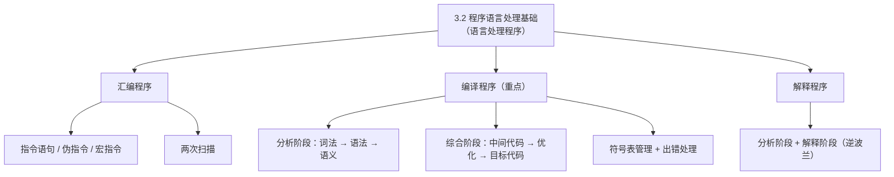
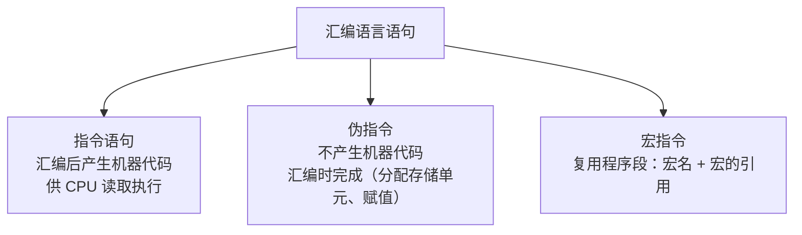
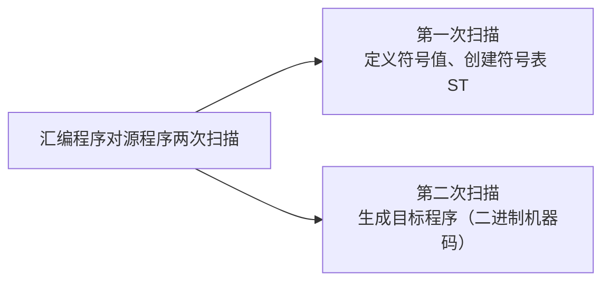
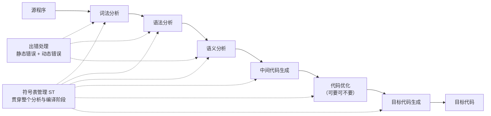
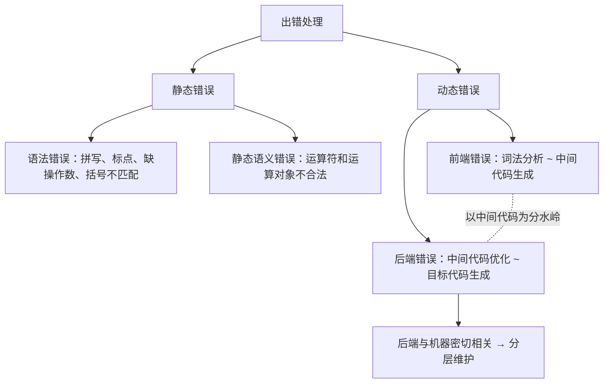
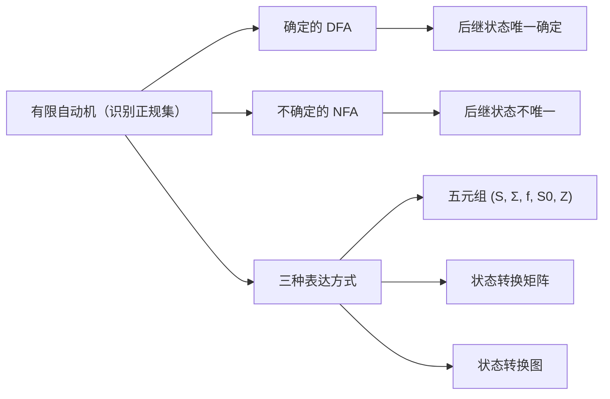
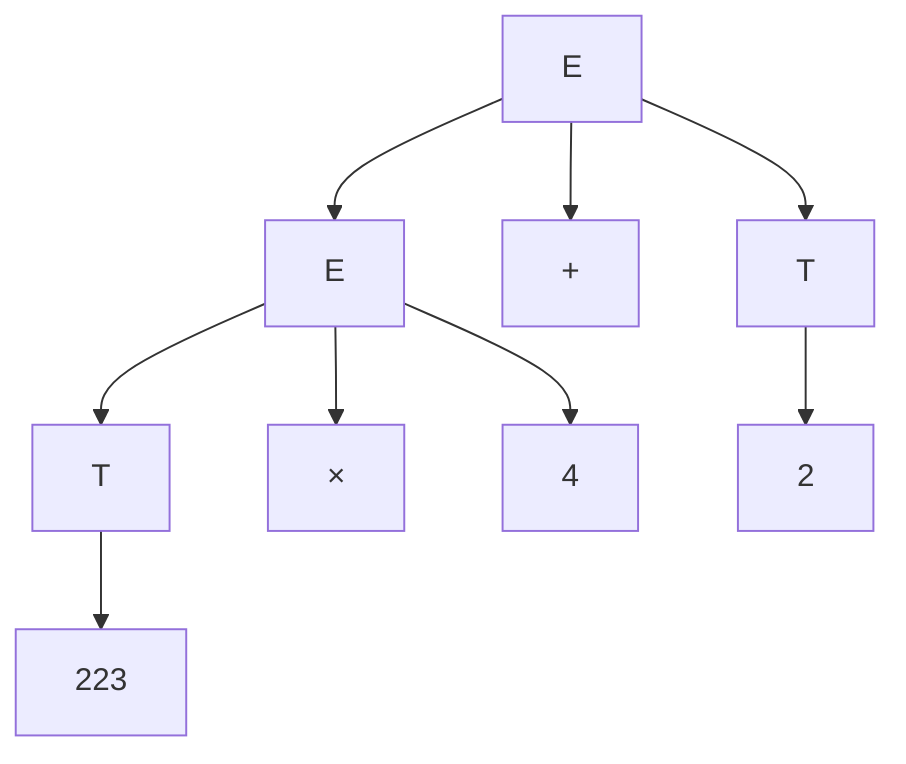
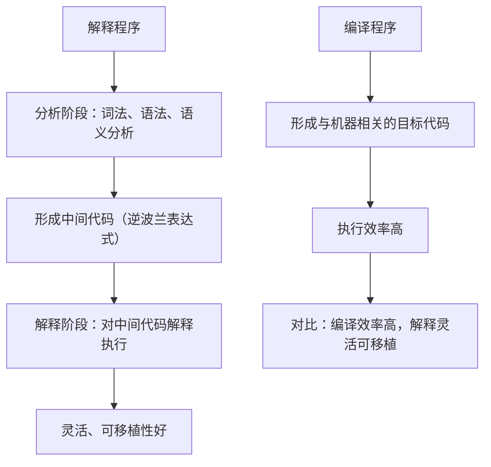

课程链接：视频《3.2 程序语言处理基础》（软考程序员系列课程）

视频链接：

## 本节概述

本节是系列课程的第十节课，进入教材第 3 章「程序设计语言基础知识」，是教材第 3 章的最后一个知识点，对应教材 3.2 节「语言处理程序基础」。**程序语言处理**是将高级语言编写的代码或汇编语言编写的代码，经过**编译**和**解释**变成机器语言或中间代码，供计算机上运行。本节脉络依次是：语言处理程序概述 → 汇编语言基础 → 编译程序基础（词法、语法、语义分析及代码生成）→ 词法分析（正规式、有限自动机）→ 语法分析 → 解释程序基础。

## 语言处理程序概述

语言处理程序的主要内容有**汇编程序、解释程序和编译程序**（上节课已简单介绍）。语言处理的过程：把高级语言（或汇编语言）编写的源程序，翻译成机器指令（目标程序）或中间代码。

## 汇编语言基础

汇编语言编写的源程序，通过**汇编程序**翻译成机器能够读懂的机器指令（目标程序）。汇编语言包括三种语句：

**指令语句**：汇编后产生**机器代码**，能供 CPU 读取并执行。它主要有传送指令、算术运算、逻辑运算、移位、转移指令、处理控制指令等。

**伪指令**：**不产生机器代码**（视频口误"微指力"）。它主要用来给变量分配存储单元或赋值，用于在源程序进行**汇编时**完成（区别：指令是在程序**运行时**完成的，伪指令是在**汇编时**完成的）。

**宏指令**：为了**多次复用**程序段而定义的语句。每个宏都有对应的宏名，宏指令语句实际上是**宏的引用**——记住"复用 + 引用"这两个概念。

**汇编程序的两次扫描**：汇编程序对源程序进行两次扫描——**第一次**：定义符号的值，创建**符号表（ST，符号表）**；**第二次**：**生成目标程序**，将可汇编执行的汇编语句翻译成对应的二进制机器码指令。

> [!NOTE]
> 概念不要求掌握太深，能理解整个运行过程即可。

## 编译程序基础：整体过程

编译程序首先看整个编译的过程：源程序先进行**词法分析**（将单词一个一个地取出来进行分析）。编译分两个阶段：**分析阶段**（词法分析、语法分析、语义分析）和**综合阶段（编译阶段）**（中间代码生成、代码优化、目标代码生成）。

**词法分析**：将单词一个一个地取出来；**语法分析**：对单词组成的语法结构有没有错误进行分析；**语义分析**：检查符不符合语义的规范（大部分在静态上完成，属于静态出错）。

**中间代码生成、代码优化、目标代码生成**属于编译阶段的活。其中**出错管理**主要是在**动态的出错管理**；而整个**符号表的管理**贯穿于整个程序的分析与编译的阶段。

> [!NOTE]
> 记概念时主要是记"可执行程序执行的过程"这一条主线，一些较深的概念理解一下即可——考试对概念考察比较浅，重点题型是"背过程"。

### 词法分析器

**词法分析**是将源程序转换为**单词二元组**的表示：单词二元组包括**单词的种类**和**单词自身的值**。单词的种类就是单词的标识符；单词自身的值就是赋值语句给单词赋的值。例如源程序中声明的部分和赋值的部分，经过词法分析后对应到单词标识符：X 对应 ID1、Y 对应 ID2、Z 对应 ID3，然后逐一赋值。

### 语法分析器

**语法分析**是把单词符号分解成各类的**语法单位**（语法分析与分解的过程），根据一定的语法规则生成**语法树**；不满足语法规则的会返回**诊断信息**。

### 语义分析器

**语义分析**是主要分析语法结构的**语义信息**，检查源程序中是否包含**语义的错误**，收集**类型信息**供代码生成阶段使用——其类型信息主要包括**类型的载体**（即符号表）和**运算**。

举例：符号表记录 X 的类型是 real、逻辑地址 0；Y 类型 real、逻辑地址 4（这是 Pascal 语言，紧接着往下存储）。类型载体的运算：对语句进行类型分析以后，形成新的语法树。这里是语义处理节点：将整型的 60 进行类型转换（转换为浮点型 60.0），再与 ID3 的单词种类相乘，然后与 ID2 相加，最后赋值给 ID1。

### 中间代码生成

中间代码主要是生成**与机器无关**的符号记录系统，它通过**四元式**表示。例如 `X := Y + Z * 60` 赋值于 X：先进行 60 的浮点数计算赋值于 T1；将 ID3 乘以 T1 赋值于 T2；将 ID2（ID3）与（60 的）乘积相加赋值于 T3；最后将 T3 赋值于 ID1（这里 T1、T2、T3 都是中间表达式，视频中"与ID3"应为 T3，笔误）。

### 中间代码优化与目标代码生成

**中间代码的优化**可以处于两个阶段：一个是中间代码生成阶段，一个是目标代码生成阶段。优化后的结果结构大大简化了。实际上的优化还涉及**公共子表达式的提取、循环优化**等多种内容。

**目标代码的生成**：是将中间代码生成为**与机器密切相关**的指令代码（机器指令），我们称为目标代码。它可以包括**绝对指令代码、可重定位的指令代码和汇编指令代码**。

### 符号表管理

**符号表的管理**贯穿于整个过程（与词法分析器、语法语义分析、目标代码的运行阶段）：它主要用来记录源程序中符号的必要信息，辅助语义的检查与代码的生成——记录符号的信息、辅助检查、代码生成。

### 出错处理

出错处理包括**静态错误处理**和**动态错误处理**：

**静态错误处理**又包括**语法错误**（如单词拼写错误、标点符号错误、表达式中缺乏操作数、括号不匹配，这些都是静态错误）和**静态语义错误**（语义分析中发现的运算符和运算对象不合法）。

**动态错误**是指在编译过程中产生的错误，可以分为**前端错误**和**后端错误**：前端包括词法分析到中间代码生成这个阶段的各项工作；后端错误包括中间代码优化和目标代码生成阶段的错误，**以中间代码为分水岭**。

之所以分为前端、后端，是因为后端代码与机器密切相关——当改动前端代码时，不会涉及后端代码的改动；反之亦然。这是一种**分层维护**的思想。

## 词法分析：字符串运算与正则式

词法分析的本质是**对源程序的字符串进行分析**（以字符串为对象的运算）。

**字符串与字符集的运算**中要记住**正则闭包**和**闭包**：正则闭包是指 **A⁺ = A¹ ∪ A² ∪ A³ ∪ ……**（从 A¹ 开始一直并上去）；闭包是指多出来一个 A⁰，**A\* = A⁰ ∪ A⁺**。

**正规表达式与正规集**要记住它们的对应关系：

| 正则表达式 | 正规集（对应的字符串集合） |
|---|---|
| AB | 字符串 AB 构成的集合 |
| A \| B | A 或 B 构成的集合 |
| A\* | 零个或多个 A（闭包） |
| A⁺ | 一个或多个 A（正则闭包） |
| A\>(以 A 开头) | 以 A 为首字母，后面可接 A 也可接 B |
| … ABB（以 ABB 结尾） | 字符串以 ABB 结尾的集合 |

> [!NOTE]
> 这些以 A 开头、以 ABB 结尾的集合要"会认"即可。考试中会考**什么样的正规式是等价的**。

## 词法分析：有限自动机（重点）

**有限自动机**能够准确地识别正规集，它主要分为**确定的有限自动机（DFA）**和**不确定的有限自动机（NFA）**。这是重点概念，**历年考试考过**。

**确定的有限自动机 vs 不确定的有限自动机**：区别在于它的**后继状态是不是唯一确定的**。例如 S0 的后继状态有 S0 和 S1——后继状态不是唯一的，称为**不确定的有限自动机**；如果后继状态唯一确定，则是确定的有限自动机。

有限自动机的**表达方式有三种**（这是重点）：**五元组表达、状态转换图和状态转换矩阵**。

- **状态转换矩阵**：用矩阵表示状态转换关系（S0 输入 a 可到 S0，也可到 S1，则后继不唯一 → NFA）；
- **状态转换图**：用图表示，S0 通过 a 转换为 S0 或者通过 a 转换为 S1——这也是一种不确定有限自动机，与矩阵一一对照；
- **五元组**：**(S，Σ，f，S0，Z)**——S 是有限集合（状态），Σ(Sigma) 是有穷字母表，f 是单值部分映像（转换函数，如 f(S0,a)=S1），S0 表示初始状态，Z 代表非空终止状态集合。

> [!WARNING] 真题考点
> 有限自动机的**三种表达方式**（五元组、状态转换图、状态转换矩阵）、**确定/不确定的区别（后继状态是否唯一）**，历年考过真题。正则闭包与闭包的运算关系也是考过的点。

## 语法分析

语法分析涉及表达式的表示，然后进行分析树（语法树）的构造。例如文法：**E → E+T | T**，**T → T×F | F**（竖杠表示"或"），这样我们就形成了分析树。后边如果我们要得到的结果是 `223 × 4 + 2`，就可以用这样的文法画出**语法树**。

> [!NOTE]
> 形式文法（上下文无关文法）用来规定单词在句中的位置和顺序，构成句子的层次结构。

## 解释程序基础

解释程序同样可以分为**分析阶段**和**解释阶段**：分析阶段包括词法分析、语法分析和语义分析，然后形成中间代码——中间代码采取**逆波兰表达式**。解释部分是对中间代码进行**解释执行**。

**解释程序与编译程序的区别**：编译程序比解释程序能够获得更高的效率——因为它形成了与机器相关的目标代码（机器指令）；而解释程序必须通过解释程序对中间代码进行解释方可执行。因此，解释程序比编译程序**更加灵活**，解释程序的**可移植性**（可一致性）也就更好。

## 本节小结

① **汇编语言**：指令语句（产生机器代码）、伪指令（不产生机器代码、汇编时完成）、宏指令（宏定义 + 宏引用）；汇编程序两次扫描——第一次定义符号创建符号表，第二次生成目标程序。

② **编译过程**：分析阶段（词法→语法→语义，偏静态出错）+ 综合阶段（中间代码生成→代码优化（可要可不要）→目标代码生成）；符号表贯穿全程，出错处理分静态错误与动态错误（前端/后端，以中间代码为分水岭，后端与机器密切相关 → 分层维护）。

③ **词法分析**：单词二元组（种类 + 值）；字符串运算重点——**正则闭包 A⁺ 与闭包 A\***；正规式与正规集对应要会认（等价正规式是考点）。

④ **有限自动机（真题重点）**：DFA 后继状态唯一、NFA 后继不唯一；三种表达方式——五元组 (S, Σ, f, S0, Z)、状态转换矩阵、状态转换图。

⑤ **语法分析**：E→E+T|T、T→T×F|F 的递归文法生成语法树，用于规定单词的位置顺序和句子的层次结构。

⑥ **解释程序**：分析阶段 + 解释阶段（逆波兰中间代码）；编译效率高、解释灵活可移植性好——这是编译与解释的重要区别。