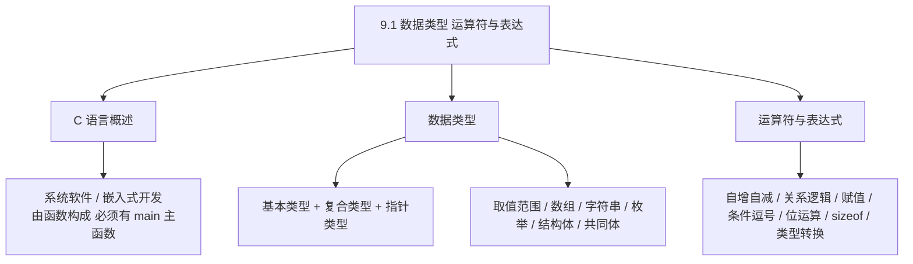
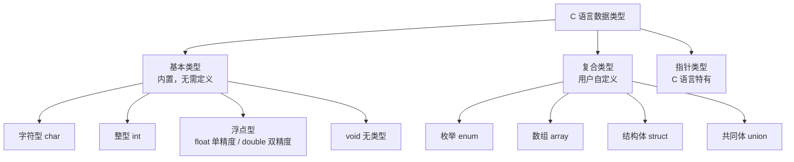
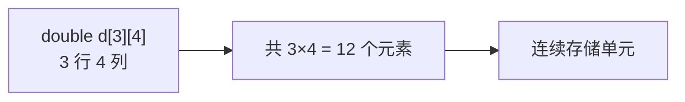
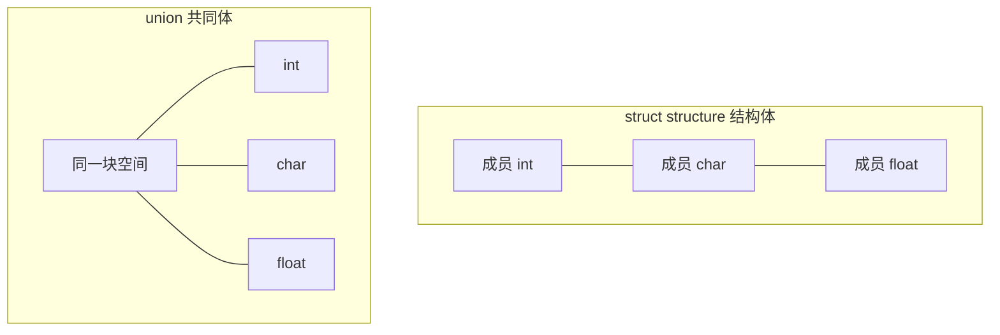
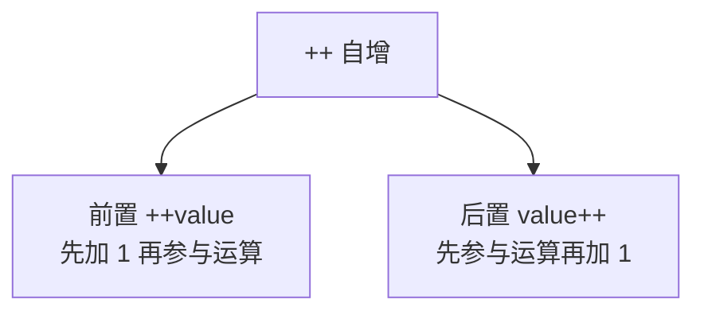
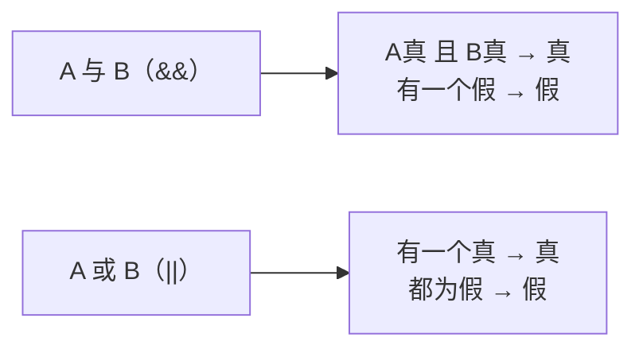
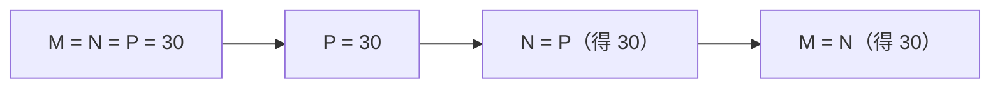
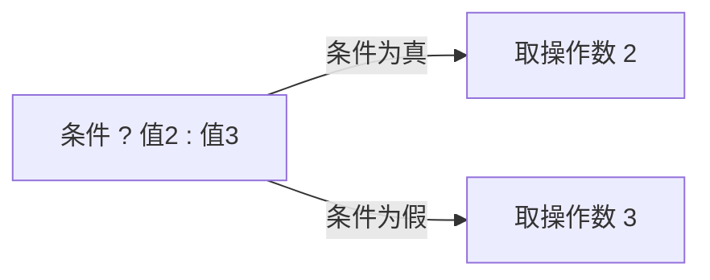
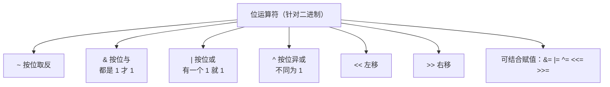

课程链接：视频《9.1 数据类型 运算符与表达式》（软考程序员系列课程）

视频链接：

## 本节概述

本节是系列课程的第二十四节课，进入**第九章 C 语言程序设计**，本节讲解 C 语言的两大基础：**数据类型** 与 **运算符和表达式**。C 语言是软考中考查编码能力的重要语言，本节是 C 语言的第一课，先把"有哪些类型、运算符怎么用、表达式怎么算"打牢。本节脉络依次是：C 语言概述 → 数据类型总览（基本/复合/指针）→ 各基本类型的取值范围 → 数组 → 字符串 → 枚举、结构体、共同体 → 运算符与表达式（自增自减 / 关系逻辑 / 赋值 / 条件逗号 / 位运算 / sizeof / 类型转换）。

先看一张本节的知识地图，把整节内容装进脑子里：



## C 语言概述

### C 语言能做什么

C 语言是**通用型的程序设计语言**，几乎可以做任何事情。它常用来做两件事：

- **编写系统软件**（如操作系统、编译器等）。
- **嵌入式应用开发**。

**什么是嵌入式开发**？就是在**非电脑环境**中使用：比如我们的**冰箱、电视、手机、洗衣机**中内嵌的一种电脑程序。因为这些程序基本都是**控制指令集**的模式，使用 C 语言能够**兼顾到它的硬件环境**，所以 C 语言常用于系统软件和嵌入式开发的编写。

> [!TIP] 通俗理解
> C 语言"离硬件近、运行效率高"，所以底层系统和嵌入式设备（家电、手机里的控制程序）都用它，这正说明了 C 语言硬核、贴近机器的特性。

### C 语言的发展

C 语言发展经历了很多阶段。了解**最新标准**即可：**2011 年**由两大标准化组织发布——**ISO（国际标准化组织）** 和 **IEC（国际电工委员会）**，这就是 **C11 标准**。

### C 语言的结构特点

对 C 语言初步的印象：

- C 语言一般是**由一系列函数构成的**，主要通过**函数的调用**来完成其功能。
- 函数调用包括**传参和传值**（后面章节详解）。
- C 语言**必须要有一个主函数 `main`**，整个程序是从 **`main` 函数开始执行的**。


## 数据类型总览

C 语言的数据类型分为三大类：**基本类型、复合类型、指针类型**。

- **基本类型**：C 语言**内置**的类型，不需要用户定义，包括**字符型、整型、浮点型**（单精度和双精度）以及 **void（无值）型**。
- **复合类型**：**用户自定义**的类型，**必须在程序首部定义**，包括**枚举、数组、结构体、共同体**。
- **指针类型**：**C 语言特有**的一种类型（后面章节详解）。



### 基本类型细分

- **字符型**：`char`。
- **整型**：`int`。
- **浮点型**：**单精度 `float`**、**双精度 `double`**。double 比 float 精度更高、占位更大。
- **void（无类型）**：比较特殊。**主要用于函数调用时返回值的类型说明**——如果一个函数用了 `void` 修饰，就表示它**不返回任何类型的数据**。

### 变量和常量

数据类型当中还有**变量**和**常量**之分，这也是 C 语言的基本概念。

> [!NOTE]
> `void` 关键字要记：用于声明函数"不返回任何数据"。

## 基本类型的取值范围

各个基本类型的取值范围是本节**识记型考点**（只需大致记住范围值）：

| 类型 | 符号 | 表示方式 | 取值范围 |
|---|---|---|---|
| 字符型 | signed char | 有符号字符 | −2⁷ ~ (2⁷−1)，即 −128 ~ 127 |
| 无符号字符型 | unsigned char | 无符号字符 | **0 ~ 255** |
| 短整型 | short / signed short | 有符号短整型 | **−32768 ~ 32767** |
| 无符号短整型 | unsigned short | 无符号短整型 | **0 ~ 65535** |
| 整型 | int | 有符号整型 | −2³¹ ~ (2³¹−1) |
| 浮点型 | float | 单精度 | 约 ±3.4×10³⁸ |
| 双精度型 | double | 双精度 | 精度更高、位数更大 |

> [!WARNING] 真题考点
> 记几个关键数：**无符号字符型 0~255；短整型 −32768~32767；无符号短整型 0~65535**。面试/考试常直接用这几个范围判断。

## 数组

数组分为**一维数组**和**二维数组**，属于复合类型。

### 一维数组的三种表示方法

一维数组通常用方括号 `[ ]` 定义，下面用"单精度 float 数组"举例，看三种初始化方式：

- **第 1 种**：`float temp[100];` 一维数组有 100 个元素，然后**给第 11、14 位赋初值 11.5**。
- **第 2 种**：用**枚举/逐项列举**的方式给出初值。
- **第 3 种**：比较独特——**只给前五个赋初值 1 2 3 4 5，后面五个初值自动为 0**。前缀初始化后，剩余元素自动填充 0。

```c
// 第 1 种：声明 100 个元素，选择性赋初值
float temp[100];
temp[10] = 11.5;   // 第 11 个元素（下标从 0 开始）

// 第 2 种：逐个列举（部分示例）
float a[5] = {1.0, 2.0, 3.0, 4.0, 5.0};

// 第 3 种：只给前五个赋值，后五个自动为 0
float b[10] = {1, 2, 3, 4, 5};   // b[5]~b[9] 自动为 0
```

> [!NOTE]
> 数组下标从 **0** 开始。第 3 种"前缀赋值、剩余补 0"是 C 语言的重要约定，很多题目就考这个。

### 二维数组

二维数组用**行列**表示，例如：

```c
double d[3][4];   // 3 行 4 列
```

它会占用存放 **3×4=12 个 double 元素**且**连续**的存储单元。注意二维数组在内存中是**连续存储**的。



## 字符串

**字符串**是**一个连续的字符系列**，用**特殊的 '\0'（杠零）结尾**。我们看到的字符串在内存中都是以 `'\0'` 结束的。

```c
char s[] = "A";   // 双引号，字符串
char c  = 'A';    // 单引号，一个字符
```

**双引号 `"A"` 和单引号 `'A'` 的含义不同**：

- `"A"` 表示**字符串**，实际由 **2 个字符**组成：字符 `A` + 字符串结束符 `'\0'`。
- `'A'` 表示**单个字符 A**，只有 1 个字符。

> [!WARNING] 真题考点
> **字符串以 `\0` 结尾**，所以 `"A"` 占 2 字节（A + \0），而 `'A'` 只是一个字符。分辨双引号（字符串）与单引号（字符）很常考。

## 枚举类型

**枚举类型（enum）** 一一列举可能出现的情况，由用户定义。一般以 `enum` 开头，定义一个枚举变量。看示例：

```c
enum color { red = 4, blue = 5, yellow = 6, green = 30, gray = 41 };
```

这里为枚举常量赋了自定义值。**枚举的本质**是把一组可能的取值用一个名字代表，避免写魔法数字。

> [!NOTE]
> 枚举了解一下即可：用 `enum` 定义，把可能出现的情况一一列举。

## 结构体与共同体

**结构体（struct）** 和**共同体（union）** 都是用户自定义的复合类型，表达方式接近，区别在于存储方式：**结构体各成员分别占用空间，共同体所有成员共享一块空间**。

```c
// 结构体：struct 关键字
struct complex {
    double r;   // 实部
    double i;   // 虚部
};
```

结构体变量可用 `变量名.成员名` 访问：如结构体变量 `z`，用 `z.r`、`z.i` 访问其成员。结构体也可以省略类型名。

```c
// 共同体：union 关键字
union data {
    int   i;     // A.i：整型成员
    char  ch;    // A.ch：字符成员
    float f;     // A.f：浮点成员
};
union data A;
```

**共同体（union）的关键考点**：共同体的**大小等于占用空间最大的那个成员的大小**。

- 结构体：`int`、`char`、`float` 各存各的，总占用 = 各成员之和（还可能有对齐填充）。
- 共同体：`int`、`char`、`float` **共用同一块存储空间**，同一时刻只能存一个，所以**其大小 = 最大成员的大小**。



> [!WARNING] 真题考点
> 结构体/共体体的最大区别：**结构体各成员独立占空间，共体体共享同一块空间、其大小等于最大成员大小**。这是本节常考判断。

## 运算符与表达式

### 自增自减运算符（++ / --）

自增 `++`、自减 `--` 是高频考点，关键是**前置**和**后置**的区别：

- **前置 `++value`**：**先加 1，再参与表达式运算**。
- **后置 `value++`**：**先用原值参与表达式运算，再给变量加 1**。



> [!WARNING] 真题考点
> `i=1; a=i++;`（a 得 1，i 变 2）与 `i=1; a=++i;`（a 得 2，i 变 2）务必区分。**前置先用新值、后置先用旧值**。

**实际应用**：自增常用于**遍历数组或变量**，比如 for 循环：

```c
for (int i = 0; i < length; i++) {
    // i 从 0 递增到 length，步长为 1
}
```

循环里 `i++` 表示下标 `i` 以**步长 1 递增**，直到不再满足条件 `i < length` 为止。

### 关系运算符与逻辑运算符

**关系运算符**：等于 `==`、不等于 `!=`、小于 `<`、小于等于 `<=`、大于 `>`、大于等于 `>=`。

- **等于/不等于**常用于**空值（空指针）判断**：先判断 `变量 != NULL`，再去使用，否则可能抛出**空指针异常（null pointer exception）**。

```c
if (ptr != NULL) {   // 先判空再接值，避免空指针异常
    // 安全使用 ptr
}
```

- **小于等于/大于等于**常用于**判断时间、数值的范围**。例如：薪金 `salary` 在 **5000 以上**要交个人所得税；

```c
if (salary > 5000) {
    // 需要交税
} else {
    // 不需要交税（含 salary <= 5000）
}
```

**逻辑运算符**：与 `&&`、或 `||`、非 `!`。运算结果用 **1 表示真（true）、0 表示假（false）**。

- **逻辑与 `&&`**：A 与 B，**必须 A 为真且 B 为真**，结果才为真；只要有一个为假，结果就为假。
- **逻辑或 `||`**：A 或 B，**只要有一个为真**，结果就为真。

逻辑或/与有**短路**特性：`||`（或）只要满足一端就足够（短路），`&&`（与）只要一端为假即可（短路）。



> [!NOTE]
> 逻辑运算是**短路**操作，即满足条件表达式一端就可确定结果；**1=真、0=假**。

### 赋值运算符

赋值运算符用于把值赋给变量，常见的复合赋值形式：

- `A += 12`：把 **A 加 12** 赋给 A（等价 `A = A + 12`）。
- `B *= A`：把 **B 乘 A** 赋给 B。
- 连续赋值：`M = N = P = 30;` 先把 **30 赋给 P**，再把 **P 的值赋给 N**，最后把 **N 的值赋给 M**。赋值从右往左结合。



> [!NOTE]
> 连续赋值**从右向左**结合：先赋右边、再逐步向左传递值。

### 条件运算符（三元/三目运算符）

条件运算符是**三元运算符（三目运算符）**，格式为：

```c
条件 ? 操作数2 : 操作数3
```

- **先判断条件（操作数 1）**；
- 条件为**真** → 执行**操作数 2**；
- 条件为**假** → 执行**操作数 3**。



> [!NOTE]
> 三元运算符只有一个：`条件 ? 结果1 : 结果2`，简洁表达 if-else。

### 逗号表达式

逗号表达式由 `表达式1, 表达式2, ..., 表达式N` 共同构成一个表达式。

- 它一般用于解决**"只允许出现一个表达式的地方，却需要写多个表达式"**的问题。
- 逗号表达式的值是**最后一个表达式**的值。

```c
int x = (a=2, a+3, a*2);   // 依次执行 a=2、a+3、a*2
```

> [!NOTE]
> 逗号表达式从左到右依次计算，**整个表达式的值取最右边（最后一个）表达式的值**。

### 位运算符

位运算是**针对机器码（二进制码）**进行的运算，属于底层运算：

| 运算符 | 名称 | 说明 |
|---|---|---|
| `~` | 按位取反 | 0 变 1、1 变 0（`~0101` → `1010`） |
| `&` | 按位与 | 都是 1 才为 1（1 与 0 = 0） |
| `\|` | 按位或 | 有一个 1 即为 1（0 或 1 = 1） |
| `^` | 按位异或 | 相同为 0、不同为 1 |
| `<<` | 左移位 | 整体左移，左端舍弃右端补 0 |
| `>>` | 右移位 | 整体右移，右端舍弃 |

位运算可以**与赋值运算结合**产生复合赋值：`&=`、`|=`、`^=`、`<<=`、`>>=`，即先进行位运算，再赋给某值。



> [!NOTE]
> 位运算符作用于二进制位，可复合到赋值上。了解即可，重点是记住有与、或、异或、取反、左移、右移六种。

### sizeof 运算符

**`sizeof`** 用来求某个类型或数组所占的**字节大小**。字符串的长度用 sizeof 计算时可结合它在内存中的存储理解。

`sizeof(a)` 表示求**数组 a（按它的数据类型）在内存中占用的字节数 / 元素个数**。例如某数组 a 有 7 个元素，`sizeof(a) / sizeof(a[0])` 即可求出元素个数=7。

```c
int a[7];
sizeof(a) / sizeof(a[0]);   // 结果为 7，得到数组元素个数
```

### 类型的强制转换

C 语言可以用强制类型转换 `(类型)` 操作符显式转换类型：

- `(int)(X + Y)`：先把 **X 与 Y 的和**强制转换为 `int` 类型。
- `(int)X + Y`：先把 **X 强制转换为 int**，再与 Y 相加。

```c
(double)3 / 2;   // 与
(double)(3 / 2); // 不同：前者结果 1.5，后者结果为 1.0
```

**关键区别**：**先运算后转换** 还是 **先转换后运算**，结果可能不同。

> [!WARNING] 真题考点
> 强制类型转换的优先级要弄清：`(double)3/2` = 先转 3 为 3.0，再除以 2 = 1.5；`(double)(3/2)` = 先整除得 1，再转 1.0。**转化作用于紧跟其后的量**。

## 本节小结

① **C 语言概述**：**通用语言，能做任何事，常用于系统软件和嵌入式开发**（冰箱/电视/手机/洗衣机内嵌程序）。由**一系列函数**构成，主要通过**函数调用**完成功能，**必须有 main 主函数**作为执行起点。最新标准为 ISO/IEC 发布的 **C11（2011）**。

② **数据类型分类**：**基本类型（char、int、float、double、void）、复合类型（枚举、数组、结构体、共同体，需用户定义）、指针类型（C 特有）**。`void` 用于函数"不返回任何数据"。

③ **取值范围（记关键数）**：**无符号字符 0~255；短整型 −32768~32767；无符号短整型 0~65535**；字符型 −128~127；整型 ±2³¹。

④ **数组与字符串**：一维数组 `float temp[100]`，**下标从 0 开始**，**前缀赋值后剩余元素自动补 0**；二维 `double d[3][4]` **连续存储、共 3×4=12 个元素**。**字符串以 `\0` 结尾**，`"A"` = A + `\0`（2 字节），`'A'` 只 1 个字符。

⑤ **枚举/结构体/共同体**：枚举 `enum` 列举取值的可能。**结构体各成员独立占空间；共同体共用一块空间，大小 = 最大成员大小**（`union data` 中 int/char/float 共存于一块，取最大者）。

⑥ **运算符**：**自增前置先加再用、后置先用再加**；关系运算符 `==/!=` 判空指针防空指针异常、`<=/>=` 判范围；逻辑 `&&` 全真才真、`||` 一真即真（短路，1=真 0=假）；赋值可复合（`+=`）可连续（从右到左）；**三元运算符 `条件?值2:值3`**；逗号表达式值取最后一个；位运算（`~ & | ^ << >>`）针对二进制且可结合赋值；`sizeof` 求长度；**强制类型转换 `(int)(X+Y)` 与 `(int)X+Y` 结果不同**。