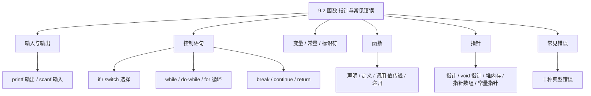
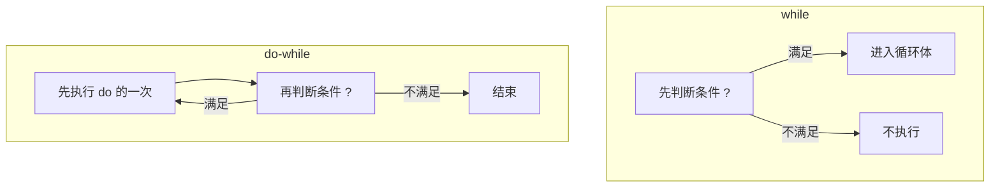
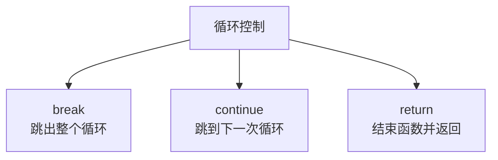
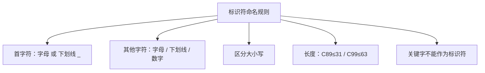

课程链接：视频《9.2 函数 指针与常见错误》（软考程序员系列课程）

视频链接：

## 本节概述

本节是系列课程的第二十五节课，继续进入**第九章 C 语言程序设计**，本节把 C 语言体系的重要组成部分串一遍：**输入输出、控制语句、变量常量与标识符、函数、指针，以及常见错误**。这是 C 语言较重要的一课，也是下午编程题判断对错的常考内容。本节脉络依次是：输入输出（printf/scanf）→ 控制语句（选择 switch、循环 while/do-while/for、break/continue/return）→ 变量常量与标识符命名规则 → 函数（声明/定义/调用、值传递、递归）→ 指针（定义、void 指针、堆内存、指针数组、常量指针/指针常量）→ C 语言十大常见错误。

先看一张本节的知识地图，把整节内容装进脑子里：



## 输入与输出

在新的 C 标准中，**输入输出只要求掌握两个函数：printf 和 scanf**。

### printf（格式化输出）

**printf** 按**用户指定的格式**在控制台输出结果。格式为：

```c
printf("控制字符串", 输出列表);
```

实例：

```c
int i = 10, j = 20;
float x = 12.3456, y = 55.0;
printf("i=%d, j=%d, x=%f, y=%f\n", i, j, x, y);
// 输出：i=10, j=20, x=12.3456, y=55.0
```

**格式说明符（占位符）**：

- `%d` 表示**整型**。
- `%f` 表示**浮点型**（单精度）。
- `\n` 是**换行符**。

| 格式符 | 含义 |
|---|---|
| `%d` | 整型 int |
| `%f` | 浮点型 float |
| `%c` | 字符 char |
| `%s` | 字符串 |
| `\n` | 换行符 |

### scanf（格式化输入）

**scanf** 不是输出列表，而是**格式符合 + 地址列表**——按指定格式**把键盘的数据输入到指定的变量中**。

```c
int age;
char gender;
char name[20];
scanf("%c %d %s", &gender, &age, name);
```

- `%c` 对应**字符** gender，需要传**地址** `&gender`。
- `%d` 对应**整型** age，传地址 `&age`。
- `%s` 对应**字符串** name，数组名本身就是地址。

> [!WARNING] 真题考点
> **scanf 使用的是地址列表（`&` 取地址），printf 使用的是值列表**。字符串/数组名可直接作为地址，普通变量要加 `&`。

## 控制语句

控制语句在 C、Java、C++ 等语言中是**相通的**，学会一门可以触类旁通。分为**选择结构**和**循环结构**。

### 选择结构：if 与 switch

**if 语句**：条件成立执行一个块，否则执行另一个块。示例：

```c
// 写法 1：if-else 用花括号括成整体块
if (x > 0) {
    if (x < 5)
        y = x + 1;   // 满足 0<x<5
    else
        y = x - 1;   // 满足 x>=5
}

// 写法 2：合并条件
if (x > 0 && x < 5)
    y = x + 1;
else
    y = x - 1;
```

**switch 语句**：多分支选择，**遇到 break 才跳出循环，否则从上到下依次执行**。这是一个关键考点——**漏写 break 的穿透（fall-through）**。

```c
switch (score) {
    case 1:
        printf("S ！");
        break;          // 有 break，执行后跳出
    case 11:
        printf("Jack");
        // 没有 break，继续往下执行！
    case 12:
        printf("Queen");
        break;
}
```

- 输入 `1`：打印 "S！"，遇 break 跳出。
- 输入 `11`：打印 "Jack"，**因为没有 break**，继续执行 case 12 打印 "Queen"。

> [!WARNING] 真题考点
> **switch 漏写 break 会"穿透"继续执行下一个 case**。这是必考点，务必判断每个 case 后有没有 break。

### 循环结构：while / do-while / for

**while 语句**：先判断条件，**条件满足才进入循环体**（可能一次都不执行）。

```c
while (条件) {
    // 循环体，条件满足才执行
}
```

**do-while 语句**：**先执行一次 do 的操作，再判断条件是否成立**来决定是否继续循环（**至少执行一次**）。

```c
do {
    // 循环体，先执行一次
} while (条件);   // 再判断
```

**while 与 do-while 的区别**：

| 项目 | while | do-while |
|---|---|---|
| 执行顺序 | **先判断条件**再执行 | **先执行一次**再判断条件 |
| 最少执行次数 | 可能 0 次 | **至少 1 次** |



**for 语句**：遍历式循环，通常有初始化、条件、步长三部分：

```c
for (int i = 0; i < length; i++) {
    // i 从 0 开始，小于 length 才进入，每次步长 +1
}
```

### break / continue / return

- **break**：在循环体中遇到它就**跳出整个循环**。
- **continue**：遇到它就**继续执行循环的下一个条件**，直到循环结束或遇到 break 跳出。
- **return**：主要用于**函数返回**，**立即停止函数的执行，并返回到调用函数**。



## 变量、常量与标识符

### 变量与常量

**变量**：调用前**必须先定义**，例如 `int a;` 定义了一个整型变量 a。

**字面量**：一般指在代码中直接写出的大写字符串表示的值，如 `"hello"`、`"china"`。

**常量（const）**：有两种等价写法：

```c
const int a = 10;   // 写法 1
int const a = 10;   // 写法 2
```

`const` 修饰后，变量值不可修改。

### 标识符命名规则（考点）

- **组成**：以**字母（大小写）或下划线 `_` 开头**，后面可跟**字母、下划线或数字**。其他字符不允许出现在标识符中。
- **大小写有区别**：C 语言**区分大小写**，`Sum` 和 `sum` 是不同标识符。
- **长度限制**：**C89 标准限 31 字符以内，C99 新标准限 63 字符以内**。
- **关键字不能作标识符**：C 语言关键字有特殊意义，不能用作标识符。
- **命名建议**：使用有一定意义的字符串便于记忆；**变量用小写字母，用户自定义类型开头字母大写**。

> [!WARNING] 真题考点
> 判断"非法命名规则"常考：要求以**字母或下划线开头**，**只能含字母/数字/下划线**，**区分大小写**，**关键字不能作为标识符**。



## 函数

### 函数的结构

**函数的定义**四部分组成：**返回类型 + 函数名 + 参数列表 + 函数体**。

- **返回类型**：函数返回的数据类型；即使没有返回值，也要用 **void** 定义。
- **函数名**：自定义。
- **传入的参数**：形式参数。
- **return 语句**：如果不是 void，**必须返回一个返回值**（`return 值;`），用于**立即停止函数执行并返回到调用处**。

```c
返回类型 函数名(参数列表) {
    // 函数体：执行语句
    return 返回值;   // 若非 void 必返回
}
```

### 函数声明、定义与调用

- **函数在使用前必须经过声明**：**声明只需带上返回类型、函数名和参数列表**。
- **定义**：包含函数**所有执行情况**（完整函数体）。
- **函数声明可集中放在头文件里，用 `#include` 包含头文件**；也可以放在程序文件开头，而把**函数定义放在程序文件后面某处**，**这样好在函数定义前就进行引用/调用**。

```c
// 函数的声明（原型）：只需返回类型 + 函数名 + 参数列表
double max(double a, double b);

// 函数的定义：包含完整函数体
double max(double a, double b) {
    return a > b ? a : b;
}
```

## 值传递与递归

### 值传递（传值）

**值传递**：把**实参的值复制给形参**，实参和形参**占用不同的存储单元**。形参改变值，**不会影响实参**。

```c
void add(int x) {   // x 是形参
    x = x + 1;      // 只改形参 x，不影响实参
}
int a = 10;
add(a);             // 传值：把 a 的值 10 复制给 x，a 仍为 10
```

> [!TIP] 通俗理解
> 值传递像"复印了一份文件交给对方去改"，原文件不会受影响。形参改了，实参不变。
>
> （注意：若要修改实参本身，需传**地址**——指针，这在指针部分会讲。）

### 递归函数

**递归函数**用**分治法**思想：将一个**难以直接解决的大问题，逐渐分割成比较小的、相同类型的子问题**，逐个突破、分而治之（分治法前面章节已讲过）。

```c
int fact(int n) {
    if (n <= 1) return 1;   // 递归出口
    return n * fact(n - 1); // 递归调用子问题
}
```

> [!NOTE]
> 递归 = 分治（大问题拆成相同类型小问题）+ 递归出口（终止条件）。递归出口是重点，防止无限递归。

## 指针

### 什么是指针

**指针是内存单元的地址**，包括：**变量的地址、数组的地址、函数入口的地址**。

- **取地址运算符 `&`**：获取变量的地址。
- **间接运算符 `*`**：获取指针所指的变量（解引用）。

```c
int a = 10;
int *p = &a;   // p 存 a 的地址（取地址 &）
*p = 20;        // 通过指针修改 a（间接 *），a 变为 20
```

### 空指针与 void 指针

- **空指针（NULL）**：**全局指针变量**会自动初始化成空指针；**局部指针变量的初值是随机的**（这是容易出错的地方）。空指针通常用 `if (ptr != NULL)` 判断后再使用。
- **void 指针（`void *`）**：**可以与任意类型进行匹配**，但在**被使用之前必须转换为明确的类型**。

### 指针与堆内存（内存泄漏）

**C 语言动态申请堆内存后，必须释放**，否则会引起**内存泄漏**（这是常见错误）。申请与释放**成对出现**。

```c
int *p = (int *)malloc(sizeof(int));   // 申请一块 int 内存
free(p);                                 // 使用后必须释放
```

> [!WARNING] 真题考点
> **动态内存申请后不释放 → 内存泄漏**；**释放后指针应置空（`p=NULL`）**，否则成为**野指针**。申请/释放成对出现。

### 通过指针访问数组

**通过指针访问数组元素**，利用指针指向数组首地址、做偏移：

- **一维数组**：指针指向第一个元素，`*p` 取第一元素，`*(p+1)` 取第二个，依次类推。
- **二维数组**：`a[i][j]` 表示元素。**概念上**的表示是"初值地址 + 偏移量"，程序表示上先取出初值地址，再加上偏移量。

### 通过指针访问字符串常量

```c
char *s = "hello";
printf("%s\n", s);   // 输出 hello
printf("%c\n", *s);  // 取第一个字符，结果为 h
```

**字符串常量在运行过程中是不允许修改的**——例如在运行中把 `e` 改成 `a` 是不被程序允许的。

### 指针数组

**指针数组**：数组的每个元素都是指针。示例：

```c
char *pname[5];        // 5 个元素，每个都是指针
pname[0] = "A";
pname[1] = "B";        // 依次填地址进去
```

### 常量指针与指针常量（重点辨析）

判断依据：**`*`（星号）与 const 的相对位置**。

```c
const int *p;   // 常量指针
int *const p;   // 指针常量
```

- **常量指针（`const int *p`）**：星号在 const 后面，"**const 修饰的是 int**"——**不能通过指针修改它指向对象的值**，但**指针本身可以改变指向**。
- **指针常量（`int *const p`）**：星号在 const 前面，"**const 修饰的是指针**"——**指针本身是常量，不能再指向其他对象**，但可以修改所指向对象的值。

> [!WARNING] 真题考点
> **看星号与 const 谁在前**：`const` 在 `*` 前 → **常量指针**（所指向对象为常量，不可改值可改指向）；`const` 在 `*` 后 → **指针常量**（指针本身是常量，可改值不可改指向）。

| 类型 | 写法 | const 修饰对象 | 能改指向 | 能改值 |
|---|---|---|---|---|
| 常量指针 | `const int *p` | `int`（所指对象） | 可以 | 不可以 |
| 指针常量 | `int *const p` | `*p`（指针本身） | 不可以 | 可以 |

## C 语言的常见错误（十大）

软考**下午编程题常考判断错误**，这十种典型错误要记牢：

1. **标识符大小写有区别**——大小写不同是不同的标识符。
2. **忽略变量类型导致运算不合法**——例如整型相除不可能得到 float 型，运算前需要做类型转换。
3. **字符常量与字符串常量混淆**——**字符常量用单引号 `'A'`，字符串常量用双引号 `"A"`（结尾隐含一个 `\0`）**。
4. **引用未初始化的变量**——变量在引用前必须初始化。
5. **赋值 `=` 与相等 `==` 混淆**——`=` 是把某值赋给某变量，`==` 才是比较是否相等。
6. **漏写 break**——switch 中没有 break 就不跳出循环（穿透）。
7. **数据溢出**——数值超出类型范围。
8. **数组下标超出有效范围**——访问越界（数组越界）。
9. **混淆数组名和指针变量**——数组名是常量地址，指针可移动，二者不完全相等。
10. **指针引起的错误**——
    - **内存泄漏**：申请后未释放。
    - **空指针异常**：使用 NULL 指针。
    - **野指针**：释放内存后未立即将指针置空（应赋 `NULL`）。
    - **返回指向临时变量的指针**：临时变量函数结束即消亡，返回其指针不安全。
    - **试图修改常量**：试图改写 const 修饰的对象。

> [!WARNING] 真题考点
> 十大错误归纳成几类记：**命名（大小写）、类型（忽略/溢出/混用单双引号）、初始化（引用未初始化）、运算符（= 与 ==）、控制（漏 break、数组越界）、指针（内存泄漏/空指针/野指针/返回临时变量指针/改常量）**。下午题常给代码让你找错。

## 本节小结

① **输入输出**：**printf 按格式输出（值列表），scanf 按格式输入（地址列表 `&`）**。`%d`=整型、`%f`=浮点、`%c`=字符、`%s`=字符串、`\n`=换行。scanf 普通变量要取地址，字符串数组名本身就是地址。

② **控制语句**：选择结构 **if、switch**（switch **漏写 break 会穿透**）；循环 **while（先判断，可能 0 次）、do-while（先执行一次，至少 1 次）、for（初始化/条件/步长）**；控制词 **break 跳出循环、continue 跳到下一次、return 结束函数并返回**。

③ **变量/常量/标识符**：变量先定义后用；`const` 常量两种写法 `const int a` / `int const a`。**标识符以字母或下划线开头，后跟字母/数字/下划线，区分大小写，C89≤31 字符、C99≤63，关键字不能用**。

④ **函数**：由**返回类型+函数名+参数+函数体**构成，return 停止函数并返回；非 void 必须返回；**使用前先声明**（声明只需返回类型+函数名+参数，可放头文件用 `#include` 包含）。**值传递把实参值复制给形参，形参改变不影响实参**。

⑤ **递归**：用**分治**思想把大问题拆成相同类型子问题逐个解决，必须有**递归出口**防止无限递归。

⑥ **指针**：**指针是内存单元地址**（变量/数组/函数入口地址）。`&` 取地址、`*` 间接访问。**空指针全局自动为 NULL、局部初值随机；void 指针可与任意类型匹配但使用前须转明确类型**。**堆内存申请后必须释放否则内存泄漏**，释放后应置空防野指针。指针可访问数组、字符串常量（**运行中不可修改字符串常量**）。**常量指针 `const int *p`（不能改所指对象值，可改指向）；指针常量 `int *const p`（指针不可移，可改所指值）**——看 `*` 与 const 相对位置。

⑦ **十大常见错误**：大小写区别、忽略类型（整型除不能得 float）、单双引号混用、引用未初始化变量、`=`/`==` 混淆、漏写 break、数据溢出、数组下标越界、混淆数组名与指针、指针错误（内存泄漏/空指针/野指针/返回临时变量指针/试图修改常量）。下午题判错重点看这些。