课程链接：视频《2.1 进程管理》（软考程序员系列课程）

视频链接：

## 本节概述

本节是系列课程的第五节课，进入教材第 2 章「操作系统基础知识」。操作系统的功能可以分为五大部分：**进程管理、文件管理、存储管理、设备管理和作业管理**，其中进程管理是操作系统的核心，也是本节的主题。本节脉络依次是：进程的概念与状态 → 前驱图 → 同步与互斥 → PV 操作（重点）→ 进程通信与调度 → 死锁。

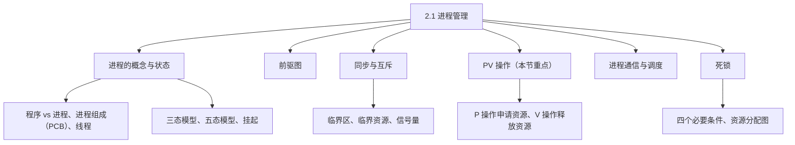

## 进程与程序的区别

在讲进程状态之前，先弄清什么是进程、它和程序有什么区别。**程序是一个静止的概念，而进程是一个动态变化的概念**——简单说，进程就是"程序的一次执行"。进程可以分为三部分：**程序、数据和进程控制块（PCB）**。其中程序在编制好后是不可修改的；而数据部分包括程序执行所需的数据及工作区，是可以修改的。

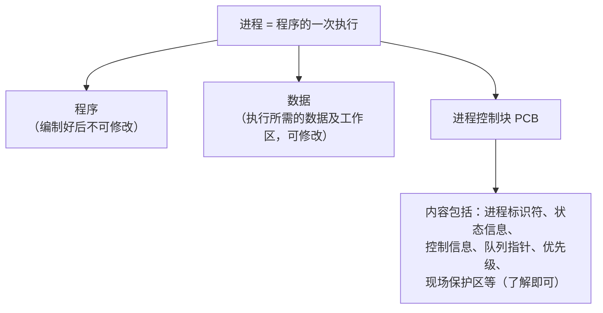

进程的动态概念又衍生出了**线程**：进程专门负责"资源"这个含义，而线程负责"控制"这个含义——也就是说，进程是资源分配的单位，线程是调度（执行）的单位，了解这个分工即可。

## 进程的状态

进程的状态先按**三态模型**理解：**运行态、就绪态、阻塞态**；在此基础上加入**新建**和**终止**两个态，就得到**五态模型**。

**运行态**：进程在处理机（CPU）上运行。

**就绪态**：进程已经获得了除处理机以外的所有资源，一旦获得处理机就可以运行。

**阻塞态**：进程需要等待某个事件的发生（比如 I/O 请求），处于阻塞；当等待的事件已经发生（如 I/O 事件结束）时，它就会进入就绪态。

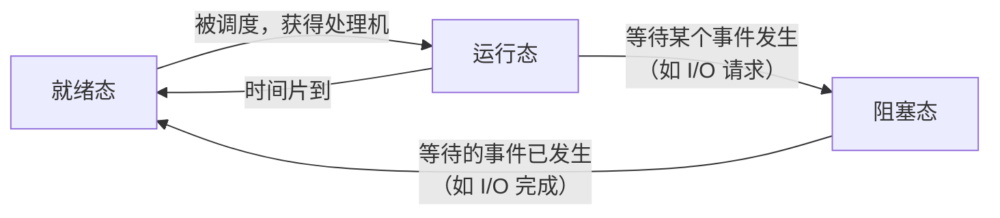

> [!WARNING] 真题考点
> 就绪态与运行态是**可互逆**的过程（双向转换）；而就绪态与阻塞态**不可互逆**——阻塞的进程必须等事件发生后先回到就绪态，再由调度进入运行态。"不可逆转的过程"考过真题，各状态的含义也是常考点。

除了三态之外还有**挂起**的概念：活跃就绪和静止就绪之间可以转换——活跃到静止是**挂起**的过程，静止到活跃是**激活**的过程（阻塞态同理有活跃阻塞与静止阻塞）。让进程挂起可以把不用的进程暂时移出内存，以缓解内存紧张。

**新建态**：进程刚刚被创建、还没有被提交的状态（即已经创建了但还没有提交）。**终止态**：系统在等待最终的处理（比如释放内存）时进程所处的状态。

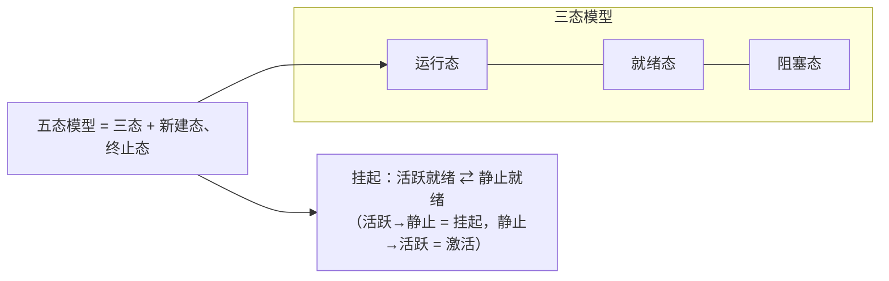

## 程序执行的特征与前驱图

程序执行的特征有**顺序执行**和**并行（并发）执行**两种。

**顺序执行**具有三个特性：**顺序性**——程序按顺序依次执行；**封闭性**——程序执行过程是封闭的（独占所有资源，不受其他程序影响）；**可再现性**——程序执行完以后，再执行这段代码还是会得到同样的结果。

从顺序执行变为**并行执行**可能会发生几个问题：第一，失去了它的**封闭性**，也就是说失去了"原子性"——原子性是指"要么做、要么不做"，打破了原子性就可能出现问题；第二，程序与机器的执行**不再一一对应**（一个程序可能被打断、分多次执行）；第三，程序之间产生**相互制约性**。

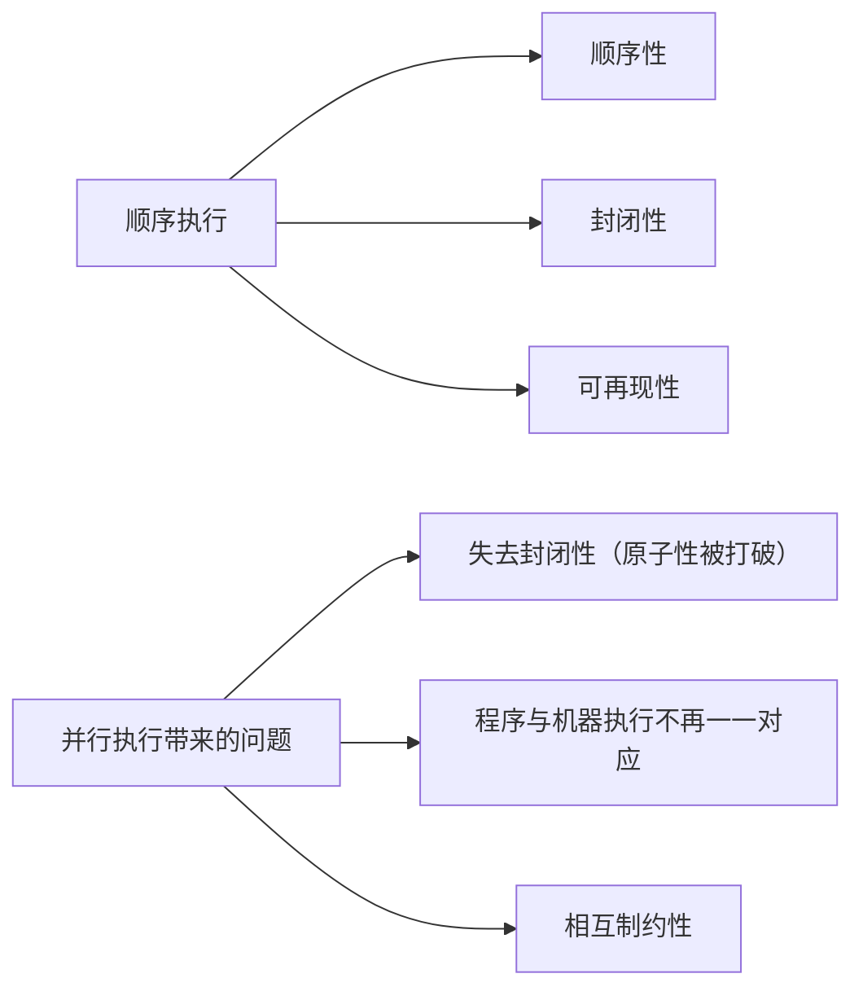

**前驱图**（历年真题）：一台计算机有一个 CPU、一台输入设备和一台输出设备；每个作业具有三个程序段——输入 I1、I2、I3，计算 C1、C2、C3，输出 P1、P2、P3。它们之间的关系：**I2 与 C1 并行执行，I3、C2、P1 并行执行，C3、P2 并行执行**。前驱图画出来大致如下：

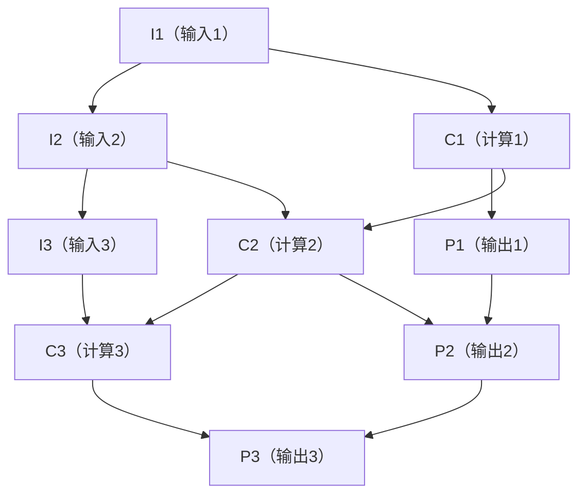

> [!NOTE]
> 图中处于同一"层"的程序段（I2 与 C1；I3、C2、P1；C3、P2）之间没有箭头、可以并行执行；有箭头相连的则是先后制约关系，比如 I1 是 C1 的**前驱**，C1 是 I1 的**后继**。

约束关系分**直接制约**和**间接制约**：I2、I3 受到 I1 的间接制约，C2、C3 受到 C1 的间接制约，P2、P3 受到 P1 的间接制约（同一类设备的串行排队）；跨设备的行内关系是直接制约——C1、P1 受到 I1 的直接制约，C2、P2 受到 I2 的直接制约，C3、P3 受到 I3 的直接制约（同一作业必须先输入、再计算、后输出）。这道题是历年真题，前驱图要会看、会画。

## 进程的控制

进程的控制主要是通过**原语**进行的操作。进程的控制包括：**新建进程、撤销进程、改变进程的状态和进程通信**这几个部分。

**原语**是指由若干个机器指令组成、完成特定功能的程序段，它的特点是**原子性**（要么全部执行完，要么不执行，中途不可被打断）。原语按功能分为**控制原语、通信原语、资源管理原语和其他原语**。

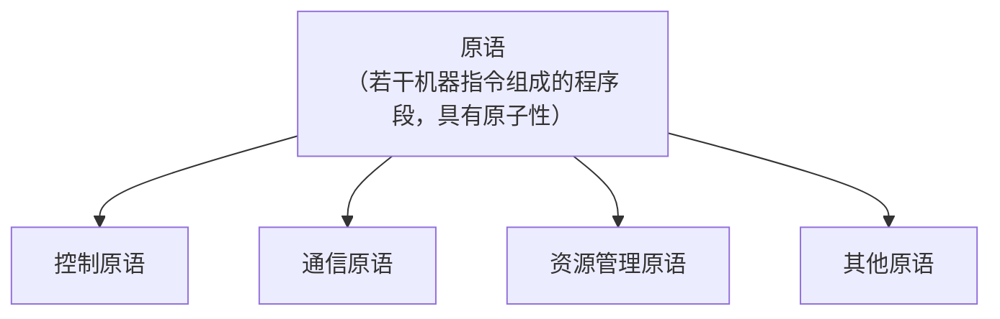

## 临界区与信号量

在学 PV 操作之前，先了解几个概念。

**临界资源**：进程间需要以**互斥**方式共享的资源，如打印队列。

**临界区**：进程中对临界资源进行操作的那段**程序**——注意，**临界区是一段程序**，这个在历年真题中考过。

**互斥临界区的管理原则**（四条）：**有空则进、无空则等、有限等待、让权等待**。"有空则进、无空则等"很好理解；有限等待是指进程等待的时间是有限的（不会无限等下去）；让权等待是指进程暂时进不去时，应该主动让出 CPU（不占着 CPU 空转，等一会再来），视频里用时间片和优先级来帮助理解这两条。

**信号量 S**（一般以 S 命名）按控制对象分为两类：**公用信号量**——用于互斥，初值一般为 1 或资源的数目（比如打印机被占用后再次申请就变为 0，表示资源不可用，此时就阻塞进程）；**私用信号量**——用于同步，初值为 0 或某个正数。

从**物理意义**上看信号量的值：从"资源的可用性"看，信号量大于等于 0，表示还有可用资源；从"等待资源的进程数"看，信号量小于 0，其绝对值就是正在等待的进程个数。

> [!WARNING] 真题考点
> 例如信号量 S 的取值范围是 -3、-2、-1、0、1、2，那么这台打印机可容纳的**等待资源进程数是 3**（负数的绝对值）。这是历年考过的一道真题。

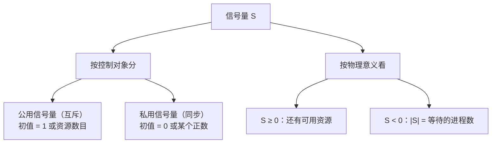

## PV 操作

**PV 操作是这一节的重点内容**（P、V 都不是英文，是取自荷兰语的单词）。**P 操作表示申请一个资源**；**V 操作表示释放一个资源**。

**P 操作**：每次执行 P 操作都会将信号量**减 1**。当信号量 S 大于等于 0 时，进程继续执行；S 小于 0 时，就阻塞进程（进程进入等待队列）。

**V 操作**：将信号量值**加 1**。当 S 大于 0 时进程继续执行；当 S 小于等于 0 时，则从阻塞状态下唤醒一个进程，并将其插入就绪队列，然后执行 V 操作的进程继续执行。

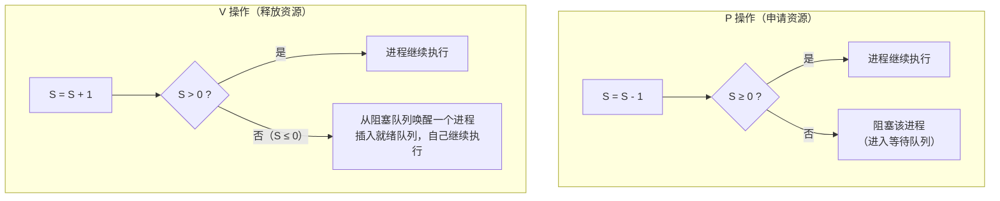

> [!NOTE]
> 视频中把 P、V 的加减口误说反了，但后面的例题演示与教材一致，请按上面（教材口径）记忆：**P 减 1、V 加 1**。另外做题时要注意信号量等于 **0 状态的进程**这个边界值——S=0 时 P 操作正好可用完资源，再申请就会变负、进入阻塞。

## 同步与互斥

同步和互斥是**不是一对反义词**，而是进程的两种关系（两种状态）。

**互斥**就像千军万马过独木桥：资源是有限的，每次能通过的人数也是有限的——多个进程竞争同一资源，一次只能有一个进程使用。**同步**就像一道应用题：李四骑着自行车往前走一段距离后，在这里等张三，等到张三和李四到达同一个点，两个人才并行继续往前走——进程之间有先后协作关系，一个进程等另一个进程到达某个"点"再一起继续。

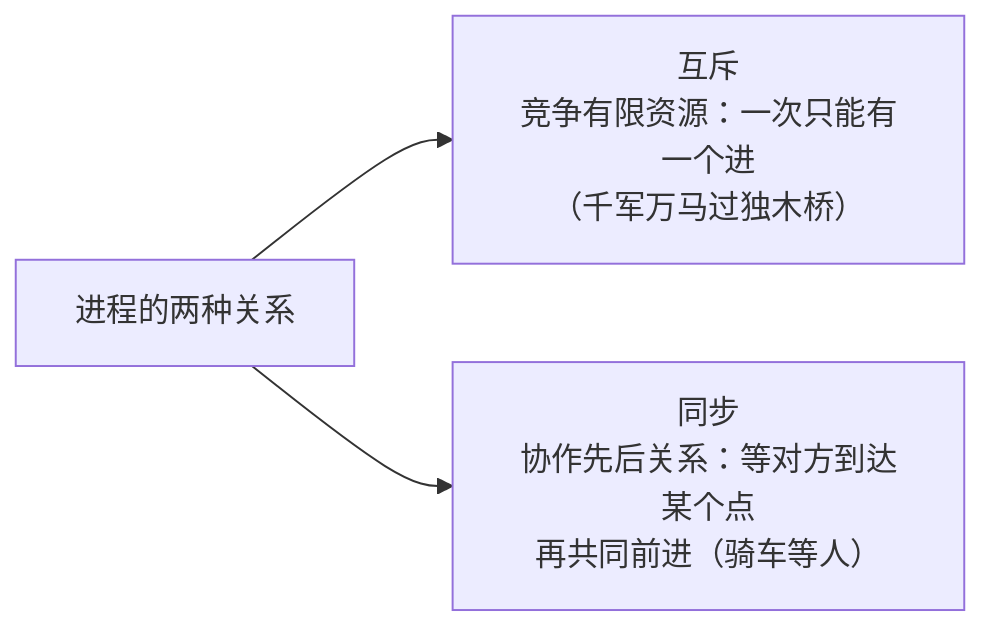

## PV 操作之进程互斥

用书上的经典例子理解互斥：进程一是专门"数数"的——有一辆车过了，它就把这个数字加 1；进程二是"重置"的——执行进程二时，会把进程一累加的数字打印在屏幕上，然后再把这个数字还原成 0。

先把信号量 S 的值设为 1，表示这是一个互斥资源、它的资源数只有 1。执行进程一时 P(S)，S 等于 0，进程可以继续往下执行，于是把数字加 1。当进程一还没有执行完的时候，如果进程二来执行，S 此时还是 0，进程二再 P(S) 就变成 -1——它不能执行"打印数字"这个操作，只能阻塞等待；必须等到进程一执行完、执行 V(S) 释放资源。之后如果进程一还要数数就继续 P(S)；若是进程二夺得时间片，S=1 时进程二 P(S) 又变回 0，可以继续执行，把数字打印出来、再把数字置为 0，最后执行 V(S) 唤醒进程并把 S 恢复到 1。这样两个进程共同争夺 S=1 这一个资源，就实现了进程一和进程二的**互斥**——我执行进程一没执行完时，不允许你执行进程二；反之亦然。

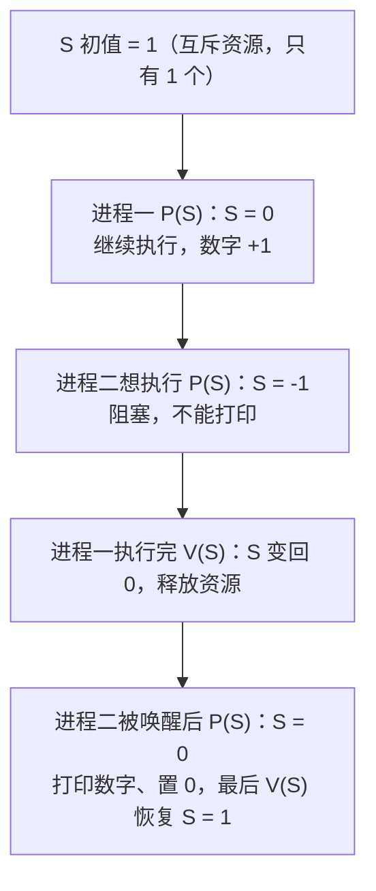

## PV 操作之进程同步：生产者消费者问题

进程同步有一个非常经典的案例——**生产者和消费者问题**，它分单缓冲区和多缓冲区两种情形。

**单缓冲区的同步**：生产者和消费者的 PV 操作是**对应起来**的——在生产者这边 P(SE)，在消费者这边就 V(SE)（释放）；在生产者这边 V(SR)，在消费者这边就 P(SR)。这样对应起来的 PV 操作称为进程的同步。

其中 SE 的初值为 1，表示市场最初可以容纳一个产品（这个"1"也代表缓冲区是单缓冲区）；SR 的初值为 0。

流程是：生产者最初生产一个产品 →P(SE)，SE 从 1 变 0 → 继续执行，把产品送到市场 →V(SR)，SR 从 0 变 1 → 这时消费者就可以进行消费了。如果生产者没有执行 V(SR)，消费者一开始就 P(SR)，SR 等于 -1，相当于把消费者**阻塞**住——只有在产品送到市场以后 V(SR) 唤醒，SR 变成 1-1=0，消费者才能从市场取出一个产品进行消费。消费完以后，消费者需要执行 V(SE) 唤醒生产者——如果不唤醒，生产者继续 P(SE) 会变成负值被阻塞，无法继续向市场生产产品；必须等消费者取出产品、释放进程之后，生产者才能继续生产产品放入市场。这样就防止了"市场中产品无法容纳"的问题。

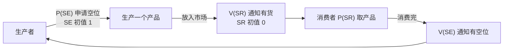

**多缓冲区**多了一个**互斥资源**的概念：因为市场（缓冲区）是一个互斥资源，所以在"送入市场"和"从市场取出产品"的最里层包裹着一个互斥信号量（P(S)/V(S)），S 初值为 1 表示缓冲区为互斥资源。同时 SE 的初值改为 **N**，代表市场可容纳 N 个产品。

生产者每生产一个产品执行 P(SE)，SE 一直减，减到 0 时还可以继续往下走（还有空位），减到负值时就无法继续往里面放资源了——必须等消费者消费后释放（V(SE)）才能继续。消费者同理，SR 初值为 0，如果生产者不执行 V(SR) 释放一个产品，消费者 P(SR) 一减就变负，被阻塞，无法消费产品。互斥信号量则保证：**生产者在放产品的同时，消费者不能拿**——生产者 P(S) 后 S=0，把产品放入市场后才执行 V(S) 释放，释放之后消费者才能从市场上取出产品；如果这个互斥信号量变为 0，消费者再去 P(S) 就会为负，无法从市场取出产品。

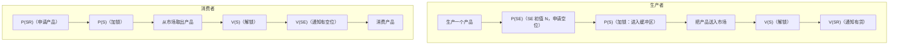

> [!NOTE]
> PV 操作就像进程的一把"锁"——在互斥资源的使用过程中把资源锁住，如果不去唤醒（V 操作）就没有办法让另一个进程继续执行。如果不用 PV 操作，很可能导致市场无法容纳生产者生产的产品，或消费者因市场上没有产品而无法消费。

## 进程的通信

进程通信包括**低级通信**和**高级通信**。

**低级通信**主要指 PV 操作。它的**编程难度比较大**（PV 操作使用不当的话，很有可能会导致死锁——就是后面要讲的死锁）；**效率很低**（因为 PV 操作的互斥概念，一次只能从里面拿一个资源、一次只能放入一个资源）。

**高级通信**包括**共享存储通信、消息传递通信和管道通信**：消息传递通过 send/receive 实现，又包括**直接通信**（send 指定接收者对象、receive 从发送者接收）和**间接通信**（把消息放入一个信箱，接收者再从信箱里拿出这个数据）。

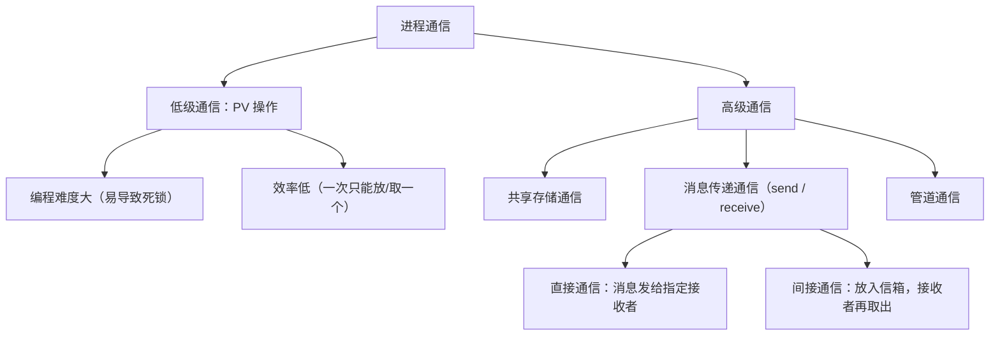

## 进程的调度

进程的调度有**三级调度**：高级调度、中级调度和低级调度。

**高级调度**又称**长期调度**，它主要完成"将（在外存中的作业）状态变为就绪状态"，是对进程状态的一个改变（把作业调入内存成为就绪进程）。**中级调度**是指将就绪的（被挂起的）资源放入内存当中（决定哪些进程在内存、哪些被换出，调节内存压力）。**低级调度**又称**短期调度**，它是把内存上的就绪进程放到 CPU 当中（决定哪个就绪进程真正获得 CPU），这是一个逐级漏斗式的变化过程。

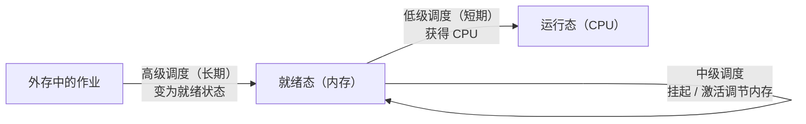

调度的方式可以分为**可剥夺式**和**不可剥夺式**——不可剥夺的调度很有可能会导致死锁。

调度算法有四种：**先来先服务、时间片轮转、优先级调度和多级反馈调度**。先来先服务调度主要用于宏观方向，它比较**有利于长作业、有利于 CPU 繁忙的作业，不利于 I/O 繁忙的作业**。时间片轮转包括固定时间片（给每个进程分配相等的时间片）和可变时间片（根据进程的不同要求，分大小不同的时间片给进程）。优先级调度包括静态优先级（进程的优先级在创建时就已经确定、不会改变）和动态优先级（进程在运行的过程中还可以改变它的优先级）。多级反馈调度是综合这些算法的优点执行的一种调度算法，其优点是：照顾了系统的吞吐量、缩短了平均周转时间、照顾了 I/O 进程以获得更好的 I/O 设备利用率、不必估计进程的执行时间、动态调整优先级（视频口误"动态调度优先级的"）。

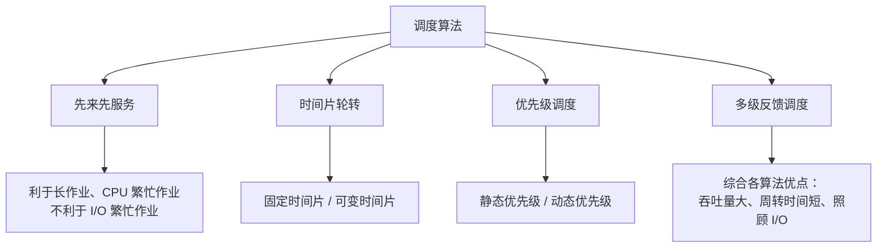

## 死锁

进程管理是操作系统的核心，如果设计不当就会产生死锁问题。**什么是死锁？**指一个进程在等待一件**不可能发生的事情**——这个进程就死锁了；如果一个或多个进程产生死锁，就会造成系统的死锁。

产生死锁有这么三类原因：一是**进程推进顺序不当**导致死锁；二是**同类资源分配不当**导致死锁；三是**PV 操作不当**导致死锁。

> [!TIP] 计算实例（真题）
> 系统有 3 个进程，每个进程都需要 5 个系统资源，系统至少要多少个资源才**不可能**发生死锁？答案是 **3 × (5-1) + 1 = 13 个**。记住公式：进程数 ×（每个进程需要的资源数 - 1）+ 1，即让每个进程都差一个资源、再多一个资源总能有一个进程完成并释放。

产生死锁的**四个必要条件**：**互斥条件**——进程对所要求资源的排他性（一个资源一次只能被一个进程使用）；**请求保持条件**——已获得部分资源、又请求资源时被阻塞（占着已有的资源不放，还想要更多）；**不可剥夺条件**——进程获取的资源未用完时不能被剥夺，只能用完以后自行释放；**环路（循环等待）条件**——发生死锁时，资源分配的有向图会构成环路，每个进程占着下一个进程申请的资源。

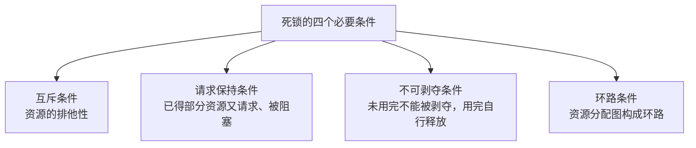

**资源分配图**（历年真题）：P1、P2 代表两个进程，R1、R2 代表两个资源。**进程指向资源**（P1 → R1）表示进程**请求**该资源；**资源指向进程**（R1 → P2）表示把资源**分配**给该进程。如果 P1 请求 R1，R1 分配给 P2，P2 请求 R2，而 R2 又分配给 P1——这时候就形成了一个**环路**，也就是死锁发生了。这种图要懂得看，历年考过真题。

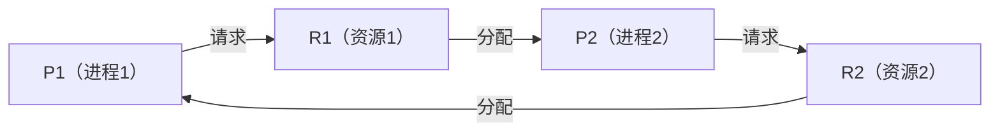

**死锁的预防与避免**：死锁的**预防**是打破四个必要条件之一（破坏互斥、请求保持、不可剥夺、环路条件中的任意一个）；死锁的**避免**则需要**银行家算法**（动态判断资源分配是否安全），这个了解一下即可，不做要求。（视频把"预防"与"避免"说反了，本处按教材口径。）

## 本节小结

① **进程与状态**：程序是静止概念，进程是程序的一次执行（= 程序 + 数据 + PCB），进程动态概念衍生出线程——进程管资源、线程管调度。三态模型：运行、就绪、阻塞；五态模型加新建、终止。**就绪 ⇄ 运行可互逆，就绪与阻塞不可互逆（真题）**；挂起=活跃转静止，激活=静止转活跃。

② **程序执行**：顺序执行有顺序性、封闭性、可再现性；并行执行会失去封闭性（原子性被打破）、程序与机器不再一一对应、产生相互制约。**前驱图**（真题）：I2∥C1、I3∥C2∥P1、C3∥P2 并行，I1 是 C1 的前驱；同类资源串联是间接制约、同一作业内是直接制约。

③ **临界区与 PV 操作**：临界资源=需互斥共享的资源；**临界区是程序**（真题）；管理原则：有空则进、无空则等、有限等待、让权等待。S≥0 表示可用资源数，S<0 的绝对值=等待进程数（真题）。**P 申请（S-1，S<0 阻塞）、V 释放（S+1，S≤0 唤醒一个进就绪队列）**。互斥=独木桥，同步=骑车等人；生产者消费者：单缓冲 SE=1/SR=0 对应 P/V，多缓冲再加互斥信号量 S=1。

④ **通信与调度**：低级通信=PV（难度大、效率低）；高级通信=共享存储、消息传递（直接/间接）、管道。调度分三级：高级（长期，作业→就绪）、中级（挂起/激活）、低级（短期，就绪→CPU）；方式分可剥夺/不可剥夺（后者易死锁）；算法：先来先服务（利于长作业、CPU 繁忙作业）、时间片轮转（固定/可变）、优先级（静态/动态）、多级反馈（综合优点）。

⑤ **死锁**：进程等待不可能发生的事。三类原因：推进顺序不当、同类资源分配不当、PV 操作不当。最少资源数公式：进程数 ×（每进程需求 -1）+ 1。四个必要条件：互斥、请求保持、不可剥夺、环路；资源分配图"进程→资源=请求、资源→进程=分配"，成环即死锁（真题）。预防=打破四个必要条件之一，避免=银行家算法（了解）。