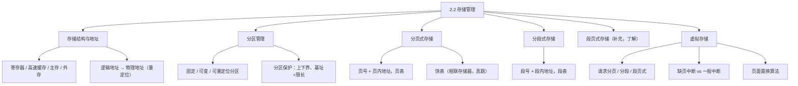
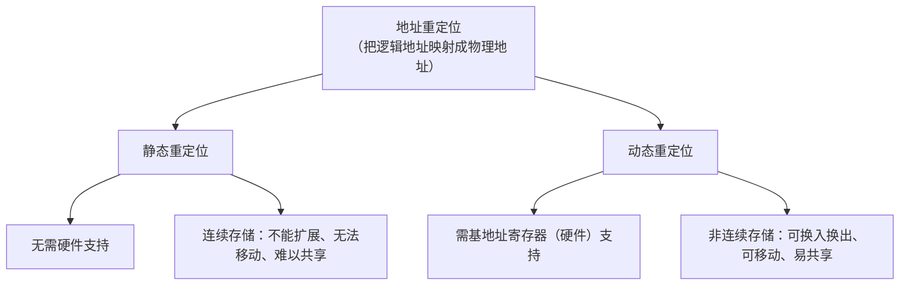
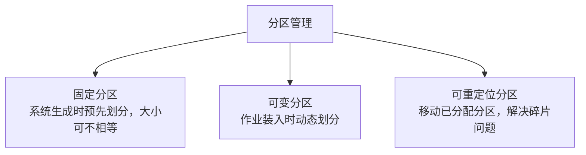
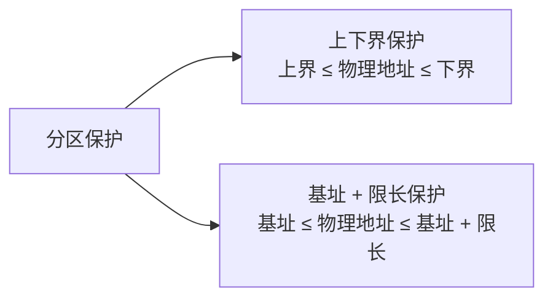
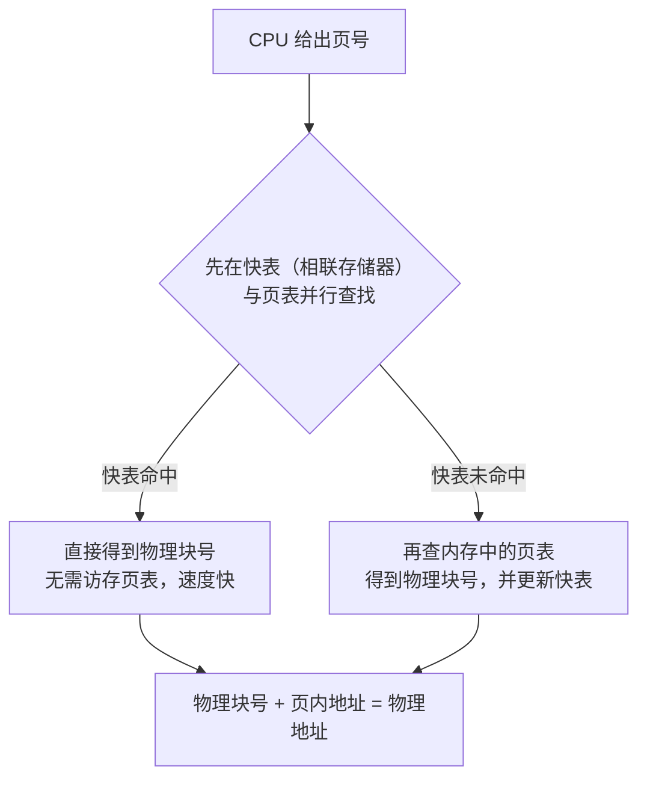
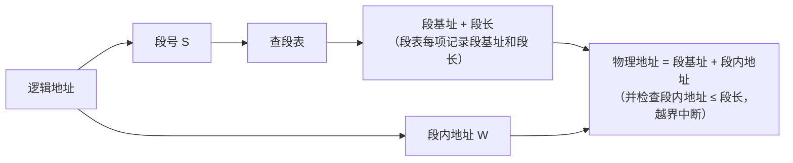
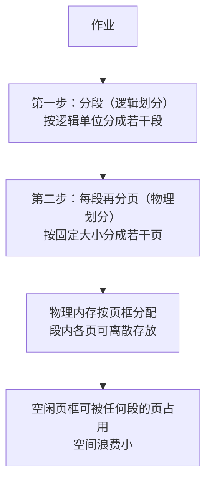
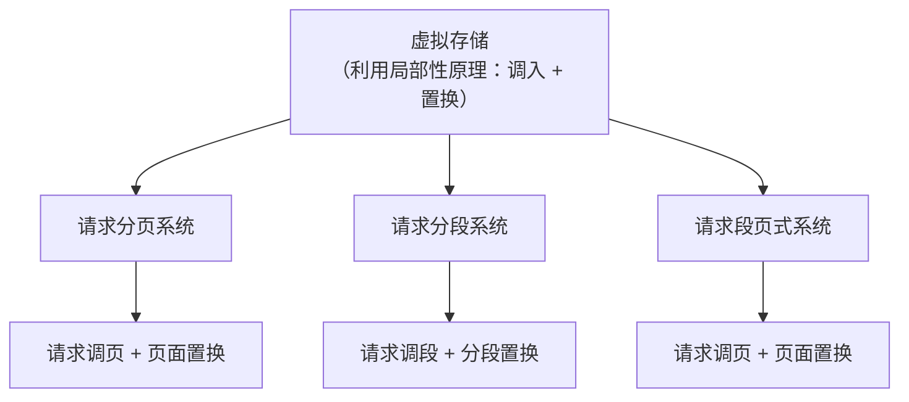
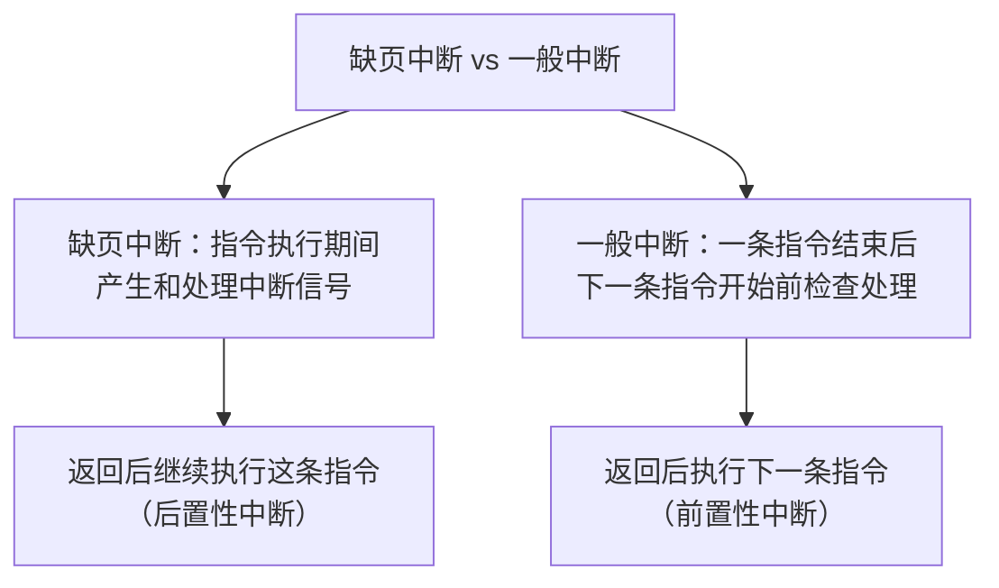
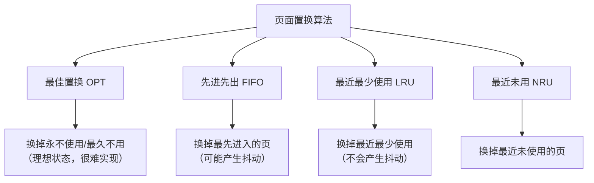

课程链接：视频《2.2 存储管理》（软考程序员系列课程）

视频链接：

## 本节概述

本课是系列课程的第六节课，主题为"存储管理"，对应教材 2.3 节「存储管理」。存储管理包括：存储管理的基本概念、分区管理、分页管理、分段管理和段页式管理、虚拟存储管理。其中**段页式管理属于补充内容**（教材里没有，视频讲师表示了解一下即可，不要有心理负担），其余都是教材内容。本课脉络依次是：存储结构 → 逻辑/物理地址与重定位 → 分区管理 → 分页式存储 → 分段式存储 → 段页式存储 → 虚拟存储 → 页面置换算法。

## 存储结构与地址重定位

**存储结构**：计算机的存储体系由**寄存器、高速缓存、主存和外存**组成。有些系统里高速缓存是没有的，但一定具有**寄存器、主存和外存**。

**逻辑地址与物理地址**：在我们的程序设计语言中，主要使用的是**逻辑地址**；但在内存当中实际存储时使用的是**物理地址**。两者之间如何对应，就引出了**地址重定位**的概念。

**地址空间**是一个集合的概念：逻辑地址的集合叫**逻辑地址空间**，物理地址的集合叫**物理地址空间**。

地址重定位分为两种：

| 类型 | 特点 |
|---|---|
| 静态重定位 | 无需硬件支持；程序必须**连续存储**，不能扩展、无法移动、难以共享 |
| 动态重定位 | 需要**基地址寄存器**等硬件支持；程序**不必连续存储**，可以换入换出，可以在内存中移动，易于实现共享 |

## 分区管理

**分区管理**的核心是**分区保护**：先把内存中的某一块分配给每个用户使用，用户之间不能互相影响，这就是分区的目的。

分区按划分方式分为三类：

| 分区方式 | 特点 |
|---|---|
| 固定分区 | 在系统生成时已将主存划分为若干分区，每个分区的大小可以各不相等 |
| 可变分区 | 一种动态的分区方式，在作业装入时进行划分 |
| 可重定位分区 | 为了解决磁盘碎片问题而产生，能够移动所有已分配好的分区，使之成为连续的分区 |

**分区的保护**有两种方式：**上下界保护**——设定一个上界寄存器和下界寄存器，要求物理地址落在上界与下界之间；**基地址和限长寄存器保护**——给定一个基地址，物理地址必须大于等于基地址、且小于等于"基地址 + 限长寄存器中的地址（限长）"。

> [!NOTE]
> 上下界保护和"基址＋限长"保护都是让程序只能访问自己被分配的那一块区域，超出就触发越界（地址越界）中断，从而保护其他分区不被打扰。

## 分页式存储管理

分页式存储的**地址结构**由**页号**和**页内地址**构成：页号代表它能容纳的页的编号（数量），页内地址代表每个页的大小（在一个页内的偏移量）。

系统会为每个进程建立一张映射表，这种表叫**页表**：例如页号 0 对应的块号（也叫**页框号**）为 2，它就在内存中指向对应的那一块内存。

**地址变换**：把逻辑地址变换成内存中的物理地址，其过程就是把页号变换为页框号（块号），页内地址保持不变，两者拼接起来就是物理地址。

**越界中断的判断**：如果页号大于页表中的页表长度，即为越界；若出现越界，需要通过页表起始值和页号重新计算出它在页表中的位置，再继续转换。

> [!TIP] 例题理解
> 例如逻辑地址由页号 3 和页内地址 W 组成，查页表得页号 3 对应的页框号，如页框号为 4，则物理地址 = 4 号物理块 + 页内地址 W（页内地址原样保留）。

分页式存储的**优点**：内存利用率高、碎片少、分配与存储管理简单。**缺点**：增加了系统的开销；可能产生**抖动现象**——所谓抖动，是指增加内存物理块后缺页次数反而增多，"得不偿失"的现象。

### 快表

**快表**（TLB）是一个小容量的**相联存储器**，由高速缓存组成，速度快，用来存放**页号和物理块号的对应关系**，通常存放当前访问最频繁的少数活动页面的页号。它可以**从硬件上保证按内容查找**——相联存储器就是按内容查找的存储器，**这在历年真题里考过**。

快表的查找和页表的查找是**并行**进行的：如果在快表里找到了，就不必在页表里去找；如果在页表里找到了，就不必在快表里去找。

> [!WARNING] 真题考点
> **快表 = 相联存储器 = 按内容查找**，这个在历年真题中考过。记住它是小容量的高速缓存存储器，存的是"页号 ↔ 物理块号"的对应关系。

## 分段式存储管理

**分段式存储**是以**信息的逻辑单位**（段，如程序中的代码段、数据段）为单位进行分配和管理的，**有利于信息的共享和保护**（要记住）。

它的存储结构由**段号和段内地址**组成；每段对应段表中的一个条目，段表包括**段基址（基址）和段长（段长）**两项。

例如：一个作业空间是 30K，它在段表里查到段基址是内存的 40K 位置，那么该作业在内存中就是"从 40K 开始往下走 30K 偏移量"这一段；同理 15K 的段对应着从 120K 开始往下走 15K 的段。

分段也讲了一个**越界中断**的概念：如果段号超过段表长度，就会产生越界中断。

**分段式存储的优缺点**：能够实现多道程序共享内存，各段程序修改互不影响（段是逻辑单位，天然适合共享和保护）；但它的**内存利用率很低**，内存碎片影响比较大。

## 段页式存储管理（补充内容）

> [!NOTE] 补充内容
> 段页式管理在教材中没有，属于视频讲师的补充。视频讲师说"了解一下即可，不要有心理负担"。

段页式存储是综合了分页和分段两种存储管理方式的优缺点而优化出来的算法：它**先对作业进行分页式存储，然后再进行分段式存储**——作业中的各页归为同一个作业段，作业段之间互不越界（就像男厕所、女厕所不会走错）；而操作系统把每个物理页框看作"茅坑"，哪个段释放空闲了，其他页也可以来占这块，这样就避免了空间的浪费。

**段页式的优点**：空间浪费很小、存储共享容易、能够动态链接。**缺点**：增加了软件的开销、复杂性增加了；软件需要硬件支持，其占用的内容（开销）也有所增加，所以它的执行速度会大大下降。

## 虚拟存储

**虚拟存储**是为扩大存储容量而采取的一种设计方法。它引入**调入**和**置换**两个功能，利用的原理是**程序的局部性原理**（空间局部性和时间局部性，前面 1.2 已讲过）。

虚拟存储对应三类系统，分别有三种实现方式：**请求分页系统**（在分页系统基础上增加**请求调页**功能和**页面置换**功能，允许只装入若干用户程序和数据后，通过调页和置换功能陆续将页面调入内存）、**请求分段系统**（增加请求调段和分段置换功能）、**请求段页式系统**（增加请求调页和页面置换功能）。

### 缺页中断与一般中断的区别

所谓**缺页**，就是我们所需要访问的页面不在内存中，这时候就产生缺页中断。

**缺页中断**是在**指令执行期间**产生和处理中断信号；而**一般中断**是一条指令**结束以后**、下一条指令开始执行前检查和处理中断。这是它们在检查和处理中断的时间上有不同。

另外，一条指令在执行过程中可能产生**多次缺页中断**。返回时，缺页中断返回该指令的开始处重新执行该指令（后置性），一般中断则返回到下一条指令执行（前置性）。

## 页面置换算法

页面置换算法讲了四条（还有一条随机置换算法就不谈了，随机无规律可言）：

| 算法 | 思想 | 特点 |
|---|---|---|
| 最佳置换算法（OPT） | 选择永远不用的或最长时间不被访问的页面置换出去 | 最理想的状态，但实现起来很难，是一种理想算法 |
| 先进先出（FIFO） | 最先进来的页面最先淘汰出去 | 实现简单，但可能产生**抖动现象** |
| 最近最少使用（LRU） | 选择最近最少使用的页面予以淘汰 | 不会产生抖动现象 |
| 最近未用（NRU） | 最近一段时间没有使用过的页面换出 | 类似 LRU 的简化版本 |

**抖动现象**：在增加了物理块（内存）的过程中，可能原先用了 3 块内存，后来增加了 4 块，但是在置换过程中发现缺页的次数反而增加了，这种"得不偿失"的现象称为抖动现象。

## 本节小结

① **地址与重定位**：程序用逻辑地址、内存用物理地址；逻辑地址集合=逻辑地址空间，物理地址集合=物理地址空间。静态重定位无需硬件、必须连续存储、不能扩展移动共享；动态重定位需基址寄存器、不必连续、可换入换出可移动可共享。

② **分区管理**：固定分区（系统生成时划分）、可变分区（作业装入时划分）、可重定位分区（移动分区解决碎片）。分区保护两种：上下界保护、基址+限长保护。

③ **分页式存储**：地址 = 页号 + 页内地址；页表映射页号→页框号，页内地址不变，拼接成物理地址；页号越界产生越界中断。优点：利用率高、碎片少；缺点：开销大、可能抖动。**快表 = 小容量相联存储器（按内容查找，真题）**，存储页号↔物理块号对应关系，与页表并行查找。

④ **分段式存储**：按逻辑单位（段）划分，利于共享和保护；地址 = 段号 + 段内地址；段表记录段基址和段长，物理地址 = 段基址 + 段内地址（检查越界）。优点：共享、互不影响；缺点：内存利用率低、碎片影响大。

⑤ **段页式（补充）**：先分段再分页，页框可被任意段占用；空间浪费小、共享容易、可动态链接；但开销大、速度明显下降。

⑥ **虚拟存储**：扩大容量，调入+置换，基于局部性原理；三种实现：请求分页、请求分段、请求段页式。**缺页中断在指令执行期间产生**（返回重执行该指令，后置性）；一般中断在指令结束后检查（返回执行下一条指令，前置性）。置换算法：OPT 最理想难实现、FIFO 可能抖动、LRU 不会抖动、NRU 最近未用。