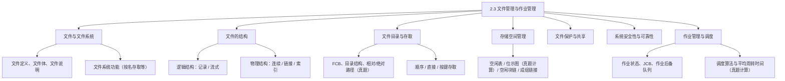
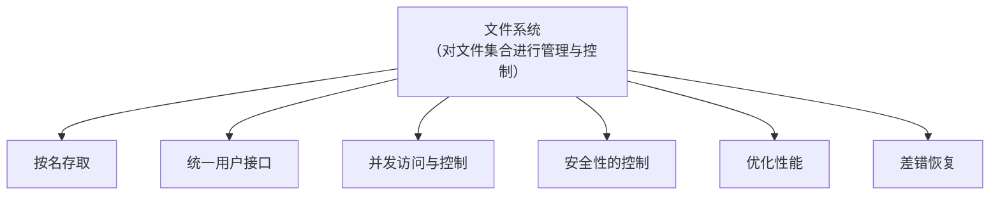
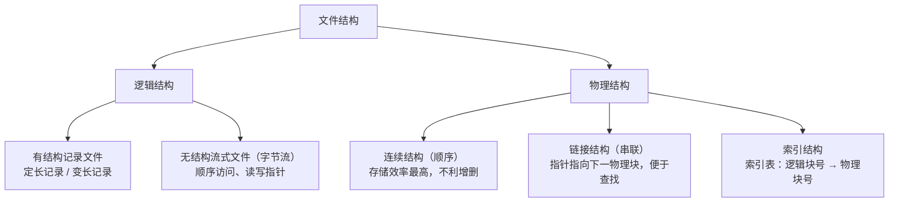
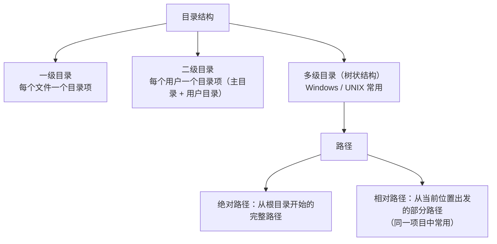
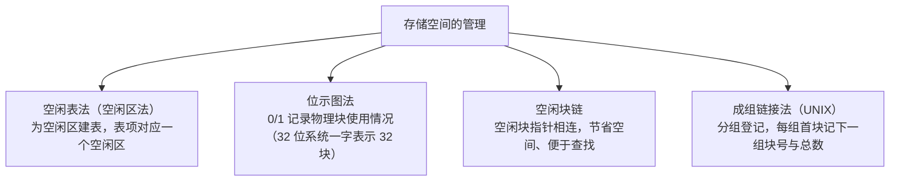
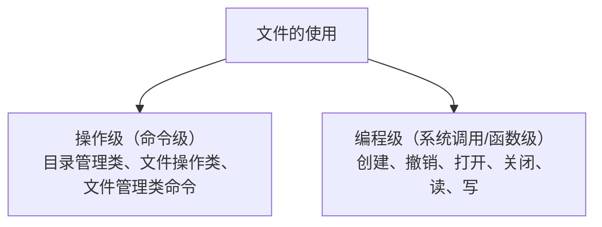
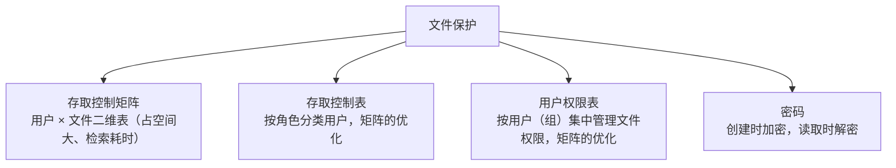
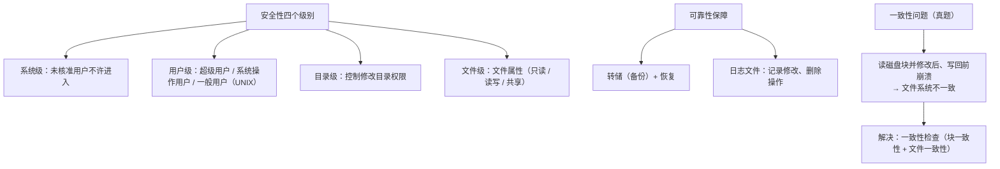
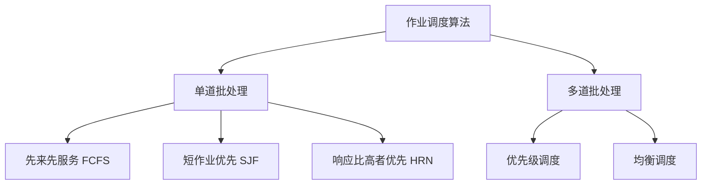
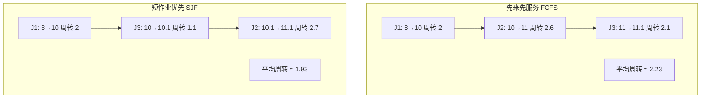

课程链接：视频《2.3 文件管理与作业管理》（软考程序员系列课程）

视频链接：

## 本节概述

本课是系列课程的第七节课，主题为"文件管理与作业管理"，对应教材 2.5 节「文件管理」和 2.6 节「作业管理」两部分内容。本节脉络依次是：文件与文件系统 → 文件的结构 → 文件的存取 → 存储空间的管理 → 文件的使用与保护 → 系统的安全性与可靠性 → 作业管理 → 作业调度算法与性能指标。

## 文件与文件系统

**什么是文件？** 文件是一种具有**符号名**、在逻辑上具有完整意义的一组**相关信息项**的集合。信息项是构成文件的原子结构，是文件的最基本单位。

文件包括**文件体**和**文件说明**两部分：文件体就是文件的内容；文件说明是为了管理文件所使用的信息，包括文件名、内部标识、文件的类型、存储的地址、文件的长度等信息。

**什么是文件系统？** 系统是文件的一个集合——文件是信息的集合，系统是文件的集合，对这个文件集合进行管理与控制，就构成了文件系统。文件系统的功能有六个：**按名存取**（这个要记）、统一用户接口、并发访问与控制、安全性的控制、优化性能、差错恢复。

**简单补充：文件的分类**。按**用途**分：系统文件、库文件、用户文件；按**保存期限**分：临时文件、档案文件、永久文件；按**保护方式**分：只读文件、读写文件、可执行文件和不保护文件。

## 文件的结构

文件的结构分为**逻辑结构**和**物理结构**。

**逻辑结构**是指文件在逻辑上的组织形式，有两种形式：**有结构的记录形式**和**无结构的流式文件**。有结构的记录文件由**一个以上的记录**构成，其信息是完整的；记录又分**定长记录**（文件记录的长度相同）和**变长记录**（文件记录的长度不同）。无结构流式文件就是文件体是一串**字节流**，通常采用顺序访问的方式，对流式文件的访问通常是利用**读写指针**指向下一个要访问的字符串。

**物理结构**是指文件内部的组织方式，即文件在物理存储设备上的存储方法，有**连续结构、链式结构和索引结构**：

| 物理结构 | 别称 | 特点 | 优缺点 |
|---|---|---|---|
| 连续结构 | 顺序结构 | 文件依次存放在连续编号的物理块上 | 存储效率最高；但不利于记录的增加与删除，查找与修改单个记录的性能差，文件较大时性能非常差 |
| 链接结构 | 串联结构 | 每个物理块设有一个指针，指向下一物理块 | 解决顺序存储的缺点，能通过指针方便地查找整个文件，便于查找 |
| 索引结构 | — | 为每个文件建立一张索引表，记录文件信息所在的逻辑块号对应的物理块号 | 便于直接存取 |

索引表是在文件创建时由系统**自动创建**的，根据文件大小的不同，索引表占用的物理块个数不等，一般占有几个物理块。**多个物理块的索引表**可采取两种组织方式：**链接文件方式**和**多重索引方式**。

## 文件目录

**文件控制块（FCB）**是文件目录的一种数据结构，它包含三类信息：
- **基本信息类**：文件名、文件的物理地址、文件的长度；
- **存取控制类**：文件存取的权限，如读、写和执行；
- **使用信息类**：建立的日期、最后一次修改的日期。

**文件的目录结构**包括一级目录、二级目录和多级目录：一级目录为每个文件分配一个目录项；二级目录为每个用户分配一个目录项（由用户目录和主文件目录构成）；**多级目录是一种树状结构**，通常用于 Windows 系统和 UNIX 系统。

谈到多级目录，就引申出**相对路径和绝对路径**（历年真题考过）。例如访问 C 盘下 Programme 目录下 QQ 目录里的 QQ.exe 文件：**绝对路径**是从根目录开始的完整路径（`C:\Programme\QQ\QQ.exe`）；**相对路径**是去掉前面一段路径后的部分（`QQ\QQ.exe`，从当前位置出发）。

> [!TIP] 通俗理解（视频比喻）
> 就像打电话：在九江本地直接拨 `835400` 就能通，这就是"相对路径"；在全国拨要加区号 `0792`，在国际上拨还要加国际冠码 `86`，`86 + 0792 + 835400` 整个号码就是"绝对路径"。在同一个项目当中，相对路径用得比较多。

## 文件的存取方式

文件常用的存取方式有：**顺序存取法**——严格按物理记录顺序进行存取；**直接存取法**——随意存取任意物理记录，这常用于流式文件；**按键存储法**——也即按内容存储，按文件的某个关键内容（关键字）进行存取。

> [!NOTE]
> 视频在这里把文件系统与数据库系统做了对比：文件系统是**早于**数据库系统出现的，文件系统对文件进行管理，数据库系统专门对数据进行管理；近年数据库系统有向"分散化、分布化（以中心为节点逐步分散）"发展的趋势，文件存储又占了主流。文件系统里的按键存储方式，比较类似数据库中的**主键**——以某个文件内容进行存储。

## 存储空间的管理

存储空间的管理常用的方法有：**空闲表法（空闲区法）、位视图（位示图）法、空闲块链法和成组链接法**。

**空闲区法**：在外存空间分配一个连续未分配的区域，称为空闲区；为每个空闲区建立一张空闲表，每个表项对应一个空闲区（记录起始空闲块号和空闲块数）。

**位视图（位示图）法**：在外存上建立一张位示图，记录文件存储器的使用情况。在 32 位系统中，文件存储器的第 0~31 块物理块用一个字表示，第 32~63 块用第二个字表示，以此类推。位示图中某位为 0 表示对应块空闲、为 1 表示已占用。

| 空闲表表项 | 起始空闲块号 | 空闲块数 | 状态 |
|---|---|---|---|
| 项目 1 | 18 | 5 | 可用 |
| 项目 2 | 29 | 8 | 未用 |

> [!TIP] 例题（真题风格）
> 有 120G 的硬盘，物理块号是 4M（每块 4M 字节），问位示图的大小是多少？计算：120G × 1024 ÷ 4M ÷ 8 字节 = **3840 字节**（120G 换算成 MB 再除以每块大小得物理块总数，除以 8 得需要的字节数）。

**空闲块链法**：空闲物理块设有指向下一空闲物理块的指针，其优点是**节省空间**且**便于查找**。

**成组链接法**：在 UNIX 系统中将空闲块分为若干组（如 100 个空闲块为一组），每个组的第一个空闲块登记下一组物理块号和空闲块的总数；假如某一组的第一个空闲块号等于 0，就意味着该组为最后一组、无下一组空闲块。

## 文件的使用与保护

**文件的使用**。多用户环境下，操作系统为文件建立和维护文件的访问权限信息，它将文件使用分为**操作级**和**编程级**：操作级又称**命令级**，向用户提供命令（目录管理类命令、文件操作类命令、文件管理类命令）；编程级又称**系统调用和函数级**，向用户提供系统调用——常用的系统调用包括：创建、撤销、打开、关闭、读、写等。

**文件的共享**是指不同用户进程使用同一个文件，通常通过**索引节点法**和**符号链接法**来共享文件。**符号链接**是通过建立新的文件或目录与原文件或目录的**路径**进行映射；访问符号链接时，系统通过映射找到源文件的路径并访问它。采用符号链接的优点是**可以跨越文件系统**——只需提供文件所在地址和路径，就可以通过网络连接到世界上任何一台机器中的文件；缺点是其他用户读取符号链接的共享文件，**比读取硬链接（索引节点）的共享文件要增加读写磁盘的操作次数**。

**文件的保护**有四种方式：**存取控制矩阵、存取控制表、用户权限表和密码**。

- **存取控制矩阵**：一张行（用户）× 列（文件）的二维表，表中标明每个用户对每个文件的操作权限（如系统管理员对某文件可读可写但不能修改，文件库管理员可读写、修改和删除）。缺点：需要占用**大量的存储空间**，检索过程会浪费大量系统时间。
- **存取控制表**：对存取控制矩阵的优化——先按对文件访问权利的差别对用户进行分类（如系统管理员、数据库管理员等"角色"），再把具体用户划分到这些角色中，针对每个文件按角色授予权限。
- **用户权限表**：以用户或用户组为单位，将用户的文件集中存放成表，表目表示用户对文件存取的权限；这也是对存取控制矩阵的优化。
- **密码**：在文件创建时为用户提供一个密码，用该密码对文件内容加密，读取时再对文件进行解密，从而控制用户的读取和修改。

## 系统的安全性与可靠性

系统的安全性与可靠性可以分为四级：**系统级、用户级、目录级和文件级**。
- **系统级**：控制未核准的用户不允许进入系统；
- **用户级**：对用户进行分类，如超级用户、系统操作用户和一般用户（这是 UNIX 里的分类；视频多次提到 UNIX 系统，要注意 UNIX 系统的考察点）；
- **目录级**：控制用户修改目录的权限；
- **文件级**：通过系统管理员或文件主对文件属性的设置来控制用户对文件的访问，通常设置只读、读写、共享等属性。

**文件系统的可靠性**通过**转储（备份）和恢复**来保障：将文件备份起来；通过**日志文件**记录对文件修改和删除的操作，一旦发生故障，通过副本（备份）进行恢复。

**文件系统的一致性**：在读取某磁盘块并修改后、再将信息写回磁盘前，如果系统崩溃，文件系统可能会出现**不一致**的现象（这个**考过历年真题**）。通常的解决方法是采取**一致性检查**——文件一致性的检查包括**块一致性检查**和**文件一致性检查**。

> [!WARNING] 真题考点
> "在读取某磁盘块并修改后，再将信息写回到磁盘前系统崩溃，文件系统可能会出现不一致的现象"——这句是历年真题原文级考点，务必记住。

## 作业管理

**什么是作业？** 系统为完成用户的计算任务所做工作的总和，它包括**程序、数据**和**作业说明书**。作业说明书又包括：**作业的基本情况**（用户名、作业名、编程语言、最大处理时间）、**作业的控制**（作业控制的方式、作业操作的顺序、作业执行出错的处理）、**作业的资源**（处理时间、优先级、存储空间、外设类型和数量、使用程序等）。

**作业的状态**包括四个：**提交、后备、执行和完成**。
- **提交状态**：作业提交给计算机中心、通过输入设备送入计算机系统的过程（进行作业录入）；
- **后备状态**：通过 **SPOOLing（假脱机）** 系统将作业输入到计算机后备存储器中，随时等待作业调度进行调度（这里提到了作业的调度）；
- **执行状态**：作业被作业调度程序选中、为其分配必要的资源并创建相应的进程后进入执行状态；作业的执行又包括**运行、就绪和等待**三种状态；
- **完成状态**：当作业正常结束或异常终止时进入完成状态；调度程序对作业进行善后处理——撤销作业控制块、收回作业所占用的系统资源、将作业执行结果形成输出文件放入输出井中，由 SPOOLing 系统控制输出。

**作业控制块（JCB）**：记录与该作业有关的各种信息的登记表，包括用户名、作业名、状态标记等信息。**作业后备队列**：由于输入井中有多个后备作业，为方便作业调度程序调度，通常把作业控制块排成一个或多个队列，这种队列称为作业后备队列（由若干个 JCB 组成）。

## 作业调度的算法

**作业调度算法应考虑三个因素**：均衡地使用系统资源；平衡系统和用户的要求；缩短作业的平均周转时间。

作业调度算法**分为单道批处理和多道批处理**：单道批处理包括**先来先服务、短作业优先、响应比高者优先**；多道批处理包括**优先级调度和均衡调度**。

**响应比高者优先**：响应比 = 作业响应时间 ÷ 作业执行时间，也可写成 **1 + 作业等待时间 ÷ 作业执行时间**。这个公式要记。

**优先级调度**：是为了照顾时间要求紧迫的作业、或照顾 I/O 繁忙的作业以充分发挥外设的效率；在不兼顾分时操作和批量处理的系统中（视频口误"或在一个兼顾..."，教材口径为兼顾分时与批处理、照顾终端会话型作业以获得合理响应时间），需要采用基于优先级的调度策略——优先级高的作业先调度。

**均衡调度**：根据系统运行情况和作业本身的特性对作业进行分类，作业调度轮流从这些不同类别的作业中挑选作业执行，力求均衡地使用系统的各种资源。

## 作业调度的性能指标

**平均周转时间**：各作业（完成时间 − 提交时间）的差值的和，再除以作业个数。**平均周转系数（带权周转时间）**：每个作业的周转时间再除以它自己的执行时间，把所有值加起来除以作业个数——引入周转系数是因为作业的执行时间不能直观地衡量系统性能，它能更直观地展现系统性能。

> [!NOTE] 公式
> - 周转时间 T = 完成时间 − 提交时间
> - 平均周转时间 = Σ(完成时间 − 提交时间) ÷ 作业数
> - 平均周转系数 = Σ[（完成时间 − 提交时间）÷ 执行时间] ÷ 作业数

**例题（视频完整演算，真题风格）**：J1 提交时间 8、运行时间 2；J2 提交时间 8.4、运行时间 1；J3 提交时间 9.0、运行时间 0.1。

**先来先服务（FCFS）**：按提交顺序 J1 → J2 → J3。
- J1：结束 10，周转 10−8 = 2
- J2：结束 11，周转 11−8.4 = 2.6
- J3：结束 11.1，周转 11.1−9.0 = 2.1
- 平均周转时间 = (2 + 2.6 + 2.1) ÷ 3 ≈ **2.23**

**短作业优先（SJF）**：J1 先到先运行（运行 2），然后选运行时间最短的 J3（0.1），最后 J2。
- J1：周转 2（同上）
- J3：结束 10.1，周转 10.1−9.0 = 1.1
- J2：结束 11.1，周转 11.1−8.4 = 2.7
- 平均周转时间 = (2 + 1.1 + 2.7) ÷ 3 ≈ **1.93**

**结论**：最短作业优先（SJF）算法的平均周转时间**最小**，先来先服务（FCFS）的周转时间**较大**，响应比高者优先（HRN）居中。作业的平均周转时间越短，意味着作业在系统中停留的时间越短，系统的利用率也就越高——这就是系统的性能指标。

## 本节小结

① **文件与文件系统**：文件 = 具有符号名的相关信息项的集合（文件体 + 文件说明）；文件系统 = 对文件集合进行管理与控制的集合，功能之首是**按名存取**。文件按用途/保存期限/保护方式各有分类。

② **文件结构**：逻辑结构分有结构记录文件（定长/变长）与无结构流式文件（字节流、顺序访问）；物理结构分连续结构（存储效率最高，不利增删）、链接结构（指针串联、便于查找）、索引结构（索引表记录逻辑块号→物理块号，多物理块索引可采用链接或多重索引）。

③ **目录与路径**：FCB 含基本信息、存取控制、使用信息三类；目录分一级（每文件一项）、二级（每用户一项）、多级（树状，Windows/UNIX）。**相对路径 vs 绝对路径是真题**（相对：从当前位置；绝对：从根目录；同一法就像本地直拨与加区号/国际冠码）。

④ **存储空间管理**：空闲表法、位示图法（一字 32 块，**120G/4M/8 字节=3840 字节**）、空闲块链（省空间便查找）、成组链接（UNIX，组首块登记下一组）。存取方式：顺序、直接（流式常用）、按键（按内容，类似数据库主键）。

⑤ **使用与保护**：操作级（命令）/编程级（系统调用：创建、撤销、打开、关闭、读、写）；共享靠索引节点法和符号链接（符号链接可跨文件系统但读写开销大）；保护四种：存取控制矩阵（占空间大）、存取控制表（按角色分类）、用户权限表（按用户组）、密码（加密解密）。

⑥ **安全与可靠性**：四个级别——系统级、用户级（UNIX 分超级/操作/一般）、目录级、文件级；可靠性靠转储（备份）+日志文件；**一致性（真题）**：读磁盘块修改后、写回前崩溃会导致不一致，用一致性检查（块一致性 + 文件一致性）解决。

⑦ **作业管理**：作业 = 程序 + 数据 + 作业说明书（基本情况/作业控制/作业资源）；状态四态：提交 → 后备（SPOOLing）→ 执行（运行/就绪/等待）→ 完成（善后处理，结果进输出井）；JCB 组织成作业后备队列。调度算法：单道（先来先服务、短作业优先、响应比高者优先，响应比 = 1 + 等待时间/执行时间）、多道（优先级调度、均衡调度）；**短作业优先平均周转时间最小**，平均周转时间越短系统利用率越高。