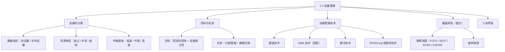
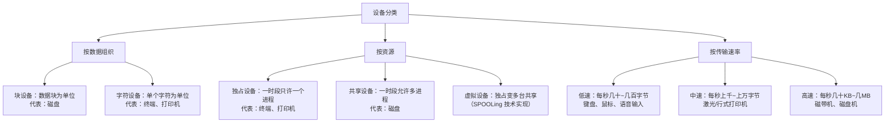
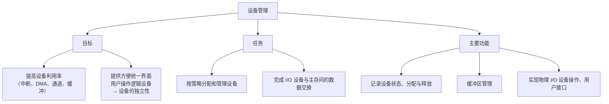
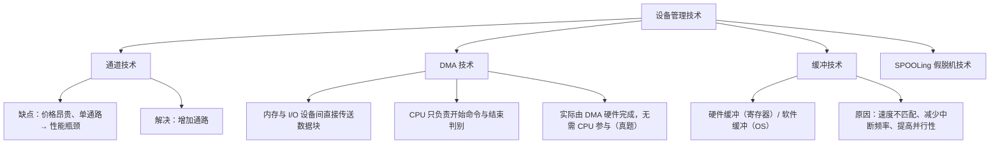
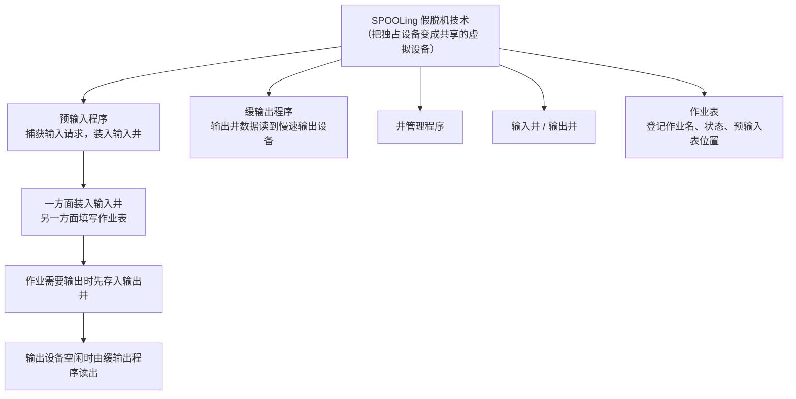
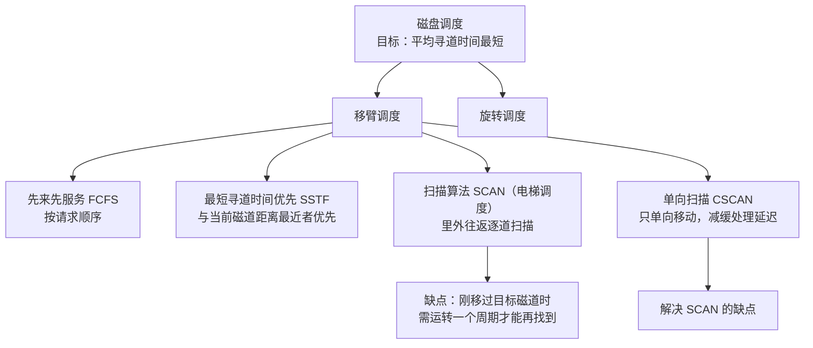
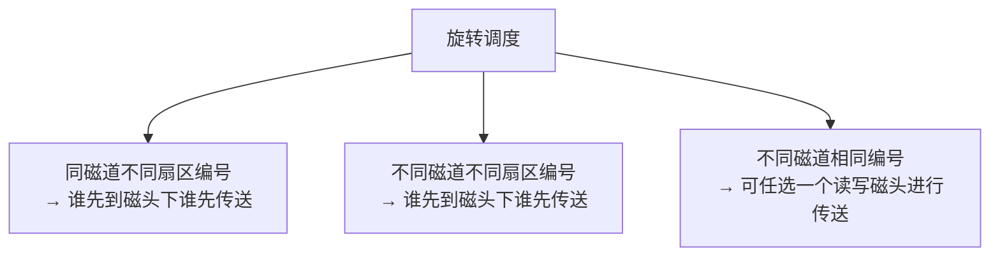
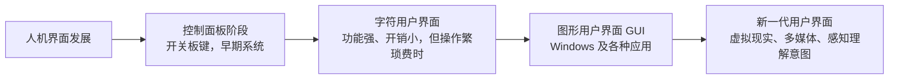

课程链接：视频《2.4 设备管理》（软考程序员系列课程）

视频链接：

## 本节概述

本课是系列课程的第八节课，讲解第二章的最后一个内容——**设备管理**。设备管理是操作系统中最为繁杂且与硬件设备密切相关的部分：它不但要管理实际的 I/O 操作设备（磁盘机、扫描仪、打印机、键盘、鼠标等），还要管理设备控制器、DMA 控制器、中断控制器、I/O 处理机等支持设备。本节脉络依次是：设备的分类 → 设备管理的目标与任务 → 设备管理技术（通道、DMA、缓冲、SPOOLing）→ 磁盘调度 → 人机界面。

## 设备的分类

设备按照**数据组织**上分，可以分为**块设备和字符设备**：块设备是以**数据块**为单位进行组织和传输数据信息的设备，代表有磁盘；字符设备是以**单个字符**为单位传输数据信息的设备，代表有终端和打印机。

按照**资源**上来分，可以分为**独占设备、共享设备和虚拟设备**：
- **独占设备**：一个时间段以内只允许一个进程或一个用户访问的设备，代表有终端和打印机；
- **共享设备**：一个时间内允许多个进程访问的设备，代表有磁盘；
- **虚拟设备**：将一台独占设备变成若干台（多个用户或进程共享）的设备，这种可以使用**假脱机（SPOOLing）技术**来实现。

按照**数据传输速率**上来分，可以分为：
- **低速设备**：每秒几十到几百字节的传输速率，代表有键盘、鼠标和语音输入设备；
- **中速设备**：每秒上千到上十千字节的传输速率，代表有激光打印机、行式打印机；
- **高速设备**：每秒几千 KB 到几兆字节的，常用的是磁带机和磁盘机。

## 设备管理的目标与任务

设备管理的**目标**有两个：第一个是**提高设备的利用率**——所采用的技术有**中断技术、DMA 技术、通道技术和缓冲技术**等；第二个是**为用户提供方便统一的界面**——用户操作的是**逻辑设备**，具体的物理设备的操作由操作系统来实现，这又称**设备的独立性**。

设备管理的**任务**有两类：一类是**按策略来分配和管理设备**；另一类是**完成 I/O 设备与主存（设备）之间的数据交换**。

设备管理的**主要功能**有：动态地掌握和记录设备的状态；设备分配与释放；缓冲区的管理；实现物理 I/O 设备的操作；提供设备使用的用户接口和设备访问与控制。

## 设备管理技术：通道、DMA 与缓冲

**通道技术**：它的缺点是**价格昂贵**，而且一条通道内主存与设备之间**只有一个通路**，这样容易造成**性能瓶颈**；解决性能瓶颈的一个方法就是**增加通路**。

**DMA 技术**（直接存储器存取）：内存与 I/O 设备之间**直接通过数据块传送**。即在内存与输入输出设备间传送一个数据块的过程中，只需要 CPU 在开始的时候发出传送一块数据块的命令、与结束时通过 CPU 的轮询与中断得知是否结束以及下次操作是否准备就绪；实际上数据传送操作是通过 **DMA 硬件**来直接完成，**无需 CPU 的参与**，这叫做 DMA 技术。

> [!WARNING] 真题考点
> DMA 技术历年考试考过：数据传送中实际参与的是 **DMA 硬件**、**无需 CPU 参与**。这条务必牢记。

**缓冲技术**包括**硬件缓冲**和**软件缓冲**：硬件缓冲是通过硬件寄存器（寄存器）实现的缓冲；软件缓冲是通过操作系统实现的缓冲。引入缓冲技术的原因有三点：①因为 **CPU 与存储设备之间的速度不匹配**（前面章节也讲过）；②**减少 CPU 的中断频率**；③**提高 CPU 与存储设备之间的并行性**。

## 设备管理技术：SPOOLing（假脱机）

**SPOOLing 技术**（假脱机）包括**预输入程序、缓（缓输出）输入程序、井管理程序、输入输出井和作业表**。它的工作过程是：最初启动**预输入程序**捕获输入请求，一旦得到输入请求，就立即执行，将其装入到**输入井**中；一方面装入输入井，另一方面**填写作业表**；当作业需要输出设备时，可先将数据存放在**输出井**中，等到输出设备空闲时，由缓输出程序把硬盘（磁盘）上输出井的数据读到慢速输出设备上。

**作业表**是用来登记系统中所有作业的作业名、状态和预输入表位置等信息。输入井中的作业也有四种状态，跟作业管理讲的一模一样：**输入状态、收容状态、执行状态和完成状态**。

## 磁盘调度

磁盘调度**比较重要**。磁盘调度的**目标**需要记住：**平均寻道时间最短**。

磁盘调度包括两个过程：**移臂调度**过程和**旋转调度**过程。

### 移臂调度

移臂调度有四种算法：

| 算法 | 别称 | 思想 | 缺点 |
|---|---|---|---|
| 先来先服务（FCFS） | — | 按请求到来的顺序进行调度 | 最简单；平均寻道时间一般不理想 |
| 最短寻道时间优先（SSTF） | — | 要求访问的磁道与当前磁道距离最近者优先 | 可能使远处磁道长时间等待（饥饿） |
| 扫描算法（SCAN） | 电梯调度 | 磁头从里到外逐一扫描（选择距离磁头最近的磁道），到最外面磁道后调换方向，再由外向内逐一扫描 | 磁头刚移过正要访问的磁道时，需要运转一个周期才能再找到它，违背"平均寻道时间最短" |
| 单向扫描算法（CSCAN） | C-SCAN | 磁头单向移动（如只从里向外），找到就继续单向移动 | 有效地减缓了这种处理的延迟 |

**扫描算法（SCAN）**又被称为**电梯调度**——因为它的运行方式像电梯：从里向外、从外向里逐层（逐道）扫描。它有缺点：当磁头刚刚移过正要运行的磁道时（磁头在运转过程中正好移过了这个磁道），它需要移到最外面一个磁道、再返回来才能找到这个磁道，也就是说需要**运转一个周期**才能找到该磁道，这违反了平均寻道时间最短的要求。

**单向扫描算法（CSCAN）**正是为了解决 SCAN 的这个缺点：磁头**单向**移动（从里向外），如果没有找到就继续从里向外移动，只做单向移动。这样有一个好处：能够**减缓这种处理的延迟**。

### 旋转调度

旋转调度讲的是进程请求访问**同一磁道的不同扇区编号**、**不同磁道的不同扇区编号**以及**不同磁道的相同扇区编号**的几种情况。其中前两种（同磁道不同编号、不同磁道不同编号）的扇区访问时，旋转调度总是让**首先达到读写磁头位置下的扇区**进行传送操作——也就是谁先到磁头下谁先传送；而对于**不同磁道、相同编号**的访问（记住是相同编号），则可**任选一个读写磁头**位置下的扇区进行传送操作。

> [!WARNING] 真题考点
> 需要记住的点是磁盘调度的**目标**（平均寻道时间最短）以及**扫描算法（SCAN）**和**单向扫描算法（CSCAN）**，历年考试考过真题。

## 人机界面

**人机界面**（又称**用户界面**）不属于设备管理的内容，它属于**系统设计**的内容——是计算机中实现用户与计算机通信的**硬件和软件的总称**。它的硬件部分包括用户向计算机输入数据和命令的装置，以及由计算机输出供用户观察和处理的输出装置（也就是 I/O 装置）；软件方面还包括用户与计算机相互通信的协议、约定、操作命令和处理软件等。

**人机界面的发展过程**包括四个阶段：

| 阶段 | 特点 |
|---|---|
| 控制面板阶段 | 通过控制开关、板键查看运行情况，用于早期系统 |
| 字符用户界面（命令行） | 通过输入字符在显示器或打印机上显示运行情况；优点：功能灵活、功能强大、开销小；缺点：操作繁琐、操作费时 |
| 图形用户界面（GUI） | 包括现在的 Windows 系统以及在系统上使用的系统软件和应用软件 |
| 新一代用户界面 | 包括虚拟现实技术、多媒体技术，以及通过感知来理解用户意图、实现用户要求的方法 |

**人机界面的设计原则**：操作简单、界面美观、交互便捷、用语通俗——这些都是为了让用户的**学习成本**达到最低，使**维护成本**降到最低。

## 本节小结

① **设备分类**：按数据组织分块设备（数据块，磁盘）与字符设备（单个字符，终端、打印机）；按资源分独占（终端、打印机）、共享（磁盘）、虚拟（SPOOLing 把独占变共享）；按速率分低速（键盘、鼠标）、中速（打印机）、高速（磁带机、磁盘机）。

② **目标与任务**：目标 = 提高设备利用率（中断、DMA、通道、缓冲）+ 方便统一界面（**设备的独立性**：用户操作逻辑设备，物理设备由 OS 控制）；任务 = 按策略分配管理设备 + 完成 I/O 设备与主存间的数据交换。

③ **管理技术**：通道技术价格昂贵、单通路造成瓶颈（增加通路解决）；**DMA 技术由 DMA 硬件完成数据块传送、无需 CPU 参与（真题）**；缓冲技术分硬件（寄存器）与软件（OS），用于解决速度不匹配、减少中断频率、提高并行性；SPOOLing 由预输入程序、缓输出程序、井管理程序、输入输出井、作业表构成，作业四态与作业管理一致。

④ **磁盘调度（重点）**：目标 = **平均寻道时间最短**；移臂调度四种算法——FCFS、SSTF（距离最近优先）、SCAN（电梯调度，刚移过目标磁道需运转一周是缺点）、CSCAN（单向移动，减缓延迟）；旋转调度：同一/不同磁道不同编号谁先到磁头下谁先传送，不同磁道相同编号可任选一个磁头。**SCAN 与 CSCAN 是真题**。

⑤ **人机界面**：属于系统设计而非设备管理；发展四阶段——控制面板 → 字符界面（功能强开销小、操作繁琐费时）→ 图形界面（Windows）→ 新一代（虚拟现实、多媒体、感知理解）；设计原则 = 操作简单、界面美观、交互便捷、用语通俗（学习成本与维护成本最低）。