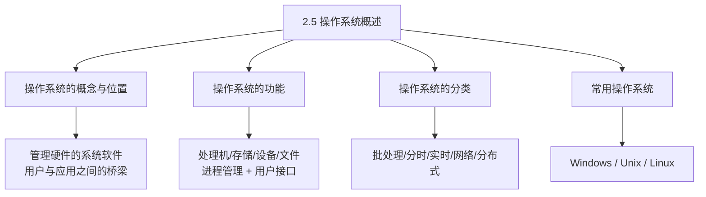
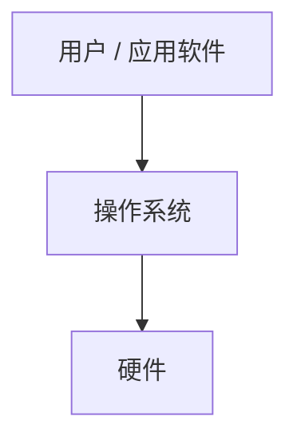
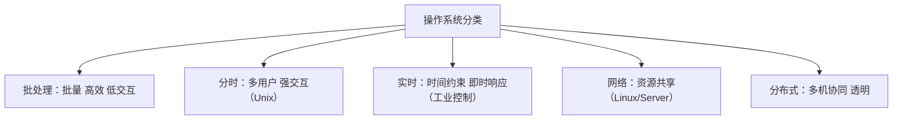

课程链接：视频《2.5 操作系统概述》（软考程序员系列课程）

视频链接：

## 本节概述

本节是系列课程的第三十三节课，补全**第二章 操作系统基础知识**的总述部分。前面的课程已经分模块看了进程管理、存储管理、文件与作业、设备管理，本节从整体角度认识操作系统：操作系统是什么、有哪些功能、分为哪几类、常用操作系统有哪些。本节脉络依次是：操作系统的概念与位置 → 操作系统的功能 → 操作系统的分类 → 常用操作系统简介。

先看一张本节的知识地图，把整节内容装进脑子里：

## 操作系统的概念与位置

**操作系统（Operating System，OS）** 是**管理计算机系统硬件和软件资源的系统软件**，是计算机系统中最基本的系统软件。

它在系统层次中的位置：**硬件之上、其他软件（应用软件/其他系统软件）之下**，充当**用户与计算机硬件之间的接口（桥梁）**。

- **向下**：管理、控制硬件资源。
- **向上**：为应用软件和用户提供**接口（系统调用）**，方便用户使用计算机。

> [!TIP] 通俗理解
> 操作系统就像"大厦物业"：硬件是"水电气管道"，应用软件是"住户"。物业（操作系统）统一管理水电分配，住户（应用）不用自己跟管道打交道，只管通过物业享受服务。

## 操作系统的功能

操作系统的主要功能（从资源管理的角度，五大功能）：

| 功能 | 作用 |
|---|---|
| **处理机管理（进程管理）** | 管理 CPU，负责**进程**的创建、调度、同步、死锁处理 |
| **存储管理** | 管理内存，负责**内存分配、回收、地址映射、虚存** |
| **设备管理** | 管理 I/O 设备，负责**设备分配、驱动、磁盘调度** |
| **文件管理** | 管理外存文件，负责**文件的组织、存取、共享与保护** |
| **用户接口（作业管理）** | 向用户提供**命令接口、程序接口（系统调用）、图形界面** |

> [!WARNING] 真题考点
> 操作系统的五大功能常考：**处理机、存储器、设备、文件、作业（用户接口）管理**。前面各节正是这五大功能的展开，可前后呼应记忆。

## 操作系统的分类

按使用方式和实时性，操作系统主要分为：

| 类型 | 特点 | 代表 |
|---|---|---|
| **批处理操作系统** | 成批处理作业，**效率高但交互性差** | 大型机传统系统 |
| **分时操作系统** | **多个用户分时共享 CPU**，有较强**交互性** | Unix |
| **实时操作系统** | 响应**时间强约束**，能及时处理外部事件 | 工业控制、嵌入式、航空 |
| **网络操作系统** | 支持**网络资源共享与通信** | Unix/Linux/Windows Server |
| **分布式操作系统** | 多台计算机**协同工作**，对用户透明 | 分布式系统 |

- **分时系统追求**：**交互性、及时响应**。
- **实时系统追求**：**实时性（在规定时间内必须响应）**。
- **批处理系统追求**：**系统吞吐量（效率）**。

> [!WARNING] 真题考点
> 分类常考：**分时=多用户共享交互强；实时=响应时间有硬约束、用于控制领域（导弹/工业/嵌入）；批处理=批量高效低交互；网络=资源共享**。判断某系统属于哪类是常见选择题。

## 常用操作系统

- **Windows 系列**：最流行的**个人桌面系统**，图形界面友好。
- **Unix**：**多用户、多任务、分时**操作系统，稳定，广泛用于服务器。
- **Linux**：**开放源代码**的类 Unix 操作系统，广泛用于服务器、嵌入式，自由免费。

> [!NOTE]
> 常用系统了解即可：**Windows 桌面、Unix/Linux 服务器**。Linux 开源免费，是服务器和嵌入式的主流。

## 本节小结

① **概念与位置**：操作系统是**管理计算机软硬件资源的基本系统软件**，位于**硬件之上、软件之下**，是**用户与硬件的接口（桥梁）**。

② **五大功能**：**处理机（进程）管理、存储管理、设备管理、文件管理、作业管理（用户接口）**——即后续各节内容的统摄框架。

③ **分类**：**批处理（批量高效低交互）、分时（多用户强交互，Unix）、实时（时间硬约束，工业/嵌入式控制）、网络（资源共享）、分布式（多机协同透明）**。

④ **常用系统**：**Windows 个人桌面、Unix/Linux 服务器（Linux 开源免费）**。