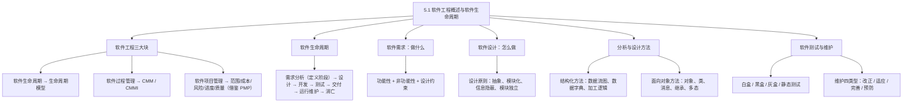
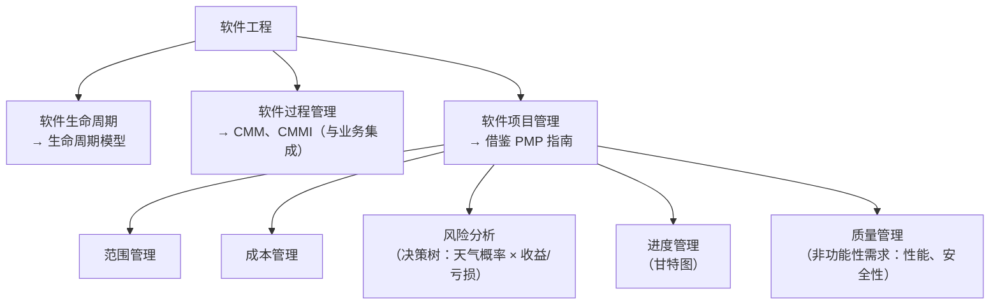
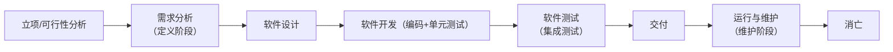
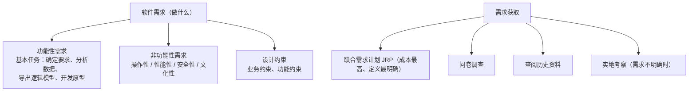
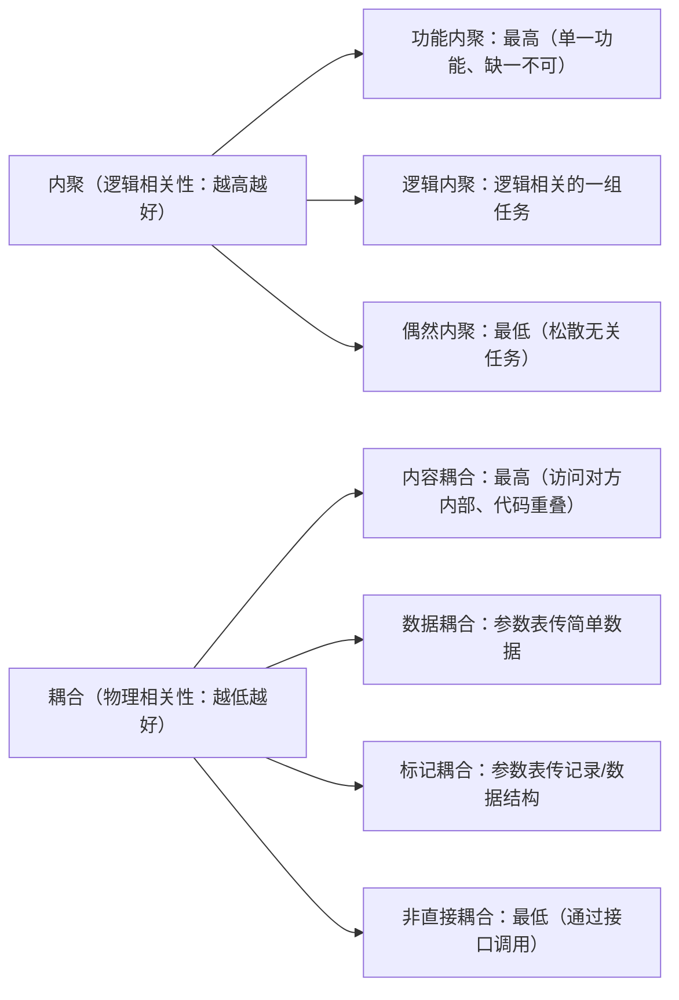
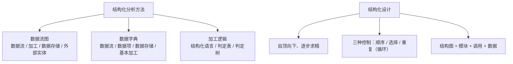
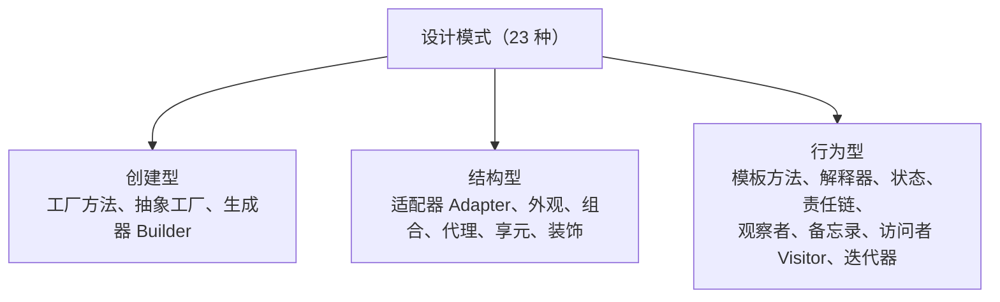
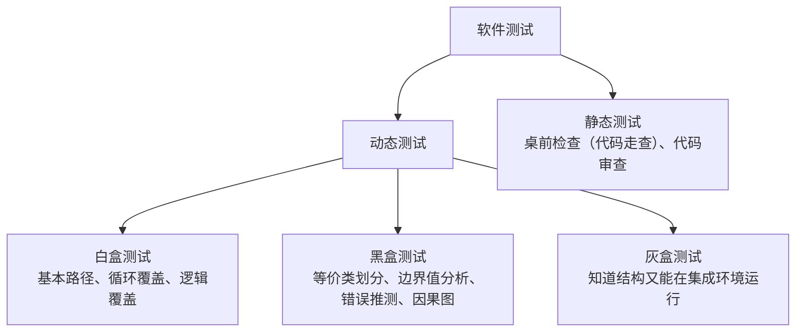
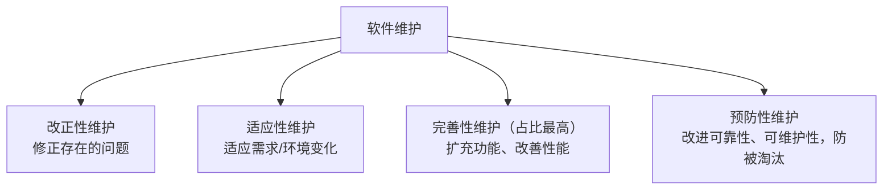

课程链接：视频《5.1 软件生命周期与软件工程概述》（软考程序员系列课程）

视频链接：

## 本节概述

本课是系列课程的第十五节课，开始进入软件工程这一章节。今天讲两点内容：**软件工程的概述**和**软件的生命周期**。软件工程体系庞大，衔接软考高级的"系统规划设计师"考试；本课脉络依次是：软件工程三块内容 → 软件生命周期各阶段 → 软件需求（做什么）→ 软件设计（怎么做）→ 分析与设计方法（结构化 / 面向对象）→ 软件测试 → 软件的运行与维护。

## 软件工程概述

软件最早是发展在工程学后面的，软件系统的管理借助了**工程学**的理念，于是被命名为**软件工程**。

软件工程可以分**三块内容**来讲解：

| 内容 | 对应 |
|---|---|
| 软件的生命周期 | 对应**软件生命周期模型** |
| 软件的过程管理 | 对应**过程成熟度模型（CMM）**、**过程成熟度集成模型（CMMI）**及管理工具 |
| 软件的项目管理 | 分为范围管理、成本管理、风险分析、进度管理和质量管理 |

**软件过程管理**：人们在经过生命周期模型进行软件/信息系统规划以后，发现还无法真正对信息系统进行过程化的管理。所谓**过程**，是对软件生产过程中**每一个活动进行规划和管理**。由此诞生了 **CMM（软件过程成熟度模型）**和 **CMMI（软件过程成熟度集成模型）**——集成模型是在 CMM 的基础上诞生的，它与业务相集成。这种认证国内不多、国外比较流行。

**软件项目管理**（在国内有软考考试，如中级的系统集成项目管理师、高级的信息系统项目管理师）借鉴了美国的 **PMBOK（PMP 项目管理指南）**，这本书每四年更新一次，针对几大知识域进行管理：**范围管理、成本管理、风险管理、进度管理和质量管理**。

> [!NOTE]
> 范围管理强调"只做范围内的事、不要做范围外的事"——做范围外的事会导致**需求蔓延**，需求的蔓延会导致**成本增加**，成本增加又是一种**风险**，这些是相互影响的。风险分析可以用**决策树**：如天气好（概率 56%）盈利 10 元、天气不好（概率 44%）亏损 5 元，决策值为它们加权相加。成本分析可按代码行数等计算。

## 软件的生命周期

软件生命周期包括：**需求分析（立项、可行性分析、需求调研）→ 软件设计 → 软件开发 → 软件测试 → 交付 → 运行与维护 → 消亡**。各阶段的界限不是那么明朗（在某些开发模型中更不明显）。

阶段划分与性质：
- **需求分析**比较明确，是软件的**定义阶段**；
- 软件的**设计和测试阶段**统称为软件的**开发阶段**；
- 软件的**运行与维护阶段**称为软件的**维护阶段**。

> [!NOTE]
> 运行与维护阶段也有软件测试：例如进行**改正性维护**（修正需求/代码错误）时，要对代码重新编译，重新编译后的代码要经过**回归测试**来测试其正确性。

**需求分析**的活动：问题定义、可行性分析（是否可行）、需求调研。**软件设计**包括：**总体设计**（对架构的设计）与**详细设计**（具体到数据存储的位置、业务怎么开展等）。**软件测试**分两部分：**编码和单元测试**（程序员在编程过程中自测）；**综合性测试（集成测试）**——打包给用户测试、在开发现场测试或在用户的正式环境中测试，例如 **Beta（β）测试**（把 β 版本发放给用户测试）和 **Alpha（α）测试**（开发人员组织用户到现场测试）。

**软件维护**要注意几个部分：**改正性维护**（软件存在的错误非改不可）、**适应性维护**（软件为了适应用户需求的变化而进行的维护）、**完善性维护**、**预防性维护**——注意它们的区别。

## 软件需求（解决"做什么"的问题）

**软件需求**解决**做什么**的问题，它包括**功能性的需求、非功能性的需求和设计约束**。

**功能性需求**（基本任务）：确定综合的要求、分析数据的要求、导出逻辑模型、修正开发模型、开发原型系统等。

**非功能性需求**（要记一下包括哪些）：**操作性**的需求、**性能性**的需求、**安全性**的需求和**文化性**的需求。

**设计约束**：主要是一些业务上的约束或功能上的约束。

**需求的获取手段**：
- **联合需求计划（JRP）**：用户方和开发方的关键人物一起召开会议，专门讨论并将需求明确地定义下来——它**消耗的成本最高，定义的需求也最为明确**；
- **问卷调查**：向需求方进行开放性问题调查；
- **查阅资料**：查阅以前开发的一些历史资料；
- **实地考察**：在需求不明确的情况下，开发人员进行实地考察。

**需求的分析方法**：面向数据流的分析方法、面向数据结构的分析方法和面向对象的分析方法。

## 软件设计（解决"怎么做"的问题）

软件设计任务包括**概要设计**和**详细设计**：
- **概要设计**：软件的总体结构设计、数据结构与数据库的设计、编写概要设计文档；
- **详细设计**：算法设计、数据结构设计和其他设计，编写详细设计说明书，还包括**代码设计、I/O 设计和用户界面设计**；概要设计和详细设计都要进行**评审**。

**用户界面设计原则**：简单、易用、学习成本低、满足业务需求。

**软件设计的原则**：**抽象、模块化、信息隐蔽、模块独立**（主要记忆这几个）。模块独立包括**高内聚、低耦合**和复杂度三块内容。

**模块化**的要求：保持模块大小适中；尽可能减少调用的深度；模块之间**多扇入、少扇出**；单入口单出口；模块的作用域应该在模块之内；功能应该是可预测的。

> [!NOTE] 扇入/扇出、深度
> **扇入**指模块的**上层模块**的个数较多；**扇出**指其直属**下层模块**的个数较少——所以叫"多扇入、少扇出"（上层多、下层少）。**深度**是指结构图所能控制的层数（模块的层次）。

### 内聚与耦合

**内聚**是模块与模块之间**逻辑相关性**——要求必须很高；**耦合**是模块与模块之间**结构（物理结构）相关性**——要求比较低，这样的架构才合理。

**内聚的程度**（从高到低的对比考点）：**功能内聚**程度最高——完成某一单一功能，各部分协同工作、缺一不可；**偶然性内聚**程度最低——完成一组没有关系或松散关系的任务；**逻辑内聚**——完成逻辑上相关的一组任务。考试可能考内聚程度的比较（两头要记住：功能内聚最高、偶然内聚最低）。

**耦合的程度**（从高到低）：**内容耦合**程度最高——一个模块直接访问另一个模块的内部数据、不通过正常入口转到另一模块内部、两个模块有部分代码重叠、一个模块有多个入口（物理结构重叠），要进行**解耦**使其降低；**非直接耦合**程度最低——两个模块之间没有直接关系，联系完全通过**接口**的控制和调用实现（业务调用接口，接口去实现，这是耦合程度最低的）；还有**数据耦合**（借助参数表传递简单数据）和**标记耦合**（通过参数表传递记录信息或数据结构）。

## 分析与设计方法

### 结构化分析与设计方法

**结构化分析**包括**数据流图、数据字典**和**加工逻辑**（下午考试可能会考一道数据流图题，要会分辨数据流、数据存储、加工、外部实体）：

| 组成 | 内容 |
|---|---|
| 数据流图（DFD） | 数据流、加工、数据存储、外部实体 |
| 数据字典 | 数据流、数据项、数据存储、基本加工 |
| 加工逻辑 | 结构化语言、判定表、判定树 |

结构化分析的**过程**（不断递进）：由具体模型 → 抽象出逻辑模型 → 目标系统的模型 → 补充性模型，是不断递进的过程。

**结构化设计**是**自顶向下、逐步求精**的过程，它主要包括**三种控制**：选择控制、顺序控制、重复（循环）控制。结构化设计包括**模块、调用**和**数据**，这三个共同组成了**结构图**。

### 面向对象的分析与设计方法（OOD/OOA）

**基本概念**：**对象**——实际物体可抽象成对象（如"中国人"是一个人）；**类**——把对象归为哪一类（人属于人类，学生分为高中生、大学生等）；**消息**——对象之间互相传递的控制信息。

**继承、多态和动态绑定**：**继承**是父类和子类的继承关系（鱼属于动物，实现了动物的游泳功能）；**多态**（多肽）——某一方法定义了多个参数，通过传递不同参数实现同一方法的不同调用；**动态绑定**——在程序调用过程中，根据对象的具体情况，对其请求的操作和实现的方法进行连接的过程。

> [!NOTE]
> 分析与设计的区别：**分析是要做什么，设计是怎么做**。

**面向对象的原则**（进而上升到 23 种设计模式）：
- **单一职责原则**：让一个类只做一种类型的责任；
- **开闭原则**：对扩展开放，对修改关闭；
- **依赖倒置原则**：高层模块不依赖低层模块，抽象不依赖细节；
- **里氏替换原则**：任何父类出现的地方都可以用子类实例替换；
- **接口分离原则**：依赖于抽象不依赖于具体（抽象不依赖细节）。

**设计模式的分类（考点）**：
- **创建型模式**：工厂方法、抽象工厂、**生成器（Builder）**；
- **结构型模式**：**适配器（Adapter）**、外观模式、组合模式、代理模式、享元模式、装饰模式；
- **行为型模式**：模板方法、解释器、状态模式、责任链模式、观察者、备忘录、**访问者（Visitor）**、迭代器模式。

> [!WARNING] 真题考法
> 考试给出一个模式的描述，让你判断它属于什么模式/什么类型。解题关键是结构图中的**英文**：**Builder（生成器）→ 创建型**、**Adapter（适配器）→ 结构型**、**Visitor（访问者）→ 行为型**——这三个是历年真题中出现过的设计模式，稍微记忆一下。

## 软件测试

**测试的基本原则**：
1. **尽早、不断地进行测试**（对应后面 V 模型，强调在所有环节中都要测试）；
2. **避免测试自己设计的程序**（自己设计的程序不容易发现自己的错误）；
3. 既要选择**有效合理**的数据，又要选择**无效不合理**的数据——即**边界值**问题（如测试 0~11 的数据，11 这个边界值也要测试）；
4. 修改后的程序必须进行**回归测试**；
5. **尚未发现的错误数量与已发现的错误数量成正比**（这个结论记一下即可）——一旦发现某段代码 bug 较多，未测试的程序段中可能还有更多错误。

**动态测试与静态测试**：
- **动态测试**：**白盒测试**（程序代码和结构都清楚的情况下，由程序员主导）；**黑盒测试**（代码和结构都被封装好，一般用于用户环境中的集成测试）；**灰盒测试**（既知道代码结构，又能在集成环境中运行，两者折中）。
  - **白盒测试**包括：基本路径测试、循环覆盖测试和**逻辑覆盖测试**（逻辑覆盖又包括语句覆盖、判定覆盖、条件覆盖、条件判定覆盖、修改条件判断覆盖、条件组合覆盖、点覆盖、边覆盖、路径覆盖等）；
  - **黑盒测试**包括：**等价类划分、边界值分析、错误推测、因果图**等（了解即可）；
- **静态测试**：**桌前检查**（程序员自己浏览自己的代码，又叫代码走查）、**代码审查**——在代码可见情况下进行的、由程序员或程序员之间完成的测试。

## 软件的运行与维护

软件的维护是软件生命周期中的一个完整部分，可以定义为**需要提供软件支持的全部活动**——包括**交付前的活动**（交付后运行的计划、维护的计划等）和**交付后的活动**（软件的修改、培训和帮助资料等）。

**软件的可维护性**包括：**易分析性、易改变性、稳定性和易测试性**。

**软件维护的类型**：
- **改正性维护**：改进软件中存在的问题；
- **适应性维护**：为了适应需求（环境）变化而进行的修改；
- **完善性维护**：扩充功能、改善性能的修改——**完善性维护所占的比例是最高的**；
- **预防性维护**：改进软件的可靠性和可维护性，为了适应未来软件环境的变化，主动增加预防性功能，使其不被淘汰。

> [!WARNING] 考点
> ①**完善性维护**在维护中所占比重最高；②**运行和维护**阶段在整个生命周期中所占的比重也是最高的。

软件的**七个质量特性**包括：可理解性、可测试性、可修改性、可靠性、可移植性、可使用性和效率等。

## 本节小结

① **软件工程三大块**：生命周期（→生命周期模型）、过程管理（→CMM/CMMI）、项目管理（→借鉴 PMP，范围/成本/风险/进度/质量，范围蔓延会连锁引起成本增加等风险）。

② **生命周期**：需求分析（定义阶段）→设计→开发→测试→交付→运行与维护（维护阶段）→消亡；设计+测试=开发阶段；运行维护阶段也有测试（改正性维护后的回归测试）。α 测试=开发人员组织用户现场测试；β 测试=发版本给用户测试。

③ **软件需求（做什么）**：功能性 + 非功能性（操作性/性能性/安全性/文化性）+ 设计约束；获取手段里 **JRP 联合需求计划成本最高、定义最明确**，需求不明确时实地考察。

④ **软件设计（怎么做）**：概要设计（总体结构、数据结构与数据库、概要文档）+ 详细设计（算法、数据结构、代码/I/O/界面设计）都要评审；设计原则记住**抽象、模块化、信息隐蔽、模块独立（高内聚低耦合）**；模块化"多扇入、少扇出、单入口单出口"；内聚功能最高、偶然最低；耦合内容最高、非直接（通过接口）最低。

⑤ **分析与设计方法**：结构化分析=数据流图（数据流/加工/存储/外部实体）+数据字典+加工逻辑（结构化语言/判定表/判定树），下午可能考数据流图；结构化设计=自顶向下逐步求精，顺序/选择/循环三种控制。面向对象=对象/类/消息、继承/多态/动态绑定；五大原则；设计模式分三类记忆——**创建型（Builder）、结构型（Adapter）、行为型（Visitor，真题）**。

⑥ **测试与维护**：原则（尽早测试、避免测试自己、边界值、回归测试、发现与未发现错误数成正比）；白盒（代码结构清楚）逻辑覆盖、黑盒（封装好）等价类/边界值/错误推测/因果图、灰盒折中、静态测试=桌前检查/代码审查；维护四类型中**完善性维护占比最高、运行维护阶段占生命周期比重最大**。