课程链接：视频《5.2 软件生命周期模型与开发方法》（软考程序员系列课程）

视频链接：

## 本节概述

本课是系列课程的第十六节课，讲解软件工程第二部分内容——**软件生命周期模型**。今天主要内容有：软件开发方法、软件的生命周期模型、软件的开发环境。软件开发方法指导实践，有了开发方法才会有生命周期过程中的各种模型——它们是"方法 → 模型"的一层关系。本节脉络：四种开发方法 → 各类生命周期模型（瀑布、增量、演化、螺旋、喷泉、快速开发）→ V 模型与统一过程 UP → 敏捷开发方法 → 软件开发环境 → 遗留系统的演化策略。

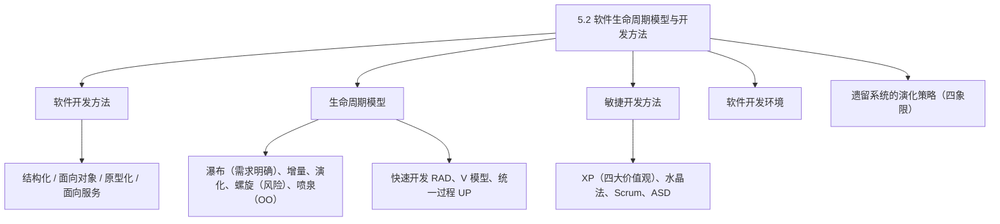

## 软件开发方法

讲某某方法、某某思想，一般都比较"上层"——先要有一个方法或思想去指导实践，有了软件开发方法，才会有软件生命周期过程中存在的各种模型。

**四种开发方法**：

| 方法 | 代表/特点 |
|---|---|
| 结构化开发方法 | 以 **C 语言**为代表；按一定顺序（需求→设计→编码→测试→运行维护）进行，**阶段十分明显**；要求在明确需求（充分调研用户需求）的前提下再进入编码和设计阶段 |
| 面向对象的开发方法 | 近年来用得多（Java、Python、PHP、C#）；以一个个**对象和类**为开发实体；**阶段化不明显**，能满足需求不是很明确的开发 |
| 原型化开发方法 | 用来**调研需求**；一开始构建一个让用户体验的部分功能或界面，用户在使用过程中反馈问题，从而明确开发需求；分为**演化型原型**和**抛弃型原型** |
| 面向服务的开发方法 | 将一个个成熟的模块开发成一个个**构件**，构件经过业务过程中使用被固定下来，形成某种标准化的东西；是一种**粗粒度、标准化**的开发方法 |

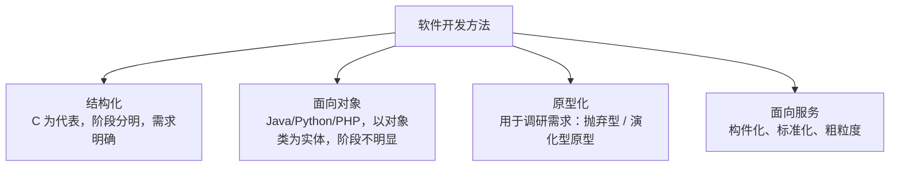

## 瀑布模型

**瀑布模型**的主要应用场景是**需求明确**的情况下。它将软件生命周期的各种活动明确划分为：**计划阶段、需求分析阶段、设计阶段、编码阶段、测试阶段和运行维护阶段**。

其中：软件**计划和需求**阶段又称为软件的**定义阶段**；**设计、编码和测试**阶段又被称为软件的**开发阶段**；软件的**运行与维护**阶段称为软件的**维护阶段**。它的特点是**阶段划分非常明确**；开发模型内部的思想是综合的——可以在一种开发模型中使用多种开发方法或开发思想（如瀑布模型使用结构化的开发方法）。

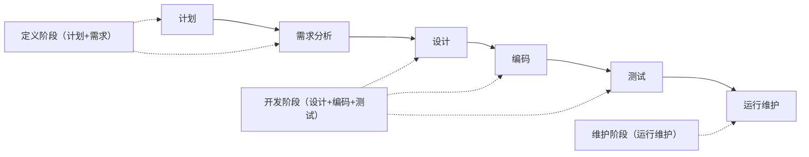

## 增量模型

**增量模型**会在每个增量发布一个**可操作的产品**（可交付用户使用的版本）：比如版本一被称为**核心产品**，客户使用和评估后，将其作为下一个发布版本的新特征和功能；不断进行分析、设计、编码，不断提出新的增量版本——从而达到**减少用户需求变更**的目的，减少用户需求变更所带来的**开发成本**。但增量开发模型也有不足：它会带来**管理成本的增加**（要记一下）。

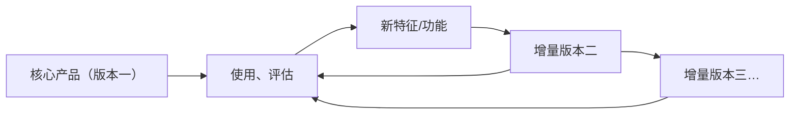

## 演化模型

演化模型可以从原型化开发方法中提出，原型分两种：

- **抛弃型原型**：用来调研需求所做的一些界面（甚至用原型开发工具设计），**不用于实际业务操作**，只提供给用户调研需求；在正式开发过程中将它抛弃掉；
- **演化型原型**：先开发一个可供用户使用的**原型系统**，用户使用过程中提出意见和建议，对原型进行修改、获得新版本，不断演化得到用户所需产品。它适用于**不能完整定义需求**的软件开发；缺点：**将不够稳定的功能先提供给用户**，会带来用户的负面情绪。

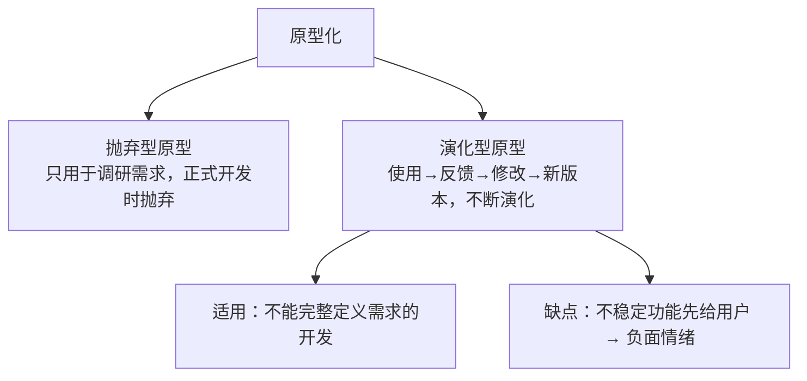

## 螺旋模型

**螺旋模型**要记住：它**强调了风险分析**，是一个**多次迭代**的过程。同样，螺旋模型会带来**开发成本的增加**——因为不断迭代可能带来开发成本增加。

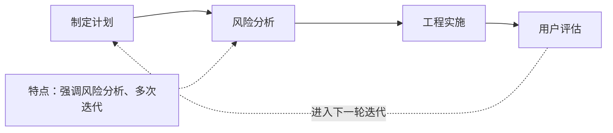

## 喷泉模型与快速开发模型

**喷泉模型**：开发过程是**无间隙**的、**迭代**的过程；比较有特色的是它属于**面向对象**的开发。缺点是**不利于项目管理**——因为各个阶段无间隙、没有明显的结构性界限，开发阶段甚至重叠，需要大量开发人员，审核和管理文档的难度也增加。

**快速开发模型（RAD）**：最早在 **VB、Delphi** 语言中用得比较多。它由**生命周期模型和基于构件的开发**组成，主要有几个开发过程：**业务建模 → 数据建模 → 过程建模 → 应用生成 → 测试与交付**。

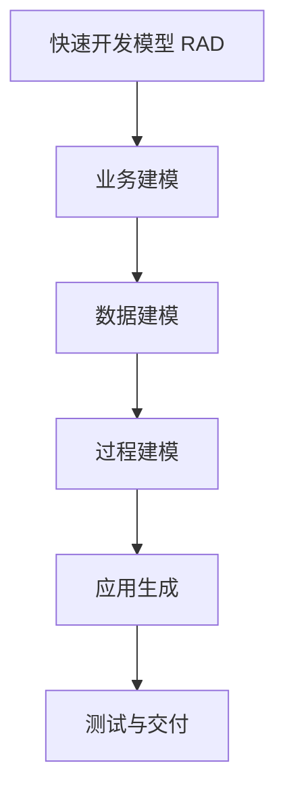

## V 模型（强调软件测试）

**V 模型**强调了**软件测试的重要性**：它将软件测试应用到软件分析、设计与编码的整个软件开发过程的各个阶段，强调**测试先行**的思想。

**各阶段对应的测试**（中级教材口径）：**需求分析 → 验收测试（概要 → 系统测试）**；**概要设计 → 集成测试；详细设计 → 单元测试；编码 → 单元测试**。高级教材强调测试先行，将**需求分析对应系统测试、概要设计对应集成测试、详细设计对应单元测试**。记忆口诀："**需验概系详集编单**"（需求→验收、概要→系统/集成、详细→集成/单元、编码→单元），具体以习题为准。

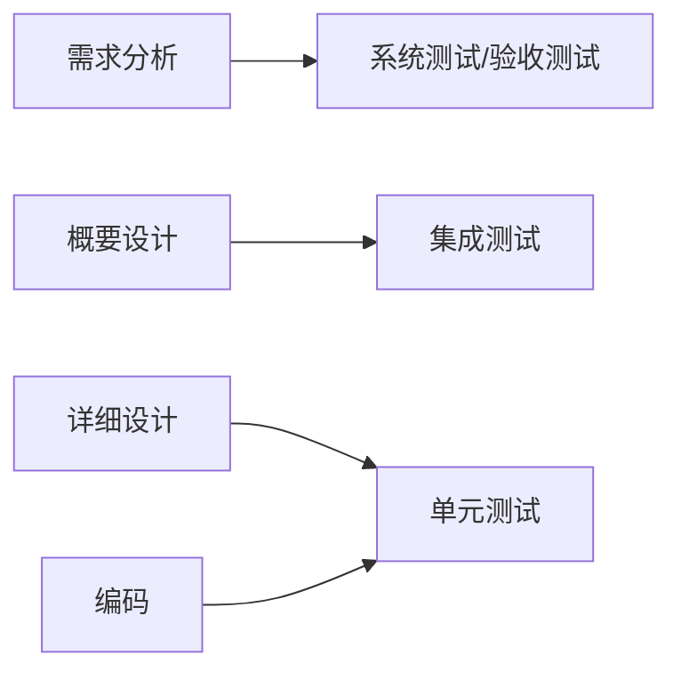

## 统一过程 UP 与 RUP

**统一过程（UP）**的特点（记一下）：**用例驱动、风险驱动、以架构为中心、迭代增量**的开发过程。

统一过程有**五个阶段**，对应着五个制品：

| 阶段 | 对应制品 |
|---|---|
| 起始阶段 | 生命周期目标 |
| 精化阶段 | 生命周期的架构 |
| 构建阶段 | 初始运作功能 |
| 移交阶段 | 产品发布的版本 |
| 生产阶段 | 系统评估和变更请求 |

它的典型代表是 **RUP（Rational Unified Process）**——针对前面四个阶段**完全兼容 UP**，比 UP 更加详细（R 是公司名的前缀）。

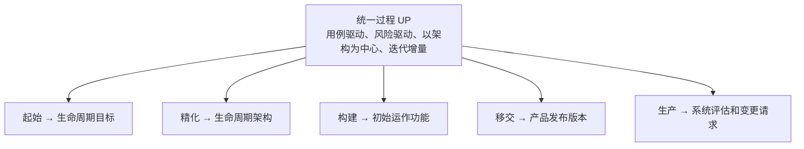

## 敏捷开发方法

**敏捷开发方法的目标**（可能考）：**尽可能早地、持续地对有价值的产品（软件）交付**。它适用于**规模小**的项目，规模大的项目不适用（已被实践证明）。

**敏捷开发的典型方法**：
- **极限编程（XP）**：有**四大价值观——沟通、简单、反馈、勇气**，五个原则，12 个最佳实践——有计划游戏、隐喻、简单设计、**测试先行**、重构、**结对编程**（一个人敲代码，一个人在旁边看）、集体代码所有制、持续集成、每周工作 40 小时、现场客户、编码标准。它反对没有效率的会议和没有效率的文档，重视人的主观能动性；
- **水晶法（Crystal）**：强调每一个不同的项目需要**一套不同的策略、约定和方法论**；
- **并列征求法（Scrum）**：一种**迭代**的方法，**每 30 天形成一个冲刺（Sprint）阶段**，各阶段会分优先级、并行递增，形成像橄榄球中的**并列争球**；协调通过简短的会议进行；
- **自适应开发方法（ASD）**：有六个原则，适合规模较小的项目，主要目标是尽可能持续地对有价值的产品交付。

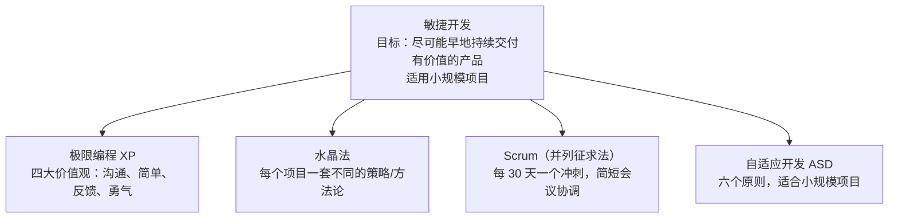

## 软件的开发环境

软件的开发环境是软件开发过程中支撑软件开发的一些**软件系统**，构成了软件开发的生存环境（空间）。它包括**软件的工具集**和**环境集成机制**：

- **软件的工具集**：能够支撑软件开发的过程、活动和任务；
- **软件的集成机制**：包括**数据的集成、控制的集成和界面的集成**。

软件开发环境的特征：环境的**服务是集成的**；能够支撑**小组的工作方式**（通过提供**配置管理**支撑各种开发活动）；它是一种**开放的和可剪裁**的集成开放环境——开放是指可以把环境外的工具集成到环境中为开发提供方便，可剪裁是指可以根据不同用户的需求进行剪裁，形成特定的开发环境。

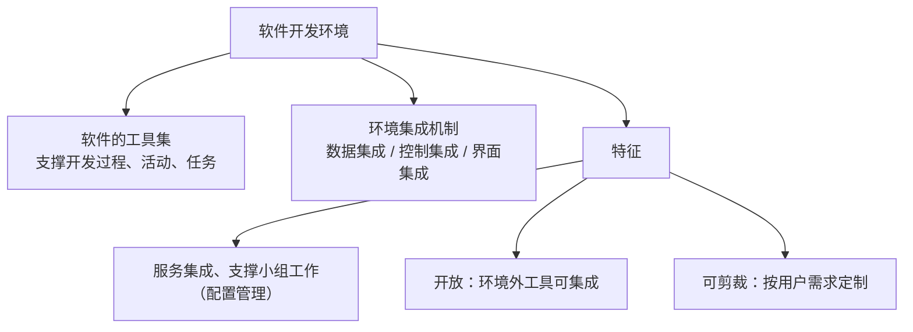

## 遗留系统的演化策略（补充）

在运维或升级改造阶段会有一些**遗留系统**，它们有不同的演化策略，分为**四个象限**（用"业务价值 × 技术水平"的二维坐标划分）：

| 象限 | 业务价值 | 技术水平 | 演化策略 |
|---|---|---|---|
| 第一象限 | 高 | 高 | **改造** |
| 第二象限 | 低 | 高 | **集成** |
| 第三象限 | 低 | 低 | **抛弃（淘汰）** |
| 第四象限 | 高 | 低 | **继承**（继承其业务） |

> [!NOTE]
> 视频强调：业务价值高、技术水平高 → 改造；技术水平高、业务价值低 → 集成；技术水平和业务价值都低 → 抛弃/淘汰；业务价值高、技术水平低 → 继承其业务。题库里有这类题目，了解一下即可。

## 本节小结

① **开发方法**：结构化（C 为代表、阶段分明、需求明确）、面向对象（Java/Python/PHP、以对象类为实体、阶段不明显）、原型化（调研需求：抛弃型/演化型）、面向服务（构件化、标准化、粗粒度）。有方法才有模型——方法指导实践。

② **瀑布**：需求明确时适用；计划+需求=定义阶段，设计+编码+测试=开发阶段，运行维护=维护阶段，阶段划分明确。**增量**：每个增量发可交付版本（首版=核心产品），减少需求变更成本，**缺点管理成本增加**。**演化**：抛弃型原型（仅调研用）与演化型原型（可用系统不断演进，适用于不能完整定义需求，缺点：不稳定功能先给用户）。

③ **螺旋**：强调**风险分析**、多次迭代，缺点开发成本增加。**喷泉**：面向对象、无间隙迭代，缺点不利于项目管理。**快速开发 RAD**：VB/Delphi，业务建模→数据建模→过程建模→应用生成→测试与交付。

④ **V 模型**：测试先行；**口诀"需验概系详集编单"**（需求→验收/系统、概要→集成/系统、详细→集成/单元、编码→单元）。**统一过程 UP**：用例驱动、风险驱动、以架构为中心、迭代增量；五阶段对应制品（起始→生命周期目标、精化→架构、构建→初始运作功能、移交→发布版本、生产→评估与变更请求）；典型代表 RUP。

⑤ **敏捷**：目标=尽可能早地持续交付有价值的产品（可能考），适合小项目；XP 四大价值观=沟通、简单、反馈、勇气；水晶法=一项目一套策略；Scrum=每 30 天冲刺、简短会议协调；ASD=六原则、适合小项目。

⑥ **开发环境**：软件工具集 + 环境集成机制（数据/控制/界面集成）；特征=服务集成、支撑小组工作、**开放且可剪裁**。**遗留系统四象限**：高技高值→改造、高技低值→集成、低技低值→抛弃、低技高值→继承。