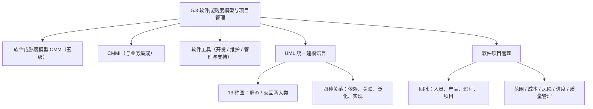
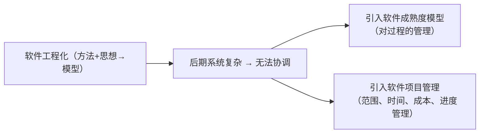
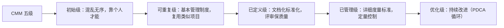
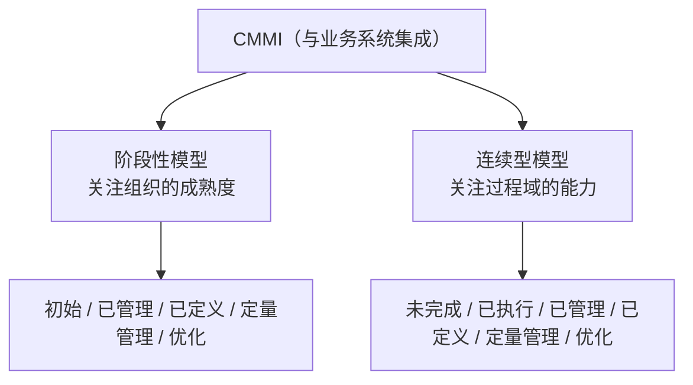
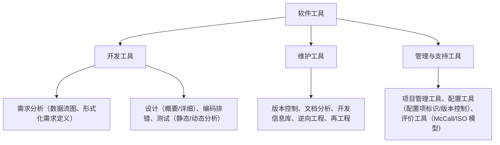
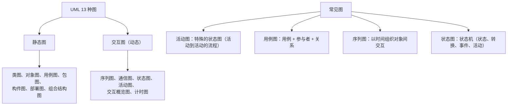
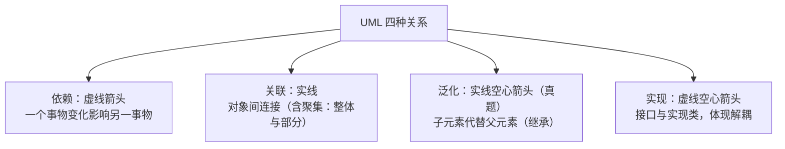
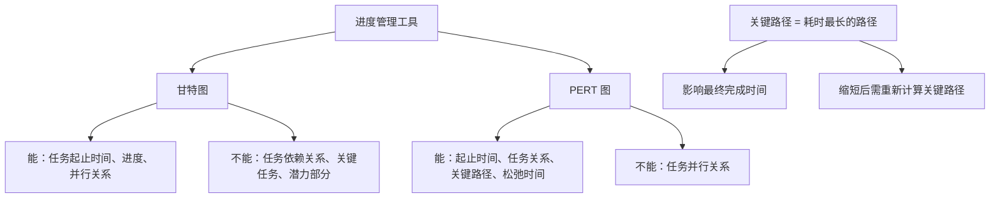
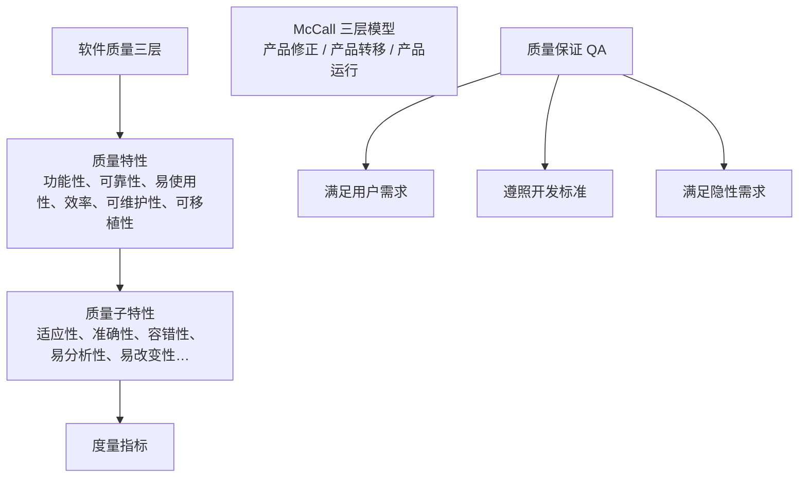

课程链接：视频《5.3 软件成熟度模型与项目管理》（软考程序员系列课程）

视频链接：

## 本节概述

本课是系列课程的第十七节课，用这一节结束软件工程章节的讲解。今天的主要内容：软件的**成熟度模型**（CMM/CMMI）、软件的工具、**统一建模语言 UML**、软件的项目管理。本课脉络：为什么需要过程与项目管理 → CMM 五级 → CMMI → 软件工具分类 → UML（13 种图、四种关系）→ 项目管理（四批、三角、范围/成本/风险/进度/质量管理）。

## 为什么需要过程管理与项目管理

我们在讲软件工程时是从**工程化**角度考虑软件的规划，这种考虑通过一些软件开发的方法和思想，综合成软件开发模型固化下来。但在信息系统建立的后期，随着系统间逻辑或业务越来越复杂，这种固化的方法无法很好地协调各系统间相关联的关系，导致软件运维的复杂性增加；甚至软件规划初期没有做好规划，导致信息系统构建失败——而信息系统规划失败大多程度上是没有引入很好的**项目管理**理念造成的。

所以需要对某个关键的项目活动或项目过程进行有效管理，这引入了**软件成熟度模型（对过程的管理）**；需要对软件进行合理规划、对信息系统各过程或活动进行合理安排（范围、时间、成本、进度管理），这引入了**软件项目管理的概念**。在软件设计和项目管理之间衔接的地方就是**软件需求**。

在**范围管理**中，强调做范围内的事情：需求调研时可以将需求分解为**必须完成的需求**和**兴奋需求**（兴奋需求要合理控制）；这种"需求基线"外的功能（如给用户额外开发饼状图、柱状图）需要权衡是否影响需求基线。**基线**就像建筑砌墙时的**铅垂线**，不能超越，一旦超越就导致整个信息系统管理的失败。

## 软件成熟度模型 CMM（五级）

**软件成熟度模型（CMM）**是对软件开发、设计、运维等关键活动过程中进行的管理，主要分五个等级（要记忆）：

| 级别 | 特点 |
|---|---|
| ① 初始级 | 管理制度缺乏、过程缺乏定义、**混乱无序**；成功靠个人的才能和经验 |
| ② 可重复级 | 建立了**基本的管理制度**，采取一定措施控制了费用和时间；通过类似项目的**可重复性开发**（复用类似项目经验） |
| ③ 已定义级 | 将软件过程**文档化、标准化**，按照需要改进开发过程，并通过**评审**方法来保证软件质量 |
| ④ 已管理级 | 制定了软件过程和软件质量的**详细度量标准**，对软件过程和软件质量进行**定量的**理解和控制 |
| ⑤ 优化级 | 一种**不断持续改进**的过程——在软件管理中称为 **PDCA 循环**（计划→做→检查→再实践，不断循环） |

> [!NOTE] 隐性需求
> 已定义级提到隐性需求：软件可以跑，但并发数多时性能急剧下降，影响用户使用——这种没写进需求文档的需求就是隐性需求（如软件的质量、运行性能指标），它需要考虑，与软件架构有明显关系。

## 能力成熟度集成模型 CMMI

**CMMI**（能力成熟度模型集成）是指能力成熟度模型与**业务系统的集成**，能集成不同的业务系统。它分为：
- **阶段性模型**：关注**组织的成熟度**——分为初始的、已管理的、已定义的、定量管理的和优化的；
- **连续型模型**：关注**过程域的能力**——分为未完成的、已执行的、已管理的、已定义的、定量管理的和优化的。

## 软件工具

软件工具可以分为**软件开发工具、软件维护工具**和**软件管理与支持工具**。

**开发工具**：
- **需求分析工具**：能够生成完整、清晰、一致的功能规范；主要有基于自然语言或图形描述的工具（例如数据流图——通过数据流的流入流出平衡来分析出清晰的功能规范）和形式化的需求定义语言（包含决策性的功能模块）；
- **设计工具**：概要设计工具和详细设计工具；
- **编码排错工具**：编码工具（如将机器码转换为中间码的解释型语言，前面已讲）；排错工具辅导程序员寻找源程序错误原因、确定出错位置；
- **测试工具**：静态分析（对源程序的程序结构、数据流、控制流进行分析）和动态分析（执行程序，检查语句、分支和路径覆盖，进行断点探测执行流等）。

**维护工具**：
- **版本控制工具**：软件的开发维护中会形成多个版本，必须进行存储、更新和恢复管理的工具；
- **文档分析工具**；
- **开发信息库**：用来维护软件项目的开发信息，记录每个对象的修改信息和其他变更；
- **逆向工程工具**：将软件某种形式（源程序）转换为抽象形式的软件表示，使软件更易理解；
- **再工程工具**：构建一个功能和性能更加完善系统的工具。

**管理与支持工具**：
- **项目管理工具**：用于软件项目计划、调度、通信、成本估算、资源分配和质量控制；
- **软件配置工具**：包括配置项的标识、辅助完成版本控制、变化控制、审计和状态统计；
- **软件评价工具**：辅助管理人员进行软件质量保证活动，通常按某个软件质量模型（如 **McCall 软件模型和 ISO 质量模型**）对软件进行度量，得到评价报告。

## 统一建模语言 UML

**UML（统一建模语言）**从要素上可分为**基本构造块、放置的规则和公共的机制**；从词汇上可以分为**事物、关系和图**。

**事物的四种类型**：
- **结构性事物**：静态的事物，用来阐述概念和物理元素，包括类、接口、协作、用例、主动类、构件、制品和节点；
- **行为性事物**：动态的，包括交互、状态和活动等；
- **分组性事物**：将一组类或元素组织成一个包的对象（包的概念）；
- **注释性事物**：附着在一个或一组元素上，对它进行约束和解释的符号。

**UML 的 13 种图**分两大类（要区分）：
- **静态图**：**类图、对象图、用例图、包图、构件图、部署图、组合结构图**；
- **交互图（动态图）**：**序列图、通信图、状态图、活动图、交互概览图、计时（技术）图**。

常考的概念：**活动图**是一种特殊的状态图，展示系统从一个活动到另一个活动的流程；**用例图**展示一组用例和参与者及它们之间的关系，描述谁使用系统以及用户期望以什么方式与系统交互（含用例与参与者之间的关联、用例之间的扩展关系）；**序列图**是在用例执行过程中以时间组织对象之间的交互活动；**状态图**展现一种状态机，由状态转换、事件、活动组成。

**UML 的四种关系（图形化表示要会判断）**：
- **依赖**：一个事物发生变化会影响另一个事物，用**虚线箭头**表示；
- **关联**：描述一组链（对象）之间的连接，一对一、一对多使用最多；其中包含**聚集关系**，体现**整体与部分**的关系；
- **泛化**：用**实线空心箭头**表示，是**子元素代替父元素**的对象（子类继承父类）——**这个在历年真题中考过**；
- **实现**：接口与实现类之间的关系（或用例与实现协作的关系），是接口与其实现类的关系，体现**解耦**，用**虚线空心箭头**表示。

## 软件项目管理

软件项目管理引入了美国 **PMBOK（PM 指南）** 中的内容，它关注**人员、产品、过程和项目**，简称"**四批**"。

- **人员**：强调**项目干系人**——与项目有切身利益关系的人，包括项目开发人员、金主（支付项目工程款的人）、项目/实施经理、使用软件的人等，对干系人的管理是项目管理需要考虑的范畴；
- **产品**：包括可交付的产品，也包括需要进行测试集成的产品，还包括项目的文档；
- **过程**：整个项目会划分成不同的小阶段，这些小阶段全部完成了才能完成复杂的软件；
- **项目**：在项目管理中定义为**一次性的、渐进明细的、独特的一种活动**，需要有计划性、可控性，采取的方法是在正确的基础上开始工作、保持动力、跟踪进度、做出正确决策、进行事后分析。

**项目三角形**：从项目管理范围上看，最初提到的是**质量、时间和成本**，这共同构成软件项目的三角支撑——任何一边过长或过短都会影响其他部分（如时间过短会影响质量、也会影响成本）。光谈这三点是不够的，还需要关注软件的**范围**。

### 范围管理

**范围管理**的目的是**做范围以内的事情，不做范围以外的事情**——软件范围无限延伸会造成**需求蔓延**，导致项目**延期**、**开发成本增加**，甚至影响项目关键功能的质量。

### 成本管理

成本管理包括**成本的估算、成本的预算和成本的控制**三大块（教程里主要提成本估算）。

**成本估算的分解技术**：代码行的估算（程序员写出总代码行数 × 每行代码的市场价位）、基于功能点的估算（开发了多少个功能点）、基于过程的估算、基于用例（用力）的估算——这些都有**类比估算**的成分（类比以前的项目来估算现在）。

**基本的成本估算方法**：
- **自顶向下**：参照项目所消耗的成本来算总成本——优点：**估算工作量小、速度快、不会遗漏**；缺点：不清楚低级别上的技术困难（会导致成本上升），估算精确度不够；
- **自底向上**：将待开发项目细分，估算每个子项目的工作量再相加——优点：**比较准确**；缺点：对各任务之间相互联系的工作量和系统级的工作量估算往往**偏低**；
- **差别性估算**：将开发项目与多个已完成项目比较，找出不同之处，估算不同支出对成本的影响，导出总成本——优点：提高准确度；缺点：不能明确差别的界限；
- 此外还有**专家估算法**（请行业专家估算）、类比估算法和算式估算法。

### 风险分析

**风险分析**强调关系未来：软件风险是软件信息系统开发中存在的**不确定性**。关心**未来**——风险是否会导致软件的失败；关心**变化**——用户需求变更会不会对软件项目实体产生影响，并且做出选择。风险管理的步骤：**风险的识别、风险的估计和风险管理策略、风险的解决和风险的监控**。

### 进度管理

**进度监督**有两种方式：一是**交付日期已确定**，必须在规定期限内完成；二是只确定**大致的交付日期**，最终交付日期由软件开发部门确定。

**进度安排的图形化表示方法（两段话要记下来）**：
- **甘特图**：能清晰描述**任务从何时开始到何时结束**、任务的进展情况，以及**各个任务的并行关系**；但**不能**清晰地反映各任务之间的**依赖关系**，难以确定整个项目的关键所在，也不能反映计划中有潜力的部分；
- **PERT 图（计划评审技术图）**：不仅给出每个任务的开始时间、结束时间和完成项目所需的时间，还给出**任务之间的关系**（哪些任务完成才能开始另外一些任务），可以找出如期完成整个工程的**关键任务（关键路径）**；任务的**松弛时间**反映完成任务时可推迟开始时间或延长其完成时间；但 PERT 图**不能反映任务之间的并行关系**。

**关键路径**：每条从开始到结束有多条路径，**哪条路径所使用的时间最长，这条路径就是关键路径**——最终完成的时间受花费时间最长的那条路径支配；并行活动可以节省时间（如边烧水边洗漱），缩短工程时间时要先确保时间基线不变，缩短后要**重新计算关键路径**。

### 质量管理

**软件的质量**有三个层次：第一层是**质量特性**（功能性、可靠性、易使用性、效率性、可维护性、可移植性——视频"可一致性"为口误）；第二层是**质量子特性**——功能性的子特性有适应性、准确性、互用性、依从性和安全性；可靠性的子特性有承受性（成熟性）、容错性、易恢复性；易使用性的子特性有易理解性、易学性、易操作性；效率的子特性有时间性、资源性；可维护性的子特性有易分析性、易改变性、稳定性、易测试性；可移植性的子特性有适应性、易安装性、一致性、易替换性；第三层是**度量指标**。

**McCall 的三层模型框架**：包括产品的**修正、产品的转移**和**产品的运行**；第一层质量特性、第二层评价准则、第三层度量指标。

**软件的质量保证（QA）**：首先要保证软件**必须满足用户的需求**；其次软件需要**遵照一系列的开发标准**；最后软件还要**满足隐性需求**（未写在需求规定中的需求）。软件质量保证包括**七个主要活动**：应用技术方法、进行正式技术评审、测试软件、标准实施、控制变更、度量、记录保存和报告。

## 本节小结

① **CMM 五级**：初始级（混乱无序、靠个人才能）→ 可重复级（基本管理制度、复用类似项目）→ 已定义级（文档化标准化、评审保质量）→ 已管理级（详细度量标准、定量控制）→ 优化级（持续改进 = **PDCA**）。**CMMI** 是与业务系统集成；阶段性模型关注组织成熟度（5 级）、连续型模型关注过程域能力（6 级）。

② **软件工具**：开发工具（需求分析[数据流图/形式化需求定义]、设计、编码排错、测试[静态/动态分析]）；维护工具（版本控制、文档分析、开发信息库、逆向工程、再工程）；管理与支持工具（项目管理、配置工具[标识/版本/变更/审计]、评价工具[McCall/ISO 模型]）。

③ **UML**：13 种图分**静态**（类、对象、用例、包、构件、部署、组合结构）与**交互**（序列、通信、状态、活动、交互概览、计时）；活动图=特殊状态图、用例图=用例+参与者、序列图=时间组织交互。四种关系：**依赖（虚线箭头）、关联（实线，含聚集=整体部分）、泛化（实线空心箭头，子代父——真题）、实现（虚线空心箭头，接口与实现类）**。

④ **项目管理（四批）**：人员（干系人）、产品、过程、项目（一次性、渐进明细、独特）。**三角 = 质量、时间、成本**，再关注范围。范围管理=只做范围内的事（蔓延→延期+成本增加+关键功能质量下降）；成本估算方法（自顶向下：快而不精确；自底向上：准确但偏低；差别性、专家、类比）；风险=不确定性（识别→估计→策略→解决→监控）；进度管理——**甘特图**能看起止时间/进度/并行但看不出依赖与关键，**PERT 图**能看任务关系/关键路径/松弛时间但看不出并行，**关键路径=耗时最长路径**；质量管理三层+McCall 三层（修正/转移/运行）+QA 七活动。