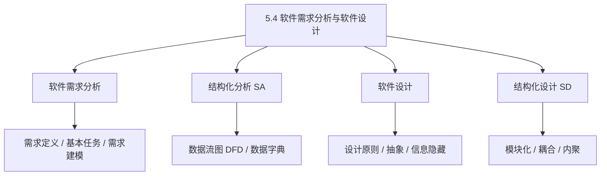
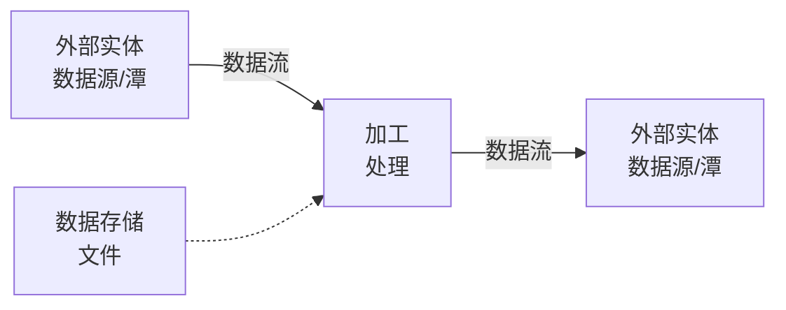
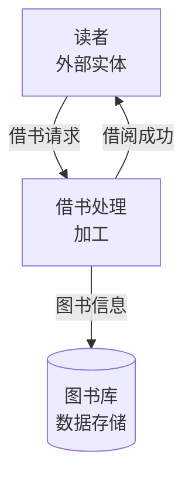
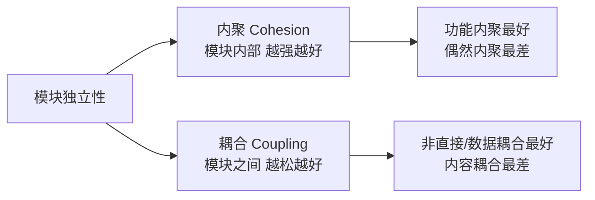

课程链接：视频《5.4 软件需求分析与软件设计》（软考程序员系列课程）

视频链接：

## 本节概述

本节是系列课程的第三十节课，进入教材第 5 章「软件工程基础知识」，补全软件过程的**需求分析与软件设计**两大阶段。软考上午题的软件工程模块里，需求分析的任务、结构化分析的建模（数据流图/数据字典）、软件设计的原则（高内聚低耦合）都是高频考点。本节脉络依次是：软件生命周期回顾 → 软件需求分析（定义/任务/建模工具）→ 结构化分析与设计（数据流图 DFD、数据字典）→ 软件设计（原则与抽象）→ 结构化设计（模块、耦合与内聚）。

先看一张本节的知识地图，把整节内容装进脑子里：

## 软件需求分析

### 软件需求的定义

**软件需求**就是指用户对目标软件系统在**功能、行为、性能、设计约束**等方面的期望。分为两类：

- **功能需求**：系统**必须做什么**（如"能够实现登录""能够查询订单"）。
- **非功能需求**：系统的**质量属性与约束**（性能、可靠性、安全性、易用性、可维护性等）。

### 需求分析的基本任务

需求分析的基本任务是**解决"做什么"（what）的问题**，而不是"怎么做"。核心任务包括：

1. **确定系统的综合要求**（功能、性能、环境、可靠性等）。
2. **分析系统的数据要求**（数据字典、数据流、数据结构）。
3. **推导出系统的逻辑模型**（用数据流图、数据字典描述）。
4. **修正系统的开发计划**。
5. **编写需求规格说明书（SRS）**——需求分析的最终成果，作为后续设计实现的依据。

> [!WARNING] 真题考点
> **需求分析关心"做什么"（功能），设计才关心"怎么做"**。这是常考判断。需求分析最终产出是**软件需求规格说明书（SRS）**。

## 结构化分析方法（SA）

**结构化分析方法（Structured Analysis，SA）** 的核心思想是**自顶向下、逐层分解**，用**数据流图**和**数据字典**描述系统的逻辑模型。

### 数据流图（DFD）

**数据流图（Data Flow Diagram，DFD）** 用图形描述系统中数据的**流动、变换和处理**。它有四种基本符号：

| 图符 | 名称 | 含义 |
|---|---|---|
| 圆角矩形/圆圈 | **加工（处理）** | 对数据进行的处理变换 |
| 矩形/方框 | **数据源/数据潭（外部实体）** | 数据的来源或去向 |
| 箭头 | **数据流** | 数据的流动方向 |
| 双横线/表 | **数据存储文件** | 数据保存的地方 |

一个典型例子——图书借阅系统的数据流：

### 数据字典（DD）

**数据字典（Data Dictionary，DD）** 是**对数据流图中所有数据流的描述**（定义数据、数据流、存储的说明）。它和数据流图配合使用：**DFD 画结构，DD 描述细节**。

> [!NOTE]
> **数据流图画"骨架"，数据字典填"血肉"**。DFD 表达系统由哪些加工、数据流组成；DD 说明每个数据项的具体含义。

## 软件设计

### 软件设计的任务

软件设计是**在需求分析之后，解决"怎么做（how）"**的阶段。分为：

- **概要设计（总体设计）**：确定系统的**总体结构**——把系统划分为若干模块，确定模块之间的调用关系。
- **详细设计（过程设计）**：确定**每个模块内部**的具体实现——算法、数据结构、接口细节。

> [!WARNING] 真题考点
> **概要设计→总体结构（模块划分）；详细设计→模块内部实现。需求分析问"做什么"，设计阶段问"怎么做"。**

### 软件设计的原则

1. **抽象**：抽出事物的**共性、本质特征**而忽略非本质细节。自顶向下逐步抽象出层次结构。
2. **模块化**：把一个复杂系统**分解为独立的模块**，每个模块完成一个子功能。
3. **信息隐蔽**：模块内部的信息（实现细节）**不对模块外部暴露**，只通过接口通信。
4. **模块独立**：追求**高内聚、低耦合**（见结构化设计）。

### 软件设计原则的平衡（考点）

- **模块化带来的好处**：便于分工、便于测试维护。
- **过高分解的坏处**：模块过小，模块间接口（耦合）增多，反而增加成本互相联系。

> [!TIP] 通俗理解
> 模块独立就像"部门分工"：一个部门只管一件事、部门间通过明确接口配合。部门井水不犯河水（高内聚），部门之间约定清晰（低耦合），系统就好维护。

## 结构化设计方法（SD）

**结构化设计方法（Structured Design，SD）** 把系统划分成一个个**模块**，评价系统质量的两个关键指标是 **内聚** 和 **耦合**。

### 内聚（Cohesion）

**内聚**衡量**一个模块内部**各元素之间结合的紧密程度。内聚由弱到强（好的内聚程度高）：

- **偶然内聚**：模块内各元素之间无关系（最差）。
- **逻辑内聚**：把逻辑上相似的功能放一起。
- **时间内聚**：因**同一时间执行**而被分在一起。
- **过程内聚**：因**执行顺序**（过程）相关而组合。
- **通信内聚**：模块内各部分**使用相同输入数据/产生相同输出**。
- **顺序内聚**：模块内各部分**相继执行**，一个的输出是另一个的输入。
- **功能内聚**：模块内所有元素**共同完成一个单一功能**（最好，最理想）。

> [!WARNING] 真题考点
> **内聚越强越好，功能内聚最好、偶然内聚最差**。判断某模块属于哪类内聚是常考题。

### 耦合（Coupling）

**耦合**衡量**模块与模块之间**的关联程度。耦合由低到高（好的耦合程度低、越松越好）：

- **非直接耦合**：两模块无直接关系（最好）。
- **数据耦合**：通过**参数**传递普通数据。
- **标记耦合**：传递的是**数据结构**（如整个数组）。
- **控制耦合**：一个模块把**控制信号**传给另一个模块。
- **外部耦合**：通过**全局变量/外部数据**联系。
- **公共耦合**：多个模块**共享一个公共数据环境**（如共用一个全局区）。
- **内容耦合**：一个模块**直接访问**另一个模块的内部（最差）。

| 耦合级别 | 好坏 |
|---|---|
| 非直接 / 数据耦合 | 最好（低耦合） |
| 标记 / 控制耦合 | 中等 |
| 外部 / 公共 / 内容耦合 | 最差（高耦合） |

> [!WARNING] 真题考点
> **系统设计追求"高内聚、低耦合"**。耦合由低到高排序（非直接<数据<标记<控制<外部<公共<内容）要会判断，尤其**内容耦合最差**。

> [!NOTE]
> 一句话记忆：**一个模块内部要"高度聚合"（高内聚），模块之间要"松散连接"（低耦合）**。这就是模块独立性的精髓。

## 本节小结

① **软件需求**：分**功能需求（做什么）**和**非功能需求（质量属性/约束，如性能、安全、可靠性）**。

② **需求分析任务**：确定综合要求、分析数据要求、**建立逻辑模型**（数据流图+数据字典）、修订开发计划、**编写需求规格说明书 SRS**（最终成果）。

③ **结构化分析 SA**：**自顶向下逐层分解**，用 **数据流图 DFD**（加工/外部实体/数据流/数据存储四种符号）+ **数据字典**（对数据流的解释）描述系统逻辑模型。

④ **软件设计**：分**概要设计（总体结构、模块划分）** 与 **详细设计（模块内部实现）**。原则有**抽象、模块化、信息隐蔽、模块独立**，追求**高内聚低耦合**。

⑤ **结构化设计 SD**：**内聚衡量模块内部（功能内聚最好）；耦合衡量模块之间（数据耦合最好、内容耦合最差）**。常考判断某模块属于哪种内聚/耦合级别。