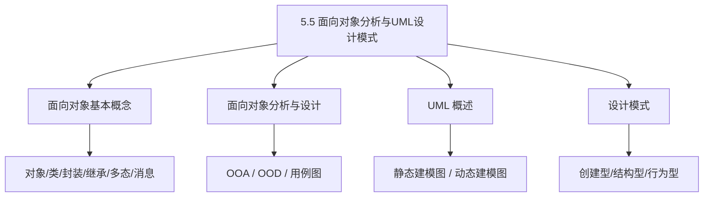
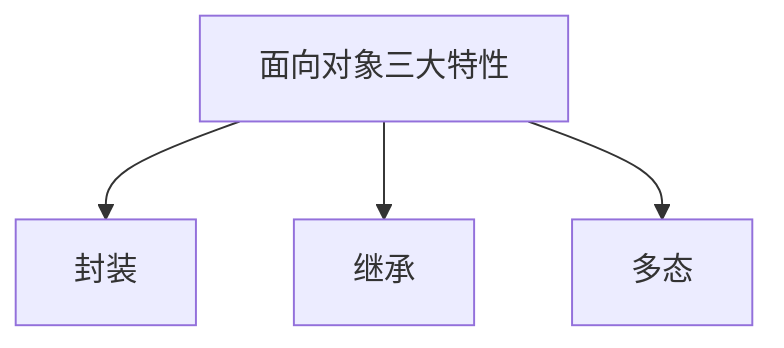
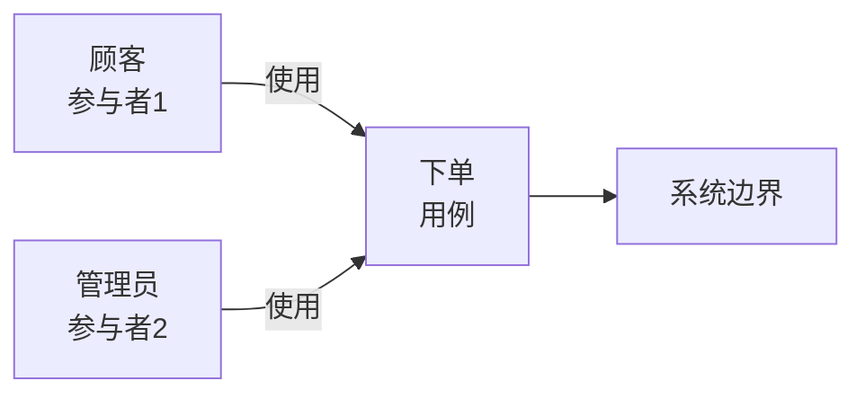
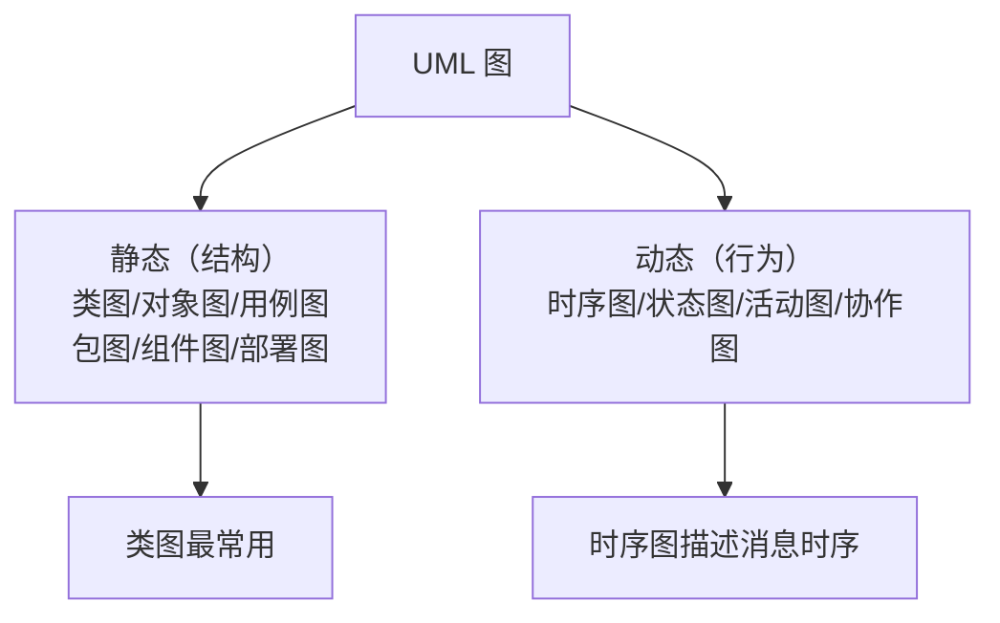

课程链接：视频《5.5 面向对象分析与UML设计模式》（软考程序员系列课程）

视频链接：

## 本节概述

本节是系列课程的第三十一节课，继续教材第 5 章「软件工程基础知识」，补全**面向对象的分析与设计**以及 **UML** 与 **设计模式**。面向对象是下午题 C++/Java 的基础，也是上午题常考概念；UML 图种类、设计模式的分类是识别性考点。本节脉络依次是：面向对象的基本概念（对象/类/封装/继承/多态）→ 面向对象的分析与设计（OOA/OOD、用例图）→ UML 概述（类图/时序图/用例图等九种图）→ 设计模式（创建型/结构型/行为型）。

先看一张本节的知识地图，把整节内容装进脑子里：

## 面向对象的基本概念

面向对象（Object-Oriented，OO）的核心概念与 C++/Java 章节已详述的机制一致，这里从软件工程角度归纳：

| 概念 | 含义 |
|---|---|
| **对象（Object）** | 具有**状态（属性）**和**行为（方法）**的实体 |
| **类（Class）** | 对象的**模板/抽象**，一组相同对象的共同特征 |
| **封装（Encapsulation）** | 把数据和对数据的操作**封装在一起**，对外只暴露接口，隐藏内部实现 |
| **继承（Inheritance）** | 子类**自动获得**父类的属性和方法，实现代码复用 |
| **多态（Polymorphism）** | 同一消息作用于不同对象产生不同行为 |
| **消息（Message）** | 对象之间通过**消息传递**进行交互（调用对方方法） |
| **抽象（Abstraction）** | 抽出事物的**共性本质**，忽略非本质细节 |

> [!TIP] 通俗理解
> 面向对象把世界看成"一堆对象"：人、车、订单都是对象，各自有属性（姓名、颜色、金额）和方法（说话、启动、付款），对象之间通过"调方法"（发消息）互相协作。

### 面向对象三大特性

- **封装**：隐藏实现、暴露接口。
- **继承**：代码复用、建立类层次。
- **多态**：统一接口、不同实现。

> [!NOTE]
> 面向对象四要素常考：**类、对象、继承、封装**（多态也常并列）。其中"封装"体现信息隐蔽，与前面软件设计原则呼应。

## 面向对象的分析与设计

### 面向对象分析（OOA）

**面向对象分析（Object-Oriented Analysis，OOA）** 阶段建立**问题域的逻辑模型**，主要任务是**清楚需求**：从用例出发识别对象、类、它们之间的关系（关联、聚合、继承）。

### 面向对象设计（OOD）

**面向对象设计（Object-Oriented Design，OOD)** 在分析模型基础上做**系统设计**：完善类、确定类的接口、划分模块、决定用哪种设计模式实现。

### 用例模型（Use Case）

OOA 常用**用例图**表达系统功能。**用例（Use Case）** 表示系统提供的一项功能，参与者（Actor）是使用系统的角色。

## UML 概述

**UML（Unified Modeling Language，统一建模语言）** 是**可视化建模语言的标准**，用于描述、构造、文档化软件系统。UML 用**图形符号**表达面向对象系统。

> [!NOTE]
> UML 是"图"，不是编程语言。它帮助设计者用标准图把系统画出来，便于沟通和设计。

### UML 的静态建模图（结构图）

| 图 | 作用 |
|---|---|
| **类图** | 描述**系统中类的静态结构**：类、属性、方法以及类之间的关系（继承、关联、聚合等） |
| **对象图** | 描述**某一时刻对象及其关系**（类图的实例） |
| **用例图** | 描述**系统功能与参与者**的关系 |
| **包图** | 表示包的层次结构 |
| **组件图** | 描述**软件组件及其依赖** |
| **部署图** | 描述**系统硬件和软件的物理部署** |

### UML 的动态建模图（行为图）

| 图 | 作用 |
|---|---|
| **时序图（顺序图）** | 描述**对象之间消息传递的时间顺序** |
| **状态图** | 描述**一个对象的生命周期状态变化** |
| **活动图** | 描述**流程/业务活动**，类似于流程图 |
| **协作图（通信图）** | 描述**对象之间的交互与协作**（侧重于对象间组织关系） |

> [!WARNING] 真题考点
> 高频识别题：**类图、对象图、用例图=静态（结构）；时序图、状态图、活动图、协作图=动态（行为）**。常考"下面哪些属于 UML 结构图/行为图"。

## 设计模式

**设计模式（Design Pattern）** 是**经过反复验证、可复用的设计经验总结**，用于解决特定场景下的设计问题。设计模式分三类（以"目的"划分）：

| 类别 | 关注点 | 常见例子 |
|---|---|---|
| **创建型**（Creational） | **对象如何创建** | 单例（Singleton）、工厂方法（Factory Method）、抽象工厂、建造者、原型 |
| **结构型**（Structural） | **类和对象如何组合**形成更大结构 | 适配器（Adapter）、装饰器（Decorator）、代理、组合、外观 |
| **行为型**（Behavioral） | **对象之间如何协作、分配职责** | 观察者（Observer）、策略（Strategy）、模板方法、迭代器、状态 |

> [!TIP] 通俗理解
> 创建型管"怎么造东西"，结构型管"怎么拼零件"，行为型管"怎么分工协作"。三类各司其职。

### 常见设计模式一句话记忆

- **单例模式（Singleton）**：保证一个类**只有一个实例**，全局可访问（如：打印池、数据库连接池）。
- **工厂方法（Factory Method）**：由一个**工厂类统一负责创建对象**，把"创建"与"使用"解耦。
- **观察者模式（Observer）**：**一个对象变化时自动通知多个依赖它的对象**（如：发布订阅）。
- **抽象工厂（Abstract Factory）**：创建**一簇相关对象**的接口。
- **适配器（Adapter）**：把接口转换成客户端期望的另一种接口。

> [!NOTE]
> 设计模式了解了识别即可：**创建型（单例/工厂）、结构型（适配器/装饰器）、行为型（观察者/策略）**。重点记单例和工厂。

## 本节小结

① **面向对象概念**：**类=对象的模板，对象=类的实例；封装（隐藏实现暴露接口）、继承（复用）、多态（同一消息不同行为）**，对象间靠**消息传递**交互。

② **面向对象分析与设计**：**OOA 分析阶段建逻辑模型（识别对象类与关系）、OOD 设计阶段完善类和接口**，用**用例图**表达系统功能（参与者+用例）。

③ **UML（统一建模语言）**：标准可视化建模语言。**静态图=类图/对象图/用例图/包图/组件图/部署图；动态图=时序图/状态图/活动图/协作图**。考题常让区分静态与动态图。

④ **设计模式三类（按目的）**：**创建型（单例/工厂方法/抽象工厂）管"创建"、结构型（适配器/装饰器）管"组合"、行为型（观察者/策略）管"协作"**。重点记忆**单例（唯一实例）与工厂（统一创建对象）**。