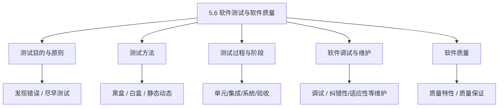
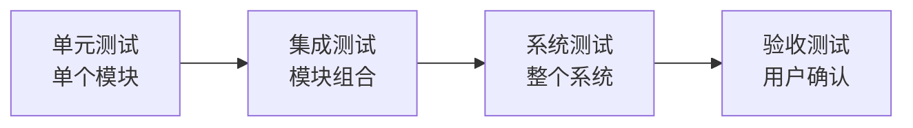

课程链接：视频《5.6 软件测试与软件质量》（软考程序员系列课程）

视频链接：

## 本节概述

本节是系列课程的第三十二节课，继续教材第 5 章「软件工程基础知识」，补全**软件测试与软件质量保证**。软件测试在软考上午题占比较重，**黑盒/白盒测试、测试方法、测试阶段**都是高频考点。本节脉络依次是：软件测试的目的与原则 → 测试方法（黑盒/白盒/其他）→ 测试用例设计 → 软件测试过程与阶段 → 软件调试 → 软件维护 → 软件质量特性与质量保证。

先看一张本节的知识地图，把整节内容装进脑子里：

## 软件测试的目的与原则

### 测试的目的

**软件测试的目的**主要有两点：

- **发现尽可能多的错误**，并尽可能早地发现。
- 通过测试证明"程序能做什么"，但**不能证明程序没有错误**——只能证明程序有错误，不能证明没有错误。

> [!WARNING] 真题考点
> 经典判断句：**"测试是为了发现错误，而不是为了证明程序没有错误"**，测试**只能证明程序有错，无法证明程序无错**。常考。

### 测试的原则

1. **尽早、不断进行测试**（测试应贯穿软件开发全过程）。
2. **测试用例要包括有效、无效的输入数据**（既要合法输入，也要非法输入）。
3. **程序员应避免测试自己编写的程序**（旁观者清），应由别人测试。
4. 穷举测试**是不可能的**，只能选择合适的代表性用例。
5. 注重**回归测试**（修改后要重新测试，防止引入新错误）。

> [!NOTE]
> 测试原则记住几条：尽早测试、无效数据也要测、避免自测、穷举不可能、重视回归测试。

## 软件测试方法

按"是否查看内部逻辑"分为**黑盒测试**与**白盒测试**。

### 黑盒测试（功能测试）

**黑盒测试**把程序看成"不透明的黑盒子"，**不关心内部逻辑**，只根据**规格说明**，检验输入是否正确得到预期输出。

- 着眼于**功能**。
- 适用：测试系统**是否正确实现了功能**。

**黑盒测试的用例设计方法**：等价类划分、边界值分析、错误推测、因果图。

### 白盒测试（结构测试）

**白盒测试**把程序看成"透明的盒子"，**根据程序内部逻辑结构**设计测试用例，检验**每条路径、每个逻辑结构**是否按设计执行。

- 着眼于**内部结构**。
- 适用：需要**覆盖代码路径**的测试。

**白盒测试的用例设计方法**：语句覆盖、判定（分支）覆盖、条件覆盖、路径覆盖等。

> [!WARNING] 真题考点
> **黑盒测试看功能不看内部（等价类/边界值/错误推测）；白盒测试看内部逻辑（语句/判定/路径覆盖）**。常考判断某测试属于黑盒还是白盒。

| 对比 | 黑盒测试 | 白盒测试 |
|---|---|---|
| 关注点 | 功能、输入输出 | 内部逻辑结构 |
| 程序视为 | 不透明黑盒 | 透明白盒 |
| 用例方法 | 等价类、边界值、错误推测 | 语句/判定/条件/路径覆盖 |
| 别名 | 功能测试 | 结构测试 |

### 按执行方式分类

- **静态测试**：**不运行程序**，通过**人工检查**（评审、走查）发现错误。
- **动态测试**：**运行程序**，输入数据执行代码观察结果。

## 软件测试过程与阶段

软件测试遵循**由小到大**的过程，分阶段进行：

| 测试阶段 | 测试对象 | 说明 |
|---|---|---|
| **单元测试**（模块测试） | **单个模块/函数** | 最小单位测试，检验模块内部逻辑 |
| **集成测试** | **模块组合** | 测试模块之间的接口与集成是否正确 |
| **系统测试** | **整个系统** | 把软硬件结合成完整系统测试，验证是否符合需求 |
| **验收测试**（确认测试） | **整个系统** | 由用户确认软件是否满足需求、能否验收 |

> [!WARNING] 真题考点
> 测试四阶段顺序常考：**单元 → 集成 → 系统 → 验收**。且**单元测试大多与编码同步进行（程序员自己测），集成/系统测试由专门测试人员/独立团队进行**。

### 回归测试

**回归测试**指**修改了代码后，重新运行已有测试**，以验证修改没有破坏已有功能。任何一次修改都可能引入新错误，所以要回归。

## 软件调试与维护

### 软件调试（Debug）

- **测试**发现错误，**调试**则定位并修正错误。测试是先找出问题，调试是解决问题。
- 调试手段：断点、单步跟踪、打印中间变量、原因排除法（归纳/演绎）。

> [!NOTE]
> **测试"找错"，调试"改错"**。二者关系常考区分。

### 软件维护

软件交付使用后的维护是生命周期中花钱最多的一部分。维护分四类：

| 维护类型 | 说明 | 比例 |
|---|---|---|
| **纠错性维护（改正性）** | 修正**已发现的错误** | 约 20% |
| **适应性维护** | 为**适应环境变化**（操作系统升级、硬件变化）而改 | 约 25% |
| **完善性维护** | **增加新功能 / 改善性能**，满足新增需求 | 约 50% |
| **预防性维护** | 为**将来**维护方便而做的修改 | 约 5% |

> [!WARNING] 真题考点
> **完善性维护占比最大（约 50%）、预防性维护最少**。常考给一个场景判断属于哪类维护（改错=纠错、换平台=适应、加功能=完善）。

## 软件质量

### 软件质量特性

**ISO/IEC 9126** 软件质量模型定义了软件质量的特性，主要包括（识别性考点）：

| 质量特性 | 含义 |
|---|---|
| **功能性** | 满足需求的功能和特性 |
| **可靠性** | 规定条件下不失效的能力 |
| **易用性** | 用户使用起来方便 |
| **效率** | 时间/资源利用效率（性能） |
| **可维护性** | 修改、增强的容易程度 |
| **可移植性** | 从一个环境移到另一环境的能力 |

> [!NOTE]
> 软件质量六大特性常用记忆：**功能、可靠、易用、效率、可维护、可移植**（FRURPAS 类似记法的中文版）。

### 软件质量保证（SQA）

**软件质量保证（Software Quality Assurance，SQA）** 是为保证软件质量而采取的一整套**有计划、系统化**的活动：

- 制定质量标准、进行评审、审查。
- 通过**软件测试、第三方审查、配置管理**等手段保障质量。

质量保证与测试的关系：**测试是发现缺陷的手段，质量保证是从过程上保证不产生缺陷**。

## 本节小结

① **测试目的与原则**：**测试为了发现错误、且证明不了"无错"**；原则有**尽早测试、用有效+无效输入、避免自测、穷举不可能、重回归测试**。

② **测试方法**：**黑盒=功能测试不看内部（等价类/边界值/错误推测）；白盒=结构测试看内部逻辑（语句/判定/路径覆盖）；静态=不运行程序（评审）；动态=运行程序**。

③ **测试阶段**：**单元→集成→系统→验收**，由小到大；单元测试多数与编码同步，集成/系统/验收由独立人员做；**修改后做回归测试**。

④ **调试与维护**：**测试找错、调试改错**；维护四类——**纠错性改错、适应性换环境、完善性加功能（占比最大约50%）、预防性为将来**。

⑤ **软件质量**：六大特性**功能性、可靠性、易用性、效率、可维护性、可移植性**；**质量保证（SQA）从过程上系统化保障质量**。