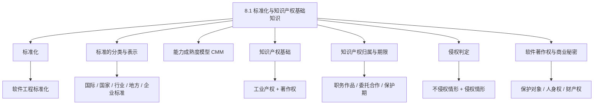
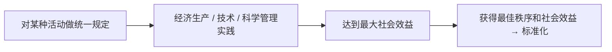
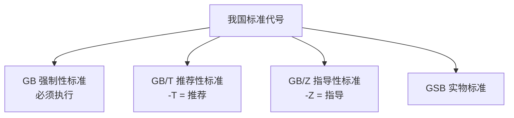
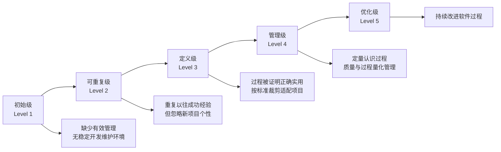
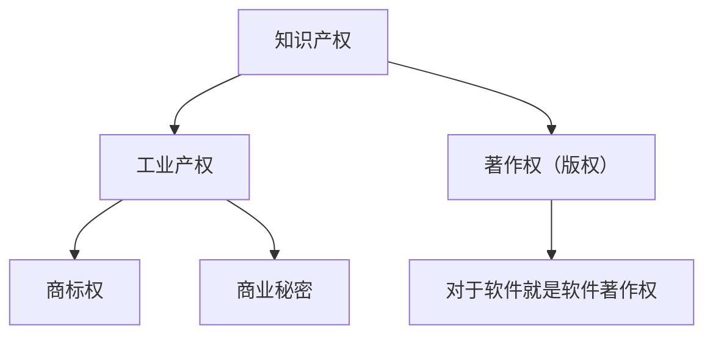
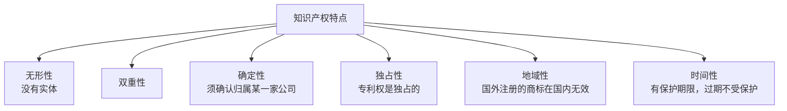
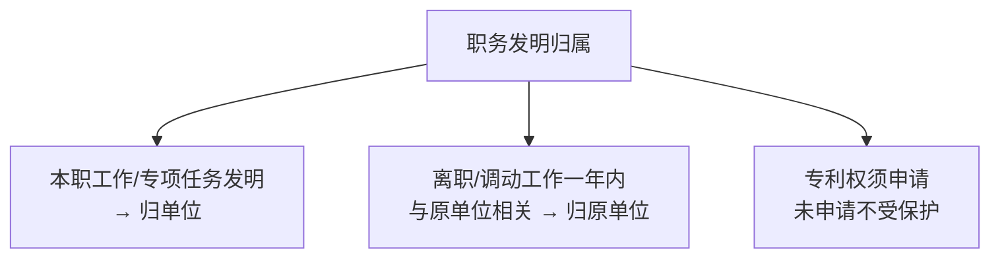
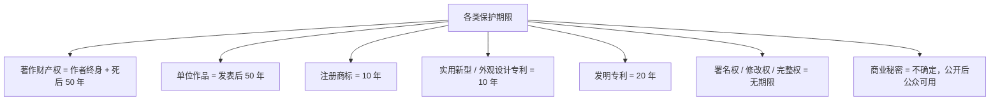
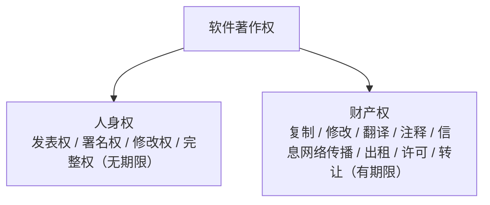
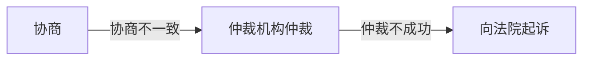

课程链接：视频《8.1 标准化与知识产权基础知识》（软考程序员系列课程）

视频链接：

## 本节概述

本节是系列课程的第二十三节课，进入教材第 8 章「标准化和知识产权基础知识」，本节讲解标准化与知识产权的入门知识。这一章内容多而杂，但考点相对集中，记住"怎么考"比背下全部法条更划算。本节脉络依次是：标准化概念 → 软件工程标准化 → 标准的分类（国际/国家/区域/行业/地方/企业标准及代号）→ 标准表示方法（GB/GB/T/GB/Z 等）→ 能力成熟度模型 CMM 五级 → 知识产权的分类与特点 → 知识产权的归属（职务作品/委托合作开发/先申请原则）→ 保护期限 → 侵权判定（不侵权与侵权两种情形）→ 软件著作权 → 商业秘密 → 实例分析。

先看一张本节的知识地图，把整节内容装进脑子里：

## 标准化

**什么是标准化？** 做一件事时对它进行**统一规定**，使我们在经济生产或技术、科学管理的社会实践中，**达到最大的社会效益，并获得最佳的秩序和社会效益**，这种过程称为**标准化**。

**软件工程的标准化**又包括：**过程标准、产品标准、专业标准、技法标准、维护规范和质量规范**。

> [!NOTE]
> 标准化定义了解即可。重点记软件工程标准化包含那六类规范。

## 标准的分类

标准按**适用范围**分类，常见的考点是**国际标准、区域标准、国家标准**等组织代号——记代号对应的组织名。

### 国际标准

- **ISO**：国际标准化组织（**ISO**）。
- **ISO/IEC**：国际电工委员会（**IEC**）与国际标准化组织联合，常写作 **ISO/IEC**。

### 国家标准

国家标准的代号代表国家，**这是重点**：

| 代号 | 代表 |
|---|---|
| **GB** | **中国** |
| **ANSI** | **美国** |
| **BS** | **英国** |
| **JIS** | **日本**（易错点：视频读作"GIS"，教材为 JIS） |
| **GJB** | **中国军用标准** |
| **MIL** | **美国军用标准** |
| **IEEE** | **美国电气电子工程师协会**（i-Switch 读作"i-trip"，实为 IEEE） |

> [!WARNING] 真题考点
> **GB=中国、ANSI=美国、BS=英国、JIS=日本**这组国别代号常考，尤其 JIS（日本）别被误解成中国。**IEEE 是美国电气电子工程师协会**。

### 区域标准

- **PASC**：**太平洋地区标准会议**（视频读"PASE"，教材为 PASC）。
- **CEN**：**欧洲标准委员会**。
- **ASAC**：**亚洲标准咨询委员会**。
- **ARSO**：**非洲地区标准化组织**。

> [!NOTE]
> 区域标准了解即可。

### 地方标准 / 企业标准

- **地方标准**：由**地方一级行政机构**制定的标准。
- **项目标准 / 企业标准**：企业、项目内部制定的规范。

## 标准的表示方法

标准的表示(编号)一般由四部分组成：**标准代号、专业代号、顺序号、年号**。重点记我国各种标准的**代号后缀**。

- **GB**：**强制性标准**，**必须实施**，由我国标准化法律所规定强制执行。
- **GB/T**：**推荐性标准**（`T` 取自"推"），非强制、推荐采用。
- **GB/Z**：**指导性标准**（`Z` 取自"指"）。
- **GSB**：**实物标准**。

> [!WARNING] 真题考点
> **推荐性标准是 GB 后带字母 T**；强制性标准是 GB 不带后缀。认准 **GB=强制、GB/T=推荐、GB/Z=指导**。

### 行业 / 地方 / 企业标准代号

- **行业标准**代号由**汉语拼音**缩写组成，如**电子行业标准是 SJ**。
- **地方标准**代号为 **DB + 省级行政区划前两位**数字。
- **企业标准**代号为 **Q + 企业代号**。

> [!NOTE]
> 记**电子行业=SJ、地方=DB、企业=Q**这个代号习惯即可。

## 能力成熟度模型（CMM）

能力成熟度模型又称 **CMM**（Capability Maturity Model），分为**五个级别**，逐级提升。这块与软件工程章节的能力成熟度相关，放在本节一起理解。

- **初始级（1 级）**：企业**缺少有效的管理**，**不具备稳定的软件开发和维护环境**。
- **可重复级（2 级）**：**新项目的计划与管理基于以往同类项目的成功经验**。优点能确保"再一次成功"；**缺点**是**忽略了新项目的个性**，因为每个项目都是有个性的，只照搬以往经验是有风险的。
- **定义级（3 级）**：**企业标准软件过程被证明是正确的且实用的**。所有开发项目需**根据标准过程裁剪出与项目相适应的过程**并执行。
- **管理级（4 级）**：企业**开始定量地认识软件过程**——软件活动构成软件过程，**软件质量管理和软件过程管理都是一种量化的管理**，能给出定量的、量化的管理。
- **优化级（5 级）**：**支持软件过程改进的可持续性**，能**持续性地改进软件过程**。

> [!NOTE]
> CMM 五级理解性记忆即可：初始（无序）→ 可重复（复制经验）→ 定义（标准+裁剪）→ 管理（量化）→ 优化（持续改进）。

## 知识产权基础

### 知识产权的分类

知识产权从分类上可分为**工业产权**和**著作权**两类：

- **工业产权**：包括**商标权**和**商业秘密**等。
- **著作权**：**著作权又称版权**。注意**版权和著作权是同一概念**（真题常问"版权等同于下面哪项权利"→ 著作权）。

### 知识产权的特点

知识产权具有以下特点：**无形性、双重性、确定性（确认性）、独占性、地域性、时间性**。

这几个性质在**侵权判定**里面都有体现：

- **时间性**：保护有**时效**，过了这个时间就不再保护。
- **地域性**：权利只在特定地域有效，例如**在国外注册的商标，在国内不能直接使用**、不受保护。
- **独占性**：体现在**专利权上它是独占的**。
- **确定性（确认性）**：例如**商标必须确认为某一家公司所注册、所持有**，注册了以后才能受到保护。在不确定的情况下，甚至只能靠"抽签/抓阄"来决定归属（这是一种无奈的方法）。

## 知识产权的归属

### 职务作品的归属

**职务作品**：利用**单位的物质技术条件进行制作，并由单位承担责任**的作品。

- **除了署名权外，其他著作权均归单位**，其中**署名权可以归个人**。
- 有**合同约定**著作权归单位的，同样按约定归属。
- **其他情况**：**作者拥有著作权，单位拥有优先使用权**。（这个要明确：作者有著作权，单位有优先使用权）

### 软件的职务作品 / 专利的职务发明

- **软件职务作品**：属于**本职工作中明确规定的开发目标**，或属于**从事本职工作活动的结果**；使用了单位的**资金、专用设备、未来公开的信息、物质条件**，并由**单位或组织承担责任**的软件，**单位享有著作权**。
- **专利的职务发明**：**本职工作中作出的发明创造**，以及**履行本单位交付的本职工作之外的任务所作出的发明创造**，均属职务发明；**离职、调动工作一年内**（注意这个时间）作出的与原单位相关的发明，**专利权归原单位**。
- 注意：**专利权是在申请以后才能获得保护的**，**没有申请不受保护**。

### 委托开发与合作开发作品

- **委托开发**：有合同约定的，著作权**归委托方**；**合同未约定归属的，归创作方（受托方）**。
- **合作开发**：**只进行组织、提供咨询意见、物质条件或进行其他辅助工作的合作者，不享有著作权**；**共同创作的，共同享有著作权**；如果作品是可以分开的，就可分开申请。

### 商标与专利的申请原则（先申请原则）

- **商标**：采用**先申请先使用**的原则；**如果同时申请、同时使用**，则**协商解决**，**协商不能达成一致的，抽签（抓阄）决定**——目的是**必须确定商标属于哪家公司**。
- **专利**：**先申请先拥有**；如果**同时申请**，先**协商归属**；但不能同时驳回申请。

> [!WARNING] 真题考点
> **委托开发未约定归属 → 归创作方（受托方）；先申请原则：商标同时申请→协商→抽签，专利同时申请→协商**。职务发明"离职一年内归原单位"，时间点要记。

## 保护期限（时间性）

各权利的保护期限不同，这是**数字记忆型考点**。

### 公民作品著作权的期限

- **署名权、修改权、保护作品完整权**（精神/人身权利）：**没有期限**——永远保护，目的是最大程度体现作者的意志。
- **发表权、使用权、获得报酬权**（财产权利）：有期限，保护期为**作者的终身及死后 50 年**（即**到第 50 年的 12 月 31 日止**）。

### 单位作品著作权的期限

- 单位作品具有**发表权、使用权、获得报酬权**，保护期为 **50 年**，**从发表当年开始算起 50 年**。
- **未发表的不受保护**。

### 软件作品的著作权期限

- 公民软件作品：**署名权、修改权没有期限**；**发表权、翻译权、发行权、出租权、信息网络传播权等**为**作者的终身及死后 50 年**。
- 软件属于**合作开发**的，以**最后死亡的作者**为准。
- **单位软件产品**：发表权、翻译权、复制权、发行权、出租权、网络使用权等，**发表后保护 50 年，未发表不受保护**。

### 商标、专利的期限

- **注册商标**有效期为 **10 年**。注册人**死亡或公司倒闭**、**一年未转让**的、**到期前六个月内应续展**。
- **实用新型和外观设计专利权**：**10 年**，从**申请之日**开始算起。
- **发明专利**权：**20 年**，从**申请之日**算起。
- **商业秘密**：保护期**不确定**，而**公开后公众可以使用**。

> [!WARNING] 真题考点（数字要记牢）
> **著作权财产权=作者终身+死后 50 年（合作开发按最后死亡作者）；单位作品=发表后 50 年、未发表不保护；注册商标=10 年；实用新型/外观设计专利=10 年；发明专利=20 年（都从申请日起算）**。隐私、署名/修改/完整权无期限。

## 侵权判定

### 著作权保护和不受保护的内容

- **中国公民、法人或其他组织的作品，无论是否发表，都享有著作权**。
- **开发的思想、处理过程、操作方法、数学概念不受保护**。因为**思想类的东西若受保护会限制我们的创新思维发展**。
- **著作权法不适用**：法律法规、国家机关的决定决议命令、其他具体的立法/行政/司法性质的文件，以及官方正式译文、时事新闻、立法通用数表、通用表格、公式等。

> [!NOTE]
> 真题：**不受著作权保护**的包括"国务院颁发的《计算机软件保护条例》"这类**法规性文件**，以及官方正式译文、时事新闻、通用表格公式。思想、算法、数学概念不受保护。

**一道历年真题**：某人写了一篇文章并发表，之后被国家机关看中并作为官方正式文章发表。那么他拥有著作权的期限是**从发表之日起，到被官方正式录用为官方正式译文这个时段**。**一旦被官方录用为正式译文，他的著作权就丧失了**。

### 不构成侵权的情形（合理使用 / 法定许可）

属于**不构成侵权**的情况包括：

- 用作**个人学习、研究或欣赏**的学习性东西。
- **适当引用**：如论文中引用不超过 **30%** 的内容，并**注明引用的文献**。
- **公开演讲**的内容；用于**教学和科研**的。
- **复制馆藏作品**；**免费表演**他人的作品。
- 对**室外公共场所**艺术品进行**临摹、绘画、摄影和录像**。
- 将**汉语翻译成少数民族语言或盲文**出版（促进文化交流）。

### 构成侵权的情形

以下行为**构成侵权**：

- **未经许可发表他人作品**。
- **未经许可将合作作品作为个人作品发表**。
- **未参加创作，却在他人的作品上署名**。
- **歪曲、篡改他人作品；剽窃他人作品；使用他人作品而未给报酬**。
- **未经出版者许可，使用其出版的期刊、图书的版式设计**（版式设计也受保护）。
- 例如网上某些**字体**被某个人注册为专利权，使用该字体也会构成侵权。

> [!WARNING] 真题考点
> **合理使用（不侵权）**：个人学习欣赏、适当引用（≤30% 并注明）、公开演讲、教学科研、复制馆藏、免费表演、室外公共场所临摹绘画摄影录像、译成少数民族语言/盲文。**侵权**：未经许可发表、合作作品当个人作品、未参加创作署名、歪曲篡改、剽窃、用而不给报酬、盗用期刊图书版式设计。

## 软件著作权

**软件著作权的保护对象是计算机程序和相关文档**。不保护的是：计算机软件开发中所涉及的**思想、概念、发现、原理、算法、处理过程和运算方法**（即只保护表达，不保护思想）。

**软件著作权包括人身权和财产权**：

- **人身权**：**发表权、署名权**（精神权利）。
- **财产权**：使用权、**复制权、修改权、翻译权、注释权、信息网络传播权、出租权**、使用权许可和获得报酬权、转让权。

> [!NOTE]
> **修改权、署名权、保护作品完整权**这类精神权利**没有时间效应**；其他财产类权利**有时间效应**（作者终身+死后 50 年）。

## 商业秘密

**商业秘密**是指**不为公众所知**、**能为权利人带来经济效益**、**具有实用性**、并为权利人**采取了保密措施**的**技术信息和经营信息**。

它的**三个必备条件**：

1. **不为公众所知**（秘密性）。
2. **能够带来经济效益**（价值性）。
3. **采取了保密措施**（保密性，实用）。

**保密的对象是技术信息和经营信息**。**软件在尚未开发完成时**，在软件开发中所形成的知识内容**也可以构成商业秘密**。商业秘密保护期不确定，一经公开公众即可使用。

## 实例分析（历年真题）

### 实例 1：画家作品被注册为商标

某画家的一幅作品，在**未被允许**的情况下，被某公司**注册为该公司的商标**并大量复制/使用在该公司的软件上。

- **结论**：该公司构成的侵权属于**著作权法**保护的侵权（画家的作品未注册商标，所以不构成**商标**侵权，而属于**作品**侵权——著作权）。
- **画家维权的流程**：**① 先协商 → ② 协商不成向仲裁机构申请仲裁 → ③ 仲裁不成向法院起诉**。

> [!WARNING] 真题考点
> 画家作品被注册为商标并用到软件上 → 侵犯的是**著作权**（不是商标权）。维权顺序固定为**协商 → 仲裁 → 诉讼（起诉）**。

### 实例 2：委托开发软件的著作权归属

甲公司受乙公司**委托开发**了一款软件，**在未签订任何委托合同**的情况下：

- **结论**：软件著作权**归甲公司（受托方）所有**。因为委托开发未签合同/协议，著作权归创作方。

### 实例 3：iPad 商标的地域性

Ipad 被我国的某**电池生产商**注册为商标，并大量使用在电池产品上；而某**电脑公司**在**国外**也注册了该商标。若该电脑公司在**我国**使用 ipad 作为自己的产品商标：

- **结论**：**构成侵权**，侵犯了电池生产商的**商标权**。因为这体现了知识产权的**地域性**——在国外注册的商标，**在国内无法进行认定和保护**。

> [!NOTE]
> 这个实例对应知识产权"地域性"特点：权利的保护以注册国家/地域为界，国外注册的商标在国内不受保护。

## 本节小结

① **标准化与标准分类**：标准化=对活动做统一规定以获最佳秩序与最大社会效益。软件工程标准化=过程/产品/专业/技法标准 + 维护规范 + 质量规范。标准分类=国际（ISO、ISO/IEC）、区域（PASC、CEN、ASAC、ARSO）、国家、行业、地方（DB）、企业（Q）。

② **标准代号（重点）**：**GB=中国、ANSI=美国、BS=英国、JIS=日本**；**GJB/MIL=中国/美国军用标准，IEEE=美国电气电子工程师协会**；**电子行业=SJ**。表示方法=标准代号+专业代号+顺序号+年号。**GB=强制、GB/T=推荐、GB/Z=指导、GSB=实物**。

③ **能力成熟度模型 CMM 五级**：初始级（无序）→ 可重复级（复制成功经验，忽略新项目个性）→ 定义级（标准过程经证明正确实用并裁剪适配）→ 管理级（定量/量化管理）→ 优化级（可持续改进过程）。

④ **知识产权基础**：分**工业产权（商标、商业秘密）**和**著作权（版权，二者同义）**。特点=**无形性、双重性、确定性、独占性（专利）、地域性（国外商标国内无效）、时间性（有期限）**。

⑤ **归属**：**职务作品除署名权外归单位、署名权归个人；作者拥有著作权时单位有优先使用权**。**委托开发无约定归受托方；合作开发仅出辅助不享著作权、共同创作共同享有**。**商标=先申请先使用、同时申请协商→抽签；专利=先申请先拥有、同时申请协商**。职务发明离职一年内归原单位，专利权须申请才受保护。

⑥ **保护期限**：**著作财产权=终身+死后 50 年（第50年12月31日止，合作按最后死亡作者）；单位作品=发表后 50 年且未发表不保护；署名/修改/完整权=无期限；注册商标=10 年；实用新型/外观设计=10 年；发明=20 年（均从申请日算起）；商业秘密=不确定，公开后公众可用**。

⑦ **软件著作权与商业秘密**：保护对象=**计算机程序和相关文档**，不保护思想/原理/算法/处理过程/方法。含**人身权（发表权、署名权，无期限）**与**财产权（复制/修改/翻译/注释/信息网络传播/出租/许可/转让，有期限）**。**商业秘密三条件=不为公众所知 + 带来经济效益 + 采取保密措施**，对象是技术信息和经营信息，未开发完成的数据也可构成。

⑧ **侵权判定（真题）**：**不侵权**=个人学习欣赏、适当引用≤30% 并注明、公开演讲、教学科研、复制馆藏、免费表演、室外公共场所临摹绘画摄影录像、译少数民族语言/盲文。**侵权**=未经许可发表、合作作品当个人作品、未参加创作署名、歪曲篡改、剽窃、用而不给报酬、盗用期刊图书版式。**实例**：画家作品被注册为商标并用在软件上→侵犯著作权，维权流程=协商→仲裁→起诉；委托开发无合同→归甲公司；iPad 国外注册商标在国内使用→侵犯国内注册方商标权（地域性）。