课程链接：视频《6.1 数据库系统基础》（软考程序员系列课程）

视频链接：

## 本节概述

本节是系列课程的第十八节课，进入教材第 6 章「数据库基础知识」。软考的上午题会围绕数据库的基本概念出选择题，本节先把整个数据库的"骨架"建立起来。本节脉络依次是：数据库系统的组成 → 数据库管理技术的发展（三阶段）→ 大数据 → 数据库管理系统 DBMS → 数据模型（三要素、E-R 模型、层次/网状/关系模型）→ 三级模式两级映射。最后这一块是本节的重中之重，几乎年年考。

先看一张本节的知识地图，把整节内容装进脑子里：

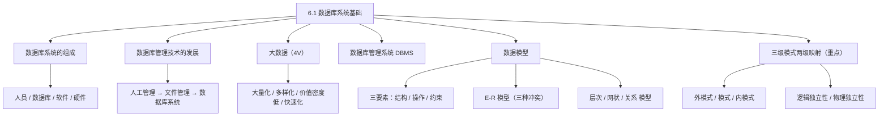

## 数据库系统的组成

数据库系统不是"一个软件"这么简单，它是围绕数据组织起来的一整套体系。**一个完整的数据库系统包括四个部分：人员、数据库、软件和硬件**。

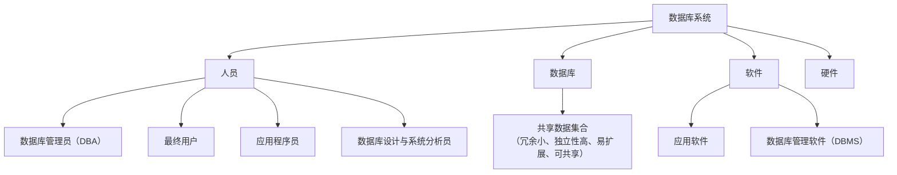

**人员**分四类，各司其职：

- **数据库管理员（DBA）**：负责数据库的建立、维护和日常管理，是"管库"的人。
- **最终用户**：通过应用程序使用数据库的人，一般不用直接面对数据。
- **应用程序员**：编写访问数据库的应用程序的人。
- **数据库设计与系统分析员**：负责分析和设计数据库结构的人。

**数据库**是数据的一种**有组织的共享数据集合**。它和普通文件堆不一样，具有这些特点：**冗余较小**（同一份数据尽量只存一份）、**独立性较高**（数据的结构变化不影响程序）、**易扩展**，并且**能被各类用户共享**。

> [!TIP] 通俗理解
> 把数据库想象成一个"共享仓库"：以前每个人自己揣着一份材料的复印件（文件各自存，冗余又重复）；有了数据库，全公司共用同一个仓库，东西只放一份，谁要用谁去取。这就是"共享""少冗余""易扩展"。

**软件**包括**应用软件**（我们写的那些访问数据库的程序）和**数据库管理软件（DBMS）**——DBMS 才是真正负责管理数据库的那个核心软件，后面会专门讲它。

**硬件**就是承载这一切的物理设备和存储介质（主机、磁盘等）。

## 数据库管理技术的发展

数据库不是一出生就这么完善，它经历了**三个阶段**：人工管理阶段 → 文件管理阶段 → 数据库系统阶段。理解这段演变，就能理解"为什么要有数据库"。

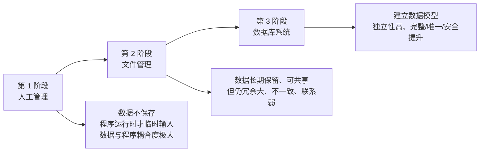

**人工管理阶段**（计算机刚出现时期）：

- 数据**不保存**，程序运行的过程中临时输入。
- 数据与程序之间**耦合度非常大**，程序对数据的**依赖性很强**。
- 数据量非常小。

**文件管理阶段**：

- 数据可以**长期保留**在文件里，实现了**共享**，不再完全属于某一个特定应用。
- 但因为没有专门的软件统一管理数据，仍然存在三个明显缺点：**数据冗余大**（同一数据多处重复存储）、**数据不一致**（一处改了别处没改，数据对不上）、**数据联系弱**（文件之间关系松散）。

> [!WARNING] 真题考点
> 三个阶段的顺序、每个阶段的典型特征（尤其文件管理阶段"冗余大、不一致、联系弱"这三个缺点）是常考的识记点。要能根据描述判断属于哪个阶段。

**数据库系统阶段**：

- **建立了数据的模型**，能整体描述数据及数据间的关系。
- 有较高的**数据独立性**。
- 数据的**存储完整性、唯一性、安全性**都得到了明显提升。

## 大数据

大数据是对海量数据的统称，它有一个经典的概括叫 **4V**：**大量化（Volume）、多样化（Variety）、价值密度低（Value）、快速化（Velocity）**。这四个 V 正好对应大数据"多、杂、淡、快"四个特点。

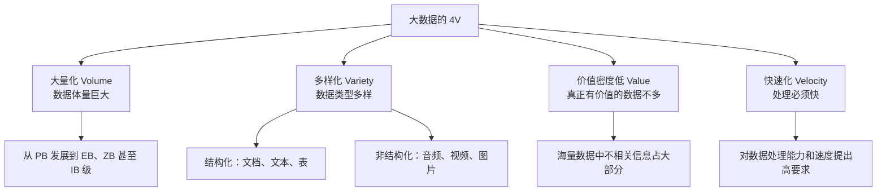

- **大量化（Volume）**：数据体量很大，从过去的 PB 级发展到字节级（EB、ZB）甚至更大。一个字别记数字，记住"海量"即可。
- **多样化（Variety）**：数据的类型多样。不只是**结构化数据**（如文档、文本、表格这类整齐的数据），还包括大量**非结构化数据**（如音频、视频、图片），这对数据处理提出了更高要求。
- **价值密度低（Value）**：数据量虽然巨大，但其中**真正有价值的数据并不多**，不相关的内容占了大部分。就好比金山里矿石很多，但金子在矿石中的占比很低。
- **快速化（Velocity）**：要求**数据处理能力要快、处理工具要能快速应对**。数据是流动的，慢了就失去实时价值。

**大数据带来的三大挑战**：

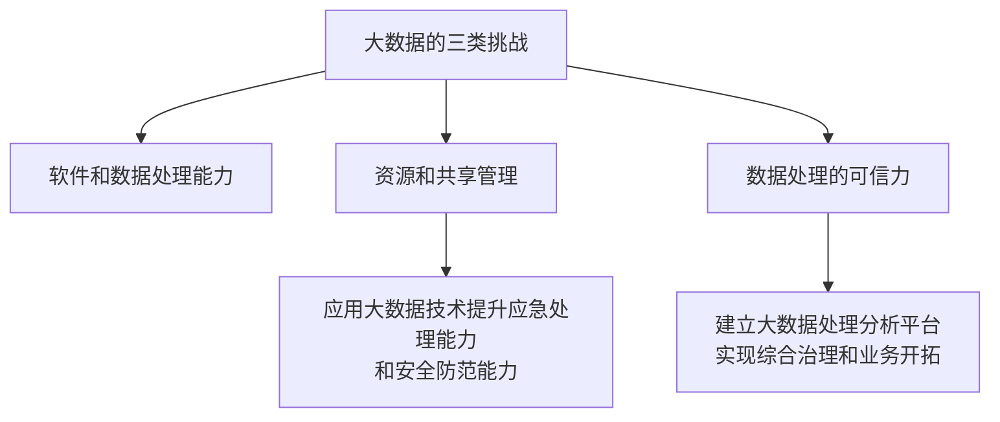

**大数据的安全风险**：大数据同样是一把双刃剑，可能带来这些安全上的威胁——**泄露用户隐私；更容易成为网络攻击的显著目标；威胁到现有的存储以及安防；可能成为高级可持续攻击（APT）的载体；同时也能为信息安全提供新的支撑**。

## 数据库管理系统（DBMS）

**DBMS 就是管理数据库的那个核心软件**，它负责数据的存储、组织、访问和管理，是数据库系统"软件"部分最关键的成员。DBMS 具有五大类**功能**：

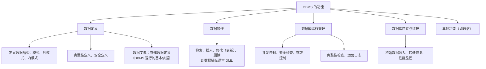

- **数据定义（DDL）**：对数据结构进行描述——定义**模式、外模式、内模式**、数据库的**完整性**和**安全**限制。这些定义内容集中存储在**数据字典**中，数据字典是 DBMS 运行的基本依据。
- **数据操作（DML）**：对数据进行增删改查——**检索、插入、修改（更新）、删除**。
- **数据库运行管理**：包括**并发控制**（多人同时操作不冲突）、**安全检查**、**存取控制**（谁能访问什么）、**完整性检查**、**运营日志**（记录操作的轨迹，用于恢复）。
- **数据库建立与维护**：如初始数据装入、数据转储与恢复、数据库性能监控等。
- **其他功能**：如**通信功能**等。

**DBMS 的特征**：

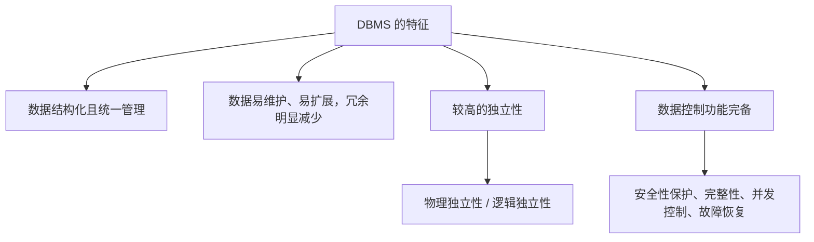

**DBMS 的分类**：

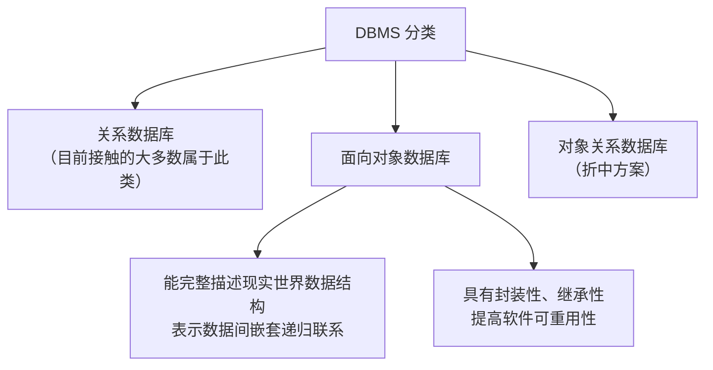

我们日常接触到的绝大多数数据库（如 Oracle、MySQL）都属于**关系数据库**；此外还有能更完整描述现实世界对象关系的**面向对象数据库**，以及介于两者之间的**对象关系数据库**。

## 数据模型的基本概念

数据模型是"如何用计算机的方式去描述现实世界数据"的抽象。所有数据模型都由**三要素**构成：**数据结构、数据操作、数据约束**。

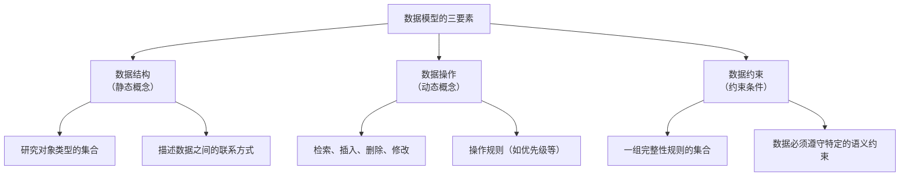

- **数据结构**：是**研究对象类型的集合**，描述数据库里的数据长什么样、怎么组织的，是一种**静态**的概念。比如"学生"有哪些字段（学号、姓名等），之间什么关系。
- **数据操作**：是对数据进行的操作，包括**检索、插入、删除、修改**，还有**操作规则**（如优先级），是**动态**的概念，描述数据能"做什么"。
- **数据约束（约束条件）**：是**一组完整性规则的集合**，数据必须遵守特定的**语义约束**。比如人事管理中要求**男职工的年龄在 18 岁到 60 岁**的范围之内——这就是一条约束。约束定义了数据"必须满足什么规矩"。

> [!NOTE]
> 记一个口诀帮零基础记忆三要素：**"数据是什么样子（结构）、能对它做什么（操作）、必须守什么规矩（约束）"**。

## 数据模型的分类

按抽象层次不同，数据模型分为两大类：**概念数据模型**和**基本数据模型（结构数据模型）**。

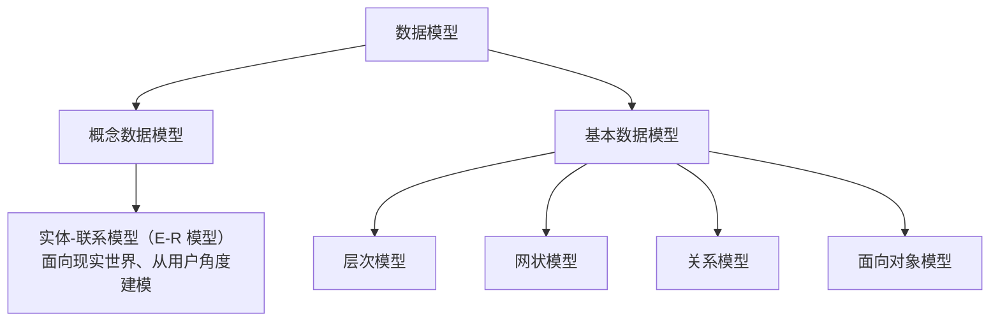

- **概念数据模型**：面向**现实世界与用户**的理解，最常见的就是**实体-联系模型（E-R 模型）**，它不关心计算机怎么存，只关心业务世界有哪些"实体"和"联系"。
- **基本数据模型**：面向**数据库的实现**，具体描述数据在数据库里怎么组织，包括**层次模型、网状模型、关系模型**和**面向对象的模型**。

## E-R 模型

**E-R 模型（实体-联系模型）**是概念建模的核心，它用简单的图形符号把现实世界画成一张"图"。先搞清楚它用的三种基本图形符号：

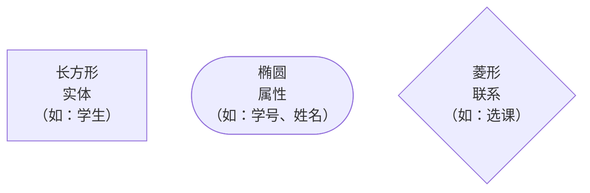

- **实体**：用一个**长方形**表示，是现实世界中可区分的事物，比如"学生""课程"。
- **属性**：用一个**椭圆**表示，描述实体的特征。比如学生的属性有**学号、姓名、性别、年龄**。
- **联系**：用一个**菱形**表示，描述实体之间的关系，比如学生与课程之间的"**选课**"联系。
- **主键（主码）**：能**唯一标识**实体的那个属性。在 E-R 图中，主键属性的下方要画一条**下划线**标出来。比如学生的主键是"学号"，课程的主键是"课程号"。

> [!TIP] 通俗理解
> 记住三件事：**实体是"名词"（东西），属性是"它的特征"，联系是"它俩的关系"**。画图时对应三种形状：矩形、椭圆、菱形。

找一个常见的例子看整体：**学生"选课"课程**。一个学生可以选多门课程，一门课程可以被多个学生选，所以学生与课程之间是**多对多**的关系。

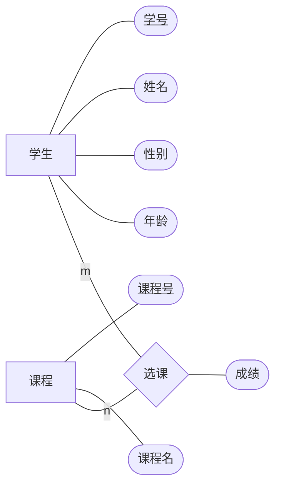

> [!NOTE]
> 上图是陈氏 E-R 图的标准画法：**实体（学生、课程）用长方形，属性（学号、姓名、成绩等）用椭圆，联系（选课）用菱形**；主键（学号、课程号）名称下方加下划线；`m` 和 `n` 表示多对多。E-R 图要会认、会画，这是软考常考的内容。

### E-R 模型的三种冲突

当把多个局部的 E-R 图合并成全局的 E-R 图时，不同视图之间可能发生冲突。需要记住**三种冲突：属性冲突、命名冲突、结构冲突**。

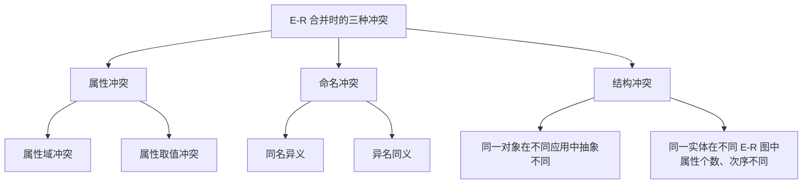

- **属性冲突**：又分为**属性域冲突**（同一属性在不同的图里取值域不一样）和**属性取值冲突**（同一属性取值范围或单位不一致，比如有的用字符串、有的用编码）。
- **命名冲突**：分两种情况——**同名异义**（名字相同、含义不同）、**异名同义**（名字不同、含义相同）。举个例子：同一门课程，一个应用叫它"计算机程序设计"，另一个应用叫它"C 语言程序设计"，名字不同但指的是同一门课——这就是**异名同义**，属于命名冲突。
- **结构冲突**：**同一对象在不同应用中具有不同的抽象**。比如同一个人，在单位里是"员工"，在阅览室里是"读者"，他在不同场合充当了不同的角色，结构上就产生了冲突；此外，同一实体在不同 E-R 图中属性个数、排列次序不同，也是结构冲突。

> [!WARNING] 真题考点
> **三种冲突要会判断**：给一个具体场景，能说出它属于属性冲突、命名冲突还是结构冲突。这是常考的识记辨析题。

## 基本数据模型：层次、网状、关系

前面讲过基本数据模型包括层次、网状、关系、面向对象。其中**层次、网状、关系**是三种最经典的模型，下面逐个看它们长什么样。

### 层次模型

**层次模型**用**树形结构**来表示数据间的联系，数据之间的层次关系**一层一层递进**，就像文件夹的多级目录：每个上层结点可以有多个下层结点，而每个下层结点只有一个上层结点（一对多）。

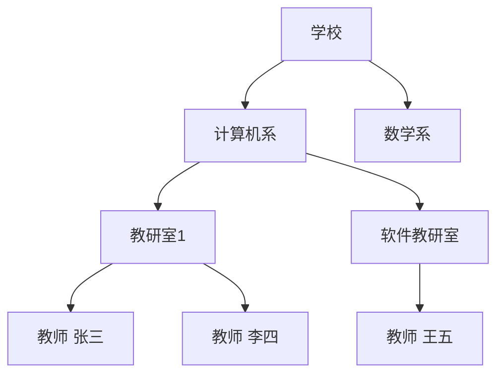

> [!TIP] 通俗理解
> 层次模型像一棵**家谱树**，也像一个**文件夹目录**：一个"父"下面可以有很多"子"，但每个"子"只能有一个"父"。它的结构天然是"上下级"的。

### 网状模型

**网状模型**用**网状结构**表示数据间的联系，允许一个结点有**多个父结点**，数据之间的联系更灵活、更复杂。比如一个"专业"下面既有教研室、又关联课程和学分，而教师与课程之间、学生与课程之间又相互发生联系，整个就交织成一张**网**。

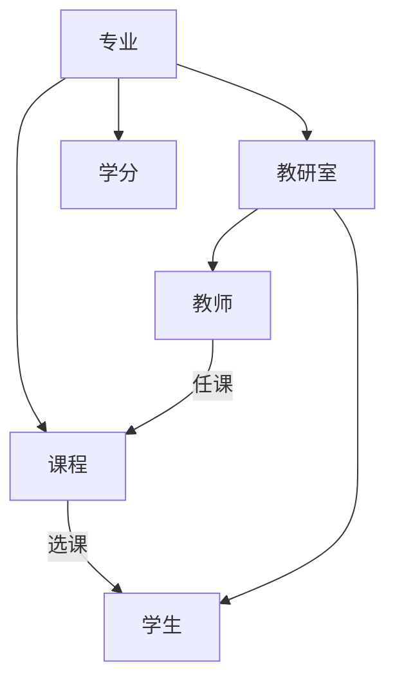

> [!TIP] 通俗理解
> 网状模型像一个**社交关系网络**：一个人可以和很多人相连，这个"结点"既能跟上面连、又能跟旁边连，关系成网，比层次模型灵活，但也更复杂。

### 关系模型

**关系模型**用**二维表（关系）**来表示数据和数据之间的联系。每一张表就是一个"关系"，表的**行**称为**元组**（一条记录），表的**列**称为**属性**。这是目前使用最广的模型。

| 学号 | 姓名 | 系别 | 年龄 | 性别 |
|---|---|---|---|---|
| 01001 | 张三 | 信息系统系 | 20 | 男 |
| 01002 | 李四 | 计算机系 | 21 | 男 |

> [!NOTE]
> 关系模型就是"一张张表格"。你平时在 Excel 里看到的那种二维表，本质就是关系模型中一个"关系"。Oracle、MySQL 这类数据库都是建立在关系模型之上的。

## 三级模式两级映射（重点）

这是本节最核心、软考**几乎必考**的内容。数据库系统为了保证数据的独立性，从底层到上层分成了**三级模式**，并且在相邻两层之间各有**一级映像**（映射）。

**三级模式：外模式、模式（概念模式）、内模式**。

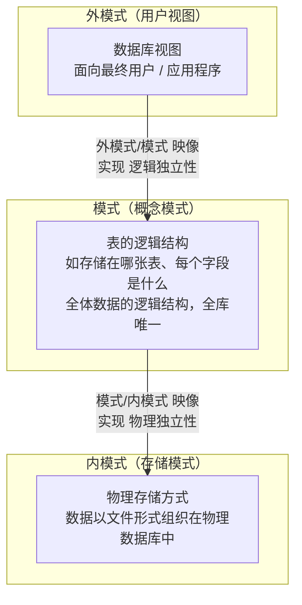

- **外模式（子模式、用户模式）**：面向**用户和应用程序**的逻辑视图，通常就是给用户看的**数据库视图**。它只暴露用户需要的那部分数据。一个数据库可以有**多个外模式**（不同用户看到不同视图）。
- **模式（概念模式）**：描述**全体数据的逻辑结构**，比如"数据存在哪张表、每个表有哪些字段、字段是什么类型"，是与现实世界相对应的整体逻辑结构。一个数据库**只有一个模式**。
- **内模式（存储模式）**：描述数据的**物理存储**方式，数据在物理数据库中是以**文件形式**组织的。存储位置、文件的内容都体现在这一层。

**两级映射与数据的独立性**。这两层映射的最终目的，就是实现**数据的独立性**——让底层的变化尽可能不影响上层应用。

先看**物理独立性**：

**物理独立性**是指：当**存储位置和存储的文件内容发生变化**（内模式改变）时，**表、字段这些逻辑结构（模式）不发生改变**，用户的应用程序也不用改。这份"物理→逻辑"的自由，由 **模式/内模式 映像**实现。

再看**逻辑独立性**：

**逻辑独立性**是指：当**模式（数据的逻辑结构）发生改变**时，**外模式（用户的视图）保持不变**，应用程序也**不需要修改**。这份"逻辑观点→用户视图"的自由，由 **外模式/模式 映像**实现。

> [!WARNING] 真题考点
> 记住一对对应关系：**模式/内模式 映像 → 物理独立性**；**外模式/模式 映像 → 逻辑独立性**。考查方式是给出"存储结构变了但应用不变"或"表结构变了但用户视图不变"，问实现的是哪种独立性，务必分清。

> [!TIP] 通俗理解
> 把数据库想成一栋楼的"管道系统"：**内模式**是埋在地下的水管走向，**模式**是每层楼的总平面图，**外模式**是你房间里看到的开关。水管改道（内模式变）不影响你屋里开关（逻辑独立性）；整栋楼户型调整（模式变）也不影响你房间的开关（逻辑独立性）。

## 本节小结

① **数据库系统的组成**：人员（DBA、最终用户、应用程序员、设计与系统分析员）、数据库（共享数据集，冗余小、独立性高、易扩展）、软件（应用软件 + DBMS）、硬件。数据库管理技术分三阶段：**人工管理**（数据不保存、与程序耦合强）→ **文件管理**（数据保留共享，但冗余大、不一致、联系弱）→ **数据库系统**（建数据模型、独立性高、完整/唯一/安全提升）。

② **大数据 4V**：大量化、多样化、价值密度低、快速化；带来软件处理能力、资源与共享管理（提升应急与安全）、数据可信力（建分析平台）三大挑战；有隐私泄露、成攻击目标、威胁存储安防、成 APT 载体等安全风险。

③ **DBMS**：功能五大类——数据定义（含数据字典）、数据操作（增删改查 DML）、运行管理（并发/安全/存取/完整性/日志）、建立与维护、其他（通信）；特征是结构化、易维护扩展、冗余少、独立性高、控制功能全；分类有**关系数据库（主流）、面向对象数据库、对象关系数据库**。

④ **数据模型**：三要素=**数据结构（静态）、数据操作（动态）、数据约束（规则）**；分**概念模型（E-R 模型）**与**基本模型（层次、网状、关系、面向对象）**。E-R 图中**实体=矩形、属性=椭圆、联系=菱形、主键属下加下划线**；E-R 合并有**三种冲突：属性冲突、命名冲突、结构冲突**。

⑤ **三级模式两级映射（重点）**：外模式=用户视图、模式=全体逻辑结构（表）、内模式=物理存储（文件）。**模式/内模式映像→物理独立性**，**外模式/模式映像→逻辑独立性**。核心思想：底层变化不影响上层应用。