课程链接：视频《6.2 关系运算与 SQL 语言基础知识》（软考程序员系列课程）

视频链接：

## 本节概述

本节是系列课程的第十九节课，进入教材第 6 章「数据库基础知识」，本节主题为"关系运算与 SQL 语言基础知识"，对应教材 6.5 节「关系数据库与关系运算」、6.6 节「关系数据库 SQL 语言简介」和 6.7 节「数据库设计」。我们现在接触的数据库基本都是**关系数据库**，它的关系运算和查询建表语言，是数据库运行、维护和建立的基础，也是软考上午题必考的一块内容。本节脉络依次是：关系数据库的基本概念 → 关系代数运算 → 数据库范式（了解）→ SQL 语言 → 数据库设计（了解）。

先看一张本节的知识地图，把整节内容装进脑子里：

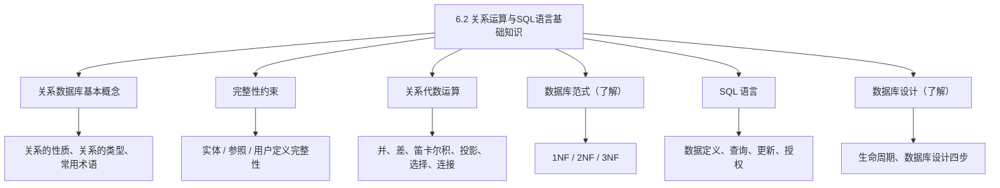

## 关系的性质

关系模型用**二维表**表示数据，这种"表"被称为**关系（Relation）**。一张合法的关系表要满足下面五条性质：

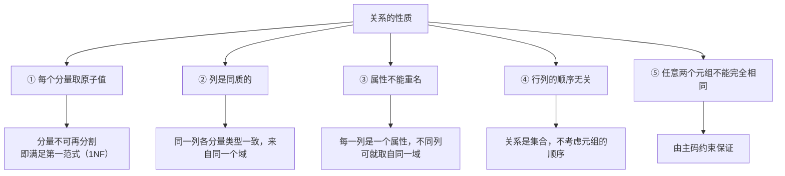

- **每个分量取原子值**：关系中每行每列交叉的那个值**不可再分割**。比如职称不能写"高级教师"这样一个能再拆成"教授""副教授"的组合值，否则就不满足第一范式。反过来，一个分量是"教授"或"副教授"这样的原子值就符合要求。
- **列是同质的**：同一列的各个分量必须是**同一类型**的数据，来自同一个**域**（取值范围）。
- **属性不能重名**：每一列是一个属性（列名唯一）；不同的列**可以取自同一个域**，但列名不能重复。
- **行列的顺序无关**：关系本质上是**集合**，因此**不考虑元组（行）之间的顺序**，怎么排序都是同一个关系。
- **任意两个元组不能完全相同**：表中的任意两行不能完全一样，这条由**主码约束**保证（后面会讲主码）。

> [!WARNING] 真题考点
> "分量必须是原子值"也就是**第一范式（1NF）**的要求，是常考选择点。判断一张表是否规范，先看它的分量是否能再分割。

## 关系的三种类型

按照"表"在数据库中的用途，关系分为三类：

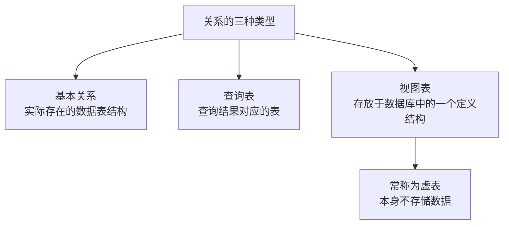

- **基本关系**：实际存在数据库里的**表结构**，是真正存数据的表。
- **查询表**：某次查询结果对应的表，可以理解成查询产生的临时结果。
- **视图表**：建立在一个或多个基本表之上、**存放于数据库中的一个"定义结构"**，本身并不存储数据，所以常被称为**虚表**。

## 关系数据库的常用术语

关系模型的术语，每一个都有明确的含义，逐个认清：

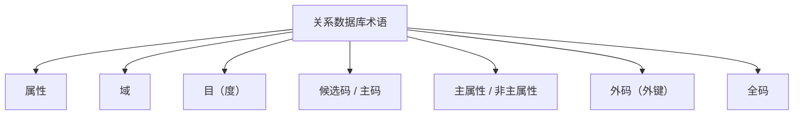

- **属性**：现实世界中的一个**事物具有的若干特征**，比如"学生"的特征有学号、姓名、年龄，这些特征就叫属性。对应到表里，就是**一列**。
- **域**：**属性的取值范围**。比如年龄的域是"0～100 岁之间"；超过这个范围的取值就是非法的。
- **目（度）**：**属性的个数**。一张表的属性有多少个，它的"目"就是多少。
- **候选码**：能**唯一标识一个元组**（一行）的一个或一组属性。候选码可能有多个。
- **主码（主键）**：从**候选码**中挑选出来的一个，作为主要标识，唯一标识每一条记录。一行一句记：候选码里挑一个当主码。
- **主属性**：**包含在任何候选码中的属性**。
- **非主属性**：不包含在任何一个候选码中的属性。
- **外码（外键）**：关系模式中的某个属性，是**其他关系的主码**，并且**受其约束**。它用来描述两个关系之间的参照联系。
- **全码**：关系模式的**所有属性组合起来**才构成候选码时，这个候选码叫全码。

> [!NOTE]
> 还有一对相关的概念：**关系模式**是对关系结构（表头）的描述，是"形"；**关系值**是某一时刻关系模式对应的具体数据（表的行），是"值"。打个比方：关系模式是"表格的格式"，关系值是"填进去的数据"。

## 关系数据库模式（E-R 图转关系模式）

上一节讲的关系模式、关系值，是"一张表长什么样、存着什么数据"的角度。教材 6.5.2 还要求我们掌握：**怎么把概念设计阶段画出来的 E-R 图，转换成关系模式（二维表）**，这是数据库逻辑设计的第一步，也是软考常考的点。

### 关系模式的表示

一个关系模式用一个**关系名 + 圆括号里的属性集合**来表示，写法形如：

```
关系名（属性 1，属性 2，…，属性 n）
```

如果某个属性是主码，一般在其下方**加下划线**标出。例如学生关系模式可以写成：

```
学生（<u>学号</u>，姓名，性别，年龄，系别）
```

表示"学生"这张表有学号、姓名、性别、年龄、系别五个字段，其中**学号是主码**（下划线标出）。

> [!WARNING] 真题考点
> 关系模式的表示：**关系名 + 括号内的一组属性，主码加下划线**。看到这种写法要能读懂"哪个是表名、有哪些字段、哪个是主键"。

### E-R 图转关系模式的规则

把 E-R 图（实体、属性、联系）翻译成一张张二维表，遵循三条规则：

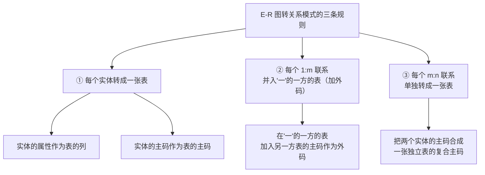

- **规则 ①：每个实体转成一张表**。实体的属性就作为这张表的列，实体的主码就作为这张表的主码。
- **规则 ②：每个 1:m（一对多）联系，并入"一"的一方**。"一"的这一方的表里，添加"多"的那一方的**主码作为外码**。
- **规则 ③：每个 m:n（多对多）联系，单独转成一张表**。把**两个参与实体的主码合并**，作为这张新表的复合主码。

> [!TIP] 通俗理解
> 企业里"一个部门管多个员工"是 1:m：部门是一方、员工是多方，所以在员工表里加一列"部门号"当外码就够；而"学生选课程"是 m:n，一张表塞不下，就得单独开一张"选课"表，用（学号+课程号）一起当主码。

### 结合 E-R 实例看转换

回到 6.1 讲过的"学生—选课—课程"E-R 图（选课为 m:n 联系），按规则转换：

- **学生实体** → 学生表（学号_，姓名，性别，年龄），学号为主码；
- **课程实体** → 课程表（课程号_，课程名），课程号为主码；
- **选课 m:n 联系** → 单独一张选课表（学号，课程号，成绩），其中"学号 + 课程号"共同作为复合主码，同时学号参照学生表、课程号参照课程表（是外码）。

这三张表组合起来，就完整表达了原 E-R 图里的全部信息。**用 6.1 那个 E-R 图就能直观对上"哪条规则对应哪张表"**。

## 完整性约束

为了保证数据的一致性和正确性，数据库引入完整性约束，它分为三类：**实体完整性、参照完整性、用户定义完整性**。

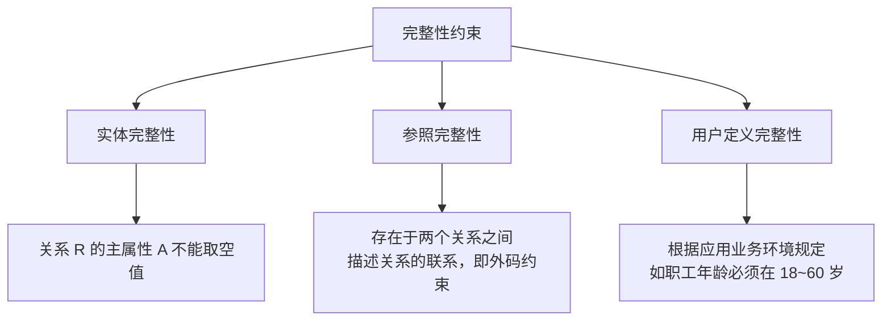

- **实体完整性**：关系 R 的**主属性不能取空值（NULL）**。因为主码用来唯一标识记录，不能为空。
- **参照完整性**：**存在于两个关系之间**，用于描述关系模型中实体与实体之间的联系。具体说，就是某关系中的**某一属性受其他关系主码的约束**，这一属性在我们的表中叫**外码（外键）**。比如学生表的"系别"属性，参照系表的"系别号"主码。
- **用户定义完整性**：根据**应用业务环境**自行规定的约束。比如：规定职工的年龄必须**大于等于 18 岁、小于等于 60 岁**，这就是用户定义完整性。

> [!TIP] 全码示例（真题）
> 有一个关系模式 R（T, C, S），T 表示教师、C 表示课程、S 表示学生。假设：一个教师可以讲授多门课程，一门课程可以由多个教师讲授，学生可以听不同教师讲授的不同课程，一个教师可以教多名学生、一门课程对应多名学生。这种情况下，**任何一个属性都不能单独唯一标识一个元组**，必须 T、C、S 三者**组合**才能唯一标识一条记录——于是 (T, C, S) 这个由所有属性构成的候选码，就是**全码**。

## 关系代数运算

关系代数是对关系（表）做运算的一套语言，有 **5 种基本运算：并、差、笛卡尔积、投影、选择**，另外还有由笛卡尔积派生的**连接**运算。

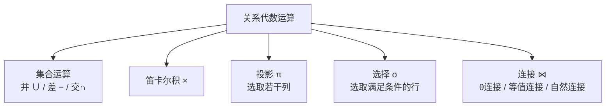

**并（∪）**：把两个关系 R 和 S 的**所有元组合并**，**去掉重复**的部分。即"属于 R 或属于 S"的元组。

**差（−）**：**属于 R 但不属于 S** 的元组。R−S 表示只在 R 里、不在 S 里的那些行。

> [!TIP] 通俗理解
> 并就是"两个班名单合起来，重复的人只算一次"；差就是"R 班里有、但 S 班里没有的人"。相当于集合的并集、差集。

**笛卡尔积（×）**：把 R 的**每一行都去和 S 的每一行拼接**，得到所有可能的组合。结果的行数 = R 的行数 × S 的行数（**行列数相乘**），列数 = R 的列数 + S 的列数。

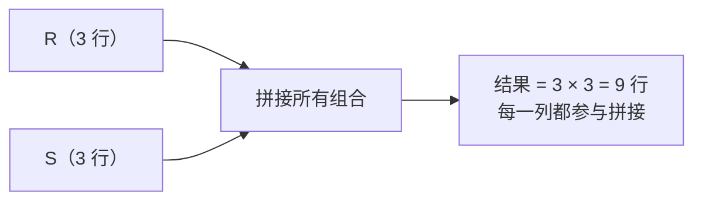

**投影（π）**：从关系里**选取指定的若干列**，去掉不需要的列。比如对关系 R 做投影选取"学号、姓名"两列，就只保留这两列内容。

**选择（σ）**：在关系里**选取满足指定条件（谓词）的行**。比如选出"年龄小于 20 岁"的所有同学——条件是约束，选择针对"行"下手。

> [!NOTE]
> **投影是删列，选择是删行**——这两个最容易混，记住这一句就分清了。投影看竖方向、选择看横方向。

**连接（⋈）**：把**两个关系的元组按条件拼接**，是在笛卡尔积的基础上再按"连接条件"挑出符合条件的组合。常见三种：

- **θ 连接（Theta 连接）**：连接条件是**一般比较运算**（如第 4 列 < 第 3 列），是最一般的连接。
- **等值连接**：θ 连接中等号为条件的特殊情况，即"θ 为等号"的连接。
- **自然连接**：要求**两个关系中被比较的分量是相同的属性组**，并在**结果中去掉重复的那个属性列**（只保留一份）。自然连接用两个相对的三角形符号表示，比等值连接更进一步（等值连接会保留两个相同的列，自然连接会合并掉重复列）。

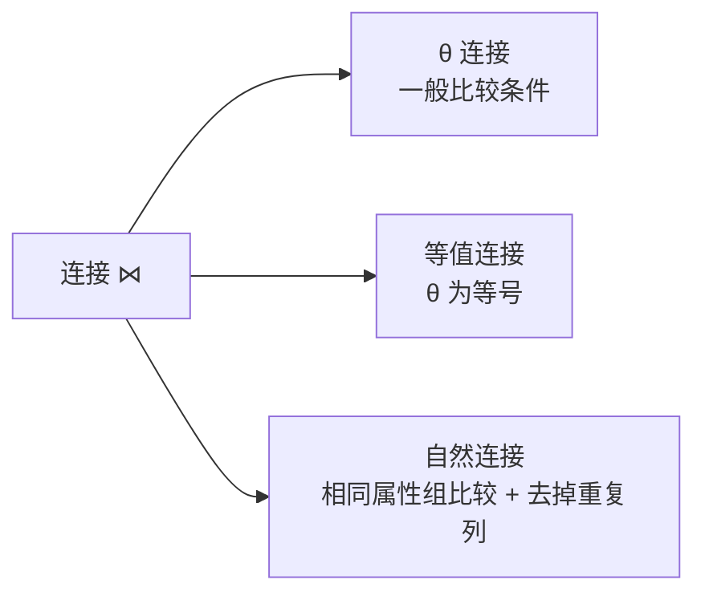

> [!TIP] 通俗理解
> 连接就像把两张表"拼桌"：θ 连接是最宽松的匹配，等值连接要求某两个字段相等才拼在一起，自然连接更进一步——拼完还要把重复的那一列删掉，只保留一份。

## 数据库范式（了解）

**这一块教材里没有专门展开**，但历年真题可能会涉及，所以了解一下即可（属于"了解"级别）。**数据库范式包括第一范式（1NF）、第二范式（2NF）、第三范式（3NF）**，它们之间存在包含关系：**若满足第二范式，则一定满足第一范式；若满足第三范式，则一定满足第二范式**。

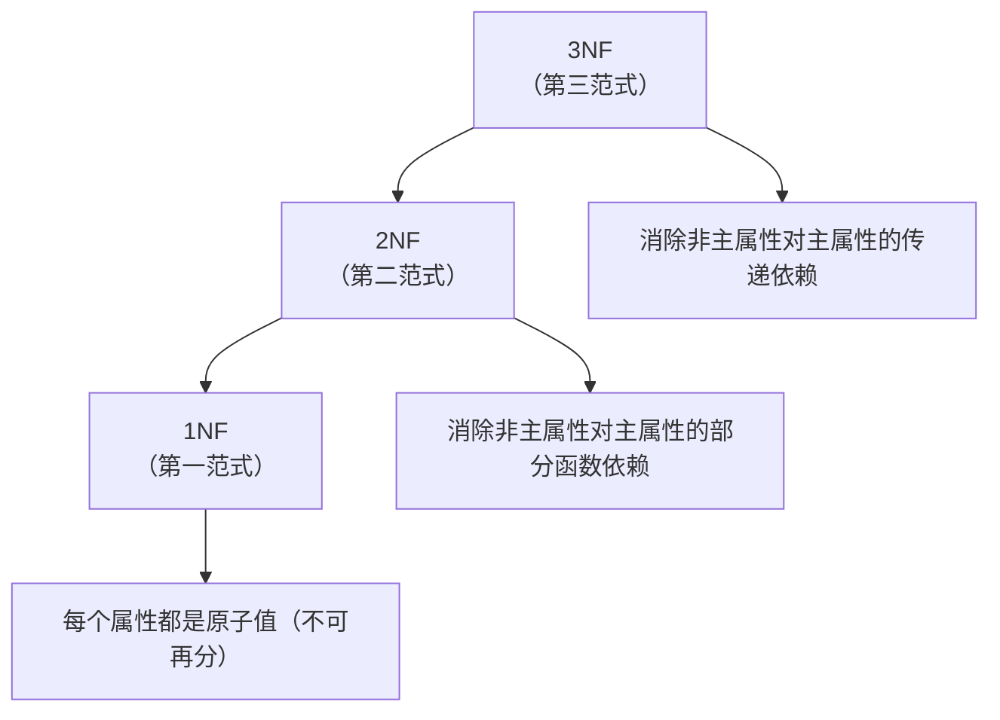

- **第一范式（1NF）**：每个属性都是**原子值**，不可再分（前面关系的性质第一条已经讲过）。
- **第二范式（2NF）**：在满足第一范式的基础上，**消除了非主属性对主属性的部分函数依赖**。所谓"部分函数依赖"，比如一张选课表有（学号、课程号、姓名、年龄、成绩、学分），其中"学号 + 课程号"共同作为主码，但"姓名、年龄"只依赖"学号"，"成绩、学分"依赖"学号和课程号"——这就存在部分依赖，不满足第二范式。
- **第三范式（3NF）**：在满足第二范式的基础上，**消除非主属性对主属性的传递依赖**。

**为什么要规范化到这些范式？** 两个目的：一是**屏蔽数据之间的冗余**；二是**解决更新异常、插入异常、删除异常**的问题。规范化程度越高，表越"瘦"，冗余和异常就越少。

> [!NOTE]
> 范式这块只需要形成印象：**1NF 不可再分、2NF 去掉部分依赖、3NF 去掉传递依赖**，能判断给定表属于第几范式即可。因为教材没列入必考，别在其上花太多精力。

## SQL 语言概述

**SQL（结构化查询语言）是一种通用的、功能强大的标准查询语言**。它名字里带"查询"，但应用范围远不止查询，还包括**建立数据库、建立数据库的表结构**等等，是关系数据库的标准语言。

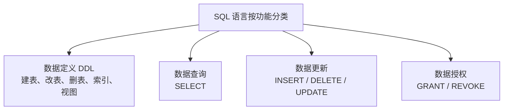

> [!WARNING] 真题考点
> 软考程序员的**上午题几乎必有一道 SQL 题**，所以 SELECT 的写法、各主要子句的作用一定要掌握。

## SQL 数据定义

数据定义用来**建立和维护数据库表结构**，主要包括建表（CREATE TABLE）、改表（ALTER TABLE）、删表（DROP TABLE）和索引。

### 创建表 CREATE TABLE

建表的基本格式为：`CREATE TABLE 表名(列名 数据类型 完整性约束, …) 表级完整性约束`。以经典的"供应商—零件"为例：

用 SQL 建立供应商表 S（供应商号 S#、供应商名 SNAME、状态、所在城市）和零件表 P（零件号 P#、零件名、颜色、重量、产地），其中：供应商代码**非空且值唯一**，供应商名字**唯一**，零件号**非空且值唯一**，零件名**非空**。

```sql
CREATE TABLE S (
    S#     CHAR(5)  PRIMARY KEY,   -- 供应商号，主码（自动非空且唯一）
    SNAME  CHAR(30) UNIQUE,        -- 供应商名，唯一
    STATUS INT,                    -- 状态
    CITY   CHAR(20)                -- 所在城市
);

CREATE TABLE P (
    P#     CHAR(6)  PRIMARY KEY,   -- 零件号，主码
    PNAME  CHAR(30) NOT NULL,      -- 零件名，非空
    COLOR  CHAR(4),
    WEIGHT INT,
    CITY   CHAR(20)
);
```

> [!NOTE]
> 一个供应商可以供应多个零件，一个零件也可以由多个供应商供应，所以两者之间是**多对多**关系。为描述这种联系，通常需要再建一张"供应关系"对照表 S_P，它用供应商号和外码零件号共同作为**主码**，同时把 S# 作为外码参照供应商表、把 P# 作为外码参照零件表。`PRIMARY KEY` 已隐含非空且唯一，因此作为主码时这两条约束可以省略不写。

### 修改表 ALTER TABLE

修改表用 `ALTER TABLE 表名`，可以 **ADD**（加新列）、**DROP**（删除某个完整性约束）或 **MODIFY**（修改某列名或完整性约束）。例如：

- 为供应商表增加"邮政编码"字段：`ALTER TABLE S ADD ZIP CHAR(6);`
- 把状态字段改为整型：`ALTER TABLE S MODIFY STATUS INT;`

一般 SQL 语句末尾可加**分号**，避免与后面的语句混淆。

### 删除表 DROP TABLE

`DROP TABLE 表名` 会删除整张表，例如 `DROP TABLE S;` 表示删除供应商表。

### 建立与删除索引

建立索引是为了**加快查询速度**。用 `CREATE INDEX 索引名 ON 表名(列名)` 建立索引：

```sql
CREATE INDEX S_CITY ON S(CITY);   -- 建立在供应商表的城市列上
```

如果不加限制，建立的是**非聚集索引**；若要建立**聚集索引**，在索引名后加 `CLUSTER`，例如 `CREATE CLUSTER INDEX …`。**聚集索引**是指索引表中的索引项顺序与表记录的物理存储顺序一致。索引的排序方式有 **ASC（升序）** 和 **DESC（降序）** 两种。删除索引用 `DROP INDEX 索引名`。

## SQL 视图

**视图（View）不是一个真实存在的表，而是一个虚拟表**——它不存数据，只是保存一段查询定义，用的时候把结果"虚拟"出来。视图对用户隐藏了底层表的细节，非常便于访问控制。

创建视图用 `CREATE VIEW 视图名 AS 查询语句`。例如建立"计算机系学生"的视图：

```sql
CREATE VIEW CS_Student AS
SELECT 学号, 姓名, 年龄
FROM Student
WHERE 系别 = '计算机';
```

> [!NOTE]
> 结尾的 `WITH CHECK OPTION`（可加可不加）表示：以后对该视图做**修改、插入操作**时，系统会校验新数据仍满足视图定义的条件（例如只允许计算机系的学生进入此视图）。撤销视图用 `DROP VIEW 视图名`，把视图从数据库中撤除。

视图的查询和普通表几乎一样——**把视图直接当作一张虚拟表来查询**即可。

## SQL 数据查询

查询是 SQL 最核心的部分，用 **SELECT**。它的基本语法骨架为：

```sql
SELECT [ALL|DISTINCT] 目标表达式
FROM 表名或视图名
[WHERE 条件表达式]
[GROUP BY 分组表达式 [HAVING 分组条件]]
[ORDER BY 排序表达式 [ASC|DESC]];
```

- `ALL`：返回全部记录；`DISTINCT`：只取**不重复**的记录（去重）。
- `WHERE`：行级条件过滤。
- `GROUP BY`：按某列分组；`HAVING`：对**分组结果**再过滤（跟在 GROUP BY 后面）。
- `ORDER BY`：按某列**排序**，升序 `ASC` 或降序 `DESC`。

**简单查询**：查询计算机系学生的学号、姓名、年龄：

```sql
SELECT 学号, 姓名, 年龄
FROM Student
WHERE 系别 = '计算机';
```

**连接查询**：需要从多张表取数据时，用连接条件把它们关联起来。例如选出"选了 C1 这门课"的学生的学号和姓名：

```sql
SELECT Student.学号, Student.姓名
FROM Student, SC
WHERE Student.学号 = SC.学号 AND SC.课程号 = 'C1';
```

> [!NOTE]
> SELECT 后的多个列名之间，**注意不要多打逗号或漏打逗号**（字幕里提醒"这里不能打错逗号"）。连接查询的要点是**用 WHERE 把两张表的关联列写等**（如 `Student.学号 = SC.学号`）。

**子查询**：把一条查询的结果，作为另一条查询的条件使用，一层套一层。例如上面的连接查询也可以改写为子查询：先求出"美术"课程的课程号，再找出选修该课程的学生学号，最后到学生表中取出对应学号和姓名。

**聚集函数**：对一组值进行统计，有 **平均值 AVG、最小值 MIN、最大值 MAX、求和 SUM、计数 COUNT** 五个。例如查询选了 C1 课程的学生的最高分和最低分：

```sql
SELECT MAX(成绩), MIN(成绩)
FROM SC
WHERE 课程号 = 'C1';
```

**分组查询**：用 `GROUP BY` 分组后配 `HAVING` 过滤组。例如：查询"由至少 3 家供应商供应零件"的工程项目，列出工程号及所用零件的平均数量，并按工程号降序排列：

```sql
SELECT 工程号, AVG(数量)
FROM 供应,
WHERE …                  -- 连接/过滤条件
GROUP BY 工程号
HAVING COUNT(DISTINCT 供应商号) > 2
ORDER BY 工程号 DESC;
```

**别名**：用 `AS` 给查询结果的列起别名，方便显示。例如 `SELECT SNAME AS 姓名, AGE AS 年龄 FROM S;` 这样表头显示的就是"姓名、年龄"，而不是字段原名。多表查询时也常用表别名区分。

**字符串与通配符（LIKE）**：模糊匹配用 `LIKE`，配合通配符 `%`（匹配任意多个字符）和 `_`（匹配一个字符）。例如查询地址字段"以 X 开头、后面跟任意多个字"的记录。若要匹配本该是通配符的字符，可用 `ESCAPE` 指定转义符，例如 `LIKE 'X/%' ESCAPE '/'` 表示 `%` 是普通字符而非通配符。

```sql
SELECT 姓名 FROM Student
WHERE 地址 LIKE '科技路%';   -- 科技路开头，后面任意
```

> [!NOTE]
> 一个结论值得记：用**聚集函数**实现的查询，通常比用 `ALL / ANY`（量词）实现的**子查询效率更高**。原因是子查询往往要逐值比较很多次（`ALL/ANY` 取的是一个集合、要和每个值比较），而聚集函数先求成一个单值再做比较，比较次数少很多。

## SQL 数据更新

数据更新包括**插入（INSERT）、删除（DELETE）、修改（UPDATE）** 三类：

**插入 INSERT**：向关系中插入一条或多条记录。例如向选课表插入学号、课程号、成绩三个字段的数据：

```sql
INSERT INTO SC(学号, 课程号, 成绩) VALUES ('01001', 'C1', 90);
```

**删除 DELETE**：删除满足条件的记录。例如删除姓名为"张晓"的一条或多条记录：

```sql
DELETE FROM SC WHERE 姓名 = '张晓';
```

**修改 UPDATE**：修改满足条件的记录。例如把教师表的工资提高 1.5 倍：

```sql
UPDATE Teacher SET Salary = Salary * 1.5;
```

**视图的更新**：视图也能更新（在满足视图可更新条件下），本质是对其底层基本表的数据做修改。例如基于 Employee 表建一个视图，然后把视图中某学生的姓名"张晓"改为"章晓"，视图与基本表的数据都会相应改变。

## SQL 授权与收回

为了控制谁能访问哪些数据、能做哪些操作，用 **GRANT（授权）** 和 **REVOKE（收回）** 管理权限：

- **授权**：把表上的操作权限授予某个用户。例如把供应商表 S 上的**所有权限**授予某用户：`GRANT ALL PRIVILEGES ON S TO 用户;`
- **收回**：收回某个用户对某表或某字段的某些操作权限，**可以逐步（按权限类别）收回**。例如收回某用户对某表某字段的**更新**权限：`REVOKE UPDATE ON 表(字段) FROM 用户;`

## 嵌入式 SQL（了解）

嵌入式 SQL 是指把 SQL 语句写在高级语言（如 C 语言）程序中，随程序一起编译运行。这一块**了解三个核心概念**即可：

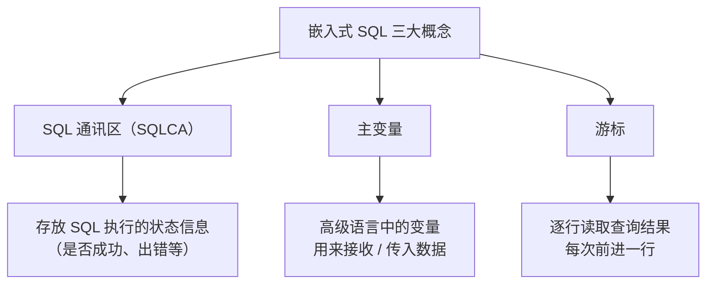

- **SQL 通讯区（SQLCA）**：存放**给定的一次 SQL 执行的状态信息**（成功与否、出错码等）的区域，程序据此判断执行结果。
- **主变量**：在高级语言中定义的**变量**，SQL 语句通过它把结果字段的值赋给程序变量。为了和 SQL 语句中的字段区别，主变量一般用**冒号（:）** 前缀标记。
- **游标（Cursor）**：查询可能返回多条记录，**游标每次取一行**，然后不断向后移动，直到取完（退出循环或记录结束）。

> [!NOTE]
> 嵌入式 SQL 只需记住"通讯区、主变量、游标"这三个名字和作用即可，属于"了解"级别，不要求会写。

## 数据库设计

一个数据库从无到有是有**生命周期**的，它**逐步递进**地经历了六个阶段：**规划 → 需求与分析 → 设计与应用程序设计 → 系统实现 → 测试 → 运行维护**。


其中**数据库设计阶段是主要内容**，它又分为四步：

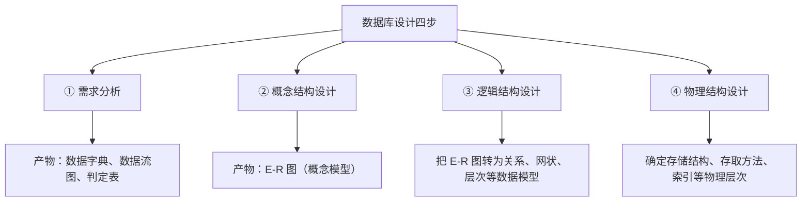

- **需求分析**：分析用户需要什么，结果包括**数据和处理**两部分。**数据**通常就是**数据字典**；**处理**包括**数据流图、判定表**等。
- **概念结构设计**：把现实世界抽象成概念模型，一般就**画 E-R 图**。
- **逻辑结构设计**：把概念模型（E-R 图）转换成**逻辑模型**（关系、网状、层次模型），再把逻辑模型转化成最终的数据模型，最后对**数据模型进行优化**。
- **物理结构设计**：设计具体的**存储结构、存取方法和索引**等物理层次。

**运行维护**阶段则包括：**数据库的日志维护、性能分析和监督、扩充数据库的新功能、修改发现的错误**等内容，这一块了解即可。

## 本节小结

① **关系数据库基本概念**：关系（表）的五条性质——分量取原子值（=1NF）、列同质、属性不重名、行列顺序无关、无重复元组（由主码保证）；关系的三种类型——基本关系、查询表、视图（虚表）。常用术语：属性（列）、域（取值范围）、目（属性个数）、候选码、主码、主属性、非主属性、外码（参照其他关系主码的属性）、全码（全部属性构成候选码）。**关系数据库模式**：关系名（属性 1，属性 2…，主码加下划线）；E-R 转关系模式三条规则——①每个实体转一张表（属性作列、主码作主码）②1:m 联系并入"一"的一方（另一方主码作外码）③m:n 联系单独建表（双方主码合成复合主码）。

② **完整性约束**：三类——**实体完整性**（主属性非空）、**参照完整性**（外码约束、描述两表联系）、**用户定义完整性**（按业务自定义，如年龄 18~60）。全码示例 R(T,C,S)（教师—课程—学生全三属性组合才能唯一标识）是常考点。

③ **关系代数**：五种基本运算——**并（∪，去重合并）、差（−，属于 R 不属于 S）、笛卡尔积（×，行列相乘拼接）、投影（π，选列/删列）、选择（σ，选行/删行）**；连接（⋈）分 θ 连接、等值连接（θ 为等号）、自然连接（相同属性组比较且去掉重复列）。

④ **数据库范式（了解）**：1NF 分量原子、2NF 消除部分函数依赖、3NF 消除传递依赖；满足 3NF 必满足 2NF 必满足 1NF；目的是减少冗余、解决更新/插入/删除异常。

⑤ **SQL 语言**：数据定义（CREATE/ALTER/DROP TABLE，索引）、视图（虚表，DROP VIEW，可加 WITH CHECK OPTION）、查询（SELECT 骨架：WHERE→GROUP BY/HAVING→ORDER BY；连接查询、子查询、聚集函数 AVG/MIN/MAX/SUM/COUNT、别名 AS、LIKE 通配符与 ESCAPE）、更新（INSERT/DELETE/UPDATE）、授权（GRANT/REVOKE）；聚集函数查询通常比 ALL/ANY 子查询效率高。嵌入式 SQL 了解通讯区、主变量、游标即可。

⑥ **数据库设计（了解）**：生命周期六阶段（规划→需求→设计→实现→测试→运行维护）；设计四步——需求分析（数据字典、数据流图）→概念设计（E-R 图）→逻辑设计（E-R 转数据模型并优化）→物理设计（存储结构、存取方法、索引）。