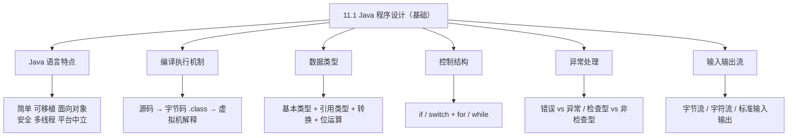
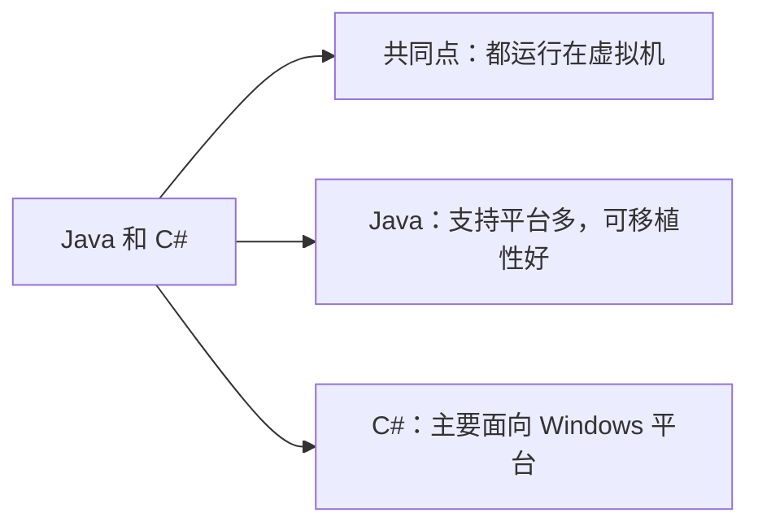
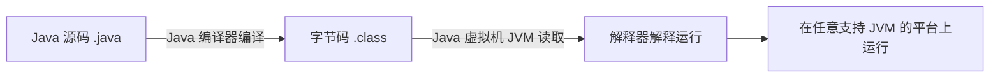
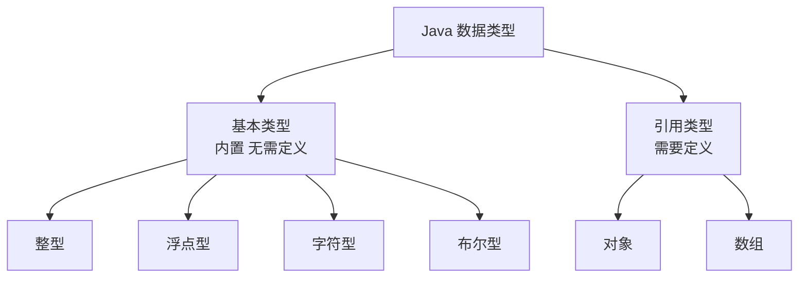
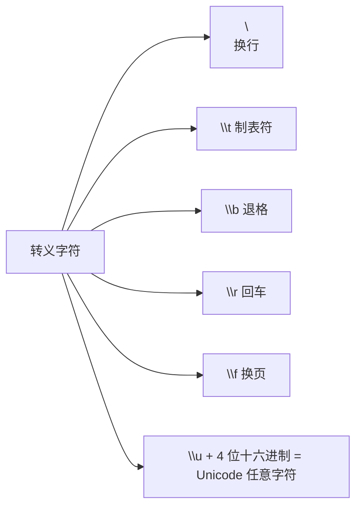
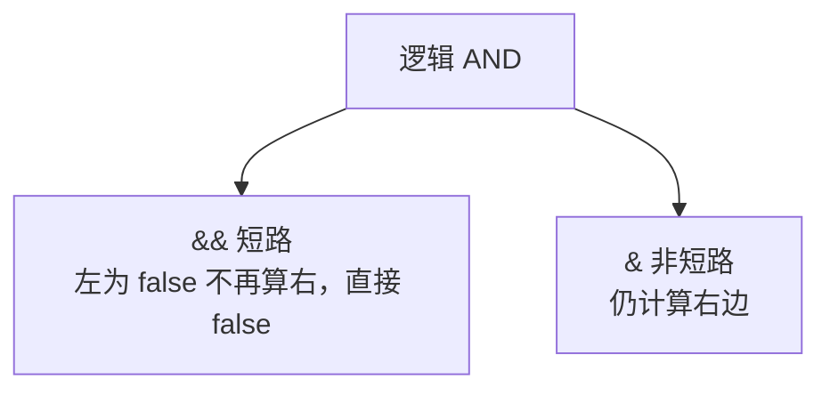
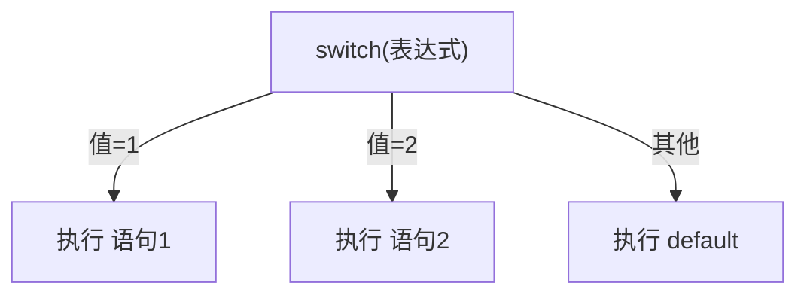
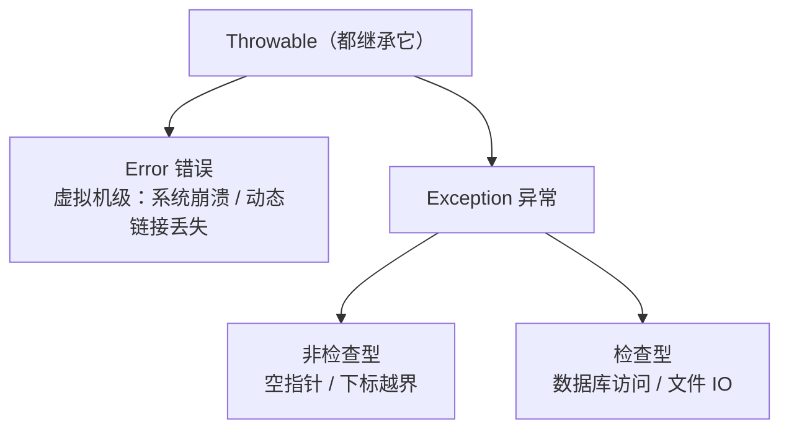
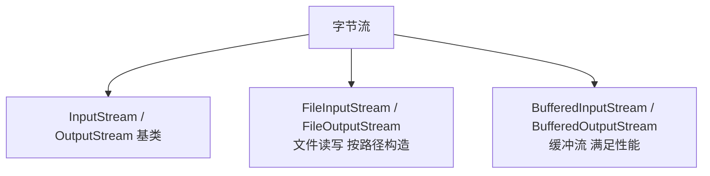

课程链接：视频《11.1 Java程序设计（基础）》（软考程序员系列课程）

视频链接：

## 本节概述

本节是系列课程的第二十七节课，进入**第十一章 Java 程序设计**，本节是 Java 语言的基础部分。Java 与 C++ 一样，是软考下午题二选一的选做语言。本节脉络依次是：Java 语言概述 → Java 的编译执行机制（虚拟机/字节码）→ 注释 → 数据类型（基本/引用、强制转换、位运算、布尔）→ 控制结构（if/switch、for/while）→ 异常处理 → 输入输出流。

先看一张本节的知识地图，把整节内容装进脑子里：



## Java 语言概述

### Java 能做什么

Java 主要用于**网络应用开发**和**手机应用开发**。它采用**分层结构设计**，处理对象时采用**面向接口的可复用**思想，带来的编程体验比较"迷人"。

### Java 语言特点

Java 语言的特点是：**简单、可移植、面向对象、分布式、高性能、健全（强类型/安全）、多线程、安全、动态、体系结构中立**。

- **简洁、可移植、面向对象**：跨平台运行。
- **体系结构中立**：解释型，编译不针对特定硬件。
- **安全**：**不容易产生内存溢出**（无指针算术），但**失去了 C 语言指针那样的灵活性**。

> [!NOTE]
> Java 特点了解一下即可。核心记忆：跨平台、可移植（靠虚拟机）、安全（不易内存溢出）。

### Java 与 C# 的对比

Java 对应**微软的 C# 语言**。两者**都运行在虚拟机上**，但**Java 的可移植性更好**，因为它**支持的平台更多**（Windows、Unix 等），而 C# 主要面向 Windows 平台。



## Java 编译执行机制（虚拟机）

### Java 的编译执行过程

1. **Java 源代码**（`.java` 文件）经过 **Java 编译器**编译。
2. 生成**字节码文件**——在文件里常见的是 **`.class` 文件**。
3. **字节码文件**被 **Java 虚拟机（JVM）** 读取，由 **Java 解释器** 解释并运行。



### 为什么可移植性好

**只要虚拟机能跑在某个平台**（Windows、Unix 等）上，那么这份字节码文件就**不需要重新编译、链接**，直接由解释器解释并运行即可。**因为虚拟机的存在，Java 获得了良好的可移植性**。

> [!TIP] 通俗理解
> Java 把"翻译好的中间语言（字节码）"做出来，让不同平台各自装一个"翻译官（虚拟机）"来解释它。一次编译、处处运行，可移植性就好。

### 公司与历史

Java 最初由 **Sun（太阳微系统）公司**开发，后来被 **Oracle（甲骨文）公司收购**，成为 Oracle 的产品。开发常用的集成环境是 **Eclipse**（字幕读音 misology 实为 Eclipse）。被谁收购会影响到 Java 后期的走向，了解一下即可。

## 注释

Java 有三种注释，**注释内容不参与代码编译**：

| 注释 | 写法 | 用途 |
|---|---|---|
| 单行注释 | `// 注释` | 写给自己看 |
| 多行注释 | `/* 注释 */` | 写给自己/其他工程师看 |
| **文档注释** | `/** 注释 */` | **写在类 / 方法上方**，用 JavaDoc 一键生成文档 |

**文档注释 `/** ... */`** 很重要，尤其在团队开发中。它用于说明**方法的作用、返回值、编写者、联系方式**等，并可通过编译器**一键生成 JavaDoc 文档**。

> [!WARNING] 真题考点
> 三种注释写法：`//` 单行、`/* */` 多行、`/** */` 文档注释。其中**文档注释写在类名/方法上方**，可用 JavaDoc 生成文档。

## 数据类型

Java 数据类型沿袭自 C 语言，分为**基本数据类型**和**引用数据类型**：

- **基本数据类型**：**不需要定义**，是内置类型，包括**整型、浮点型、字符型、布尔型**。
- **引用数据类型**：**需要定义**，例如**对象、数组**（对象引用）。



### 整型

Java 整型有 `byte`、`short`、`int`、`long`，取值范围需记住（与 C 语言对应）：

| 类型 | 位宽 | 取值范围 |
|---|---|---|
| byte | 8 位 | −2⁷ ~ 2⁷−1，即 −128 ~ 127 |
| short | 16 位 | **−32768 ~ 32767** |
| int | 32 位 | −2³¹ ~ 2³¹−1 |
| long | 64 位 | −2⁶³ ~ 2⁶³−1 |

要点：
- 使用整型前**必须先声明**，声明时可同时**初始化**；基本类型声明的同时**分配对应内存空间**。
- 使用**赋值运算符**将右边表达式的值存入左边变量。
- **乘法、除法**优先级**高于加法和减法**；**括号内的内容优先运算**。
- 自增递减（`++`/`--`）**与 C 语言一致**，分**前置和后置**，使整数加 1 或减 1。
- **用 byte 或 short 运算时，结果是 32 位的**，强制类型转换回 16 位**可能丢失精度**。

> [!NOTE]
> 整型取值范围与 C 语言一致：**short 是 −32768~32767**。用较小类型运算结果提升为 32 位，强制转换会丢失精度。

### 浮点型

浮点型有 `float` 和 `double` 两种：**float 占 4 字节，double 占 8 字节**。

**类型自动转换（提升）机制**：Java 能**自动把精度低的转换为精度高的**，以保证运算精度：

- `int` 与 `float` 相加 → 转换为**精度更高的 float**。
- 若运算类型之一是 `double`（如 float 与 double）→ 另一类型转换为 **double**。

因为 double 占 8 字节、精度比 float 高，所以自动转 double。

> [!WARNING] 真题考点
> **Java 运算时自动向高精度类型转换**（int → float → double）。若要阻止这种自动转换，可用**强制类型转换**（显式转型），但**可能丢失精度**。

**浮点数其他注意点**：
- 取模运算（`%`）：作用于两个浮点数时，得到的是**被除数除以除数整数倍之后的结果**。
- 浮点数支持中间下划线（如 `2_1.10`），但**开始/结束、小数点前后、F/L 字母之后**加下划线是**非法**的。

### 字符数据类型

- **字符用单引号括起**：`'A'`。转移字符（转义字符）用反斜杠 `\` 表示，使得其后的字符**不被当作普通的引号等作用**。
- 常见转义字符：退格 `\b`、换页 `\f`、换行 `\n`、回车 `\r`、制表符 `\t`；用 `\u` 加**四位十六进制 Unicode 编码**可表示任意字符。
- 字符类型加 1，可能会变成**另一个字符类型**。



### 布尔数据类型

- 布尔类型用 `boolean` 表示，其直接量只有 **`true` 或 `false`** 两个值。
- 与 C 语言不同（C 用 `0`/`1` 代替），**Java 直接用 `true` 和 `false`**，更形象。

> [!NOTE]
> Java 的布尔值只有 `true`/`false`，不能像 C 语言那样用 0/1 代替代替。

### 位运算与逻辑与的短路

**位运算**（针对机器码二进制）的运算符号：

| 运算 | 符号 | 说明 |
|---|---|---|
| 按位与 | `&` | 都是 1 才为 1 |
| 按位或 | `\|` | 有一个 1 即为 1 |
| 按位异或 | `^` | 相同为 0、不同为 1 |
| 按位非（取反） | `~` | 0 变 1、1 变 0 |

- **左移 `<<` / 右移 `>>`**：相当于数值**乘以 / 除以 2 的多少次方**。例如 `A` 初值为 1，左移 5 位 = `1 × 2⁵` = 32。

**逻辑与的短路**：
- **`&&`（双逻辑与）是短路计算**：当左边操作数为 `false` 时，**不再计算右边**，直接给出 `false`。
- **`&`（单逻辑与）是非短路**：无论左边如何，**仍会计算右边操作数**。



> [!WARNING] 真题考点
> **`&&` 短路（左为 false 不算右），`&` 非短路（仍算右）**。位运算的与/或/异或/非符号 `& | ^ ~` 也要记住。

## 控制结构

Java 的控制结构（if/switch、循环）与 C 语言相似。

### 选择结构：if 与 if-else

- **单行 if**：`if (判断条件为 true) 执行后面的语句;`。
- **多行 if-else**：为 true 时执行第一条，为 false 时执行第二条（else）。
- **多重判断 if-else if-else**：依次判断不同条件。**但不建议采用过多多重判断**，会让代码复杂。

### switch 语句

`switch` 后给一个**表达式**，根据表达式的值执行对应分支：

- 值等于 `expression 1` → 执行 `statement 1`；
- 值等于 `expression 2` → 执行 `statement 2`；
- 都不匹配 → 执行 **默认 default** 语句。



### 循环：for 与 while

**for 循环**（灵活性较强）三种形式：

```java
// 标准 for：初始化 ; 循环条件 ; 递增
for (int i = 0; i < length; i++) {
    // 循环体
}
```

- 由**初始化 i=0、条件 i<length、递增 i++** 三部分组成，中间用**分号 `;`** 隔开。

**for-each 遍历语句**：从集合中不断取出元素，再执行循环体，**常用于遍历**。

```java
for (类型 变量 : 集合) {
    // 遍历集合元素
}
```

**while 与 do-while**（与 C 语言相似）：

- **while**：先判断条件再执行。
- **do-while**：**先执行一次内容，再判断条件**（至少执行一次）。

> [!NOTE]
> `for-each` 是 Java 引入的遍历语法，比标准 `for` 更专注于"遍历集合"。

### Java 与 C 的不同点

- **Java 不允许内部局部变量覆盖外部局部变量**：在内部块体中，**不能出现与外部定义的局部变量同名**的变量。这个结论要记住。

### 跳转语句

与 C 语言一致：
- **break**：终止整个 switch/循环的执行。
- **continue**：跳过本次循环，继续下一次循环。
- **return**：从方法返回（可带返回值）。

## 异常处理

### 异常的分类

Java 异常体系都以 **`Throwable`**（可抛出）为顶层，分两大类：

- **错误（Error）**：指**虚拟机级别的错误**，如**系统崩溃、动态链接丢失**。例如程序写了让服务器负担很重、超时的运算，服务器无法承受发生崩溃。开发时要注意**性能设计**。
- **异常（Exception）**：我们常说的异常，分两类：
  - **非检查型异常（Unchecked）**：运行时异常，如**空指针异常、数组下标越界**。
  - **检查型异常（Checked）**：编译期要求处理的异常，如**数据库访问异常、文件输入输出异常**（读不存在的文件、数据库密码错误等）。



### 异常的处理

- **直接抛出**：向上层类**抛出异常**，本层不处理（`throws`，向外抛出、考虑信任）。
- **捕获处理**：用 **`try ... catch`** 代码块捕获并处理异常（与 C 语言类似）。
- **自定义异常**：我们可以定义自己的异常类，让它**继承 Exception**，然后自定义构造方法。

> [!NOTE]
> 异常处理掌握两点：**`throws`=向上抛出不处理；`try-catch`=捕获并处理**；自定义异常继承 Exception，自己写构造方法。

## 输入输出流

Java 的输入输出流包括**字节流、字符流、标准输入输出**。

### 字节流

- 字节流的基类是 **`InputStream`** 和 **`OutputStream`**。
- 例子：**`FileInputStream`**（文件字节输入流），构造函数传入**文件的绝对路径**；读取用 **`read()`** 方法，输出用 **`write()`** 方法。
- **缓冲流**：**`BufferedInputStream`** 和 **`BufferedOutputStream`**，是**为了满足性能**而出现的一组流（带缓冲提升读写性能）。



### 字符流

- 字符流基类：**`InputStreamReader`**（输入）和 **`OutputStreamWriter`**（输出），一对一对。
- 常见的字符流处理**按行**进行（如用 BufferedReader 按行读取）。

### 标准输入输出

- 标准输入**键盘**：`System.in`，对键盘输入的处理需要用一个**包装处理数据源的类**——**`Scanner`**（`java.util.Scanner`），可以配合 `nextInt()` 等方法**逐个取数（遍历）**。
- 控制台输出：如 `System.out.print`，还有刷新 `flush` 等。
- 格式化：如时间类型的格式化 `java.util.format` 等。

> [!NOTE]
> 标准输入输出了解即可：**`System.in` 键盘输入、`System.out` 控制台输出，用 `Scanner` 包装做输入处理**。

## 本节小结

① **Java 概述**：用于网络/手机应用开发，特点**简单、可移植、面向对象、分布式、高性能、健全、多线程、安全、动态、体系结构中立**。对应微软的 **C#**，二者都跑在虚机上，但 **Java 支持平台更多、可移植性更好**。**安全=不易内存溢出，但失去 C 指针灵活性**。

② **编译执行机制**：**源码 .java → 编译器 → 字节码 .class → JVM 虚拟机 → 解释器解释运行**。只要虚机能在某平台跑，字节码就**无需重新编译链接**，因此可移植性高。Java 原属 Sun 公司，后被 **Oracle 收购**。

③ **注释**：`//` 单行、`/* */` 多行、`/** */` **文档注释**（写在类/方法上方，用 JavaDoc 生成文档，便于团队协作）。

④ **数据类型**：基本类型（**整型 byte/short/int/long、浮点 float/double、字符、布尔**）+ 引用类型（对象、数组）。**byte/short 运算结果是 32 位**，强制转 16 位丢精度。**自动向高精度转换**（int→float→double），强制转换可能丢精度。浮点 float 4 字节、double 8 字节。**转义字符** `\n \t \b \r \f` 及 `\u`+四位十六进制表示 Unicode。**布尔只有 true/false**（C 用 0/1）。**位运算 `& | ^ ~`，左移<<乘/右移>>除 2 的幂**。**`&&` 短路、`&` 非短路**。

⑤ **控制结构**：if/if-else/多重 if/switch/for/for-each/while/do-while（先执行一次）。**分号 隔开 for 三段**。**Java 不允许内部局部变量覆盖外部局部变量**。break 终止整个、continue 跳过本次、return 返回。

⑥ **异常处理**：分 **Error（虚拟机级：系统崩溃/动态链接丢失）** 与 **Exception（非检查型：空指针/下标越界；检查型：数据库访问/文件IO）**，统一继承 **Throwable**。处理方式：**throws 向上抛出、try-catch 捕获处理**，可**自定义异常继承 Exception**。

⑦ **输入输出流**：**字节流**（基类 `InputStream`/`OutputStream`，FileInputStream 文件、缓冲流满足性能）、**字符流**（`InputStreamReader`/`OutputStreamWriter`，常按行处理）、标准输入输出（`System.in` 键盘、`System.out` 控制台，用 **Scanner** 包装、`flush` 刷新、`format` 格式化）。