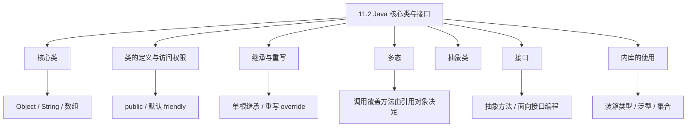
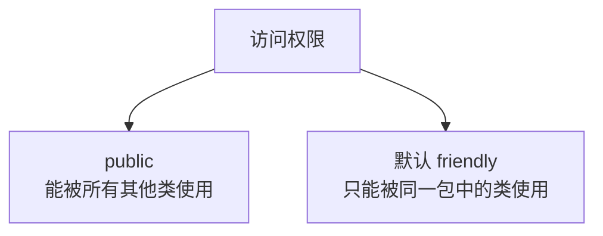
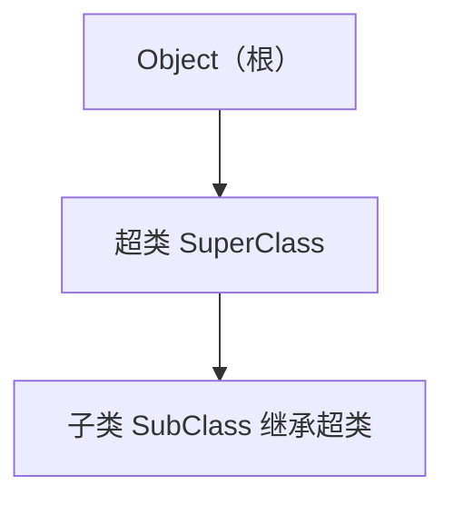
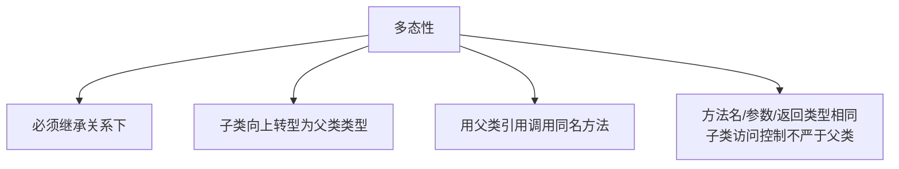
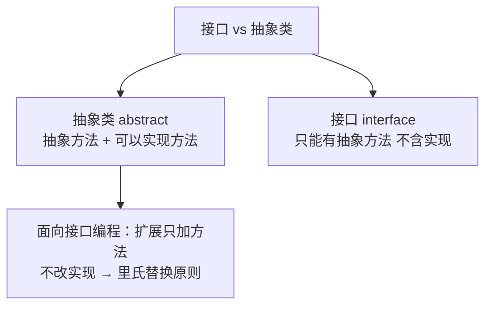
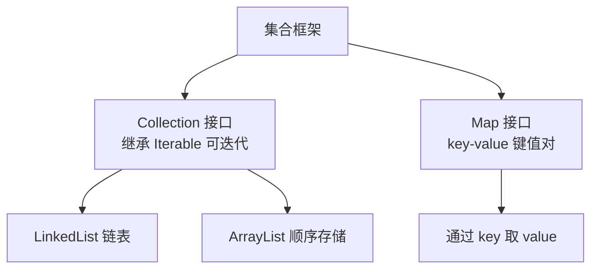

课程链接：视频《11.2 Java核心类与接口》（软考程序员系列课程）

视频链接：

## 本节概述

本节是系列课程的第二十八节课，继续进入**第十一章 Java 程序设计**，本节讲解 Java 面向对象的核心部分：**核心类、类与接口、内库（类库）的使用**。这是 Java 最重要的部分，继承、多态、抽象类、接口是软考二选一题目中 Java 的命题重点。本节脉络依次是：核心类（Object/String/数组）→ 类的定义与访问权限 → 继承与重写 → 多态 → 抽象类 → 接口（与抽象类的区别、面向接口编程）→ 内库的使用（装箱类型、泛型、集合）。

先看一张本节的知识地图，把整节内容装进脑子里：



## 核心类

### Object 类

**Object 是所有类的父类（根类）**：所有类都继承它，它的方法可以被所有类使用。常用两个方法：

- **`equals()`**：**比较方法**，比较两个对象是否相等。
- **`toString()`**：**转成字符串**的方法。若对象**不适合转成字符串**，会**抛出异常**。

> [!NOTE]
> Object 是 Java 单根继承的根源。`equals()` 比较、`toString()` 转字符串（不适用时报异常）。

### String 类

- **字符串拼接**：字符串用双引号表示，用 `+` 号拼接，如 `"abc" + "def"`。
- **比较**：`==` 表示是否相等，`!=` 表示是否不等。
- **长度**：`length()` 方法，经常使用。

**安全警示**：在**数据库 SQL 字符串拼接**时，**尽量少用拼接**，因为**容易导致 SQL 注入**。SQL 注入很快能被检测出来，如果程序通过不了等级保护，后期整改会浪费时间。

> [!WARNING] 真题考点
> String 常用操作：`+` 拼接、`== / !=` 比较、`length()` 取长度。**数据库场景少用字符串拼接，防 SQL 注入**。

### StringBuilder 与 StringBuffer

**`StringBuffer` 和 `StringBuilder`** 是为 String 类带来**缓冲机制**的类。其中**`StringBuilder` 机制要强优化于 `StringBuffer`**（效率更高），记住这一点即可。

### 数组（核心类）

**数组的定义**有几种方式：

```java
// 方式一、二：申请大小为 n 的数组
int[] a = new int[100];
int[] b = {1, 2, 3};          // 方式三：枚举数组元素
int[] c = b;                   // 方式四：复制到另一个数组
int[][] d = new int[3][4];     // 方式五：二维数组 3 行 4 列
```

- **二维数组**：`多少行多少列`。
- **多维数组中每一数组可以含有不同元素个数**（不规则数组）。

**数组常用方法**（方法名与单词含义一致）：
- `equals()`：比较两个数组是否相等。
- `fill()`：填充。
- `sort()`：排序。

> [!NOTE]
> 数组了解即可：掌握定义方式与几个常用方法（equals/fill/sort）。

## 类的定义与访问权限

### 类的定义

以经典的 **HelloWorld 类**为例：

```java
public class HelloWorld {
    public static void main(String[] args) {
        System.out.println("Hello World");  // 向控制台打印
    }
}
```

- 写 Java 程序第一行常写一个 **HelloWorld** 来测试环境是否部署好。
- `main` 是**主方法（入口）**，向控制台打印内容用 `System.out.println`。

### 对象初始化与包

- **对象初始化**：如 `static int i = -1;`（静态变量），以及实例变量 `int i;` 等。
- **包的定义**用 **`package`** 关键字；使用时用 **`import` 引入包**。

引入包的好处：例如使用 `Date` 类型，本来要写 `java.util.Date` 一串，**引入包后只要写 `Date d = new Date()`**。之后在这个类中用到 Date 就不用再写长长的一串。

### 访问权限（访问修饰符）

| 修饰符 | 访问范围 |
|---|---|
| `public` | **能被所有其他类使用** |
| （缺省，默认） | **`friendly`**：只能被**同一包**中的类使用 |



> [!NOTE]
> 访问权限关键词：**public 全局可见；无修饰符默认 friendly，只在本包内可见**。

## 继承与重写

### 单根继承

**继承是 Java 比较重要的概念**。Java 采用**单根继承**，能保证 Java 的安全性——**所有类都通过 Object 单根继承**下来。



### 继承举例

超类（父类）中定义变量和方法，子类通过继承获得这些成员。

```java
// 超类
class SuperClass {
    int i = 5;
    int getValue() {
        return i;   // 返回 5
    }
}

// 子类继承超类
class SubClass extends SuperClass {
    int i = -3;
    // 没有重写时，直接继承，getValue 返回父类的 5
}
```

- 方法名如果一样、都是 `getValue()`，此时就叫**重写（覆写）**。
- 若子类没有重写，调用的是继承自超类的方法（返回超类里的值，如 5）。

### 重写（override）

**子类覆盖父类的方法就是重写**。子类定义自己的成员和方法，覆盖父类的同名方法：

```java
class SubClass extends SuperClass {
    int i = -3;
    int getValue() {      // 重写父类的 getValue
        return i;         // 返回子类自己的 -3
    }
}

// 调用：new SubClass().getValue() → -3
//      new SuperClass().getValue() → 5
```

- 重写后调用子类对象的 `getValue()`，返回**子类自己的值 -3**。
- 父类对象的 `getValue()` 返回**父类自己的值 5**。

## 多态

### 多态的概念

**多态**：**调用覆盖的方法，由引用的对象来决定（调用哪个版本）**，这种行为被称为多态性。**方法是一致的，但引用的对象不同，调用结果不同**。

### 多态产生的条件（三个）

1. **必须是继承关系下**的类——**非继承的不称为多态**。
2. **把子类对象向上转型为父类类型**，用**超类的引用变量调用超类中的同名方法**。
3. 满足子类与超类中方法**名称、参数、返回类型必须相同**；且**子类方法的访问控制不能比超类更严格**。

这体现一种设计理念：**对象的使用者只保持与父类接口的通信**。修改时只改子类实现，不改超类方法。

> [!WARNING] 真题考点
> 多态三条件：**① 继承关系下；② 子类向上转型、用父类引用调用同名方法；③ 方法名、参数、返回类型相同，子类访问控制不严于父类**。核心：**调用哪个覆盖版本由引用的对象决定**。



## 抽象类

**抽象类**以 **`abstract`** 开头，可包含**抽象方法**和普通实现方法。

```java
abstract class SuperClass {   // 抽象类，abstract 打头
    abstract int getValue();   // 抽象方法（没有方法体）
    int getSum() { return 2; } // 抽象类里可以带实现方法
}

class SubClass extends SuperClass {   // 继承抽象类必须实现抽象方法
    int getValue(int i) {
        return i;
    }
}
```

- 抽象类可以有**抽象方法**，也可以带**一些实现的方法**。
- 子类继承抽象类，**必须实现父类的抽象方法**。

## 接口

Java **使用接口比较多**，这与 Java **单根继承**有不可分割的关系——因为单根继承一个类，但**可以实现多个接口**来弥补。

```java
// 定义接口
interface MyInterface {
    void doSomething();   // 接口方法（抽象方法）
}

// 实现接口
class MyClass implements MyInterface {
    public void doSomething() {   // 实现接口的方法
        // ...
    }
}
```

- 如果不想实现，可以用 `abstract` 作为定义。
- **接口与抽象类的区别**：
  - **抽象类**有抽象方法，**还可以带一些实现的方法**。
  - **接口当中只能是一些抽象的方法**，**不能涉及实现**。

### 面向接口编程

**接口的好处**：在扩展接口时只需在接口后**补充相对应的方法**，**不需要修改它具体的实现**。这种**面向接口的编程**能最大程度地保证**里氏替换原则（LSP）**：

- **对修改封闭**：不允许修改原有实现。
- **对扩展开放**：允许增加新方法。

这样能最大程度保证在升级更新过程中，避免回归测试带来的问题。

> [!WARNING] 真题考点
> 接口 vs 抽象类：**抽象类可有抽象方法+实现方法；接口只能有抽象方法、不含实现**。**接口扩展时只增加新方法、不改原有实现，体现开闭原则（面向接口编程）**。



## 内库的使用（装箱类型 / 泛型 / 集合）

### 装箱类型（包装类）

Java 内库（类库/标准库）中，通过类名直接引用的**主要常量**与**构造方法**、**常用方法**：

- **常量**：最大值、最小值、长度、类型、-2 值、`true`/`false` 等。
- **构造方法**：浮点构造方法、整型构造方法（两个）、字符型构造方法（一个）、布尔值构造方法。

### 泛型

**泛型（generic）**：在定义中使用尖括号 `<>` 内的类型参数，如 **`T`**，一般填 `String`、`Object`、`Map` 类型。

```java
List<String> list = new ArrayList<>();   // <String> 是泛型类型参数
Map<String, Object> map = new HashMap<>();
```

- **为类型参数指定具体类型**（如 String、Object、Map）。
- 定义完后，可以直接对这种类型的值进行取值，方便取值。
- 泛型特征：**早前 JDK 版本没有，JDK 1.5 以后增加**了泛型支持。

> [!NOTE]
> 泛型了解即可：**`<>` 尖括号形如 `T`，装具体类型（String/Object/Map），JDK1.5 以后支持**。作用是编译期类型安全、方便取值。

### 集合框架

集合讲了 **Collection 接口**：

- **`Collection` 接口** 继承了 **`Iterable`（可迭代）** 接口，含**增加、移除、迭代**等方法。
- 迭代器接口有：**是否有下一个元素**（`hasNext`，返回空/boolean）、**下一个指向**、**移除元素**等方法。

集合的具体实现：
- **`LinkedList`（链表）接口/类**：链表结构。
- **`ArrayList`（数组列表）**：**顺序存储**结构的实现（元素顺序存储）。

**Map 接口（键值对）**：值得注意的关键点是——它是一对**键值对（key-value）**，一般是 `key` 代表它的 key，另一边是 `value`（Object）代表它的 value。我们可以**通过 key 来得到它的 value 值**。



> [!NOTE]
> 集合了解即可：**Collection（可迭代，含增/删/迭代）、LinkedList 链表、ArrayList 顺序存储、Map 键值对（用 key 取 value）**。

## 本节小结

① **核心类 Object/String**：**Object 是所有类父类（根），括 equals() 比较、toString() 转串（不适用报异常）**。**String 用 + 拼接、==/!= 比较、length() 取长度**；**数据库少用拼接防 SQL 注入**。**StringBuilder 缓冲机制优于 StringBuffer**。**数组**：定义多种方式，二维按行列，可用 equals/fill/sort。

② **类的定义与访问权限**：类用 `class` 定义，**HelloWorld 含 main 主入口、System.out.println 打印**。**对象初始化分静态/实例，包用 package 定义、import 引入**（引入后 Date 不必写长串）。**public 所有类可用；默认 friendly 仅本包可用**。

③ **继承与重写**：**Java 单根继承、所有类继承 Object**。子类 `extends` 超类获得成员；**方法名相同即重写**，重写时子类返回自己值、父类返回父类值。**单根继承保证安全性**，接口用来弥补单继承。

④ **多态**：**调用覆盖方法由引用对象决定（即多态性）**。**三条件：① 继承关系下；② 子类向上转型为父类类型、用父类引用调用同名方法；③ 方法名/参数/返回类型相同、子类访问控制不严于父类**。对象使用者只与父类接口通信。

⑤ **抽象类**：`abstract` 打头，**可有抽象方法 + 也可带实现方法**，子类继承必须实现抽象方法。

⑥ **接口**：**只能有抽象方法、不含实现**，用 `implements` 实现，不想实现用 abstract。**面向接口编程：扩展只补方法、不改实现，保证里氏替换原则（开闭）**。接口多因单根继承而生（可实现多个接口）。

⑦ **内库使用**：**装箱类型常量/构造方法**；**泛型 `<>` 形如 T、装 String/Object/Map、JDK1.5 后支持**；**集合**：Collection（继承 Iterable 可迭代，增/删/迭代）、LinkedList 链表、ArrayList 顺序存储、**Map 键值对（key 取 value）**。