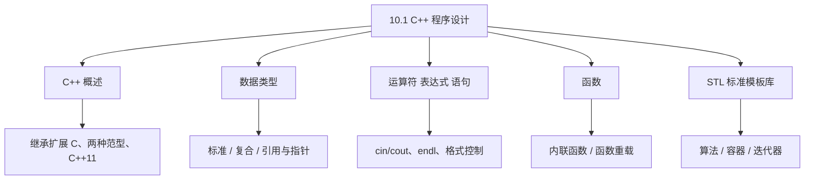
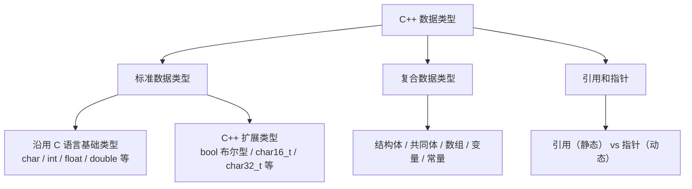
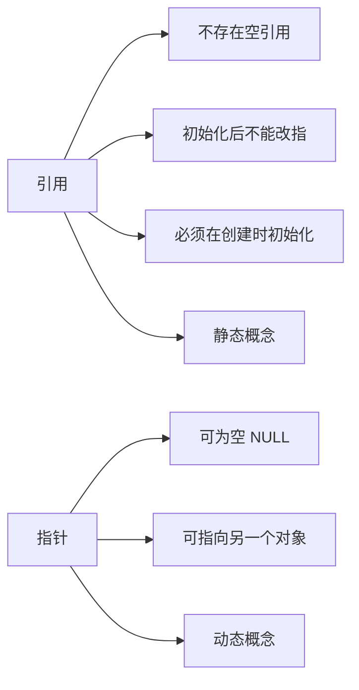
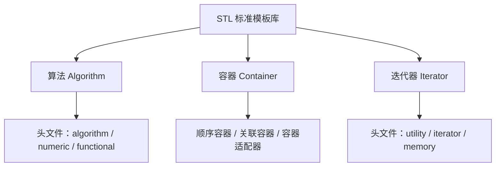
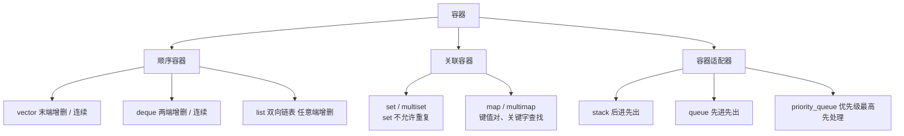

课程链接：视频《10.1 C++程序设计》（软考程序员系列课程）

视频链接：

## 本节概述

本节是系列课程的第二十六节课，进入**第十章 C++ 程序设计**，本节是 C++ 语言的开篇。先说明 C++ 在软考中的地位，再讲它的基础内容：数据类型、运算符表达式与语句、函数（内联/重载）、STL 标准模板库。本节脉络依次是：C++ 概述（发展与地位）→ 数据类型（标准/复合/引用与指针区别）→ 运算符表达式和语句（输入输出 `<< >>`、endl、格式控制）→ 函数（定义/声明/调用、内联函数、函数重载）→ STL 标准模板库（算法、容器、迭代器）。

先看一张本节的知识地图，把整节内容装进脑子里：



## C++ 概述

**C++ 程序设计**主要用于**图形化开发**和**大型三维图形的开发**。它**继承并扩展了 C 语言**，**同时支持过程式（面向过程）和面向对象的程序设计范型**。其**最新标准是 C++11 标准**（后续还发展出 C++14、C++17、C++20，但教程以 C++11 为准）。

> [!NOTE]
> C++ 是 C 语言的一个超集：既能写过程式程序，也能写面向对象程序。所谓**范型（编程范型）**就是指程序设计采用的一种风格/思想——面向过程 or 面向对象。

### C++ 在软考中的地位

**C++ 与 Java 是软考下午题里的二选一选做题目**：有一道 C++ 程序设计题、一道 Java 程序设计题，**两者选做一道即可**。如果你选择复习 C++ 程序设计，那么 Java 的内容可以不再复习；反之亦然，大家根据自己的实际情况决定。

## 数据类型

C++ 数据类型**划分与 C 语言几乎一样**，包括：**标准数据类型、复合数据类型、引用和指针**。



### 标准数据类型

- **沿用 C 语言的基础类型**：char、int、float、double 等。
- **C++ 扩展的类型**：**布尔型 `bool`**、**Unicode 相关字符类型**（如 **`char16_t`、`char32_t`**）等。

### 复合数据类型

与 C 语言一致：**结构体、共同体、数组**，以及**变量和常量**。

### 引用与指针的区别（重点）

**引用（reference）与指针（pointer）** 有本质区别，这是本节常考点：

| 对比项 | 引用 | 指针 |
|---|---|---|
| 内存模型 | 引用是变量的一个**别名** | 指针是存地址的变量 |
| 空引用 | **不存在空的引用** | 指针可为空（NULL） |
| 能否改指 | **一旦初始化一个对象，就不能再引用另一个对象** | 指针**可以指向另一个对象** |
| 初始化 | **必须在创建时被初始化** | 指针可不立即初始化 |
| 概念 | **静态**的概念 | **动态**的概念 |



> [!WARNING] 真题考点
> 引用 vs 指针三个核心区别：**① 引用不存在空引用；② 引用一旦绑定一个对象就不能再改绑；③ 引用必须在创建时初始化（静态概念），指针可动态指向任意对象**。

## 运算符 表达式 语句

### 特殊的控制语句

一些语句与 C 语言一致，但要熟记其作用：

- **break 语句**：**终止并跳出当前循环**。
- **continue 语句**：**结束这一次的循环**，进入/开始下一次循环。
- **return 语句**：**执行流程从函数返回**，一般用来返回某些参数值（返回值）。

### 输入输出（与 C 语言不同）

C++ 的输入输出**与 C 语言有所不同**，使用 **流式** 运算符：

- **输出**：`cout << 内容`（用**双小于号 `<<`**）。
- **输入**：`cin >> 变量`（用**双大于号 `>>`**）。
- **换行**：**`endl`**，功能是**换行并清除缓冲区**（而 C 语言用 `\n`）。

```cpp
#include <iostream>
using namespace std;

int main() {
    int age;
    cout << "请输入年龄：";
    cin >> age;          // 双大于号，输入
    cout << "你的年龄是：" << age << endl;   // 双小于号输出，endl 换行
    return 0;
}
```

> [!WARNING] 真题考点
> C++ 输入输出关键在符号：**输出用 `cout <<`（<<向左流出）、输入用 `cin >>`（>>向右收集）**，`endl`=换行并清空缓冲区。这与 C 的 printf/scanf 不同。

### 输出格式控制（精度与宽度）

- **有效数字（精度）** 用 `cout << setprecision(n)` 控制，如 `setprecision(4)` 表示**有效数字为四位**。
- **宽度** 用 `cout << setw(n)` 控制，如 `setw(10)` 表示**占用宽度为十位**。

**精度与宽度的区别**：

| 项目 | 说明 |
|---|---|
| 精度 setprecision | **一旦设置了精度，在下次设置之前，原设置保持不变** |
| 宽度 setw | 是**数据的最小位数**——如果宽度不够，则会**分配更多宽度**（向前补足空格） |

> [!NOTE]
> 格式控制了解即可：**精度（setprecision）只设一次长期有效，宽度（setw）是"最小宽度"，不够会自动扩展并补空格**。

## 函数

C++ 函数包括**函数的定义、函数的声明、函数的调用**。这些基本结构与 C 语言相似，但 C++ 额外引入了**内联函数**和**函数重载**。

```cpp
// 函数的定义：返回类型 函数名(形参列表) { 函数体 }
int add(int a, int b) {
    return a + b;
}

// 函数的声明（原型）：只需返回类型 + 函数名 + 参数列表
int add(int a, int b);

// 函数的调用：函数名(实参列表)
int result = add(3, 4);
```

### 内联函数

在**函数体前面加上 `inline` 关键字**，该函数就是**内联函数**。它的特点是：

- **编译器直接将函数体放在调用该函数的地方**，**不存在调用时栈帧（暂记录）的创建和释放开销**（如没有 FREE、malloc 类的创建/释放开销）。
- **内联函数必须以简洁的形式存在**——**不能包含循环语句、判断语句（复杂语句）**，否则编译器可能不内联。
- **内联函数要在函数被调用之前声明**，且**函数必须在它存在的那个文件中使用**（跨文件不能使用）。

```cpp
inline int square(int x) {   // 内联函数：函数体前加 inline
    return x * x;            // 简单、无循环/判断
}
```

> [!WARNING] 真题考点
> 内联函数三特点常考：**① inline 在函数体前；② 编译器把函数体嵌入调用处，省去栈帧创建/释放开销；③ 必须简洁（无循环/复杂判断）、在调用前声明、仅限本文件**。

### 函数重载

**函数重载**有点类似于**面向对象中的多态**：当一个函数完成**相同或相似功能**时，**函数名允许重复使用**。编译器会**根据参数表中参数的个数或类型**来决定调用哪个函数。

- 决定调用哪个函数的是**参数的个数和类型**，**而不是函数名**。

```cpp
int add(int a, int b) { return a + b; }          // 两个 int
double add(double a, double b) { return a+b; }    // 两个 double → 重载
```

**函数重载需注意的三点**：

1. **避免函数名相同但功能完全不同的情况**——同名的函数，功能应当相似。
2. **不允许"函数名相同、形参个数和类型也相同、但返回值不同"的情形**——只靠返回类型不同不能构成重载。
3. 调用时若**实参与形参不完全匹配**，编译器会**自动进行类型转换**；**转换不了时则报出错误**。

> [!WARNING] 真题考点
> 函数重载关键：**同名函数靠"参数个数或类型"区分，不靠返回值区分**；参数类型不匹配时会自动转换，转换不了报错。类似多态思想。

## STL 标准模板库

**STL（Standard Template Library，标准模板库）** 是一系列**软件代码的统称**，就是一种模板库。其代码从广义上分为**三类：算法、容器和迭代器**。相比传统的函数和类组成的库，**STL 能够提供更好的代码重用**。



### 算法

算法有三个头文件：

- `<algorithm>`：主要提供**逻辑方面**的模板，包括**比较、交换、查找、遍历、复制、修改、移除、反转、排序、合并**等控制逻辑。
- `<numeric>`：提供**数学运算**方面的一些模板函数。
- `<functional>`：主要提供**声明函数对象**（功能对象）相关的模板。

### 容器

**容器**就是**能够容纳数据对象、数据的一个存储空间**。容器有三种类型：**顺序容器、关联容器和容器适配器**。

**顺序容器**（linear/顺序结构）：

| 顺序容器 | 内部结构 | 特点 |
|---|---|---|
| vector | 连续存储 | **在序列末端快速插入/删除**，能直接访问任意元素 |
| deque（双端队列） | 连续存储 | 从**序列两端快速插入/删除**，能直接访问任意元素 |
| list | 双向链表 | 从**序列任意一端快速插入删除**（双向链表） |

**关联容器**（靠关键字查找）：分两类 `set` 和 `map`，各又分普通和 multi 版本：

| 关联容器 | 特点 |
|---|---|
| set | **便于快速查找**，**不允许元素重复** |
| multiset | **允许元素重复** |
| map | **一对一的映射**，**基于关键字的快速查找**，**不允许元素重复** |
| multimap | 一对多映射，基于关键字快速查找，**允许元素重复** |

- **map 与 pair 很像**：以 **key（关键字）和 value（值）** 存储**键值对**，我们**通过 key 来查找 value 值**。



**容器适配器**：

- **stack（栈）**：**后进先出**，元素在**序列末端进入**。
- **queue（队列）**：**先进先出**，从**末端进入、首端出列**。
- **priority_queue（优先队列/优先级队列）**：**最高优先级最先处理**。

### 迭代器

**迭代器**提供了对**容器对象的一种访问方法**，并提供**容器中对象的范围**。它包含三类头文件：

- `<utility>`：包括标准库模板的几个模板、声明（如 pair）。
- `<iterator>`：**迭代器使用的一些方法**。
- `<memory>`：以**不同方式为容器中的元素分配存储空间**，同时也**为算法在执行期间产生的临时对象提供机制**（一个负责分配存储空间、一个提供临时对象机制）。

> [!NOTE]
> STL 是 C++ 的复用思想体现。本节只需掌握：**STL=算法+容器+迭代器**；**顺序容器（vector/deque/list）、关联容器（set/multiset、map/multimap，map 是 key-value 键值对）、容器适配器（stack 后进先出、queue 先进先出、priority_queue 优先级）**。

## 本节小结

① **C++ 概述与地位**：C++ 继承扩展 C，**支持过程式和面向对象两种范型**，最新标准 **C++11**，用于图形化/大型三维开发。**下午题 C++ 与 Java 二选一**。

② **数据类型**：与 C 语言一样，含**标准类型（char/int/float/double + 扩展 bool、char16_t/char32_t）、复合类型（结构体/共同体/数组/变量常量）、引用和指针**。**引用不存在空引用、一旦初始化不能再改绑、必须在创建时初始化（静态）；指针可为空、可动态改指（动态）**。

③ **运算符表达式语句**：**break 终止并跳出循环、continue 结束本次进入下一次、return 从函数返回**。**输入 `cin >>`、输出 `cout <<`（双大于/双小于号），`endl` 换行并清缓冲区**。**格式控制 setprecision=精度（设一次长期有效）、setw=最小宽度（不够自动扩展补空格）**。

④ **函数**：定义=返回类型+函数名+形参列表+函数体，声明只需返回类型+函数名+参数，调用=函数名(实参)。**内联函数：函数体前加 inline，编译器把函数体嵌入调用处省去栈帧创建/释放开销，必须简洁（无循环/复杂判断）、在调用前声明、仅限本文件**。**函数重载：同名同/近功能，靠参数个数或类型区分，不靠返回值区分，形参实参不匹配自动转换、转换不了报错**。

⑤ **STL 标准模板库**：分**算法、容器、迭代器**三类，提供更好的代码重用。**算法**=algorithm（逻辑：比较/交换/查找/遍历/复制/移除/反转/排序/合并）+numeric（数学）+functional（函数对象）。**容器**=顺序（vector/末端/连续、deque/两端/连续、list/双向链表/任意端）＋关联（set 不允许重复、multiset 允许、map 一对一键值对不允许重复、multimap 允许重复）＋适配器（stack 后进先出、queue 先进先出、priority_queue 优先级）。**迭代器**=utility（声明/模板）+iterator（迭代方法）+memory（分配存储空间、临时对象机制）。