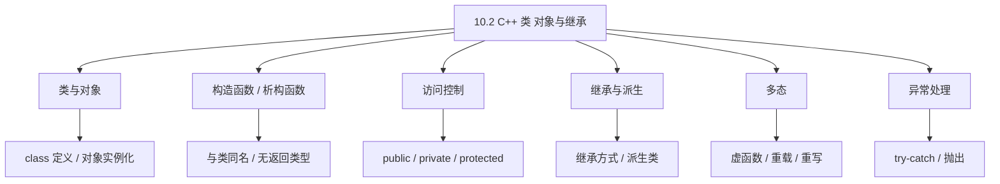
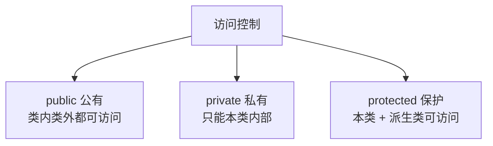
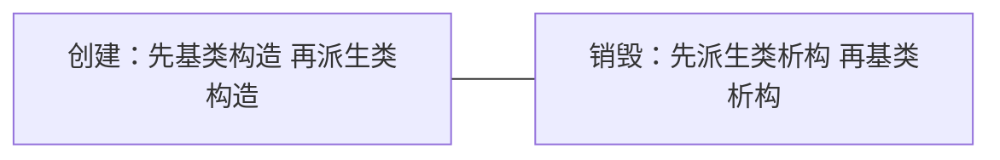
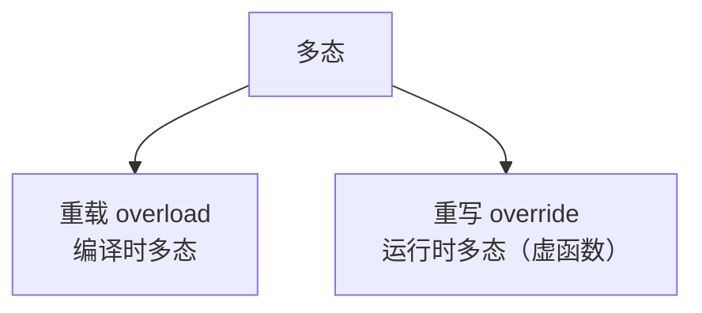
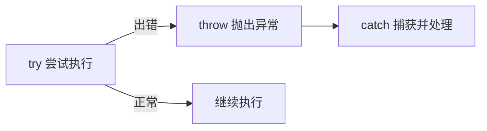

课程链接：视频《10.2 C++类 对象与继承》（软考程序员系列课程）

视频链接：

## 本节概述

本节是系列课程的第二十九节课，补全**第十章 C++ 程序设计**的面向对象核心内容。软考下午题的 C++ 选做题**几乎必考类与对象**，所以这一节是本册教程的命门之一。本节脉络依次是：类与对象的定义 → 构造函数与析构函数 → 类的访问控制（公有/私有/保护）→ 对象的使用 → 继承与派生 → 多态（虚函数、重载、重写）→ 异常处理。

先看一张本节的知识地图，把整节内容装进脑子里：



## 类与对象

### 类的定义

C++ 用 **`class`** 关键字定义类。类是一个**模板**，把**数据（成员变量）**和**操作（成员函数/方法）**封装在一起。比如定义一个"盒子 Box"类：

```cpp
class Box {
public:                        // 公有访问区：外部可以直接访问
    double length;             // 成员变量
    double breadth;
    double height;
    double getVolume();        // 成员函数（成员方法）
};
```

- **类 = 成员的集合**。成员包括**变量（属性/数据成员）**和**函数（方法/成员函数）**。
- **对象 = 类的实例**。类就像"图纸"，对象就是按图纸造出来的"实物"。

> [!TIP] 通俗理解
> 类好比"汽车设计图纸"，定义了一辆车有哪些属性（颜色、排量）和方法（启动、刹车）；对象则是一辆"具体的车"。图纸可以造出无数辆车，所以一个类可以创建多个对象。

### 对象的定义与使用

**定义对象**：用"类名 + 对象名"创建类的实例。

```cpp
Box box1;          // 定义了一个 Box 类型的对象 box1
Box box2;
```

**访问对象的成员**：用 **`.`（点运算符）** 访问：
- 给成员变量赋值：`box1.length = 5.0;`
- 调用成员函数：`box1.getVolume();`

### 成员函数的实现

成员函数的实现可以：

- **在类体内**直接给出函数体；
- 或在类内**声明**，在类外**定义**，类外定义要用**`::`（作用域运算符）**标明所属类：

```cpp
// 类外定义成员函数：类型 类名 :: 函数名(参数) { ... }
double Box::getVolume() {
    return length * breadth * height;
}
```

> [!NOTE]
> 访问成员：**对象用 `.`**；**指向对象的指针用 `->`**。类外定义成员函数用 `类名::` 限定。

## 构造函数与析构函数

### 构造函数（constructor）

**构造函数**的特点（常考）：

- **与类同名**。
- **没有返回类型**（也不写 void）。
- 在**创建对象时自动调用**，用于**初始化对象的成员**。

```cpp
class Box {
public:
    Box() {                 // 构造函数：与类同名、无返回类型
        length = 0;
    }
};
```

### 构造函数的重载

构造函数可以**重载**（多个参数不同的构造函数）：

```cpp
Box();                // 无参构造函数
Box(double l, double b);   // 带两个参数的构造函数
```

创建对象时根据传入参数选择对应构造函数：

```cpp
Box box1;                    // 调用无参构造
Box box2(5.0, 3.0);          // 调用带参构造
```

### 析构函数（destructor）

**析构函数**的特点：

- 类名前加 **`~`（波浪号）**，即 `~Box()`。
- **没有返回类型、没有参数**，一个类只能有一个析构函数。
- 在**对象销毁（生命周期结束）时自动调用**，用于释放占用的资源。

```cpp
class Box {
public:
    ~Box() {          // 析构函数：~类名
        // 释放资源，例如关闭文件、释放内存
    }
};
```

> [!WARNING] 真题考点
> 构造与析构三个常考点：**① 构造=与类同名、无返回类型、创建对象时调用；② 析构=`~类名`、无参无返回、对象销毁时调用；③ 构造函数可重载，析构函数不能。**


## 类的访问控制

C++ 用三个访问说明符控制类成员的访问范围：

| 访问修饰符 | 访问范围 |
|---|---|
| **public（公有）** | 类内、类外**都可以访问** |
| **private（私有）** | **只能在本类内部**访问，类外不能访问（默认就是 private） |
| **protected（保护）** | 本类内部 + **派生类（子类）** 可以访问，类外不能访问 |



> [!NOTE]
> 默认（不写）是 **private**。`private` 是本类独占，`protected` 额外开放给子类，`public` 完全开放。

## 继承与派生

### 继承的概念

**继承**是面向对象的重要特性：**从已有的类（基类/父类）派生出新的类（派生类/子类）**，子类**自动拥有父类的成员**，便于代码复用。

**派生类的定义格式**：

```cpp
class 派生类名 : 继承方式 基类名 {
    // 派生类新增的成员
};

class Rectangle : public Box {   // Rectangle 公有继承 Box
    // ...
};
```

- **基类（父类）**：被继承的类（Box）。
- **派生类（子类）**：新产生的类（Rectangle）。

### 继承的三种方式

| 基类成员 \ 继承方式 | public 继承 | protected 继承 | private 继承 |
|---|---|---|---|
| 基类 public 成员 | 派生类中**public** | 派生类中 **protected** | 派生类中 **private** |
| 基类 protected 成员 | 派生类中 **protected** | 派生类中 **protected** | 派生类中 **private** |
| 基类 private 成员 | 派生类中**不可直接访问** | 同样不可直接访问 | 同样不可直接访问 |

简单记：**继承方式只会让基类成员权限"降级"，不会提高；private 成员永远无法被派生类直接访问**。

> [!WARNING] 真题考点
> 继承结果三段式推演：**基类 private 继承后永远不可直接访问；public 继承保持原权限；protected 继承一律降到 protected、private 继承一律降到 private。** 通常最常用的是 **public 继承**。

### 派生类的构造与析构顺序

- **构造顺序**：先调**基类构造函数**，再调用**派生类构造函数**（先造爸爸再造儿子）。
- **析构顺序**：先调**派生类析构函数**，再调**基类析构函数**（先毁儿子再毁爸爸）。



> [!NOTE]
> 构造从祖先到子孙，析构从子孙到祖先（与构造相反）。

## 多态

### 什么是多态

**多态**：**同一个消息（调用同一个方法名）作用于不同对象，会产生不同行为**。C++ 实现多态主要靠**继承 + 虚函数**。



### 函数重载（overload）

**重载**：函数名相同、但**参数个数或类型不同**。发生在**同一个类**中，由编译时根据实参决定调用哪个版本。

```cpp
int add(int a, int b) { return a + b; }
double add(double a, double b) { return a + b; }  // 重载
```

### 函数重写 / 虚函数（override）

**重写**：**子类重新定义父类的同名同参函数**，发生在**继承关系中**。基类中的虚函数用 **`virtual`** 关键字声明：

```cpp
class Animal {
public:
    virtual void speak() {   // virtual 虚函数
        cout << "动物叫" << endl;
    }
};

class Dog : public Animal {
public:
    void speak() override {   // 子类重写 override
        cout << "汪汪" << endl;
    }
};
```

- 用 **`virtual`** 声明虚函数，支持**运行时多态**。
- **`override`** 表示重写（明确告诉编译器这里在重写一个虚函数）。
- 用**基类指针/引用**指向**子类对象**时，调用虚函数会**根据实际对象类型**决定执行哪个版本（编译时看指针类型、运行时看对象类型）。

```cpp
Animal *a = new Dog();   // 基类指针指向子类对象
a->speak();               // 输出"汪汪"（调用了子类的重写版本）
```

> [!WARNING] 真题考点
> **重载 vs 重写**：重载=同一类内、同名不同参（编译期）；重写=父子类间、同名同参、靠 **virtual 虚函数**（运行期）。下午题 C++ 常给基类+派生类代码问"调用输出什么"，此考点吃透必得分。

### 抽象类与纯虚函数

- **纯虚函数**：虚函数后加 `= 0`，即没有函数体的虚函数。

```cpp
class Shape {
public:
    virtual double area() = 0;   // 纯虚函数：area() = 0
};
```

- 含**纯虚函数**的类是**抽象类**，**不能创建对象**，只能作为基类被继承；抽象类的纯虚函数必须由派生类实现。

> [!NOTE]
> 纯虚函数 `= 0` → 抽象类 → 不能实例化 → 派生类必须实现该函数。记住判断即可。

## 异常处理

C++ 的异常处理用 **`try`（尝试）→ `catch`（捕获）→ `throw`（抛出）**：

```cpp
try {
    if (denominator == 0) {
        throw "除数不能为 0";   // 抛出异常
    }
} catch (const char *msg) {      // 捕获异常
    cout << "捕获异常：" << msg << endl;
}
```

- **try**：把可能出错的代码放在其中尝试执行。
- **throw**：在 try 中出现错误时，抛出一个异常（可以是字符串、数字或对象）。
- **catch**：捕获并处理抛出的异常，可写多个 catch 按类型匹配。



> [!NOTE]
> 异常处理三关键字：**try 尝试、throw 抛出、catch 捕获**。出现异常若无 catch 处理，程序会终止。

## 本节小结

① **类与对象**：`class` 定义类（数据成员 + 成员函数）；**类 = 模板，对象 = 实例**。定义对象 `Box box1;`，访问成员用 **`.`**（指针用 `->`），类外定义成员函数用 **`类名::`**。

② **构造与析构**：**构造函数=与类同名、无返回类型、创建对象时自动调用，可重载**；**析构函数=`~类名`、无参无返回、对象销毁时调用，一个类只有一个**。

③ **访问控制**：**public 类内外都可用、private 仅本类（默认）、protected 本类+派生类可访问**。

④ **继承与派生**：派生类 `class 子类 : public 基类`。**继承方式使基类成员权限降级（public→按继承方式、protected→还是 protected、private→private 且永远不可直接用）**。构造顺序先基类后派生，析构相反。

⑤ **多态**：**重载=同参不同形参（编译期）；重写=子类重定义父类同名同参、靠 `virtual` 虚函数（运行期，基类指针指向子类对象时按实际对象类型调用）**。**纯虚函数 `=0` 构成抽象类，抽象类不能建对象，派生类必须实现**。

⑥ **异常处理**：**try 尝试 → throw 抛出 → catch 捕获**，多个 catch 按类型匹配。