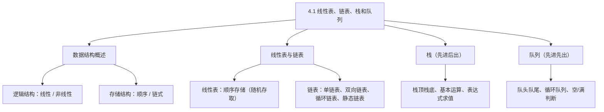
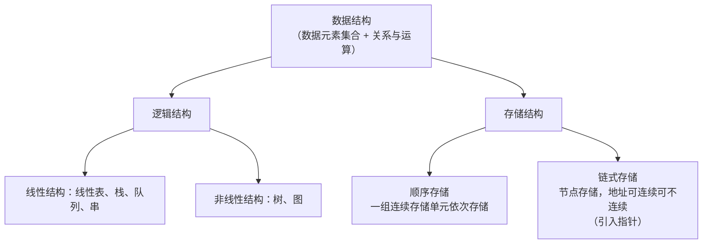
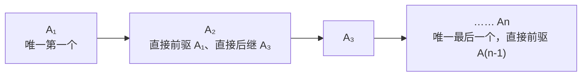
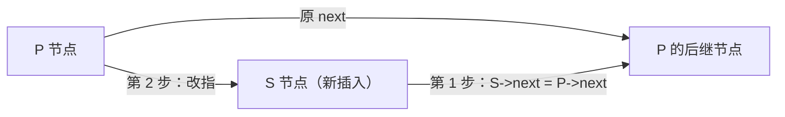
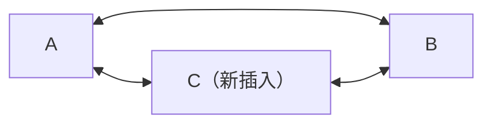
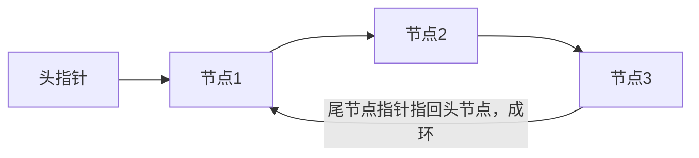
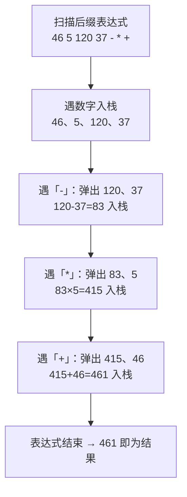
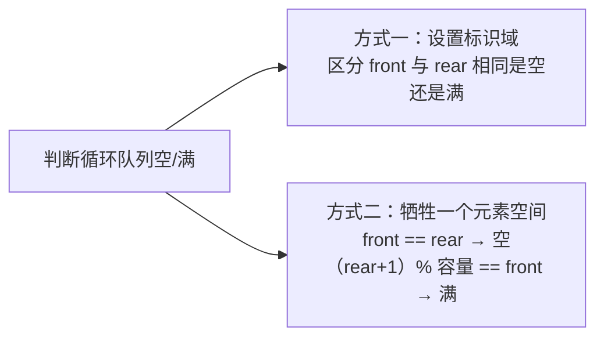
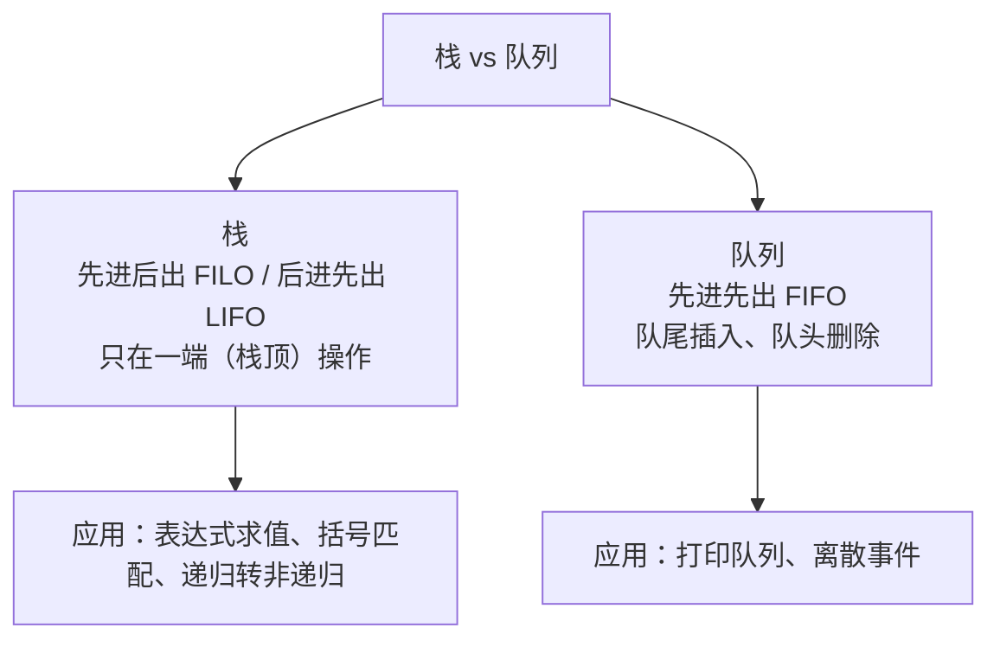

课程链接：视频《4.1 线性表、链表、栈和队列》（软考程序员系列课程）

视频链接：

## 本节概述

本课是系列课程的第十一节课，进入教材第 4 章「数据结构与算法」。这一章节在**上午试题和下午试题均有所考察**。本课内容包括两大块：①**线性表和链表**——线性表与链表的逻辑结构、存储结构以及插入删除元素、特点和优缺点；②**栈和队列**——栈与队列的不同、如何判断栈满/空栈，以及几种不同的队列。

## 数据结构概述

**数据结构**是用来描述数据元素的集合及元素间的关系与运算的。

从**逻辑**上来分，分为**线性结构**和**非线性结构**：线性结构包括线性表、栈、队列和串（这也是今天要讲的内容）；非线性结构包括树和图。

从**存储**上来分，存储结构可以分为**顺序存储**和**链式存储**两种方式：顺序存储是指用**一组连续的存储单元**依次存储元素；链式存储是指**用节点来存储数据元素**，节点的地址可以连续、也可以不连续，它引入了**指针**的概念。

## 线性表

**线性表的定义**：一个线性表是由 **n（n≥0）** 个元素构成的**有穷序列**，可以表示为 A₁、A₂、……、An。对于长度大于 0 的线性表，它的特点是：存在唯一一个称为**第一个**的元素，存在唯一一个称为**最后一个**的元素；除第一个元素以外，序列中每个元素均有一个**直接前驱**；除最后一个元素以外，序列中每个元素均只有一个**直接后继**。

例：顺序存储的线性表 1→2→3→4→5→6：1 是唯一第一个元素，6 是唯一最后一个元素；2 的直接前驱是 1、3 的直接前驱是 2；4 的直接后继是 5、3 的直接后继是 4——这种数据结构称为线性表。

### 线性表的顺序存储

**顺序存储结构**：第 i 个元素的地址 Aᵢ 的位置 = 第一个元素的位置 + 偏移量（元素之间的偏移量 + 第 i-1 个元素与第一个元素之间的偏移量）。

**顺序存储的优点**：节约存储空间；可实现顺序存储、**随机存取**；查找速度快。**缺点**：插入和删除需要**移动元素**。

> [!WARNING] 考点：平均移动元素数
> 记住两个公式（等概率情况下）：**插入一个元素需要移动元素的数目是 n/2**；**删除一个元素需要移动元素的数目是 (n-1)/2**。推导：插入时等概率事件，1/(n+1) × Σ(n+1-i)（i 从 1 到 n）→ n/2；删除时 1/n × Σ(n-i)（i 从 1 到 n）→ (n-1)/2。

### 线性表的链式存储：单链表

线性表的第二种存储结构是**链式存储**，它由节点构成，每个节点包括**数据域和指针域**。整个链表存在一个**头节点**（头指针指向该节点），最后是**尾节点**（指针域为空）。

**单链表中插入一个元素 C**（在 P 节点后插入 S 节点）分两步：
1. **S 节点的指针域（next）指向 P 节点所指向（P 指针域原来）的后继节点**：`S->next = P->next`；
2. **将 P 节点的指针域指向 S 节点**：`P->next = S`。

**删除节点**（删除 P 的后继节点 Q）分三步：
1. **备份要删除的节点**（暂存 Q 指针）；
2. **将 P 节点的指针域指向 Q 节点的后继节点**：`P->next = Q->next`（即 P->next 指向 P 的后继节点的后继节点）；
3. **释放 Q 节点**（删除一般要释放这个节点）。

**链式存储的优点**：插入和删除操作时**不需要移动元素**。**缺点**：**无法实现随机存取**，只能顺序地访问元素。

### 双向链表

**双向链表**是每个节点都包含**两个指针**，分别指向当前元素的**直接前驱**和**直接后继**（如节点 A 的指针指向直接后继 B，B 的指针指向直接前驱 A）。它的优点是可以在**两个方向上遍历**列表中的元素。

**双向链表插入一个元素**（在 P 之后插入 S，对应 A、B 之间插入 C）的步骤：
1. C 的前驱（指针）指向 A：`S->prior = P`；
2. A 的后继指向 C：`P->next = S`；
3. B 的前驱指向 C：`P->next->prior = S`（即原后继节点 B 的 prior 指向 S）；
4. C 的后继指向 B：`S->next = P->next`。

**双向链表删除一个元素 B**（删除 P 与其后继 Q 之间的元素，实际是删除 P 的后继 Q）的步骤：
1. A 的指针（next）指向 C（原后继节点的后继）：`P->next = Q->next`；
2. C 的前驱指针指向 A：`Q->next->prior = P`；
3. 释放（删除的）节点空间。

### 循环链表

**循环链表**是指表尾节点中的指针**指向链表的第一个节点**，从而形成一个**环状结构**。它的优势是：**可以从表中任意一个节点开始遍历整个表**。

**典型应用：选择首领**——N 个游戏者围成一圈，从第一个人开始顺序报数 1、2、3，凡是报到 3 的时候就退出圈子，最后留在圈子中的人成为首领（约瑟夫环问题）。实现时用循环链表，当第二个报数者要报 3 时，将报数到 3 的人推出，他的前驱的指针域必须指向他的**后继节点**，然后把这个节点释放，如此循环操作，最后留在圈子里的即首领。

### 静态链表

**静态链表**是指一个节点是数据（存储）中的一个数组中的一个元素，它引入**游标（宿主）**的概念——用数组下标（游标）来表示链接关系，代替指针。表的表尾通过指针域为某个约定值（如 -1 或 0）来标识。例如线性表 12、13、14、15 依次链接，下标 0 处存放头节点的下一个节点的下标，其数据域的值为第一个元素……直到指针域等于约定值，即为链表的**表尾**。

## 栈

**栈**是一种只能通过访问它的**一端**实现数据的存储与检索的**线性数据结构**。因为它只在一端操作，所以是**先进后出（FILO，First In Last Out）**，也就是**后进先出（LIFO）**。进行数据存储与检索的一端称为**栈顶**，另一端称为**栈底**。

**栈的基本运算**：初始化栈（InitStack，返回 void，初始化一个空栈）；判断是否为空栈（IsEmpty，返回 int：空栈返回 1，非空返回 0）；**入栈**（Push，将 X 元素加入到栈 S 中）；**出栈**（Pop，栈顶元素出栈、栈元素数目减 1）；读栈顶元素。

**栈的顺序存储**：需要**预先定义或申请存储空间**，且栈的存储空间是**有限**的——需要判断栈是否满，如果栈满元素再次入栈，会发生**上溢**的现象。

**栈的链式存储**：就是链表，链表的**头指针就是栈顶的指针**（栈顶指针指向栈顶节点，A₁ 直到 An-1 依次链接）。

**栈的典型应用**：表达式的求值、括号的匹配、计算机语言实现递归过程转非递归过程的处理。

**表达式求值（后缀表达式）**：例如 `46 5 120 37 - * +`（=45+5×(120-37)？并不重要，理解过程）——数据之间用空格隔开，符号（运算符）后置。求值步骤：数据依次压入栈中（46、5、120、37）；遇到减号时弹出两个元素 120 和 37，计算 120−37=83 再压入栈；遇到乘号，弹出 83 与 5 相乘得 415 压入栈；遇到加号，弹出 415 与 46 相加得 461 压入栈；表达式结束后，计算结果完成。

## 队列

**队列**是一种**先进先出（FIFO）**的线性表，只允许在队列的一端**插入**元素，在另一端**删除**元素。插入元素的一端称为**队尾（rear）**，删除元素的一端称为**队头（front）**——就像排队一样：在队尾排队插入，从队头离开删除。

**队列的基本运算**：初始化队列（InitQueue）；判断队列是否为空（IsEmpty，空返回真 1，否则返回假 0）；**入队**（EnQueue，带一个参数 X，将 X 加入队列的队尾，并更新队尾指针）；**出队**（DeQueue，将队头元素从队列中删除，并更新队头指针）；读队头元素。

### 队列的顺序存储与循环队列

队列的顺序存储：当**队头指针和队尾指针指在一起**（front == rear）时，我们认为它是**空队列**；当队列中存有元素时，队头、队尾指针指向不同位置。

**循环队列**：为了解决顺序队列"假溢出"问题，将存储空间首尾相接成环。

**判断队列是否为空（或满）的两种处置方式**：
1. **设置标识域**来区分队头指针和队尾指针的值是"空"还是"满"；
2. **牺牲一个元素空间**：约定"队尾指针所指位置的下一个位置是头指针位置"时表示队满；队头指针和队尾指针相同时表示队列为空。

**队列的应用**：常应用于排队的场合，比如**打印队列**，以及**离散事件的计算**。

## 本节小结

① **数据结构**：逻辑结构分线性（线性表、栈、队列、串）与非线性（树、图）；存储结构分顺序存储（连续单元，可随机存取）与链式存储（节点 + 指针，地址可不连续）。

② **线性表**：有唯一第一个/最后一个元素，每个元素（除首尾）有唯一直接前驱与直接后继。顺序存储优点：省空间、随机存取、查找快；缺点：插入删除需移动元素——**插入平均移动 n/2，删除平均移动 (n-1)/2（考点）**。

③ **链表**：单链表插入两步（`S->next = P->next; P->next = S`）、删除三步（备份 → `P->next = Q->next` → 释放 Q）；优点：插入删除不需移动元素；缺点：不能随机存取。双向链表每节点两个指针（前驱/后继），可双向遍历。循环链表表尾指针指向头节点成环，可从任意节点遍历（典型应用：约瑟夫/选择首领）。静态链表用数组 + 游标（宿主）实现链接关系。

④ **栈**：先进后出（FILO/LIFO），只在栈顶操作；基本运算 初始化/判空/入栈/出栈/读栈顶；顺序存储要防上溢（预先分配有限空间），链式存储头指针即栈顶指针；典型应用：**后缀表达式求值**（遇数入栈，遇运算符弹出两数计算后入栈）、括号匹配、递归转非递归。

⑤ **队列**：先进先出（FIFO），队尾插入、队头删除；循环队列用"标识域"或"**牺牲一个元素空间**"来区分空/满（front==rear 为空，尾指针下一位置为头指针为满）；应用：打印队列、离散事件计算。