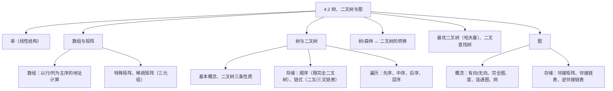
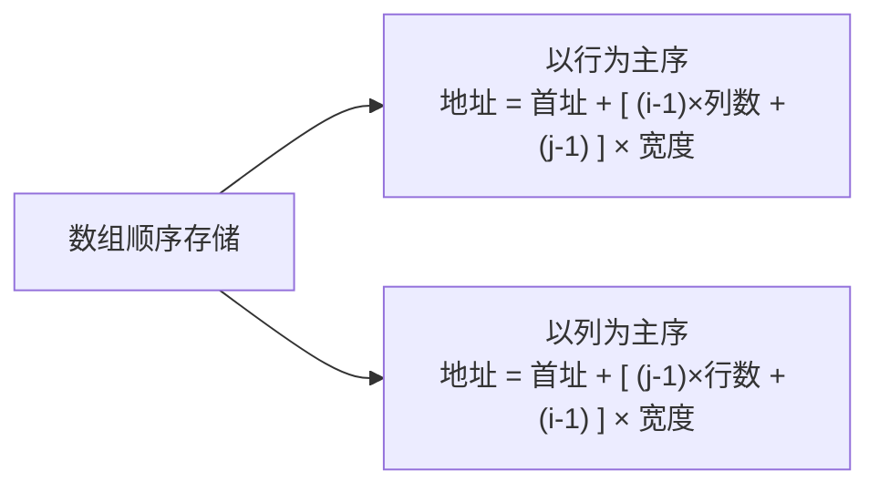
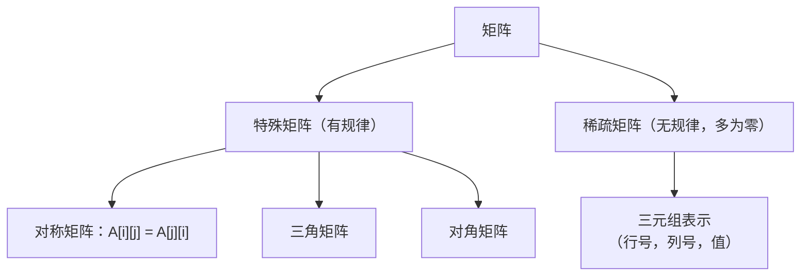
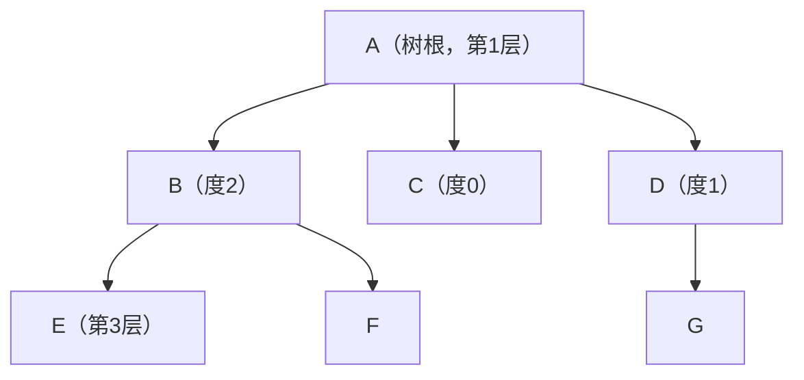
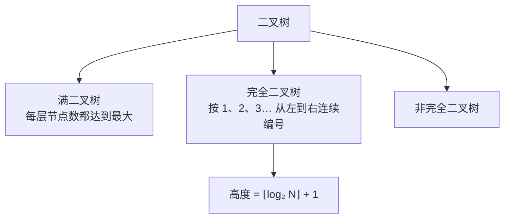
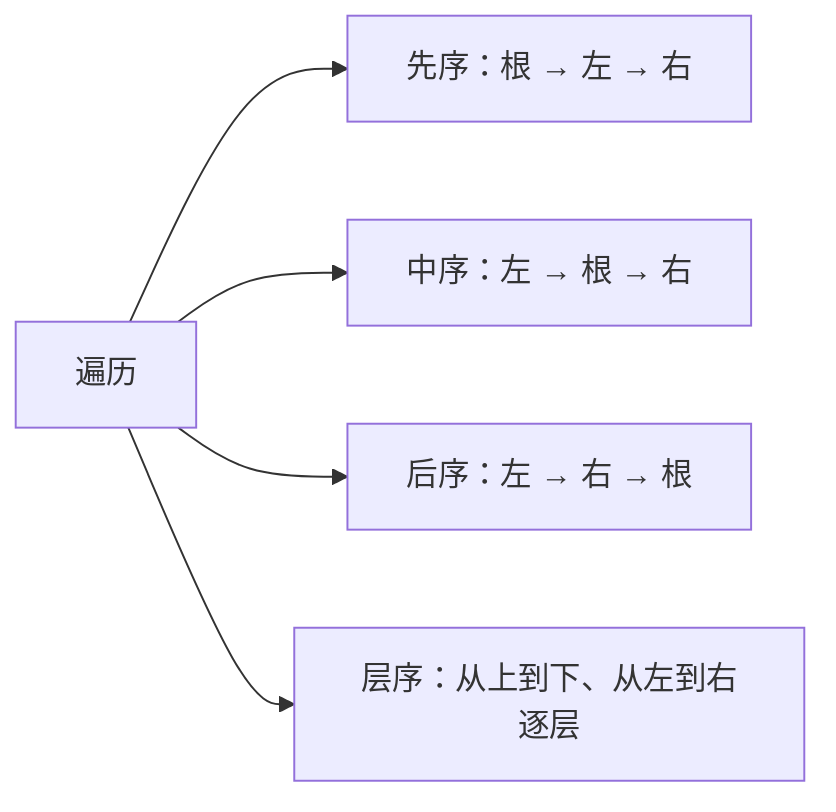
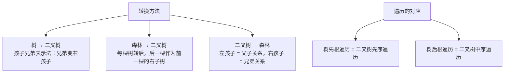
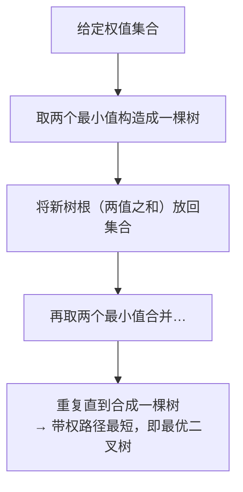
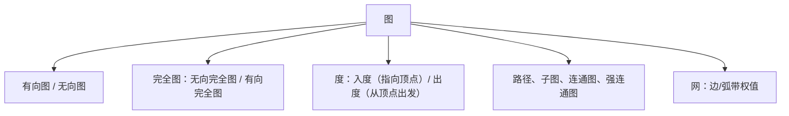
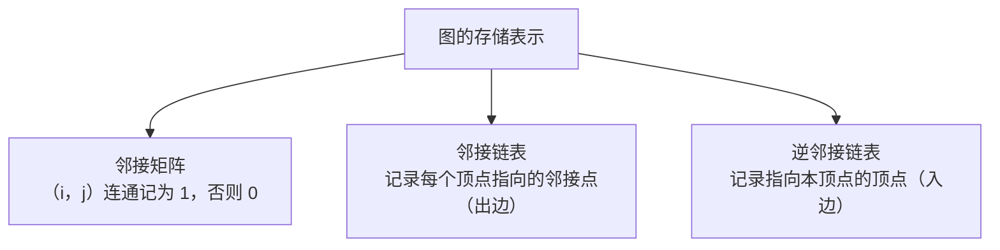

课程链接：视频《4.2 树、二叉树与图》（软考程序员系列课程）

视频链接：

## 本节概述

本节是系列课程的第十二节课，进入教材第 4 章「数据结构与算法」，本节讲解数据结构的最后一块内容——**树、二叉树与图**。本节脉络依次是：串 → 数组 → 矩阵（特殊矩阵、稀疏矩阵）→ 树与二叉树（基本概念、性质、存储、遍历）→ 树和森林与二叉树的转换 → 最优二叉树 → 二叉查找树 → 图（概念与存储表示）。

## 串

**串**是一个线性结构，也是线性结构的一部分。串的基本术语：
- **串的长度**：字符串中字符的个数；
- **空串**：不包含任何字符的串；
- **子串**：某一个串包含于另外一个串当中，被包含的串称为子串；
- **串相等**：两个字符串**长度相等**，且对应的字符内容也相同；
- **串比较**：将两个串进行对比，一般是指字符串的 ASCII 码值大的串比较大。

串的操作：**复制操作**（将串复制到某一个变量）、**连接操作**（拼接字符串，将两个字符串连接成为一个新串）、**求串长**、**串比较**、**求子串**（从某一个串内取出某些子串）。

串具有**顺序存储**（地址空间连续）和**链式存储**（地址空间可以不连续，通过指针指向下一串的开始地址）两种存储方式。

## 数组

**数组**也是一种线性表的表达形式，主要有**行向量**的表达形式和**列向量**的表达形式。它的特点有：数据元素的**数目是固定的**（一旦定义了数组，就不能再有数据元素的增减变化）；数据元素具有**相同的类型**；数据元素的下标关系具有**上下界的约束**且下标有序。数组是比较适合**顺序存储**的，有**以行为主序**和**以列为主序**两种方式。

**地址计算（以行为主序）**：第 (i, j) 个元素的地址 = 第一个元素的首地址 + [ (行标 i - 1) × 列数 + (列标 j - 1) ] × 单个数据元素的存储宽度。

**以列为主序**：地址 = 第一个元素的首地址 + [ (列标 j - 1) × 行数 + (行标 i - 1) ] × 单个数据元素的存储宽度。

> [!TIP] 例题
> 求 2 行 3 列、以行为主序的地址：首地址 + [ (2-1) × 列数 4 + (3-1) ] × 宽度 = 首地址 + (1×4 + 2) × 宽度 = 首地址 + **6** × 宽度。列为主序则按"（列标-1）× 行数 + 行标-1"自行代入计算即可。

## 矩阵：特殊矩阵与稀疏矩阵

矩阵的表达方式分为**特殊矩阵**和**稀疏矩阵**：矩阵中的元素分布**有一定的规律**的称为特殊矩阵；元素分布**没有规律**（元素大部分为零）的称为稀疏矩阵。

**特殊矩阵**又分为：**对称矩阵**（满足 A[i][j] = A[j][i]）、**三角矩阵**、**对角矩阵**。

**稀疏矩阵**主要记住**三元组**的表示：每个非零元素用（行，列，值）三元组表示，例如（1，2，12）、（1，3，9）、（3，1，-3）……整个用括号括起来。稀疏矩阵也属于顺序与链式存储。

## 树的基本概念

树要掌握以下概念（以 A 为树根的树为例，A 的孩子为 B、C、D）：
- **双亲 / 孩子**：B、C、D 是 A 的孩子结点，B 是 E、F 的双亲；
- **兄弟**：B、C 之间互为兄弟节点；
- **节点的度**：一个节点**子树的个数**（如 B 的子树有 E、F，所以 B 的度为 2；C 没有子树，度为零；D 有一个子树，度为一）；
- **内部节点**：除根节点以外，度不为零的节点（D、B 等）；
- **节点的层次**：根为第一层（A），根的孩子为第二层（B、C、D），再往下为第三层（E、F、G）；
- **树的高度（深度）**：树的最大层数（如该树最大层数为 3）；
- **有序树 / 无序树**：若树中节点的子树可以看成从左到右、**不能交换顺序**，称为有序树；
- **森林**：m（m≥0）个**互不相交的树**的集合称为森林。

## 二叉树的性质

二叉树的性质要记一下，便于在考试中快速应用：

> [!WARNING] 考点：二叉树三条性质
> ① **第 i 层至多有 2^(i-1) 个节点**（第 2 层最多 2¹=2 个节点，第 3 层最多 2²=4 个节点）；
> ② **深度为 K 的二叉树至多有 2^K − 1 个节点**；
> ③ 对任何一棵二叉树，**叶子/终端节点数 N₀ = 度为 2 的节点数 N₂ + 1**。

**满二叉树**：每一层的节点数都达到最大。**完全二叉树**：按从上到下、从左到右的顺序编号，编号连续（允许最后一层不满但必须从左到右连续）的二叉树称为完全二叉树；非完全二叉树就是中间有缺失。**具有 N 个节点的完全二叉树的高度是 ⌊log₂N⌋ + 1**（向下取整加 1，可以记一下）。

## 二叉树的存储结构

**顺序存储只适用于完全二叉树**——非完全二叉树需要增加虚节点，容易造成空间浪费。有一个结论：在坏的情况下，一个高度为 H 且只有 H 个节点的（单支）二叉树，需要 **2^H − 1** 个存储单元。

**链式存储**有**二叉链表**和**三叉链表**：每个节点指针的个数为 2 的称为二叉链表；指针的个数为 3 的是三叉链表。它们的区别是：**三叉链表需要反指向其前驱（双亲）节点**，二叉链表则不需要反指向前驱节点。

## 二叉树的遍历

二叉树的遍历有**先序遍历、中序遍历、后序遍历、层序（程序）遍历**四种：

| 遍历方式 | 顺序 |
|---|---|
| 先序遍历 | 根 → 左子树 → 右子树（根左右） |
| 中序遍历 | 左子树 → 根 → 右子树（左根右） |
| 后序遍历 | 左子树 → 右子树 → 根（左右根） |
| 层序遍历 | 从上到下、从左到右逐层访问 |

## 树和森林与二叉树的转换

**树转化为二叉树**通常使用**孩子兄弟表示法**：将兄弟表示为右孩子。例如把 A 的右孩子 C（本来是兄弟）变为 B 的右孩子，将 D 的兄弟 E 变为 D 的右孩子，这样就得到了二叉树。

**森林转化为二叉树**：将森林中的每一棵树转化成二叉树，再将第二棵树作为第一棵树的**右子树**，第三棵树作为第二棵树的右子树，依次往后推，最终形成一棵二叉树。

**二叉树转化为森林**：将**左孩子解释为父子关系**、将**右孩子解释为兄弟关系**。

**树的遍历与二叉树遍历的对应关系**：树的**先根遍历等同于二叉树的先序遍历**；树的**后根遍历等同于二叉树的中序遍历**。森林也有先序和中序遍历，是按照第一棵树、第二棵树的顺序依次进行遍历。

## 最优二叉树（哈夫曼树）

**最优二叉树**是指**带权路径长度（WPL）最短**的树。带权路径长度的计算：各叶子节点的权值 × 其路径长度的累加（例：0.08×3 + 0.125×… + 0.25×… + 0.3×权值……），其中带权路径长度最小的称为最优二叉树。

**最优二叉树的构造方法**：每次从给定权值中找出**两个最小值**，将它们构造成一棵树（一棵以二者之和为根的子树），再找次小值构造成第二棵，合并成一棵树……重复"取两个最小 → 合成"的过程，最后合成一棵带权路径最短的树，即为最优二叉树。

## 二叉查找树（二叉排序树/二叉检索树）

**二叉查找树**又称二叉排序树或二叉检索树，是为了便于查找而设置的树，它满足三个性质：
1. 若左子树非空，**左子树中的所有节点小于根节点的值**；
2. 若右子树非空，**右子树所有节点均大于根节点的值**；
3. 左右子树**也是二叉查找树**。

> [!NOTE]
> 如果某个节点放错了位置（例如比 54 小的值出现在 54 的右子树中），就不满足二叉查找树的性质——比根小的节点必须在左子树中（如 38 的左孩子位置），这棵树就不是二叉查找树。

## 图的基本概念

图的概念：
- **有向图和无向图**：按边是否有方向划分；
- **完全图**：**无向完全图**——每个节点与其他所有节点之间都有边；**有向完全图**——任意两个顶点之间存在**方向相反的两条弧**；
- **度**：关联于（连接于）顶点的边的数目；有向图中分**入度**（指向该顶点的边数）和**出度**（从该顶点出发的边数），例如某顶点入度为 0、出度为 1，另一顶点入度为 1、出度为 0；
- **路径**：图中由边（有向边或无向边）依次连接顶点的序列；
- **子图**：包含于原图的顶点和边的图（一种包含关系）；
- **连通图**：任意两个顶点之间都是连通关系（无向图）；**强连通图**：有向图中每个顶点之间都存在连通关系；
- **网**：边或弧**具有权值**的图称为网。

## 图的存储表示

图有两种（三种）表示方法：**邻接矩阵表示法、邻接链表表示法、逆邻接链表表示法**。

**邻接矩阵表示法**：用一个矩阵表示顶点之间的连通关系，**连通记为 1，不连通记为 0**。例如无向图：1 和 2、1 和 3、1 和 4 连通，则第一行为 0 1 1 1 0……（自己与自己不连通记为 0），整个就是邻接矩阵。

**邻接链表表示法**：把每个顶点的邻接（指向的）顶点用链表串起来（如 1→2、2→3、3→4、4 不指向任何；2 指向 1、3……）。

**逆邻接链表表示法**：方向相反地记录指向本顶点的顶点（把 1 指向 2 的近邻改为记录"2 指向 1"这种反向关系，即记录入边）。

## 本节小结

① **串**：线性结构；长度、空串、子串、串相等（长度相等且内容相同）、串比较（按 ASCII 码值）；操作有复制、连接、求串长、串比较、求子串；顺序/链式两种存储。

② **数组与矩阵**：数组元素数目固定、类型相同、下标有界；以行为主序地址 = 首址 + [ (i-1)×列数 + (j-1) ]×宽度，以列为主序把"行/列"对调；特殊矩阵（对称、三角、对角），稀疏矩阵用**三元组（行，列，值）**表示。

③ **树的基本概念**：树根、孩子、双亲、兄弟、节点的度（子树个数）、内部节点（非根且度≠0）、层次、高度（最大层数）、有序树/无序树、森林（m 个互不相交的树）。

④ **二叉树性质（考点）**：第 i 层至多 2^(i-1) 个节点；深度 K 至多 2^K−1 个节点；**N₀ = N₂ + 1**；完全二叉树高度 = ⌊log₂N⌋+1。顺序存储只适用完全二叉树（最坏需 2^H−1 单元），链式存储分二叉链表（2 个指针）与三叉链表（3 个指针、反指前驱）。遍历：先序（根左右）、中序（左根右）、后序（左右根）、层序（逐层从左到右）。

⑤ **转换与特殊树**：树→二叉树用孩子兄弟表示法（兄弟变右孩子）；森林→二叉树（后一棵作前一棵右子树）；二叉树→森林（左孩子=父子、右孩子=兄弟）；**树先根 = 二叉树先序，树后根 = 二叉树中序**。最优二叉树 = 带权路径长度最短（每次取两最小构造）；二叉查找树：左子树所有值<根、右子树所有值>根、左右子树也是 BST。

⑥ **图**：有向/无向、无向/有向完全图、入度/出度、路径、子图、连通图/强连通图、网（带权）；存储表示：邻接矩阵（连通记 1）、邻接链表（出边）、逆邻接链表（入边）。