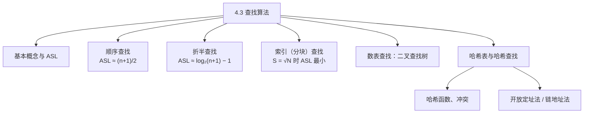
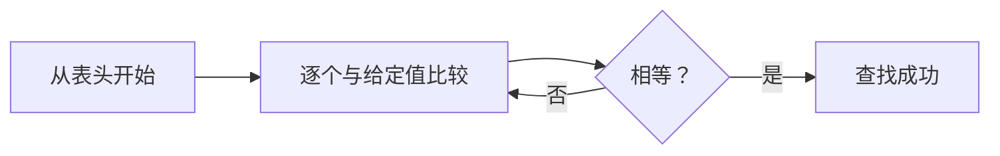
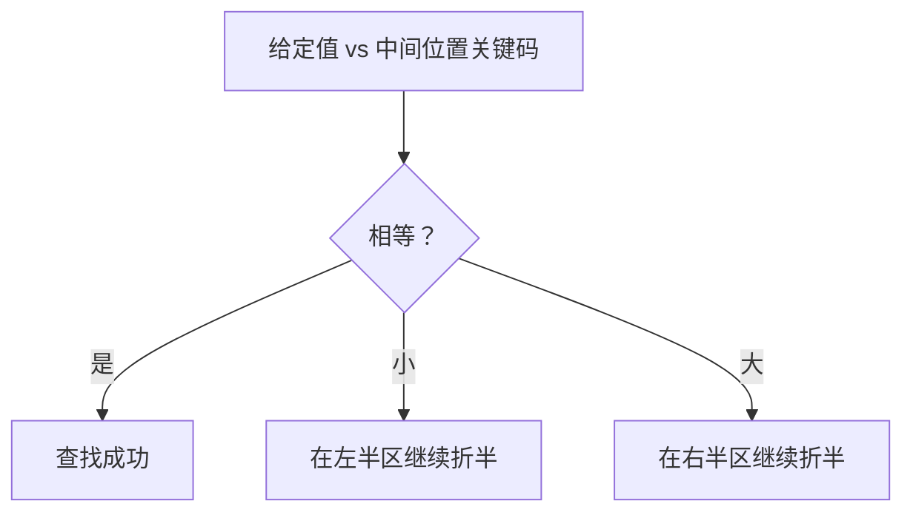
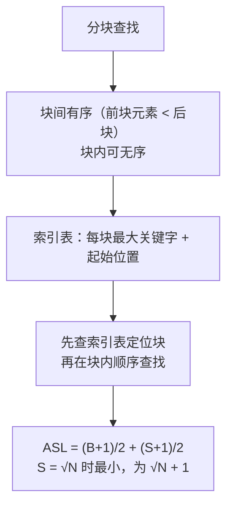
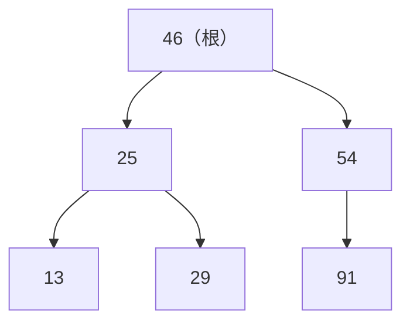
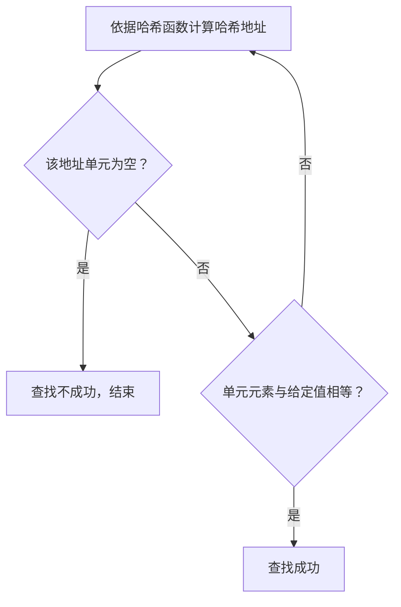
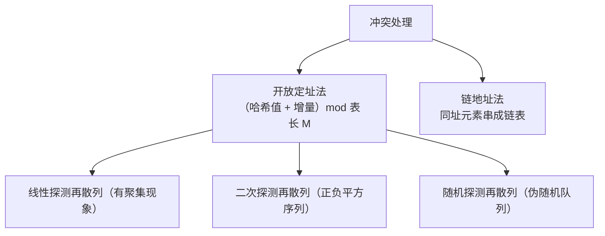

课程链接：视频《4.3 查找算法》（软考程序员系列课程）

视频链接：

## 本节概述

本节是系列课程的第十三节课，进入教材第 4 章「数据结构与算法」，是数据结构与算法的"查找算法"部分。本节内容：查找算法的基本概念及平均查找长度 → 顺序查找 → 折半查找 → 索引查找（分块查找）→ 数表查找（二叉查找树）→ 哈希表与哈希查找。

## 查找的基本概念

**查找表**一般是同一类元素的一个集合，是一种**松散的结构**，它包括**静态查找**和**动态查找**：静态查找是查询数据元素是否存在、检索特定数据元素的某个属性（不改变表结构）；动态查找是插入数据元素和删除数据元素（修改了查找表的结构）。

**关键码**：在查找表中能够标识数据元素的数据项。它又包括**主关键码**（能**唯一**标识一个数据元素）和**次关键码**（能标识**多个**数据元素）。

**查找过程**：将关键码与给定值进行比较——如果比较成功，就代表查找成功、结束查找；如果不成功，继续返回查找表中与新的关键码进行比较；如果在查找表中没有任何一个关键码与给定值相等，就返回**查找失败**。

**平均查找长度（ASL）**：查找成功时平均查找的长度。一般用：查找某条记录的概率 × 查找该记录比较的次数，求和；一般情况下认为每条记录查找的概率相等，查找 N 个记录时概率为 **1/N**。公式可记为：

> [!NOTE] 公式
> **ASL = Σ pᵢ·cᵢ**（pᵢ 为查找第 i 条记录的概率，cᵢ 为查找第 i 条记录时与关键码比较的次数）。查找比较的次数随查找表和查找方式的不同而不同。

## 顺序查找

**顺序查找**的平均查找长度：pᵢ = 1/N，cᵢ = N − i + 1，经换算可得：

> [!WARNING] 考点
> **顺序查找的 ASL ≈ (N+1)/2**（整个查找表表长的一半）。

顺序查找的**缺点**：随着 N 值不断增大，平均查找长度会比较大，查询效率会降低；**优点**：算法非常简单，对查找表的**存储结构没有要求**。

## 折半查找

**折半查找**是将给定值与**中间位置的关键码**进行比较：若相等则返回、查找成功；若不相等则缩小范围——给定值比中间值小，就在左子序列中查找；比中间值大，就在右子序列中查找。

这种序列可以用**二叉树**形式表示：根节点是中间关键字的位置，小于根节点的序列作为左子树，大于根节点的序列作为右子树。与给定值比较的关键码个数**不超过查找节点在树中的层数**，即 ≤ **⌊log₂N⌋ + 1**（N 为树中节点个数）。

**等概率情况下的平均查找长度**：ASL = (1/N)·Σ(j·2^(j-1))，即 **ASL ≈ log₂(N+1) − 1**（N 足够大时简化为该式）。

折半查找的**优点**：查找效率高。**缺点**：要求序列必须**按顺序存储**，且序列有序；插入和删除操作需要**移动大量的元素**（顺序存储带来的缺点）。

## 索引查找（分块查找）

**索引顺序查找（分块查找）**是对顺序查找的一种改进。它的特点：**块间是有序的**——第一块里的元素均小于第二块里的元素；**块内可以是无序的**。然后建立一个**索引表**，索引表由每块的**最大关键字**和它的**起始位置**组成（例如第一块最大关键字 23、起始位置 1；第二块最大关键字 49、起始位置 4；第三块最大关键字 87、起始位置 7）。

分块查找的平均查找长度分为**两部分**：查找索引表的平均查找长度 L_B + 块内查找的平均查找长度 L_w。由于都是顺序查找，前者为 **(B+1)/2**，后者为 **(S+1)/2**——其中 B 代表将长度为 N 的表平均分为 **B 块**，S 代表每块中有 **S 条记录**。

> [!WARNING] 考点
> 当 **S 取到 √N** 时，分块查找的平均查找长度最小，为 **√N + 1**。分块查找的效率介于**顺序查找和折半查找之间**。

## 数表查找：二叉查找树

**数表查找**常见的有二叉查找树、红黑树和 B 树，这里主要讲**二叉查找树（二叉排序树）**。

**二叉查找树的查找**：给定一个值 K，如果表中存在关键码等于 K 的则成功返回，否则可插入关键码等于 K 的记录。查找算法：从根节点开始，在二叉查找树中查找键值为 key 的节点——找到则返回节点的指针，找不到则返回空；若 key 小于当前关键码则继续在左子树查找，否则在右子树查找，通过循环完成。

**二叉查找树的插入**：例如初始 46，插入 25——25 小于 46 插入到左子树；插入 54——54 大于 46 插入右子树；插入 13——13 小于 25 插入 25 的左子树；插入 29——29 大于 25 且小于 46，插入 25 的右子树；插入 91——91 大于 54，插入 54 的右子树。插入算法：申请地址空间赋予 S，若为空返回失败；若键值已存在树中则不进行插入；若为空树则键值的节点就是树根；若小于关键码则插入左子树，否则插入右子树。

> [!WARNING] 考点
> **在输入序列有序的情况下**，二叉查找树构造的是一棵**单支树**，查找效率会退化，**与顺序查找效率相当**。

## 哈希表与哈希查找

**哈希表的构造**主要是一个**冲突处理**的过程：首先构造一个哈希地址，并将关键码逐渐映射到哈希地址上。**冲突**：对于一个哈希函数，如果两个关键码**不相等**，但它们的哈希函数值相等（映射到同一个地址），就出现了冲突。避免和解决冲突是构造哈希表的关键过程。

**冲突处理的方法**：
1. **开放定址法**：公式为（哈希函数的值 + 增量序列）**mod 表长 M**。增量序列有 3 种方式——以**线性递增**的序列为**线性探测再散列**；以**正负平方数**的序列为**二次探测再散列**；以**伪随机队列**为**随机探测再散列**。
2. **链地址法**：将哈希到同一地址的关键码用链表串起来。

> [!NOTE] 线性探测例
> 关键码序列，哈希表长 13（地址 0~12），哈希函数 H(key) = key mod 11（视频中为 mod 11 与表长 13）：34 mod 11 = 1，填到地址 1；47 mod 11 = 3，填到 3；19 mod 11 = 8……若产生冲突（目标地址已被占），就线性探测下一个地址（加 1 再试），直到有空位。线性探测的缺点是会带来**数据元素的聚集现象**；二次探测和随机探测可以降低这种聚集现象。

**哈希查找的查找过程**：首先依据哈希函数计算出**哈希地址**；如果该地址单元为空，说明查找不成功、可以结束；如果不是空单元，将该单元中的元素与给定值比较——若相等则查找成功，若不相等再根据哈希函数计算哈希地址，继续循环探测。

## 本节小结

① **基本概念**：查找表 = 同类元素集合（松散结构）；静态查找不改表、动态查找插入删除改表；主关键码唯一标识、次关键码标识多个；**ASL = Σ pᵢ·cᵢ**（等概率 pᵢ = 1/N）。

② **顺序查找**：cᵢ = N−i+1，**ASL ≈ (N+1)/2**；优点算法简单、对存储结构无要求；缺点 N 大时效率低。

③ **折半查找**：与中间关键码比较，相等成功、小则左、大则右；比较次数 ≤ ⌊log₂N⌋+1；**等概率 ASL ≈ log₂(N+1)−1**；优点效率高；缺点要求**有序 + 顺序存储**，插入删除移动大量元素。

④ **分块查找**：块间有序、块内无序；索引表（最大关键码 + 起始位置）；**ASL = (B+1)/2 + (S+1)/2，S=√N 时最小为 √N+1**；效率介于顺序查找与折半查找之间。

⑤ **二叉查找树**：查找键值，找到返回、找不到插入；插入规则——小于根插左、大于根插右；**输入序列有序 → 单支树 → 效率退化到与顺序查找相当（考点）**。

⑥ **哈希查找**：哈希函数把关键码映射到哈希地址；两不同关键码映射到同一地址即**冲突**；处理冲突：**开放定址法**（线性探测有聚集现象、二次/随机探测可降低聚集）与**链地址法**；查找时先算地址→空则失败、不空则比较→不等继续探测。