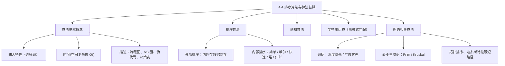
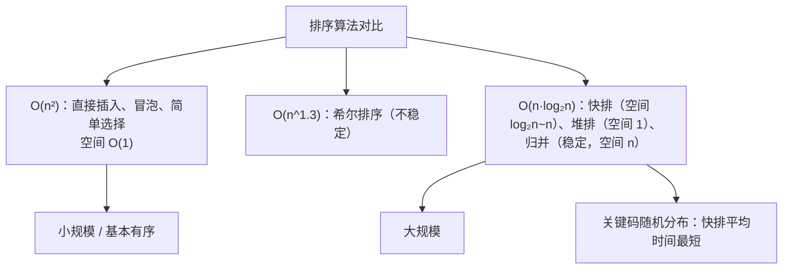
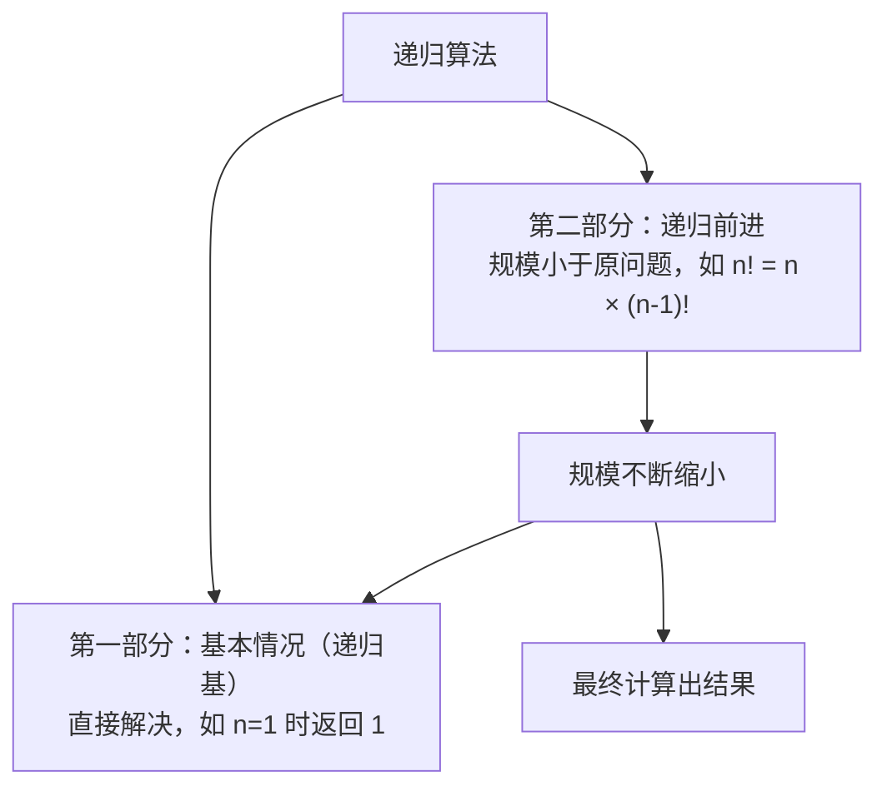
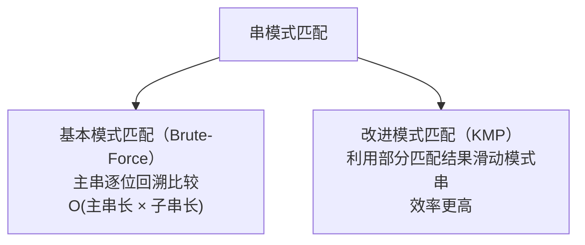
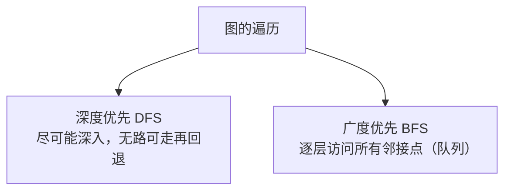
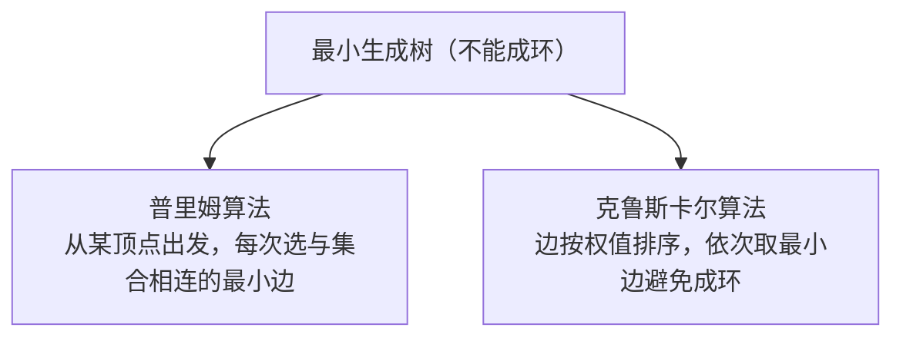
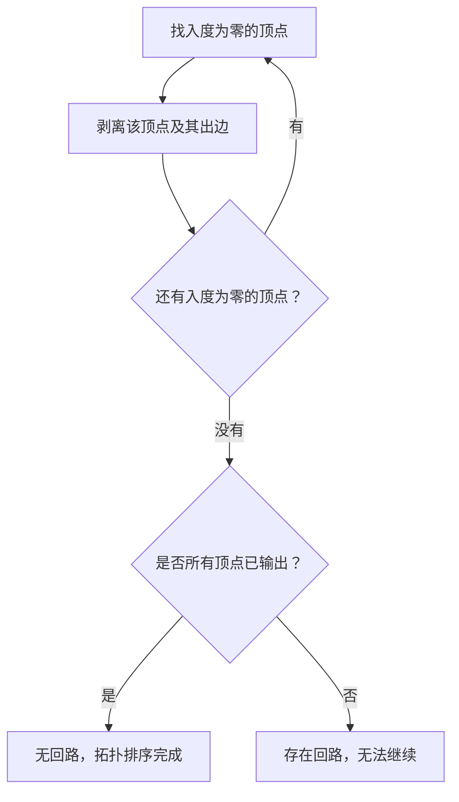
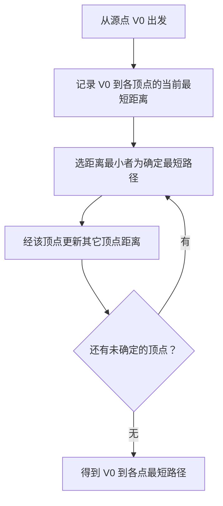

课程链接：视频《4.4 排序算法与算法基础》（软考程序员系列课程）

视频链接：

## 本节概述

本节是系列课程的第十四节课，进入教材第 4 章「数据结构与算法」，用这一节结束数据结构与算法这一章的内容。本节内容较多：算法基本概念（特性、效率、描述）→ 外部排序 / 内部排序（简单排序、希尔、快速、堆、归并）→ 递归算法 → 字符串的运算（含串模式匹配）→ 图的相关算法（遍历、最小生成树、拓扑排序、最短路径）。

## 算法的基本概念

**算法的四个特性**（这是一道选择题，要记下来）：**有穷性、确定性、可行性、输入输出**。

**算法的效率**用**时间复杂性**和**空间复杂性**来表示，都是以**大写 O 加括号**的形式表示。**时间复杂性**一般给出一个表达式，将这个表达式里**指数最大**的项填到 O 方框里。**空间复杂性**一般用于循环（嵌套循环）算法：例如循环 `for(i=1; i<=n; i++)` 这样一个表达式，它的空间复杂性是 O(n)。

**算法的描述**有：**流程图**（要知道哪些是开始、结束，哪些是处理、判断）、**NS 图**（了解一下长什么样子）、**伪代码**（不可运行的代码，但能表示算法）、**决策表**（一个二维表，例如判断"上午≥45 且下午≥45 则合格"，了解即可）。重点是流程图。

## 外部排序

**外部排序**要记住：它存在**内外存之间数据的交互**。它分为两个阶段：第一阶段，将文件记录**分段读入内存**，在内存里用某种排序方法进行排序，形成有序的记录段（称为**归并段**），并输出到外存的另一个文件中；第二阶段，对这些归并段用**归并方法**进行归并，使整个文件归并成为一个有序的段。

## 内部排序

**内部排序**主要包括：简单排序、希尔排序、快速排序、堆排序和归并排序。

### 简单排序（三种，时间复杂度均为 O(n²)，空间复杂度 O(1)）

**直接插入排序**：将一个数值 K 插入到一个有序的序列中——将 K 值与序列的第一个值比较，小则放在前面，大则放在 A₁ 后面再与 A₂ 比较……直到比较到 K 应插入的位置，然后把该位置后的元素（A₃~N）逐一往后移一位，插入 K。

**冒泡排序**：将序列中每两个值 A₁ 与 A₂、A₂ 与 A₃、A₃ 与 A₄……比较，如果 A₁ 的关键值比 A₂ 大就交换，依次比较下去，最终把**最大的值冒泡到序列的最后一位**；第二趟对 A₁~A(n-1) 排序（排除最大位），再把其中最大的放最后……比较 n-1 趟，序列就有序了。

**简单选择排序**：第 i 趟通过 n-i 次关键码比较，从 n-i+1 个记录中**选取关键码最小**的记录，必要时与第 i 个记录交换，直至所有记录有序排列。

### 希尔排序

先拟定一个整数 d 作为序列的**增量**（如 d=5），把相隔 d 个位置的元素分成一组进行排序（例如 48 与 12、37 与 26、64 与 48、96 与 54、75 与 31 两两比较），得到第一趟排序结果；再选择**小于上一次的增量**（如 3）进行第二趟；最后**增量取 1**进行第三趟，将整个序列排为有序。**时间复杂度 O(n^1.3)，空间复杂度 O(1)，是一种"最不稳定"的排序**。

### 快速排序

将待排序序列划分为**两个独立部分**（前半区和后半区），**前半区的关键码均不大于后半区的关键码**，再对这两部分递归快速排序。具体做法：用位置指示变量 I、J 分别指向第一个和最后一个记录，设置**枢轴记录**（通常取第一个记录，其关键码为 pivot）；从 J 向前搜索，找到关键码**小于** pivot 的记录停止；从 I 向后搜索，找到关键码**大于** pivot 的记录停止，交换这两个位置的元素，重复直到 I=J，即完成**一趟**划分。

快速排序的**空间复杂度 O(log₂n ~ n)**，不稳定；**当初始序列按关键码有序或基本有序时，时间复杂度退化为 O(n²)**。

### 堆排序

堆有大顶堆和小顶堆：**大顶堆**指父节点大于其子节点；**小顶堆（小根堆）**指父节点的值小于其子节点。堆排序的**时间复杂度 O(n·log₂n)、空间复杂度 O(1)**，不稳定。

### 归并排序

将两个或两个以上的有序序列合并成一个有序序列。基本做法：把 n 个元素的无序序列看成 n 个长度为 1 的有序序列，然后**两两归并**，得到长度为 2 或 1 的有序序列；再两两归并……直至最后包含 n 个有序序列的完整有序序列。**归并排序是稳定的，时间复杂度 O(n·log₂n)，空间复杂度 O(n)**（需要一个辅助数组）。

### 排序算法的选用场景（考点）

- 待排序**记录数较小**时：采用**插入排序**和**简单选择排序**；
- 记录数按关键码**基本有序**时：用**直接插入排序**或**冒泡排序**；
- N 记录数较大时：采用时间复杂度为 **O(n·log₂n)** 的排序方法——**快速排序、堆排序和归并排序**；
- 排序的关键码**随机分布**时：**快速排序的平均时间最短**。

## 递归算法

递归算法可以分为两个部分：第一部分是特殊的基本情况，可以直接解决，称为**递归基（边界/基本情况）**；第二部分可以用类似的方法加以解决，但比原问题的规模要小——每次递归时第二部分的规模不断缩小，最终缩小为第一部分的情况则结束递归。

例如求 N 的阶乘：当 n=1 时，1 的阶乘返回 1（基本情况）；当 n≠1 时，返回 n × (n-1)!（递归的前进），不断代入该函数，最终算出 n 的阶乘。

## 字符串的运算

字符串的运算包括**基本运算**和**串模式匹配**。

**基本运算**：串的拷贝（复制）、连接、比较、求子串、求串长等。

**串模式匹配**：模式串（子串）在**主串中的定位**操作，有**基本模式匹配**和**改进模式匹配**两种方法。

**基本模式匹配（Brute-Force，布鲁特·福斯算法）**：从主串第一个字符与模式串第一个字符比较，相等则继续逐字符比较；否则从主串的第二个字符与模式串第一个字符重新开始……直至模式串每个字符与主串一个连续的字符序列相等，匹配成功；若主串不存在这样的子串，匹配失败。它的**时间复杂度是 O(主串长度 × 子串长度)**。

**改进模式匹配（KMP 算法）**：每当匹配过程中出现比较字符不相等的，**利用已得到的部分匹配结果**，将模式串**向右滑动尽可能远的距离**，再继续比较（主串指针不回退）。它比基本模式匹配效率高。

## 图的相关算法

### 图的遍历

图的遍历有**深度优先遍历（DFS）**和**广度优先遍历（BFS）**：深度优先是访问顶点后深入访问其未被访问的邻接点（1→2→4→5，回退→3→6），直到没有未访问的就逐一回退；广度优先是从顶点出发，先访问它所有的邻接点，再访问这些邻接点的邻接点（逐层扩展）。在广度优先遍历中，**每个顶点最多进一次队列**。

### 最小生成树

**最小生成树算法**主要有**普里姆（Prim）算法**和**克鲁斯卡尔（Kruskal）算法**（也用于网络环境中）。

**普里姆算法**：从一个顶点出发，每次选择与已选集合**连接的最小权值边**加入生成树（如 A-C、C-F、F-D……），若某条边与已选顶点**形成环路则跳过**，直到覆盖所有顶点。

**克鲁斯卡尔算法**：先把所有边按权值从小到大排列，**依次选取最小边**（如 AC、DF、B-E……），选取时同样**避免形成环路**，直到所有顶点连通，形成最小生成树。

> [!WARNING] 考点
> 最小生成树必须满足"**树**"的概念——**不能形成环路**，这一点要注意。

### AOV 网与拓扑排序

**AOV 网**（以**顶点**表示活动的有向无环图）：在工程领域将大的工程划分成较多的子工程（活动），这些活动完成了整个工程就完成了。**AOV 网中不应该出现有向环**，因此要对 AOV 网进行**环路检测**，检测方法就是**拓扑排序**。

拓扑排序的步骤：先找到一个**入度为零**的点并把它剥离出来；再找第二个入度为零的点剥离……直到网中不存在入度为零的点。若所有顶点都已输出，说明**网中不存在回路**，拓扑排序完成；若还有未输出的顶点（剩余顶点均有前驱），说明**存在回路**，拓扑排序无法进行下去。

### 单源点最短路径：迪杰斯特拉算法

求单源点最短路径常用**迪杰斯特拉（Dijkstra）算法**：从源点 V0 开始，逐步确定到各顶点的最短路径——每次从当前可达的路径中**选取权值最小的一条**（如 V0→V5、V0→V3、V0→V4……），更新其它顶点的最短路径估值，依次选出一个顶点，直到所有顶点确定最短路径。最终得到 V0 到各点的最短路径序列（如 V0、V5、V3、V4、V2）。

## 本节小结

① **算法基础**：四大特性——有穷性、确定性、可行性、输入输出（选择题）；效率用时间/空间复杂性 O() 表示（时间取指数最大项、空间如循环 O(n)）；描述方式：流程图（重点）、NS 图、伪代码、决策表（二维表）。

② **外部排序**：内外存间数据交互；两阶段——分段读入内存排序成**归并段** → 归并成整体有序。

③ **内部排序**：三种简单排序（插入/冒泡/选择）**时间 O(n²)、空间 O(1)**；希尔 O(n^1.3)、不稳定（"最不稳定"）；快速排序不稳定、**基本有序时退化为 O(n²)**（空间 log₂n~n）；堆排序 O(n·log₂n)、空间 O(1)、不稳定；归并排序**稳定**、O(n·log₂n)、空间 O(n)。**场景（考点）**：小规模用插入/选择，基本有序用直接插入/冒泡，大规模用快排/堆排/归并，**随机分布快排平均时间最短**。

④ **递归**：递归基（基本情况）+ 递归前进（规模缩小），如 n! = n×(n-1)!。

⑤ **字符串**：基本运算（拷贝、连接、比较、求子串、求串长）；串模式匹配——基本（Brute-Force，O(主串长×子串长)）、改进（KMP，利用部分匹配结果滑动模式串）。

⑥ **图算法**：遍历——深度优先（深入回退）/ 广度优先（逐层、队列、每顶点最多进队一次）；最小生成树——**Prim**（从顶点选最小边）与 **Kruskal**（边排序取最小边），**都不能成环（考点）**；**AOV 网拓扑排序**——不断剥离入度为 0 的顶点，剥不完则存在回路；**迪杰斯特拉算法**——从源点逐步选最短路径。