> [!NOTE]
> 本文档对应《程序员教程（第5版）》第 1 章「计算机系统基础知识」，按照"一章一个文档"组织：每个小节对应一个课程视频。笔记内容由课程视频字幕与教材内容结合整理。

## 1.1 数据的表示及运算

课程链接：视频《1.1 数据的表示及运算》（软考程序员系列课程）

视频链接：

### 本节概述

本节是软考程序员上午题的核心基础，对应教材 1.2 节「数据的表示及运算」。视频讲师强调：软考知识点覆盖面很广，但**考点有侧重**——本文档中详细展开的内容都是重点和历年考点，一笔带过或标注"了解"的内容只需留个印象即可。本节的脉络依次是：数制及进制换算 → 码制（原码、反码、补码、移码）→ 定点数与浮点数 → 逻辑运算 → 校验码。

先看一张本节知识地图，对整个 1.1 节有个全景印象：

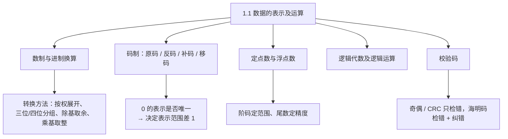

### 数制及其表示

计算机中常见的进制有四种，它们都是"按基数进位"的计数法：

| 进制 | 基数 | 进位规则 | 表示符 |
|---|---|---|---|
| 二进制 | 2 | 逢二进一 | B |
| 八进制 | 8 | 逢八进一 | O |
| 十进制 | 10 | 逢十进一 | D |
| 十六进制 | 16 | 逢十六进一 | H |

> [!NOTE]
> 考试时题目不一定写明"二进制""八进制"，而可能直接给数字加后缀或用下标表示，例如 `1011B`、`(257)O`、`AFH`。看到这些表示符要能认出它属于哪种进制。

十六进制的数码要注意：前九位是 1-9，从第十位（10）开始改用字母 **A-F** 表示（A=10、B=11、C=12、D=13、E=14、F=15）。

### 进制转换之二进制转十进制

二进制转十进制采用**按权展开法**：以小数点为原点，每一位数字乘以它所在位的"权值"，再全部相加。小数点左边是整数位，第一位权值为 **2⁰**，往左依次是 2¹、2²、2³……；小数点右边是小数位，第一位权值为 **2⁻¹**，往右依次是 2⁻²、2⁻³……。

> [!TIP] 通俗理解
> "权值"就是这一位代表的"面额"：个位是 2⁰=1，往左每一位翻倍，往右每一位减半。每位数字乘以自己位上的面额，最后加总即可。

例如 `1011.101B`：整数部分 1×2³+0×2²+1×2¹+1×2⁰ = 8+0+2+1 = 11；小数部分 1×2⁻¹+0×2⁻²+1×2⁻³ = 0.5+0+0.125 = 0.625；合起来就是 11.625D。

下面这张图展示了每一位"面额"与相乘求和的过程，看一遍就能记住按权展开法：

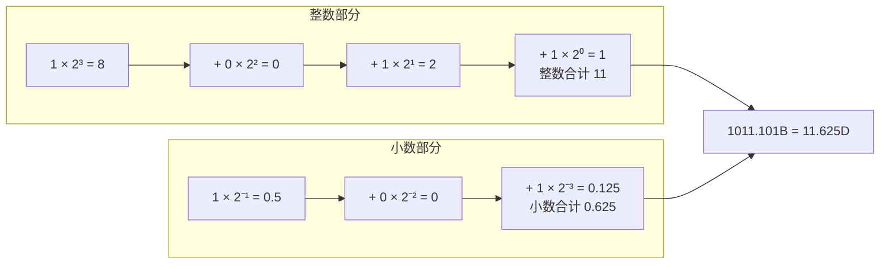

### 进制转换之二进制与八/十六进制互转

二进制转八进制用**三位分组法**：以小数点为界，整数部分从右往左、小数部分从左往右，每三位二进制数为一组；不足三位就补 0——整数部分在**最左边**补 0，小数部分在**最右边**补 0。然后每组对照"二进制—八进制"对照表换成等值的八进制数码，按原顺序写出即可。二进制转十六进制同理，只是改成**每四位为一组**。

| 二进制 | 八进制 | 十六进制 | 二进制 | 八进制 | 十六进制 |
|---|---|---|---|---|---|
| 0000 | 0 | 0 | 1000 | 10 | 8 |
| 0001 | 1 | 1 | 1001 | 11 | 9 |
| 0010 | 2 | 2 | 1010 | 12 | A |
| 0011 | 3 | 3 | 1011 | 13 | B |
| 0100 | 4 | 4 | 1100 | 14 | C |
| 0101 | 5 | 5 | 1101 | 15 | D |
| 0110 | 6 | 6 | 1110 | 16 | E |
| 0111 | 7 | 7 | 1111 | 17 | F |

> [!NOTE]
> 这张对照表最好背下来，因为分组换算全靠它。视频中强调：**忘了也别慌，可以在考场现场推**——用按权展开法把每组算出来。例如四位二进制 `0110`：0×2⁰+1×2¹+1×2²+0×2³ = 2+4 = 6；`1100`：0×2⁰+0×2¹+1×2²+1×2³ = 4+8 = 12，12 超过 9，按"10 是 A、11 是 B、12 是 C"的规则，得 **C**。上午题考试时间足够，现场推导也来得及。

视频讲解的示例：将 `10101111.001B` 转八进制——整数部分从右往左每三位一组得 `10|101|111`，最左边不足三位补 0 得 `010|101|111`，查表为 2、5、7；小数部分 `001` 正好三位，查表为 1。所以结果是 `257.1O`。

同一个数转十六进制：整数部分每四位一组得 `1010|1111`，查表为 A、F；小数 `001` 不足四位，最右边补 0 得 `0010`，查表为 2，结果 `AF.2H`。

反向转换（八/十六进制转二进制）是上述过程的逆运算：**每一位八进制数码展开成三位二进制，每一位十六进制数码展开成四位二进制**，展开不足位数时在左边补 0（此为教材内容，与分组法相对）。

### 进制转换之十进制转二/八/十六进制

十进制转其他进制要**整数、小数分开处理**。整数部分用**除基取余法（短除法）**：反复除以基数，每步记下余数，直到商为 0，把余数**倒过来写**就是结果。基数即进制数：二进制基数 2、八进制基数 8、十六进制基数 16。小数部分用**乘基取整法**：反复乘以基数，每步取出整数部分（取出的整数不再参与下一次乘法），直到小数部分为 0，把取出的整数**从上往下顺次写**。

> [!TIP] 通俗理解
> 整数"除"、小数"乘"，方向正好相反，记成口诀：**整数余数倒着读，小数整数顺着读**。

视频讲解的完整示例：175.125D 转二进制。整数部分 175 连续除以 2，余数依次为 1、1、1、1、0、1、0、1，倒过来写就是 `10101111`；小数部分 0.125×2=0.25 取整 0，0.25×2=0.5 取整 0，0.5×2=1.0 取整 1，从上往下读得 `001`。合起来正是 `10101111.001B`（与上一节的例子互为印证）。

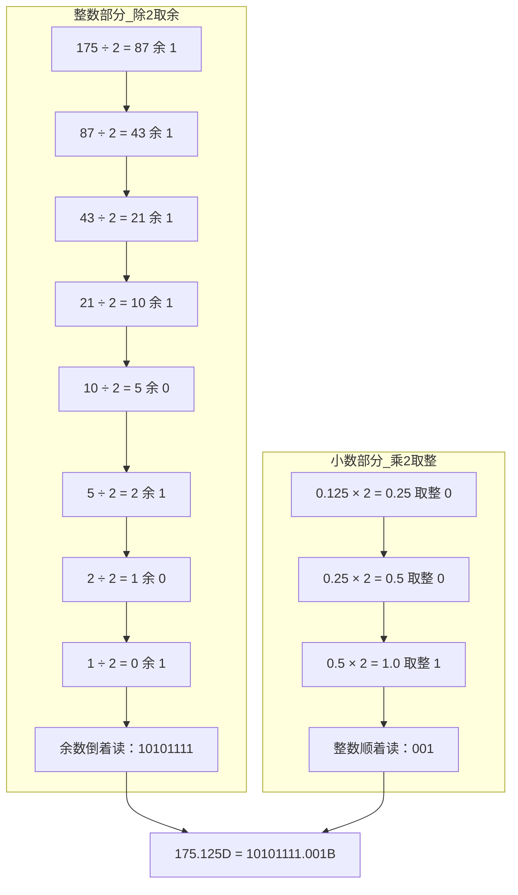

> [!NOTE]
> 考试中的小数部分常取 1/2、1/4、1/8、1/16、1/32 这类"干净"的数，乘几次就能乘到 1，方便口算。

### 二进制数的运算

二进制数的基本运算规则与十进制相似，只是进位规则变成了"二"：加法**逢二进一**，减法**借一当二**，乘法按位相乘（1×1=1，含 0 即为 0）。这些规则在后面码制和机器数运算中会反复用到。

### 码制：原码、反码、补码、移码

码制解决的核心问题是：**如何在计算机中表示带正负号的数**。以下均以八位二进制为例，规定**首位是符号位：0 表示正数，1 表示负数**，其余七位为数值位。

**原码**：直接写"符号位 + 数值的绝对值"即可。但原码有个致命问题——用它做加减运算结果会出错。视频演示：按原码逐位相加计算"1-1"，得到的结果与期待的 0 并不吻合。这正是引入反码、补码的动机。

**反码**：正数的反码与原码完全相同；负数的反码是**符号位不变、数值位以原码为基准逐位取反**（每位 0↔1，所以叫"反"码）。

**补码**：正数的补码与原码、反码相同；负数的补码是在反码的**最后一位加 1**。补码的妙处在于：正数与负数按补码相加能直接得到正确结果——"1-1"用补码算恰好等于 0，与运算的期待值完全吻合。所以计算机内部统一用补码做加减运算。

**移码**：符号位与原码、反码、补码的**符号位相反**，数值位与补码相同（即在补码基础上把首位反过来）。移码主要用于浮点数的阶码。


> [!NOTE]
> 一句话串联四种码：负数从原码出发，**数值取反得反码，末位加 1 得补码，符号位反过来得移码**；正数则是原码 = 反码 = 补码，只有移码的符号位不同。

0 的表示是码制的一个重要考点。原码和反码都存在 +0 和 -0 两个 0（原码 `00000000` 与 `10000000`，反码 `00000000` 与 `11111111`）；而**补码的 +0 和 -0 相等**（都是 `00000000`，-0 从 `11111111` 末位加 1 后进位溢出回 `00000000`），移码的 +0 和 -0 也相等（`10000000`）。正因为补码、移码让 0 的表示唯一，多腾出了一个编码位置，它们的表示范围才比原码、反码多"1"。

| 数值 | 原码 | 反码 | 补码 | 移码 |
|---|---|---|---|---|
| +1 | 00000001 | 00000001 | 00000001 | 10000001 |
| -1 | 10000001 | 11111110 | 11111111 | 01111111 |
| +0 | 00000000 | 00000000 | 00000000 | 10000000 |
| -0 | 10000000 | 11111111 | 00000000 | 10000000 |

### 定点数的表示范围

定点数就是小数点位置固定的数，分为**定点整数**（小数点固定在数值位最后）和**定点小数**（小数点固定在符号位之后，即纯小数）。以八位（1 位符号位 + 7 位数值位）为例，各码制的取值范围如下：

| 码制 | 定点整数 | 定点小数 |
|---|---|---|
| 原码 / 反码 | -(2⁷-1) ~ +(2⁷-1)，即 -127 ~ +127 | -(1-2⁻⁷) ~ +(1-2⁻⁷) |
| 补码 / 移码 | -2⁷ ~ +(2⁷-1)，即 -128 ~ +127 | -1 ~ +(1-2⁻⁷) |

> [!TIP]
> 范围公式不用死记，记住"**两种范围相差 1**"就够了：补码、移码因为 0 的表示唯一，负数方向多出 1 个编码。给定位数 n，定点整数补码范围就是 -2ⁿ⁻¹ ~ +(2ⁿ⁻¹-1)，其他范围现场类推即可。

### 浮点数及其运算

浮点数就是小数点位置可以浮动的数，用来表示更大范围的数据，其科学记数法形式为 **N = 尾数 × 基数^指数**。在计算机中的结构化表示通常为：**数符 | 阶符 | 阶码 | 尾数**（尾数即数值部分，阶码即指数部分）。

下面把定点数与浮点数的"存储布局"放在一起对比，图上看结构一目了然：

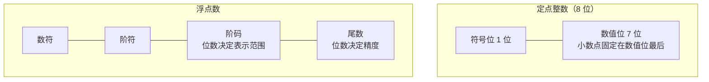

> [!WARNING] 历年考点
> **阶码的位数决定数的表示范围，尾数的位数决定数值的精度**。这一条已经考过真题（选择题），务必记住。

**规格化**：将尾数的绝对值限制在 0.5 ~ 1 之间（即尾数最高位为有效数字位），这个过程称为规格化。

浮点数的加减运算分三步：**对阶 → 尾数运算 → 结果规格化**。对阶的规则是**小数向大数看齐**——把阶小的数的尾数右移、阶码加 1，直到两数阶码相等，再对尾数做加减。


> [!NOTE]
> 为什么必须"小数向大数靠近"而不是反过来？视频用两个阶码不同的数说明：要让两个数的小数点对齐到同一个位置，只能通过**移动较小数的尾数**（右移）来实现；如果让大阶去迁就小阶，就会丢大数最左边的有效高位。

**溢出**：只有当**两个同符号的数相加**、或**两个异符号的数相减**时，运算结果才可能溢出；其余情况（异号相加、同号相减）结果的绝对值只会变小，绝无溢出可能。这个结论历年也出过选择题。

### 其他常用编码

除上述编码外，教材还列举了几种常见编码，本节只需了解即可。

**BCD 码**：用四位二进制表示一位十进制数字（即二—十进制编码）。**余三码**：在 BCD 码的基础上每个编码加 3（0011）得到。**格雷码**：相邻两个编码只有一位不同，可减少计数时的瞬态错误。**ASCII 码**：用七位二进制表示西文字符、数字和符号的国际标准编码。**汉字编码**：汉字数量多，需要输入码、机内码、字形码等多层编码配合使用。**Unicode**：为世界上几乎所有文字统一编码的国际标准。

### 逻辑代数及逻辑运算

逻辑运算是机器数运算的基础，基本运算为**与、或、非、异或**。常用的运算定律有：交换律、结合律、分配律、反演律（德·摩根律）、互补律、吸收律等。

视频特别用韦恩图讲解了两道历年考过的公式：集合 A 与 A 以外的区域**并**起来是整个全集，对应 **A + Ā = 1**（Ā 表示 A 取反）；A 与 A 以外的区域**交**起来是空集，对应 **A · Ā = 0**。这两条属于互补律。吸收律常用的还有 **A + A·B = A**、**A·(A + B) = A**（"吸收"指多余项被合并掉）。这些公式记住即可，答题时直接套用。

> [!TIP] 通俗理解
> 韦恩图法：把 A 想成纸上的一个圆圈，"A + Ā = 1"就是圆内加圆外等于整张纸（全集 1）；"A · Ā = 0"就是圆内与圆外没有公共部分（空集 0）。图像比公式更好记。

### 校验码

校验码用于检测（甚至纠正）数据在存储或传输中出现的错误。本节介绍三种：奇偶校验、海明码、循环冗余校验（CRC）。

**奇偶校验**是最简单的一种校验方式。做法是在数据位之外增加校验位，使整个码中"1"的个数恒为奇数（奇校验）或偶数（偶校验）。按校验位的排列方式分为**水平奇偶校验**（在每一行的末尾加校验位）和**垂直奇偶校验**（在每一列的末尾加校验位）。奇偶校验只能检错，不能纠错。

**海明码**不仅能检错，还能**纠错**。其构造思想是：把校验位插在编号为 **2 的幂**的位置上——2⁰=1 号位插第 1 个校验位，2¹=2 号位插第 2 个，2²=4 号位插第 3 个，以此类推，其余位置放数据位。检错、纠错的原理是：每个校验位只与特定位置的数据位相关，出错时由各校验位的结果组合即可定位到具体哪一位出错。

> [!NOTE] 考点：校验位需要几位？
> 视频给出过一道典型例题：校验 4 位数据位需要几位校验位？由教材公式 **2ʳ ≥ k + r + 1**（k 为数据位数，r 为校验位数）求解：r=3 时 2³=8 ≥ 4+3+1=8 成立，所以需要 3 位校验位（插在 1、2、4 号位）。

**循环冗余校验（CRC）**通过增加冗余校验位实现检错功能，同样只能检错、不能纠错。其规律是：**校验位（生成多项式）的位数越长，校验能力越强**。CRC 是信息传递中使用最广泛的校验码——因为传输场景下发现错误只要请求对方**重传一次**即可，重传的效率远高于"定位到哪一位出错再修复"，所以日常使用中常选 CRC。

| 校验码 | 检错 / 纠错能力 | 特点与应用 |
|---|---|---|
| 奇偶校验 | 只能检错 | 最简单；分水平/垂直校验 |
| 海明码 | 能检错 + 纠错 | 校验位插在 2 的幂次号位上 |
| CRC | 只能检错 | 校验位位数越长能力越强；传输中使用最广 |

### 本节小结

本节是第 1 章的第一块基石，围绕"计算机如何表示和运算数据"展开，关键结论如下：

① **进制换算**：二进制转十进制用按权展开法；二进制与八/十六进制互转用三位/四位分组法（不足补 0，整数在左边补、小数在右边补）；十进制转其他进制，整数除基取余（倒序写）、小数乘基取整（顺序写）。

② **码制**：负数原码数值位取反得反码，反码末位加 1 得补码，补码符号位取反得移码；正数原、反、补码相同。补码使 +0 和 -0 表示唯一，因此范围比原码、反码多 1。

③ **定点与浮点**：定点数范围记住"两种码制相差 1"即可现场推出；浮点数中**阶码位数决定表示范围、尾数位数决定精度**（真题考点）；运算步骤为对阶（小阶向大阶看齐）→ 尾数运算 → 结果规格化；只有同号相加或异号相减才可能溢出（真题考点）。

④ **逻辑与校验**：互补律 A + Ā = 1、A · Ā = 0 是真题考点；奇偶校验与 CRC 只能检错，海明码能检错且能纠错；传输场景首选 CRC。

## 1.2 计算机系统基础知识

课程链接：视频《1.2 计算机系统基础知识》（软考程序员系列课程）

视频链接：

### 本节概述

本课是系列课程的第二节课，主题"计算机系统基础知识"，对应教材 1.1 节「计算机系统的基本组成」与 1.3 节「计算机的基本组成及工作原理」两部分内容，视频重点在硬件系统。本节的脉络依次是：计算机的分类 → 硬件/软件系统组成 → 总线 → CPU → 存储器（分类、主存、Cache、外存）→ 输入输出技术。视频讲师特别提醒：CPU 结构图考试时可能要求填写部件名称，务必熟悉各寄存器的简称与归属。

### 计算机系统的分类

视频将计算机按形态和用途分为六类，了解即可：**移动设备**（手机、平板电脑等）、**普通计算机/PC**（台式机、笔记本电脑）、**服务器**（中心机房中的服务器）、**计算机集群**（通过集群技术把多台计算机连接起来协同工作）、**超级计算机**（具有超强运算能力的计算机）和**嵌入式计算机**（洗衣机、空调等家用电器内部嵌入的计算机）。

### 计算机系统之组成

计算机系统由**硬件系统**和**软件系统**两大部分组成。硬件系统是本节课的重点，分为主机和外设：主机包括 CPU（处理器）和内存；外设包括输入设备、输出设备和外存储器（辅助存储器）。

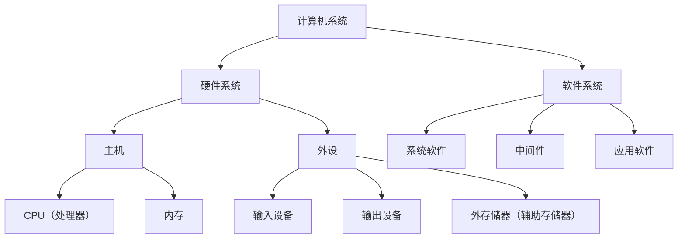

CPU 即处理器，按核心数可分为单核处理器、双核处理器和多核处理器；CPU 内部又分为运算器、控制器和寄存器组（视频口误"计算器组"）。

软件系统自内向外像洋葱一样分层：最中间是计算机硬件，外面包裹一层**系统软件**（如 Windows XP、Windows 7、Windows 10），再外面一层是**中间件**（如 .NET、Java 运行环境），最外层是**应用软件**。这三层共同构成软件系统。


### 总线之分类与性能指标

总线是连接多个设备的信息传送通道。按视频口径，总线先分为**内部总线（也就是系统总线）**和**外部总线**；系统总线又可以分为 **ISA 总线、EISA 总线、PCI 总线、AGP 总线**等。

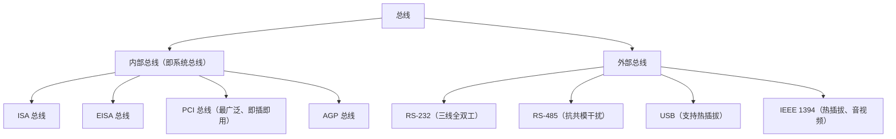

总线的性能指标有三个：**带宽、位宽和工作频率**。

> [!WARNING] 重点：PCI 总线
> **PCI 总线是目前使用最广泛的总线**，它有两种标准：32 位/124 个信号的标准，以及 64 位/188 个信号的标准。PCI 总线在设备上支持**即插即用**。

外部总线方面需要掌握几种常见总线：**RS-232 总线**的特点是传输线少——只需要三条线（一条发送、一条接收、一条地线）即可实现**全双工通信**（可以同时接收、同时发送）；**RS-485 总线**具有抑制共模干扰的能力；**USB 总线**的特点是支持**热插拔**；**IEEE 1394 总线**同样支持热插拔，主要用于音频和视频数据的传输。

### CPU：运算器、控制器、寄存器组与内部总线

CPU 包括**运算器、控制器、寄存器组和内部总线**四部分。这张结构图一定要了解，因为考试可能让考生填写图上的部件名称，常考部件如下表：

| 缩写 | 部件名称 | 归属 |
|---|---|---|
| ALU | 算术逻辑运算单元 | 运算器 |
| AC | 累加器 | 运算器 / 寄存器组 |
| PSW | 状态字寄存器 | 运算器 / 控制器 |
| PC | 程序计数器 | 控制器 |
| IR | 指令寄存器 | 控制器 / 寄存器组 |
| MAR | 地址寄存器 | 寄存器组 |
| MDR | 数据缓冲寄存器 | 寄存器组 |

**运算器**包括算术逻辑运算单元（ALU）、累加器（AC）、状态字寄存器（PSW）、通用寄存器组和多路转换器等，主要用来完成算术运算和逻辑运算，实现对数据的加工与处理。

**控制器**包括程序计数器（PC）、指令寄存器（IR）、指令译码器、时序部件、状态字寄存器（PSW）和微操作信号发生器等，负责控制指令的执行。

**寄存器组**包括累加器、通用寄存器组、标志寄存器、指令寄存器、数据缓冲寄存器（MDR）和地址寄存器（MAR）。

**内部总线**是 CPU 内部把运算器、控制器和寄存器组连接在一起的总线。

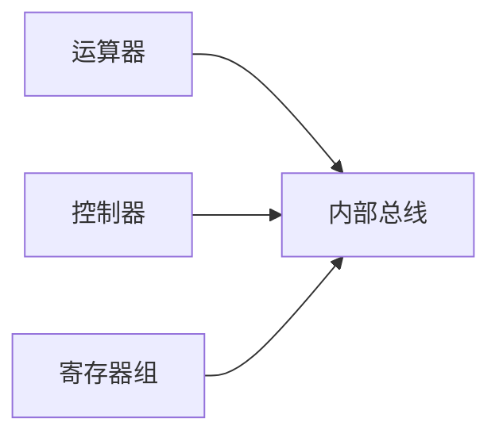

**双核与多核**：双核指在一个处理器上集成两个运算核心，从而提高运算能力；多核指在一个处理器上集成两个或多个完整的计算引擎（内核），并采取分治的策略，在特定时间内执行更多的任务。

### 存储器之分类

存储器按**工作方式**分为两类（简写要记住）：**RAM 为读写存储器**（即可读可写的随机存取存储器），**ROM 为只读存储器**。记法上，ROM 中的 O 代表 Only（只读）。

只读存储器又分为五种：

| 类型 | 名称 | 说明 |
|---|---|---|
| 固定 ROM（掩膜 ROM） | 固定只读存储器 | 出厂时内容已固定 |
| PROM | 可编程只读存储器 | 用户可一次性写入 |
| EPROM | 可擦除可编程只读存储器 | 可擦除后重写 |
| EEPROM | 电擦除可编程只读存储器 | 可电擦除后重写 |
| Flash | 闪速存储器 | 即 U 盘所用的存储芯片 |

按**寻址方式**分三种：**随机存储器 RAM**——可以对任何存储单元存入或读取数据，访问任何存储单元所需时间相同；**顺序存储器 SAM**——典型代表是磁带，磁带便宜（视频讲师举例约五元一盒）、稳定性好，现在银行等机构仍用它存放历史数据；**直接存储器 DAM**——介于随机与顺序之间的一种寻址方式，典型代表是磁盘：对磁道的寻址是随机的，但在一个磁道内的寻址是顺序的。

### 存储器之层次结构

存储器的层次从低到高依次是：辅存（外存）→ 主存 → 高速缓存（Cache）→ CPU。它们的规律是：速度**从下而上逐渐变快**，价格**从上往下逐渐降低**，存储容量**从下而上逐渐减小**。视频提示，CPU 当中还有一个寄存器的概念——**寄存器的速度高于高速缓存**。如果把 CPU 也看作存储器的一个层次，整个存储系统可划分为四层结构。

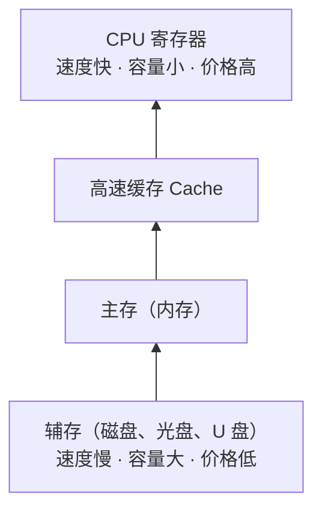

| 层次（自上而下） | 速度 | 容量 | 价格 |
|---|---|---|---|
| CPU 寄存器 | 最快 | 最小 | 最高 |
| 高速缓存 Cache | 快 | 小 | 高 |
| 主存 | 较快 | 较大 | 中 |
| 辅存（磁盘等） | 慢 | 最大 | 低 |

### 主存之结构与性能指标

主存的结构也要记一下，它由**地址寄存器、数据寄存器、存储体、地址译码器和控制线路**组成。


**地址寄存器（MAR）**：存放地址总线提供的、将要访问的存储单元的地址码。主存可寻址单元的个数等于 **2 的"地址寄存器位数"次方**。

**数据寄存器（MDR）**：存放写入存储体的数据，或从存储器中读取出来的数据。

**地址译码器**：对地址寄存器中的地址进行译码。

**控制线路**：根据读写命令控制主存储器各部分协作完成操作。

主存的性能指标包括：**内存容量**；**存取时间**——指存储器从接到读或写的命令起，到读写操作完成止所需的时间；**带宽**——每秒传输的位数，计算公式为"一个存取周期中的读写位数 W ÷ 一个存取周期"；**可靠性**——用平均故障间隔时间 **MTBF** 衡量，MTBF 越长，可靠性越高。

> [!TIP] 了解
> 可靠性计算中还有串联系统与并联系统的可靠性计算方法（并联可靠性高于串联），视频提示了解一下即可，属于可能的计算题素材。

### 高速缓存 Cache

**Cache 是为了解决 CPU 与主存的速度和性能不一致的现象而产生的**。它的原理是程序执行的**局部性原理**，包括两种局部性：

**时间局部性**：程序中某条指令一旦被执行，不久后该条指令很可能再次被执行；某个数据一旦被访问，不久后很可能再次被访问（分别针对指令和数据）。

**空间局部性**：一旦程序访问了某个存储单元，不久后其附近的存储单元也很可能被访问（针对存储单元）。

Cache 的特点：**容量小**——介于 CPU 与主存之间，一般是几千字节到几兆字节；**速度快**——比主存快 5 到 10 倍；**透明性**——对使用者（程序员）透明，感觉不到它的存在。

Cache 一般包括**控制部分和存储部分**。CPU 访问数据时，由控制部分判断所访问的数据是否在 Cache 存储内：**命中**（在）就直接对 Cache 存储取值；**未命中**（不在）又分两种情况——读取操作按**替换原则**替换掉 Cache 存储的内容，写入操作则**直接写入内存**。

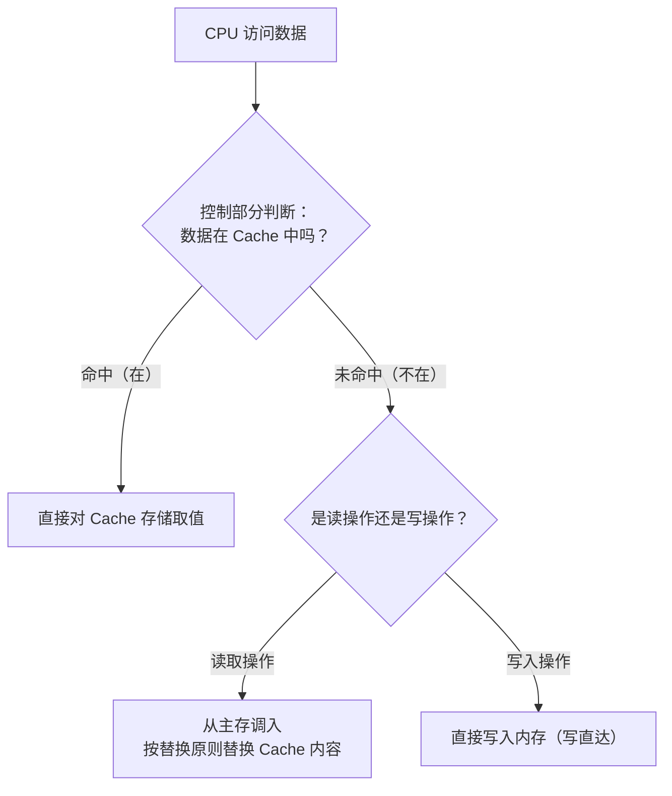

> [!WARNING] 可能出计算题
> 由命中率计算未命中及相关指标可能出计算题。教材口径：平均访问时间 = 命中率 × Cache 访问时间 + 未命中率 × 主存访问时间，命中率是 Cache 考点的核心。

### 外部存储器

外部存储器包括磁盘、硬盘、光盘、U 盘、云盘等。

**磁盘**由盘片、驱动器、控制器和接口组成，是目前广泛使用的外部存储器。**硬盘**按介质分为固态硬盘、机械硬盘和混合硬盘。

硬盘的存储容量需要记公式，包括**格式化容量与非格式化容量**的计算：非格式化容量 = 位密度 × 内圈周长（π × 最内圈直径）× 磁道总数；格式化容量 = 每个扇区的容量 × 每道扇区数 × 磁道总数 × 盘面数。

**平均访问时间 = 平均寻道时间 + 平均等待时间**。寻道时间是磁头移到目标磁道所需的时间；平均等待时间取磁道旋转一周所用时间的一半（即平均等待半圈）。数据传输率分外部传输率和内部传输率，内部传输率是磁头找到数据地址后，单位时间内写入或读出的字节数。

> [!WARNING] 真题计算：磁盘读取优化
> 这是历年出过真题的计算型考点。例如一块磁盘上有 10 个位块，读完第一个块用了若干时间（如 3ms），此时磁头已经转过目标位置，若按顺序读下一个块，必须等磁盘整整旋转一周。**优化的思路是"先读哪一块"**——读完第一块后不去读相邻块，而是**间隔跳块去读**（如直接跳读后续的块），让旋转节奏与读取节奏匹配，这样优化后的读取速率会高很多。

**光盘**按读写能力分为只读型光盘（最典型的在中间，CD-ROM）、只写一次的光盘（WORM）和可擦除型光盘。光盘的特点是耐用、非接触性读写、可靠性高、无需防震和除尘，但读取速度较慢，比硬盘和磁盘要慢一点。

**U 盘**包括 USB 移动硬盘和闪存盘（Flash Memory，即前面 ROM 分类中的闪速存储器），特点是支持热插拔，取代了最初的软盘（软盘容量比 U 盘小很多）。**云存储**是运用云计算技术实现的数据存储管理的云计算系统，本质上是一种数据存储的访问服务，了解即可。

### 输入输出技术之接口

接口是为了解决两个相对独立的子系统之间的连接问题而设立的连接界面，在 I/O 系统中解决的是主机与 I/O 设备之间的连接，它是主机与 I/O 设备之间的转换机构。接口的主要功能有：地址译码；交换数据、指令与状态信息；支持程序查询、中断和 DMA 等访问方式；提供缓冲、暂存和驱动的能力，满足一定的负载要求；进行数据类型和数据格式的转换。

接口的分类有三种角度：从**传送方式**分，有**串行接口**和**并行接口**——串行接口采用串行传输方式，数据所有位按顺序逐位输入输出；并行接口一次把一个字节或一个字的所有位同时输入输出。从**访问控制方式**分，有程序查询接口、中断接口、DMA 接口、通道控制器和 I/O 处理机。从**时序**上分，有同步接口和异步接口。另外值得注意：软件的驱动模块也作为 I/O 接口（I/O 系统）的一部分。

I/O 系统的连接方式有**总线型、星型、通道型和 I/O 处理器型**，其中**总线型是使用最广泛的连接方式**，它实现分时性共享，必须遵循总线协议；总线协议包括信号线的定义、数据格式、时序关系、信号电平和控制逻辑等。

I/O 的编址方式有两种：**与内存单元统一编址**——将 I/O 接口中有关的寄存器和存储部件视为主存中的存储单元统一编址，优点是把内存中的指令全部用于接口，增强了对接口的操作，缺点是把地址空间划分成接口和内存存储两部分，会导致内存地址不连续；**I/O 接口单独编址**——设置单独的 I/O 地址空间，为接口中的有关寄存器和存储部件分配地址码，必须设置专门的 I/O 指令进行访问，优点是不占用主存地址空间，缺点是访问主存的指令和访问接口的指令各不相同，在程序中很难辨认与使用。

### 数据交互方式：I/O 控制方式

CPU 与外设交互数据的方式有：直接程序控制、中断方式、直接存储器存取（DMA）、通道控制方式等。

**直接程序控制**包括立即（无条件）程序传送方式和程序查询方式。

**中断方式**：CPU 在执行程序的过程中，若发生某个外部事件或 CPU 内部事件，就终止正在执行的程序，转去处理这个事件；事件处理完毕后再回到原先终止的程序，接着终止前的状态继续执行。引起中断的事件称为中断源，由 CPU 内部事件引起的中断叫内部中断源，由 CPU 外部事件引起的中断叫外部中断源。中断是 CPU 分片分时执行的一种特点。


**DMA（直接存储器存取）方式**：主要通过硬件控制实现主存与 I/O 设备之间的直接数据传送，数据传送过程由 DMA 控制器进行控制，**无需 CPU 干预**（这条可考真题：DMA 无需 CPU 干预，直接实现主存与 I/O 设备间的数据传输）。

**通道控制方式**：通道是一种专用的控制器，通过执行通道程序进行 I/O 操作管理。需要进行 I/O 操作时，CPU 只需按约定格式准备好命令和数据，启动通道即可，由通道执行相应的通道程序完成所要求的操作。

| 控制方式 | 数据传送由谁控制 | 特点 |
|---|---|---|
| 直接程序控制 | CPU 直接控制（立即传送 / 查询） | CPU 全程参与，效率低 |
| 中断方式 | 事件驱动，CPU 响应处理 | CPU 分片分时执行，效率提高 |
| DMA | DMA 控制器（硬件） | 主存与外设直接传数据，无需 CPU 干预 |
| 通道控制方式 | 通道（专用控制器）执行通道程序 | CPU 只需准备命令数据并启动通道 |

### 本节小结

本节覆盖教材 1.1 与 1.3 两节内容，围绕"计算机系统由什么构成、各部件如何协作"展开，关键结论如下：

① **系统组成**：计算机 = 硬件系统 + 软件系统；软件自内向外依次是系统软件、中间件、应用软件。主机 = CPU + 内存，外设 = 输入设备、输出设备与外存。

② **总线**：ISA、EISA、PCI、AGP 属系统总线，PCI 使用最广泛、支持即插即用（32 位/124 个信号与 64 位/188 个信号两种标准）；外部总线 RS-232（三条线全双工）、RS-485（抗共模干扰）、USB（热插拔）、IEEE 1394（热插拔、音视频）。性能指标为带宽、位宽、工作频率。

③ **CPU**：由运算器（ALU、AC、PSW 等）、控制器（PC、IR、译码器等）、寄存器组（MDR、MAR 等）和内部总线组成，各部件名称要能填图；双核/多核即一个处理器集成多个核心。

④ **存储**：RAM 读写、ROM 只读（含 PROM、EPROM、EEPROM、Flash）；层次为寄存器 → Cache → 主存 → 辅存，越靠上速度越快、容量越小、价格越高；主存可寻址单元数 = 2 的"MAR 位数"次方；带宽 = 一个存取周期的读写位数 ÷ 存取周期；可靠性看 MTBF。

⑤ **Cache 与磁盘**：Cache 依据局部性原理（时间/空间）解决 CPU 与主存速度不匹配的问题，命中率相关指标可能出计算题；硬盘平均访问时间 = 寻道时间 + 等待时间（半圈），"跳块读"优化是真题计算题。

⑥ **输入输出**：接口五项功能；串行/并行、同步/异步等分类；总线型连接最广泛；统一编址与单独编址各有优缺点；数据交互方式中 DMA 由硬件完成、无需 CPU 干预（真题考点）。

## 1.3 多媒体系统

课程链接：视频《1.3 多媒体系统》（软考程序员系列课程）

视频链接：

### 本节概述

本课是系列课程的第三节课，标题为"多媒体系统"，实际包含两大块内容：**指令系统**（对应教材 1.4 节「指令系统简介」）和**多媒体系统**（对应教材 1.5 节「多媒体系统简介」）。本节脉络依次是：指令格式 → 寻址方式 → 指令种类 → 媒体分类 → 声音 → 图形与图像 → 色彩 → 动画与视频。

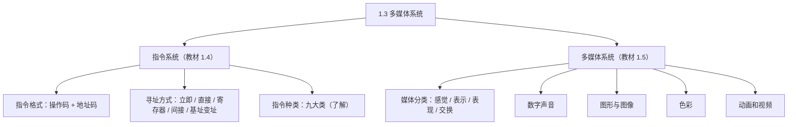

> [!WARNING] 本课真题考点多
> 视频明确提示历年考过的点：媒体分类中**表示媒体与表现媒体的区别**、**H.261 标准**（会混在图像文件格式选项中出题）、**MPEG-7 是多媒体内容描述接口标准**、**JPEG 是静态图像的压缩标准**。这四个点务必记住。

### 指令系统之格式

指令一般包括两个部分：**操作码 OP**（表示做什么操作）和**地址码 A**（表示操作对象在哪里）。按地址码的个数，指令格式分为四种：

| 格式 | 组成 | 说明 |
|---|---|---|
| 三地址格式 | OP + A1 + A2 + A3 | A1、A2 通常为两个源操作数，A3 为结果 |
| 二地址格式 | OP + A1 + A2 | 一个操作数同时兼任结果 |
| 一地址格式 | OP + A1 | 分两种情况（见下） |
| 零地址格式 | 只有 OP | 一般用于空操作、停机指令 |

一地址指令有两种表示：一种是把操作后的结果**填回自身地址码**中；另一种是把操作后的结果**填入累加器（AC）**中。

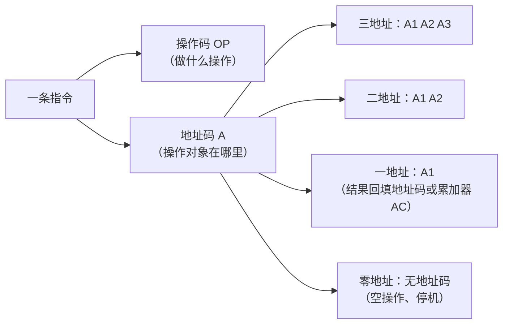

### 指令之寻址方式

寻址方式解决的是"操作数在哪里"的问题。视频小结：**立即寻址**的操作数存放在指令中；**寄存器寻址**的操作数存放在寄存器中；其他寻址方式的操作数均放在内存单元中。

五种主要寻址方式的记忆要点：**立即寻址**——立即数跟在操作码后面，操作数就在指令里；**直接寻址**——指令中直接提供存储单元的地址；**寄存器寻址**——指令中提供寄存器的名字；**间接寻址**——指令中提供的是"操作数地址的地址"，因此有**两次访问内存**的操作；**基址寻址 / 变址寻址**——分别是基址（或变址）寄存器内容加上一个正负偏移量的值。

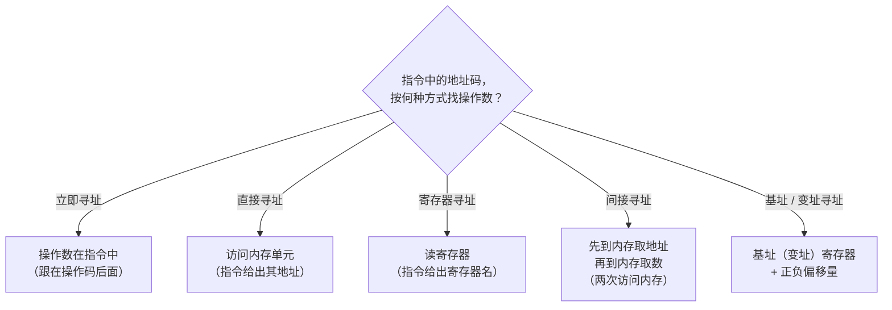

### 指令之种类

指令的种类包括九大类，了解各自代表性指令即可：

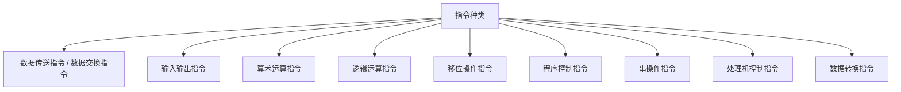

**数据传送与交换指令**：数据在立即数、寄存器和存储单元之间的传送与交换。**输入输出指令**：数据的输入输出、主机向外设发出控制指令，以及它们之间的状态信息。**算术运算指令**：加、减、乘、除和比较。**逻辑运算指令**：与、或、非、异或、取反。**移位操作指令**：算术移位、逻辑移位、循环移位，注意它们的移出进位。**程序控制指令**：包括跳转指令、子程序调用与返回指令和陷阱指令（陷阱指令用于异常处理）。**串操作指令**：串的传送、比较、搜索、替换、转换、抽取等。**处理机控制指令**：置位、清零、停机、中断、空操作等。**数据转换指令**：如十进制转二进制、定点数转浮点数、浮点数转定点数的指令。

### 多媒体之媒体分类

多媒体系统的考查重点是媒体的分类，要会区分五种媒体：

| 媒体 | 含义 | 例子 |
|---|---|---|
| 感觉媒体 | 人的感官能直接感觉到的 | 声音、图像、视频 |
| 表示媒体 | 用来进行编码的媒体 | 图形编码、音频编码 |
| 表现媒体 | 信息的输入输出设备 | 键盘、鼠标、打印机 |
| 存储媒体 | 存放信息的载体 | 硬盘、磁盘、光盘 |
| 传输媒体 | 传输信息的载体 | 电缆、电磁波 |

其中**存储媒体和传输媒体合称交换媒体**。

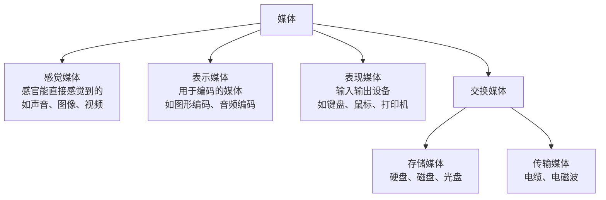

> [!WARNING] 真题考点
> 考试重点是**表示媒体与表现媒体的区别**（历年真题考过）：表示媒体是"编码"，表现媒体是"输入输出设备"。注意区分这两个概念。

### 数字声音

声音按频率范围分：**人耳能辨识的声音**是 20Hz ~ 20kHz；**数字化音（电话语音）**是 300Hz ~ 3400Hz；**CD 乐音**与人耳一致，为 20Hz ~ 20kHz（视频提示这应该是采样过后的频率范围）。

了解概念：**泛音**是指物体振动声音的可变性不高的成分，**基音**是可变性高的成分；泛音除以基音为整数倍的声音称为**乐音**，非整数倍关系的称为**噪音**。了解即可。

声音的数字化一般包括**采样、量化和编码**三步：


> [!NOTE]
> 为了保证采样后的声音质量，必须使**采样频率大于声音信号最高频率的 2 倍**（采样定理）。

声音数据量的计算（本课典型例题）：采样频率 8000Hz、量化精度 8 位、单声道，求每秒产生的数据量——直接用 8000Hz × 8 位 × 单声道 ×1（单声道乘 1，双声道乘 2）× 1 秒，即 8000 × 8 × 1 = 64000 bit/s。若要算 1 小时的数据量，再乘以 3600 秒。

```mermaid
flowchart TB
    F["每秒数据量 = 采样频率 × 量化位数 × 声道数 × 每秒"] --> E1["例题：8000 Hz × 8 位 × 1（单声道）<br/>= 64000 bit/s"]
    F --> E2["双声道则 × 2"]
    F --> E3["1 小时数据量 = 每秒数据量 × 3600"]
```

声音的主要参数：**采样频率**——每秒内采样的次数，常见三种频率（44.1kHz、22.05kHz、11.025kHz 等）；**量化位数**——用来度量声音波形的精度，包括 8 位、12 位和 16 位；**声道数目**——单声道一次产生一组波形数据，双声道一次产生两组波形数据；**数据率**——每秒的数据量，以 bps 为基本单位；**压缩比**——未压缩的音频数据与压缩后的音频数据量的比值。

常见声音文件格式：

| 格式 | 说明 |
|---|---|
| WAVE（.wav） | Windows 的标准音频格式，质量高、数据量大 |
| SND | 支持压缩 |
| AUDIO | Linux 系统的声音文件 |
| AIFF | 苹果电脑的音频文件 |
| VOC（Voice） | 由文件头和音频数据块组成 |
| MP3（MPEG-1 Layer 3） | 压缩比例大，音质高、接近 CD 音质，非常流行 |
| RealAudio | 强调压缩量（体积小），适合网络传输 |
| MIDI | 乐器数字接口的国际标准，文件长度很小、可编辑 |

### 图形与图像

**图形**以矢量表示，如用专业制图软件画出来的三角形、长方形等；**图像**用像素点表示，如照片。

```mermaid
flowchart LR
    A["图形"] --> B["矢量表示<br/>（点、线、面的数学描述）"]
    A --> C["例：制图软件画的<br/>三角形、长方形"]
    D["图像"] --> E["像素点阵表示"]
    D --> F["例：照片"]
```

图像分为黑白图像（又称二值图像）、灰度图像和彩色图像；彩色图像又分为真彩色图像、伪彩色图像（要通过调色板和色彩对照值换算出来的图像）和直接彩色图像。

```mermaid
flowchart TB
    IMG["图像"] --> I1["黑白图像（二值图像）"]
    IMG --> I2["灰度图像"]
    IMG --> I3["彩色图像"]
    I3 --> I3a["真彩色图像"]
    I3 --> I3b["伪彩色图像<br/>（经调色板 / 色彩对照换算）"]
    I3 --> I3c["直接彩色图像"]
```

图形与图像的转换在工程制图中比较常见，也就是**图像的矢量化操作**：先把一张图片放进制图软件中，对照图片勾出它的轮廓，从而把图像转换为图形。

```mermaid
flowchart LR
    A["图像（位图）"] --> B["放入制图软件<br/>对照勾画轮廓"] --> C["图形（矢量）<br/>即图像的矢量化操作"]
```

图像的数据量比较大，也要会算：例如 640×480 像素、256 色的图像，数据量 = 640 × 480 × 2⁸（256 色即 2⁸ = 8 位）= 640×480×8 bit，除以 8 换算成字节约为 300KB。

> [!NOTE]
> 数据量通式：**像素总数 × 每个像素的位数 ÷ 8 = 字节数**。256 色 = 2⁸ = 8 位，65536 色 = 2¹⁶ = 16 位，依此类推。

图像压缩分为**无损压缩**和**有损压缩**：无损压缩包括熵编码、行程编码、无损预测编码和词典编码技术；有损压缩是考虑到数据空间的冗余性进行的压缩。

```mermaid
flowchart TB
    YS["数据压缩"] --> W1["无损压缩"]
    YS --> W2["有损压缩"]
    W1 --> W1a["熵编码"]
    W1 --> W1b["行程编码"]
    W1 --> W1c["无损预测编码"]
    W1 --> W1d["词典编码"]
    W2 --> W2a["考虑数据空间的冗余性"]
```

> [!WARNING] 真题考点
> **JPEG 是静态图像的压缩标准**（视频口误念作"GPEG"）。注意与 MPEG 区分：JPEG 管静态图像，MPEG 管动态图像（视频）。

常见图像文件格式：

| 格式 | 说明 |
|---|---|
| BMP | Windows 采取的图像文件格式，不压缩、占用空间大，支持 1/4/8/24 位深度（黑白、256 色、真彩色） |
| GIF | 无损压缩，可以有动画效果，1~8 位、支持 256 色 |
| PNG | GIF 的替代品，灰度图像深度达 16 位、彩色图像达 48 位，支持无损压缩 |
| TIFF | 用于扫描仪和桌面出版系统，支持二维图像：黑白图像、灰度图像和彩色图像 |
| PCX | PC 画板的文件格式，采取行程编码压缩，不支持真彩色 |
| JPEG | 一种有损压缩格式（静态图像压缩标准） |
| WMF | 仅用于 Windows，文件结构好、具有设备无关性，解码复杂、效率较低 |

### 色彩三要素与色彩模型

颜色的三要素：**色调**——颜色的区分（如红黄蓝）；**饱和度**——颜色的深浅程度，可用"某纯色中加入白色的比例"来度量；**亮度**——颜色明暗的程度，取决于吸收和反射光功率的大小。

**色彩模型（色彩空间）**以三维空间形式组织，常见三种：

```mermaid
flowchart TB
    CM["色彩模型（色彩空间）<br/>以三维空间形式组织"] --> M1["RGB 模型<br/>红、绿、蓝三基色<br/>主要用于彩色显示器"]
    CM --> M2["CMY / CMYK 模型<br/>青色、品红、黄色<br/>（实际中还加入黑色颜料）<br/>主要用于彩色打印机"]
    CM --> M3["YUV 模型<br/>主要用于彩色电视"]
```

> [!NOTE]
> 记一个概念：**两种色光混合得到白光，则这两种色光互为互补色**。

### 色彩之属性

色彩的属性包括**分辨率、像素深度、真色彩和伪色彩**。

**分辨率**：要记住——分辨率越高，图像质量越高。分辨率又分显示分辨率和图像分辨率：显示分辨率指屏幕显示的像素；图像分辨率指图像中所显示的像素的密度。

**像素深度**：度量图像色彩分辨率的指标，像素的位数越多，能表达的颜色数目越多，其深度也就越深。

**真色彩**：每个基色的分量直接决定显示设备的基色强度，这样产生的色彩称为真色彩。**伪色彩**：保存一个色彩查找表（也称为调色板），通过色彩查找表来查找对应的色彩，这称为伪色彩。

```mermaid
flowchart TB
    A["真色彩"] --> B["每个基色分量<br/>直接决定显示设备的基色强度"]
    C["伪色彩"] --> D["保存一个色彩查找表（调色板）"]
    D --> E["通过查表得到对应的色彩"]
```

> [!NOTE]
> 图像的获取与声音类似，也包括采样、量化和编码三个步骤。

### 动画和视频

**动画**是将静态的图形、图像按照一定的顺序显示成连续的动态画面。

```mermaid
flowchart TB
    DH["动画"] --> K1["按控制方式分"]
    DH --> K2["按视觉空间分"]
    K1 --> K1a["实时动画<br/>响应时间由图像大小、复杂程度、<br/>运算速度快慢、图形计算<br/>采用硬件还是软件决定"]
    K1 --> K1b["矢量动画<br/>图形的动画：改变形状、大小，<br/>不影响整体质量"]
    K2 --> K2a["二维动画"]
    K2 --> K2b["三维动画"]
    K2b --> K2b1["线框模型（以线代表）"]
    K2b --> K2b2["表面模型（以面代表）"]
    K2b --> K2b3["实体模型"]
```

**视频**分模拟视频（以模拟信号传输的视频）和数字视频（以数字信号传输的视频）。模拟视频要注意三种彩色电视制式：**NTSC 制、PAL 制、SECAM 制**。数字视频要注意数字化的统一标准 **ITU-R BT.601**，它能满足这三种电视制式的数字化。

数字化的两种方式（按教材口径）：**复合数字化**——对复合彩色信号直接数字化；**分量数字化**——先把彩色信号分离出亮度与色差等分量，再分别数字化。二者只是先后顺序的差别，考试爱考这种区分。

```mermaid
flowchart TB
    SP["视频"] --> V1["模拟视频<br/>（以模拟信号传输）"]
    SP --> V2["数字视频<br/>（以数字信号传输）"]
    V1 --> V1a["三种彩色电视制式<br/>NTSC、PAL、SECAM"]
    V2 --> V2a["数字化统一标准 ITU-R BT.601<br/>（满足三种制式的数字化）"]
    V2a --> V2b["复合数字化<br/>对复合彩色信号直接数字化"]
    V2a --> V2c["分量数字化<br/>先分离彩色分量<br/>再分别数字化"]
```

视频压缩编码包括**帧内压缩**和**帧间压缩**：帧内压缩是对**空间冗余**的一个压缩，帧间压缩是对**时间冗余**的一个压缩。

```mermaid
flowchart LR
    A["视频压缩编码"] --> B["帧内压缩<br/>压缩的是空间冗余"]
    A --> C["帧间压缩<br/>压缩的是时间冗余"]
```

视频标准与格式（本课重点，考过真题）：

| 标准 / 格式 | 说明 |
|---|---|
| H.261 | 会议电视（可视电话）标准。**真题陷阱**：混在图像文件格式选项中考查，它其实是会议电视标准 |
| MPEG 系列 | MPEG-1、MPEG-2、MPEG-4、MPEG-7、MPEG-21 等标准 |
| MPEG-7 | 多媒体内容描述接口标准（真题考点） |
| FLIC | 2D/3D 动画制作软件中采取的彩色动画文件格式，无损压缩 |
| AVI | 微软公司的数字音频和视频文件 |
| QuickTime | 苹果公司的视频音频文件 |
| MPEG（MPG） | 以 MPEG 压缩标准压缩的一种标准格式的视频音频文件，兼容性好 |
| RealVideo（RM / RMVB） | 实时在线播放的低速广域网实时视频文件 |

### 本节小结

① **指令系统**：指令 = 操作码 OP + 地址码 A；按地址码个数分三地址、二地址、一地址、零地址格式（零地址用于空操作、停机）；一地址的结果可回填自身地址码或累加器 AC。寻址方式中立即寻址操作数在指令中、寄存器寻址在寄存器中、其余在内存（间接寻址需两次访问内存，基址/变址 = 寄存器 + 偏移量）。指令种类九大类，了解即可。

② **媒体分类**：感觉媒体 = 感官直接感受（声音、图像、视频）；表示媒体 = 编码；表现媒体 = 输入输出设备；存储媒体 + 传输媒体 = 交换媒体。**表示媒体 vs 表现媒体的区别是真题考点**。

③ **声音**：数字化三步 = 采样、量化、编码；采样频率须大于信号最高频率的 2 倍；每秒数据量 = 采样频率 × 量化位数 × 声道数；常见格式 WAVE（质量高）、MP3（音质接近 CD）、MIDI（体积小可编辑）等。

④ **图形图像与色彩**：图形 = 矢量、图像 = 像素；图像转图形称矢量化操作；图像数据量 = 像素总数 × 每像素位数 ÷ 8；压缩分无损/有损，**JPEG 是静态图像压缩标准（真题）**；色彩三要素 = 色调、饱和度、亮度；RGB 用于显示器、CMY/CMYK 用于打印机、YUV 用于电视。

⑤ **动画与视频**：动画按控制方式分实时/矢量，按空间分二维/三维（线框、表面、实体模型）；模拟视频三种制式 NTSC/PAL/SECAM；数字视频统一标准 ITU-R BT.601；帧内压缩 = 空间冗余、帧间压缩 = 时间冗余；**H.261 与 MPEG-7 是真题考点**。

## 1.4 Office 办公软件

课程链接：视频《1.4 Office 办公软件》（软考程序员系列课程）

视频链接：

### 本节概述

本课是系列课程的第四节课，内容为办公软件的补充知识。办公软件在软件系统中属于**应用软件**层面，这类题看似简单，但以笔试形式考察，主要强调程序员对文档的重视程度；软考信息处理员考试中也有相关的 Office 内容。本部分每年占分比例约**两分**。本节脉络为：Word 文档编辑与排版 → 表格制作 → 图文混合排版 → 样式、目录、题注等高效排版功能。

```mermaid
flowchart TB
    A["1.4 Office 办公软件<br/>（应用软件层面，每年约 2 分）"] --> B["文档编辑与排版"]
    A --> C["表格制作"]
    A --> D["图文混合排版"]
    A --> E["高效排版"]
    B --> B1["文本输入、剪贴板、字体、段落"]
    B --> B2["页面设置、分栏分页分节、页码脚注尾注"]
    C --> C1["创建表格、样式边框、合并拆分、公式统计"]
    D --> D1["图片、艺术字、文本框、公式、图文环绕"]
    E --> E1["样式、目录、题注、图表目录"]
```

### Word 之文档编辑

首先讲文本的输入要点：文本输入时可以**自动换行**，段落结尾用 **Enter 键**隔开；对齐时可以采用缩进式对齐。

```mermaid
flowchart LR
    A["文本编辑常用键"] --> B["Backspace 退格键<br/>删除光标左边的错字"]
    A --> C["Delete 键<br/>删除光标右边的错字"]
    A --> D["Ctrl + 空格<br/>中英文输入切换（选择输入法）"]
    A --> E["Ctrl + Shift<br/>切换输入法"]
```

漏了内容时，把光标插入到该位置再输入，输入的内容会插进去；但如果状态栏显示为**"改写"**状态，光标定位后敲入的内容会把后面的内容**覆盖**掉。

```mermaid
flowchart TB
    A["输入文本之前先看状态栏"] --> B{"状态栏显示什么？"}
    B -->|"插入"| C["输入内容插到光标处<br/>后面内容自动后移"]
    B -->|"改写"| D["输入内容覆盖<br/>光标后面的内容"]
```

**剪贴板**：2010 版的 Word 支持 **24 次复制和剪切**，它们全部存在剪贴板里。单击开始功能区（剪贴板组右下角）的小箭头打开剪贴板，可以单击剪贴板上的某一条内容进行粘贴，也可以选择"全部粘贴"按钮进行全部粘贴。

保留原格式有两种方法：一是单击开始选项卡"粘贴"按钮下面的小三角，在粘贴选项菜单中选择"保留原格式"；二是在复制文件文字以后，弹出的粘贴选项中选择"保留原格式"。这样复制文字的格式就不会改变。

```mermaid
flowchart TB
    A["复制文字后想保留原格式？"] --> B["方法一：单击「粘贴」按钮下的小三角<br/>粘贴选项中选择「保留原格式」"]
    A --> C["方法二：粘贴时弹出的粘贴选项中<br/>选择「保留原格式」"]
```

**拼写与字数统计**：在审阅选项卡的校对功能区有"拼写和语法"按钮，可对文字的拼写和语法进行检查；单击"字数统计"可以对文章文字进行统计，显示字数、页数、不计空格的字数等。写论文（如高级软考要求 2500 字）时，选中文字后点字数统计，即可掌握自己所写的字数是否达到题目要求。

### Word 之字体与段落

**字体**：开始选项卡的字体功能区可以设置字体的显示效果（如字体、字号等）；单击字体组右下角的小按键会弹出一个对话框，可设置更多的字体效果；也可以通过选中文字后点右键，在快捷菜单中选择"字体"，弹出字体对话框来设置。

**段落**：段落设置包括段落的边框和底纹等，用得比较少的是"中文版式"按钮，它包括几种类型：**纵横混排**（例如一排字中的某几个字竖排在横排文字里占一行显示）、**字符合并**（把两个字符合并到一个字符的位置）、**双行合一**、**字符缩放**等功能。段落对话框中可以进行缩进、间距、换行、分页和中文版式的详细设置。

```mermaid
flowchart LR
    A["段落对话框"] --> B["缩进（左缩进、右缩进）"]
    A --> C["间距"]
    A --> D["换行"]
    A --> E["分页"]
    A --> F["中文版式"]
```

### 项目符号、编号与首字下沉

**项目符号和编号**是为了便于阅读、使文章具有层次感，可以使用自动编号功能，在选中的项目前添加项目符号和编号。在开始选项卡的段落功能区单击"编号"按钮或"项目符号"按钮，可在各段添加简单的编号和项目符号——编号就是 1、2、3（或一、二、三），项目符号就是圆圈、勾、三角等符号；单击按钮旁边的小三角可弹出编号库和项目符号库，选择其他符号。选中一段文字时它会自动在前面加 1234。

**首字下沉**：第一个字写得非常大，可能占 2 到 3 行字的内容，从而引起注意。它有两种方式：**下沉式**和**悬挂式**；还可以对下沉的行数、距正文的距离进行设置。注意一点：**在分栏操作时，不要将首字下沉的首字选中**——如果处于选中状态下，分栏是无法进行操作的。

### 页面排版之页面设置与背景

页面的排版就是在打印之前，以页为单位对文档作进一步整体性的版面调整。页面设置主要包括：**纸张大小、页边距（上、下、左、右边距及装订线）、页面方向（横向、纵向）、版式（页眉页脚等）**，以及下面要讲到的强行翻页、分节和分栏、插入页码、脚注、尾注和打印文档。页边距、纸张都可以通过功能区"页面设置"（对话框）进行设置，其中对话框包括页边距、纸张和版式等。

```mermaid
flowchart LR
    A["页面设置"] --> B["纸张大小"]
    A --> C["页边距<br/>上、下、左、右、装订线"]
    A --> D["页面方向<br/>（横向 / 纵向）"]
    A --> E["版式<br/>（页眉页脚等）"]
```

页面的排版还包括**水印、页面背景颜色和页面边框**：可以为页面设置背景颜色，也可以插入图片作为页面的背景，一般背景图片设置为**水印**。

### 分栏、分页与分节

**分栏**是为了修饰文档版面（主要见于杂志报刊），一页的内容以两栏或三栏显示，使版面更加生动、具有可读性。分栏对话框中可以设置分一栏、两栏、三栏以及每一栏的宽度。

看不到分栏效果的几种情形：第一种是处于**草稿（视图）状态**下，草稿视图是看不到分栏效果的；第二种是在页面视图下仍看不到分栏效果或分栏布局不均匀——这是因为分栏时 Word 会根据纸张的高度从左到右布局，如果分栏的内容比较少就会出现这种情况。解决办法是在分栏的文档结束处插入一个**回车符**，增加一个空的段落。

```mermaid
flowchart TB
    A["看不到分栏效果 / 分栏布局不均匀"] --> B["情形一：处于草稿视图下"]
    A --> C["情形二：页面视图下分栏内容较少<br/>Word 按纸张高度从左到右布局"]
    B --> D["解决：切换到页面视图查看"]
    C --> E["解决：在分栏文档结束处<br/>插入一个回车符（增加空段落）"]
```

**分页**：一般情况下录满一页后系统会自动跳到下一页；但内容没满却需要另起一页书写时（如下一章节的文字录入），就要强行分页。强行分页通过页面布局选项卡的"分隔符"按钮插入**分页符**来实现（分隔符包括分页符和分节符）。分页符是**非打印字符**，不会打印出来，可以用 **Delete 键**将其删除。

**分节**：这里的"节"与普通理解不同，它是指一个**独立的编辑单位**，对每一个节可以进行不同的页面设置——它不同于文章中"章节"的定义，可以根据需要在文中相应位置插入分节符。它能达到的效果是：一篇文章中正文部分的页码是 123 这种形式，但如果需要其他部分的页码以另一种形式显示，就必须在正文部分的前面插入一个分节符，然后这个分节符代表的那一段内容（节）就可以采取不同形式的页码。

```mermaid
flowchart LR
    A["整篇文章只要一种页码"] --> B["正文页码 1 2 3……"]
    C["想让不同部分用不同形式的页码"] --> D["在正文前插入分节符"]
    D --> E["每个节是独立编辑单位<br/>可各自设置不同的页码形式"]
```

### 页码、脚注、尾注与打印

**插入页码**有两种渠道：一是插入选项卡的页眉页脚功能区里的"页码"按钮；二是通过"页码格式"对话框设置编号的格式和页码的编号（是否续前节等）。

**脚注和尾注**：脚注位于**页面的底端**（本页下面），是对文档内容进行注释说明（如论文第一页的作者、邮箱）；尾注位于**文档的结尾处**（如最后一页），是对文档引用的文献进行注释。脚注和尾注均由两个相互连接的部分组成：**注释引用标记**与其对应的**注释文本**。

```mermaid
flowchart LR
    A["注释"] --> B["脚注<br/>位于页面的底端<br/>对文档内容注释说明"]
    A --> C["尾注<br/>位于文档的结尾处<br/>对引用的文献注释"]
    B --> D["均由注释引用标记<br/>+ 对应的注释文本组成"]
    C --> D
```

**打印**：在文件里面有打印功能，可以选择（网络的）打印机、打印的份数、纸张方向（纵向、横向）、纸张大小等，设置完参数后点击打印即可，有内容时还可以预览效果。

### 表格的制作与统计

快速创建表格：在插入选项卡的表格功能区点"插入表格"即可快速创建一张表。表格功能包括**插入表格、绘制表格、文本转表格**等。

选中表格后，上方会出现一个**表格工具**（2010 或 2020 版本的 Word），它包括**设计**和**布局**两个部分。在设计里可以选择表格的样式和边框，还可以通过对话框（点组右下角小按键弹出，或右键表格）对边框、底纹等作详细设置；布局包括增加行和列、合并与拆分单元格、单元格对齐方式等。

**表格的统计功能**：比如在表格中算"语文成绩加数学成绩求和"这类总成绩。步骤是：首先定位在存放计算结果的单元格并把它选中，然后选择表格工具选项卡的数据功能区里的"公式"按钮，弹出公式对话框，输入函数或公式来计算。表格的单元格表示方式是**列号 + 行号**，如 B4 表示第二列、第四行。

```mermaid
flowchart LR
    A["定位并选中存放结果的单元格"] --> B["表格工具 → 数据功能区<br/>→「公式」按钮"] --> C["在公式对话框中<br/>输入函数 / 公式"] --> D["单元格按「列号 + 行号」引用<br/>如 B4 = 第 2 列第 4 行"]
```

### 插入图片、文字、艺术字与公式

插入图片是经常使用的操作；插入一段文字可以用**文本框**（横排、竖排文本框），使用文本框可以制作特殊的标题，如文中标题、栏间标题、竖排文本等效果；还有**艺术字**（有不同字体的图标样式）。

插入文中的图片和文字一样，可以进行复制、移动、删除，也可以进行尺寸调整、裁剪、旋转等操作。对于部分图片还可以进行**组合 / 取消组合**处理：选中两个图片进行组合后，组合起来的图片会有一个虚线包裹，可以同时拖拽、放大、缩小，两张图片的相对位置和大小会同时改变，这叫图片的组合；取消组合后，两个图片的相对位置和大小不会随着整个区域的变化而变化。点击图片会弹出图片工具功能区，可对图片设置立体效果（样式）、颜色、背景、旋转、裁剪等实时操作。

```mermaid
flowchart LR
    A["选中两张图片"] --> B["组合"] --> C["虚线包裹为一个整体<br/>可同时拖拽、放大、缩小"]
    C --> D["取消组合<br/>两张图片彼此独立<br/>不随整体变化"]
```

**插入公式**：在插入选项卡的符号功能区单击"公式"按钮，选择插入新公式，会弹出公式工具选项卡，选择合适的按钮即可编辑公式（包括各种符号和上下标结构）。虽然输入法和一些公式编辑软件提供了丰富的公式编辑功能，但 Word 里也提供了强大的公式编辑功能。

```mermaid
flowchart LR
    A["插入选项卡 → 符号功能区"] --> B["「公式」按钮"] --> C["插入新公式"] --> D["公式工具选项卡<br/>编辑符号、上下标结构"]
```

**自选图形与绘图画布**：需要组合多个图形时，可以先绘制一个**画布**，再把多个图形放在绘图画布里。绘图画布提供图形和文档其余部分之间的边界；默认情况下绘图画布没有边界和背景，但可以像任何图形一样对绘图画布应用格式。

### 图文混排

图文混排有三种方式：**浮于文字上方、衬于文字下方、与文字同一层**——这就是图层的三层关系。只有图文位于同一层时正文才会"让路"（文字环绕图片）；图片衬于文字下方时，图片上面可以写字；图片在文字上方时，图片可以覆盖在文字上。

```mermaid
flowchart TB
    A["图文混排的三种层次"] --> B["浮于文字上方<br/>图片覆盖在文字上"]
    A --> C["衬于文字下方<br/>图片上可以写字<br/>（一般设为冲蚀颜色作背景）"]
    A --> D["与文字同一层<br/>正文为图片「让路」"]
    D --> D1["嵌入型：图片作为特殊符号<br/>占据文本的位置"]
    D --> D2["四周型环绕"]
    D --> D3["紧密型环绕"]
```

具体操作：在绘图工具选项卡的排列功能区点"位置"按钮选择一个文字环绕方法；或者选择"其他布局选项"，在弹出的对话框中选择更多的文字环绕方式；也可以单击页面布局的排列功能区的"位置"或"自动换行"按钮设置文字环绕方式。其中衬于文字下方的图片一般设置成**冲蚀**颜色，以突出图片的背景效果（视频中"充足颜色"为口误）。

**嵌入式和浮动式**的区别：嵌入式的图片直接放入文本插入点处，占据文本的位置，选中该图片时四周会出现八个**实心**小方块——把图片变小后可以作为文本的一个特殊符号或标记，移动它的操作同于文本的移动；而浮动式图片可以插入图形层，在文本或其他对象前面或后面，选中时四周会出现八个**空心**小方块，此时图片独立于文本，可以用鼠标在文本中随意拖动。

```mermaid
flowchart TB
    A["选中图片看控点形状"] --> B["嵌入式<br/>四周 8 个实心小方块<br/>占据文本位置，移动同文本"]
    A --> C["浮动式<br/>四周 8 个空心小方块<br/>独立于文本，可随意拖动"]
```

### 样式

所谓**样式**是一组已命名的字符格式或段落格式。应用样式格式化文档，可以大大提高文档的质量和工作效率。Word 中提供了近百种内部样式，用户也可以修改已有的样式或建立新的样式来满足自己的需要。应用样式在开始选项卡的样式功能区——选择一种样式即可，单击滚动条可以选择更多的样式；修改和删除样式时，在样式工作区选中一个样式名，其右侧会出现一个下拉按钮，可以选择修改其样式或删除其样式。

```mermaid
flowchart TB
    A["样式<br/>一组已命名的字符 / 段落格式"] --> B["应用：开始选项卡 → 样式功能区<br/>（Word 内置近百种样式）"]
    A --> C["修改 / 删除：样式名处下拉按钮"]
    A --> D["可新建样式满足自己的需要"]
```

### 目录与图表目录

**目录**的生成有一个前提：这篇文章必须是以大纲的形式进行编排（标题使用了大纲级别的样式，如一级标题、二级标题），这样才可以自动生成目录。目录是文档中标题的列表，可以将其插入指定的位置，通过目录可以了解一篇文章论述了哪些主题并快速定位到这些主题；打印出来的文档以及在 Word 中查找的文档都可以编制目录。显示文档时目录包括标题及对应的页号，按住 **Ctrl 键**将鼠标移到目录项上会变成手型光标，标题将变成超链接，单击即可直接跳转到该标题。

```mermaid
flowchart TB
    A["前提：文章按大纲级别样式编排<br/>（一级标题、二级标题……）"] --> B["引用 → 目录：自动目录 / 手动目录 / 插入目录"]
    B --> C["设置制表符前导符、显示级别"]
    C --> D["在光标处插入目录（标题 + 页号）"]
    D --> E["Ctrl + 单击目录项：跳转到对应标题"]
    E --> F["更新目录：只更新页码 / 更新整个目录"]
```

**题注**：是向文档中插入表格、图、公式等对象时，在对象的上方或下方加一个"图 1""图 1.1""图 2"等说明的文字。题注是生成图表目录和交叉引用的前提——建立图表目录时能自动搜索文档中的题注。题注可以手动添加，也可以针对某种对象自动添加，有两种方式。题注的编号是自动变化的：每插入一个题注，后续的题注编号会自动更新；删除图表或题注后，只要右键单击其他题注标号，在快捷菜单中选择"更新域"命令，题注标号就可以自动更新。

手动添加题注：在引用选项卡的题注功能区单击"插入题注"，在弹出的题注对话框中选择对象标签或选择新建标签，再选择其他选项。自动添加题注：在题注对话框中单击"自动添加题注"按钮，可以选择在哪些对象上自动添加题注。注意：**自动添加题注对自选图形不起作用**，所以一般采取手动添加题注的方法。

**图表目录**：长篇的文章中含有大量的图形、表格和公式时，为了让读者方便地找到某个对象，可以为这些对象编制图表目录。插入方法：先对各对象添加题注（前提），然后在引用选项卡的题注功能区点"插入表目录"（插入图表目录）按钮，在弹出的对话框中选择题注标签来区分不同的目录——题注标签为"图"则插入图的目录，标签为"表格"则插入表的目录。

```mermaid
flowchart TB
    A["为表格、图、公式添加题注<br/>（图 1、图 2……）"] --> B["题注编号自动更新<br/>每插入一个后面自动 +1"]
    B --> C["删除后：右键其他题注<br/>→「更新域」自动更正编号"]
    A --> D["图表目录：引用 → 插入表目录<br/>选择题注标签生成图目录 / 表目录"]
```

视频最后留的三道思考题（也是常考小点）：从网上获取文字素材粘贴到 Word 中，直接粘贴可能出现格式问题（是保留原格式还是匹配 Word 上文格式）与编码不一致的问题，所以要用"保留原格式"等粘贴选项处理；把一篇文档中的文字连到另一篇文档时，想保证格式样式不变，同样选择保留原格式粘贴；**保存与另存为的区别**——保存会覆盖现有的文件，另存为则现有的不变，并把内容存到另外一个地方、另起一个名字；不希望某文件被别人打开浏览，可以设置**文档密码**，不希望别人修改则可以设置修改权限。

### 本节小结

① **编辑与格式**：Enter 键分段、自动换行；Backspace 删光标左边、Delete 删光标右边；Ctrl+空格切换中英文、Ctrl+Shift 切换输入法；插入状态插进去、改写状态覆盖；2010 版剪贴板支持 24 次复制剪切；保留原格式粘贴两种方法。

② **排版**：页面设置含纸张、页边距（上下左右+装订线）、方向、版式；分栏在草稿视图看不到，内容少时布局不均可在文档结束处加回车符解决；强行分页用分页符（非打印字符，Delete 可删）；**分节 = 独立编辑单位，可让不同部分用不同页码**；脚注在页面底端注释内容、尾注在文档结尾注释文献；目录生成的前提是大纲级别样式，Ctrl+单击跳转，更新目录分"只更新页码"和"更新整个目录"。

③ **表格**：插入/绘制/文本转表格三种创建方式；选中出现表格工具（设计+布局）；统计用"公式"按钮，单元格按列号+行号引用（如 B4）。

④ **图文混排**：三层关系——浮于文字上方、衬于文字下方（常设冲蚀色）、与文字同一层（嵌入型、四周型、紧密型）；嵌入式选中是 8 个实心方块（同文本移动），浮动式是 8 个空心方块（随意拖动）；多图形组合可先绘制绘图画布。

⑤ **高效排版**：样式提升文档质量与效率；题注是图表目录和交叉引用的前提、编号自动更新（删除后右键"更新域"）、自动题注对自选图形不起作用；保存覆盖原文件、另存为另起名字与位置。