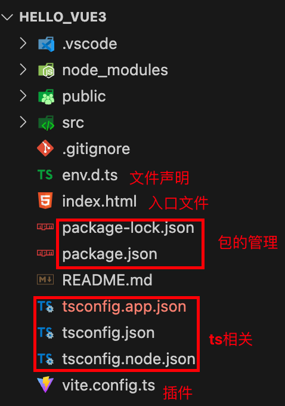
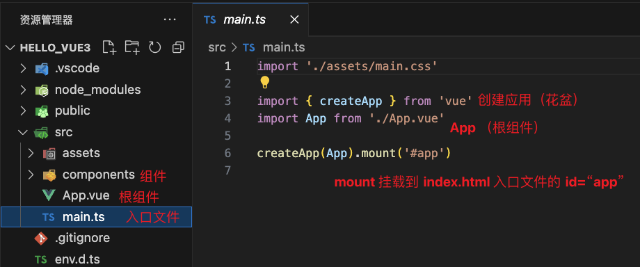

# vue3

> [!NOTE]
>
> 【尚硅谷Vue3入门到实战，最新版vue3+TypeScript前端开发教程】
>
> https://www.bilibili.com/video/BV1Za4y1r7KE?p=15&vd_source=0dca1cfb04ee971df44055dcc2b06e83

## 1. 创建vue3工程

### 1.1 创建hello_vue3工程

Vue3 推荐使用基于 vite 创建，vite是一个前端的构建工具，能够

​	轻量快速的热重载（HMR），实现快速的服务启动

​	对ts、css、jsx等支持开箱即用

​	真正的按需编译，不在等待整个应用编译完成

```shell
## 创建命令
npm create vue@latest

✔ 请输入项目名称： … hello_vue3
✔ 是否使用 TypeScript 语法？ … 是
✔ 是否启用 JSX 支持？ … 否
✔ 是否引入 Vue Router 进行单页面应用开发？ … 否
✔ 是否引入 Pinia 用于状态管理？ … 否
✔ 是否引入 Vitest 用于单元测试？ … 否
✔ 是否要引入一款端到端（End to End）测试工具？ › 不需要
✔ 是否引入 ESLint 用于代码质量检测？ … 否
✔ 是否引入 Vue DevTools 7 扩展用于调试? (试验阶段) … 否

## 项目初始化完成，可执行以下命令：
cd hello_vue3
npm install
npm run dev
```


### 1.2 工程结构介绍

edv.d.ts 用于给文件声明 例如txt文件

index.html 项目入口文件

package 包的管理文件

tsconfig ts配置的相关文件

vite.config.ts 插件配置文件



> [!WARNING]
>
> 终端输入命令  `npm i` 安装node_modules包


src->assets 资源文件夹

​	main.ts 工程入口文件 挂载到 index.html 项目入口文件

​	app.vue 根组件

​	components 组件文件夹




## 2. vue3核心语法

