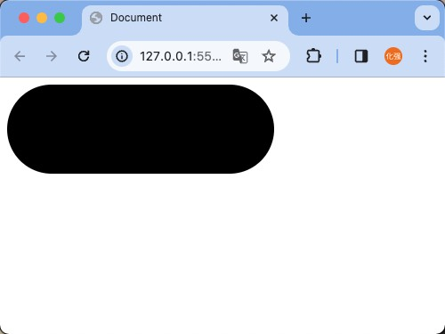

# CSS3

?> bilibili 黑马程序员 前端html+css+移动web视频教程	https://www.bilibili.com/video/BV1kM4y127Li?p=30

## 1. CSS选择器

### 1.1 后代选择器

后代选择器：选中某元素的后代元素（**所有**）。

选择器写法：父选择器  子选择器 { CSS 属性}，父子选择器之间用**空格**隔开。

```html
<style>
  div p{
    color: red;
  }
</style>

<body>
   <div>
    <p>html</p>
    <p>css</p>
    <p>JavaScript</p>
   </div>
</body>
```


### 1.2 子代选择器

子代选择器：选中某元素的子代元素（**最近的子级**）。

选择器写法：父选择器 > 子选择器 { CSS 属性}，父子选择器之间用 **>** 隔开。

```html
<style>
  div > span {
    color: red;
  }
</style>

<body>
    <div>
        <span>html</span>
        <span>html5</span>
        <p>
            <span>css</span>
            <span>JavaScript</span>
        </p>
    </div>
</body>
```


### 1.3 并集选择器

并集选择器：选中**多组标签**设置**相同**的样式。

选择器写法：选择器1, 选择器2, …, 选择器N { CSS 属性}，选择器之间用 **,** 隔开。

```html
<style>
  div,p,span{
    color: red;
  }
</style>

<body>
   <div>辽宁</div>
   <p>大连</p>
   <span>yanghuaqiang</span>
</body>
```


### 1.4 交集选择器

交集选择器：选中**同时满足多个条件**的元素。

选择器写法：选择器1选择器2 { CSS 属性}，选择器之间连写，没有任何符号。 

```html
<style>
  p.address {
    color: red;
  }
</style>

<body>
    <div class="address">辽宁</div>
    <p class="address">大连</p>
    <span>yanghuaqiang</span>
</body>
```


### 1.5 伪类选择器

伪类选择器：伪类表示元素**状态**，选中元素的某个状态设置样式。

鼠标悬停状态：**选择器:hover { CSS 属性 }**

```html
<style>
  div:hover {
    background-color: red;
  }

  a:hover {
    color: blue;
  }
</style>

<body>
    <div>
        yanghuaqiang
    </div>
    <a href="">点我</a>
</body>
```


#### 1.5.1 超链接伪类

| 选择器     | 作用           |
| ---------- | -------------- |
| `:link`    | 访问前         |
| `:visited` | 访问后         |
| `:hover`   | 鼠标悬停       |
| `:active`  | 点击时（激活） |

!> 提示：如果要给超链接设置以上四个状态，需要按 LVHA 的顺序书写。 
> 经验：工作中，一个 a 标签选择器设置超链接的样式， hover状态特殊设置 
>
> ```css
> a {
>   color: red;
> }
> 
> a:hover {
>   color: green;
> }
> ```


### 1.6 结构伪类选择器

作用：根据元素的**结构关系**查找元素。

| 选择器           | 说明                               |
| ---------------- | ---------------------------------- |
| `E:first-child`  | 查找第一个E元素                    |
| `E:last-child`   | 查找最后一个E元素                  |
| `E:nth-child(N)` | 查找第N个E元素（第一个元素N值为1） |

```html
<style>
  li:first-child {
    color: red;
  }

  li:nth-child(5) {
    color: yellow;
  }

  li:last-child {
    background-color: blue;
  }
</style>

<body>
    <ul>
        <li>1</li>
        <li>2</li>
        <li>3</li>
        <li>4</li>
        <li>5</li>
        <li>6</li>
        <li>7</li>
        <li>8</li>
        <li>9</li>
    </ul>
</body>
```


#### 1.6.1 :nth-child(公式) 

| 功能                         | 公示       |
| ---------------------------- | ---------- |
| 偶数标签                     | 2n         |
| 奇数标签                     | 2n+1；2n-1 |
| 找到5的倍数的标签            | 5n         |
| 找到第5个以后的标签（包含5） | n+5        |
| 找到第5个以前的标签（包含5） | -n+5       |

> n+5、-n-5公式中的n取值从 **0** 开始。

```html
<style>
  li:nth-child(n+6) {
    color: yellow;
  }
</style>

<body>
    <ul>
        <li>1</li>
        <li>2</li>
        <li>3</li>
        <li>4</li>
        <li>5</li>
        <li>6</li>
        <li>7</li>
        <li>8</li>
        <li>9</li>
    </ul>
</body>
```


### 1.7 伪元素选择器

作用：创建**虚拟元素**（伪元素），用来**摆放装饰性的内容**。 

| 选择器      | 说明                            |
| ----------- | ------------------------------- |
| `E::before` | 在E元素里面最前面添加一个伪元素 |
| `E::after`  | 在E元素里面最后面添加一个伪元素 |

!> 注意点：*1.* 必须设置 **content: ””属性**，用来 设置伪元素的内容，如果没有内容，则**引号留空**即可	*2.*伪元素默认是**行内**显示模式	*3.***权重和标签选择器相同**

```html
<style>
  div::before{
    content: "yanghauqiang";
    color: blue;
  }
  div::after{
    content: "qianduan";
    color: red;
  }
</style>

<body>
    <div>学</div>
</body>
```


## 2. 盒子模型

### 2.1 盒子模型组成

* 内容区域 – width & height
* 内边距 – padding（出现在内容与盒子边缘之间）
* 边框线 – border 
* 外边距 – margin（出现在盒子外面）

```html
<style>
  div{
    width: 100px;
    height: 100px;
    background-color: red;

    padding: 10px;
    border: 5px solid #000;
    margin: 10px;
  }
</style>

<body>
    <div>盒子内容</div>
</body>
```


!> 注意：*1.*盒子大小=盒子内容+border*2+padding *2；*2.*margin大小与盒子大小无关


### 2.2 边框线

#### 2.2.1 四个方向

属性名：**border**（bd）

属性值：边框线粗细  线条样式  颜色（不区分顺序）

| 属性值 | 线条样式 |
| ------ | -------- |
| solid  | 实线     |
| dashed | 虚线     |
| dotted | 点线     |

```html
<style>
  div{
    width: 100px;
    height: 100px;
    background-color: red;

    border: 1px solid #000;
  }
</style>

<body>
    <div>盒子内容</div>
</body>
```


#### 2.2.2 单方向边框线

```html
<style>
  div{
    width: 100px;
    height: 100px;
    background-color: red;

    border-top: 1px solid #000;
    border-right: 2px dashed #000;
    border-bottom: 3px solid #000;
    border-left: 4px dotted #000;
  }
</style>

<body>
    <div>盒子内容</div>
</body>
```


### 2.3 内边距

作用：设置 内容 与 盒子边缘 之间的距离。

* 属性名：padding / padding-方位名词

```html
<style>
  div{
    width: 100px;
    height: 100px;
    background-color: red;

    padding: 30px;
  }
</style>

<body>
    <div>盒子内容</div>
</body>
```


!> 提示：添加 padding 会撑大盒子。

* padding多值写法

| 数值个数 | 实例                           | 含义                                   |
| -------- | ------------------------------ | -------------------------------------- |
| 1        | `Padding:10px;`                | 上右下左：10px                         |
| 2        | `Padding:10px 20p;`            | 上：10px  右：20px  下：10px  左：20px |
| 3        | `Padding:10px 20px 30px;`      | 上：10px  右：20px  下：30px  左：20px |
| 4        | `Padding:10px 20px 30px 40px;` | 上：10px  右：20px  下：30px  左：40px |

> 技巧：从**上**开始**顺时针**赋值，当前方向没有数值则与**对面取值相同**。


### 2.4 盒子尺寸计算

默认情况：盒子尺寸 = 内容尺寸 + border 尺寸 + 内边距尺寸

结论：给盒子加 border / padding 会撑大盒子

解决：

* 手动做减法，减掉 border / padding 的尺寸
* 內减模式：**box-sizing: border-box**

```html
<style>
  div{
    width: 100px;
    height: 100px;
    background-color: red;

    padding: 30px;
    border: 10px solid #000;

    box-sizing: border-box;
  }
</style>

<body>
    <div></div>
</body>
```


### 2.5 外边距

作用：拉开两个盒子之间的距离

属性名：**margin**

提示：与 padding 属性值写法、含义相同


### 2.6 版心居中

左右 margin 值 为 auto（盒子要有宽度）

```html
<style>
  div{
    width: 100px;
    height: 100px;
    background-color: red;

    margin: 0 auto;
  }
</style>

<body>
    <div></div>
</body>
```


### 2.7 清除默认样式

清除标签默认的样式，比如：默认的内外边距。 

```css
/* 清除默认内外边距 */
* {
  margin: 0;
  padding: 0;
  box-sizing: border-box;
}
/* 清除列表项目符号 */
li {
  list-style: none;
}
```

或者定义清除标签默认的样式的css文件：reset.css，在html文件中引入

```css
/* 重置默认样式 */

/* 基础设置 */
body,h1,h2,h3,h4,h5,h6,hr,p,blockquote,dl,dt,dd,ul,ol,li,pre,form,fieldset,legend,button,input,textarea,th,td{
    margin: 0;
    padding: 0;
}

ul,ol {
    list-style: none;
}

img {
    /* 底部留白 */
    display: block;
		border:0;
}

b,strong {
    font-weight: 400;
}

h1,h2,h3,h4,h5,h6 {
    /* 父元素字号的百分比 */
    font-size: 100%;
    font-weight: normal;
}

i,em {
    /* 不倾斜 */
    font-style: normal;
}

u,ins,s,del {
    /* 去掉中划线和下划线 */
    text-decoration: none;
}

table {
    border: 1px solid #999;
    /* 相当于是cellspacing */
    border-spacing: 0;
    /* 1px边框 */
    border-collapse: collapse;
}

td,th {
    border: 1px solid #999;
}

input,button {
    /* 去掉轮廓线 */
    outline: none;
    border:none;
}

/* 风格设置 */
body {
    font: 12px/1.5 "Microsoft YaHei", Tahoma, Helvetica, Arial, "\5b8b\4f53", sans-serif;
    color: #333;
}

a {
    text-decoration: none;
    color: #666;
}

a:hover {
    color:#DD302D;
    text-decoration: none;
}

.leftfix {
    float: left;
}

.rightfix {
    float: right;
}

.clearfix::after {
    content: "";
    display: block;
    clear: both;
}

```


### 2.8 元素溢出

作用：控制溢出元素的内容的显示方式。

属性名：**overflow**

| 属性值 | 效果                                       |
| ------ | ------------------------------------------ |
| hidden | 溢出隐藏                                   |
| scroll | 溢出滚动（无论是否溢出，都显示滚动条位置） |
| auto   | 溢出滚动（溢出才显示滚动条位置）           |


### 2.9 外边距问题

#### 2.9.1 合并现象

场景：**垂直**排列的兄弟元素，上下 **margin** 会**合并**

现象：取两个 margin 中的**较大值生效**

```html
<style>
  .one{
    height: 100px;
    width: 100px;
    background-color: red;
    margin-bottom: 10px;
  }
  .two{
    height: 100px;
    width: 100px;
    background-color: red;
    margin-top: 50px;
  }
</style>

<body>
    <div class="one"></div>
    <div class="two"></div>
</body>
```


#### 2.9.2 外边距塌陷

场景：父子级的标签，子级的添加 **上外边距** 会产生**塌陷**问题

现象：**导致父级一起向下移动**

解决方法：

* 取消子级margin，父级设置padding
* 父级设置 overflow: hidden
* 父级设置 border-top

```html
<style>
  .fater{
    width: 100px;
    height: 100px;
    background-color: red;

    overflow: hidden;
  }
  .son{
    width: 50px;
    height: 50px;
    background-color: #333;
    margin-top: 30px;
  }
</style>

<body>
    <div class="fater">
        <div class="son"></div>
    </div>
</body>
```


### 2.10 行内元素 – 内外边距问题 

场景：行内元素添加 margin 和 padding，无法改变元素垂直位置

解决方法：给行内元素添加 **line-height** 可以改变垂直位置

```html
<style>
  span{
    padding: 50px;
    margin: 30px;
    line-height: 100px;
  }
</style>

<body>
    <span>杨化强</span><span>yanghauqiang</span>
</body>
```


### 2.11 圆角

作用：设置元素的外边框为圆角。

属性名：**border-radius**

属性值：数字+px / 百分比

提示：属性值是圆角半径

**多值写法**

| 取值个数 | 实例                                  | 含义                                        |
| -------- | ------------------------------------- | ------------------------------------------- |
| 1        | `border-radius: 10px;`                | 左上：10px 右上：10px 右下：10px 左下：10px |
| 2        | `border-radius: 10px 20px;`           | 左上：10px 右上：20px 右下：10px 左下：20px |
| 3        | `border-radius: 10px 20px 30px;`      | 左上：10px 右上：20px 右下：30px 左下：20px |
| 4        | `border-radius: 10px 20px 30px 40px;` | 左上：10px 右上：20px 右下：30px 左下：40px |

- 正圆形状：给正方形盒子设置圆角属性值为 **宽高的一半 / 50%**

```html
<style>
  .div1 {
    height: 100px;
    width: 100px;
    background-color: #000;
    border-radius: 50%;
  }
  .div2 {
    height: 100px;
    width: 100px;
    background-color: #888;
    border-radius: 50%;
  }
</style>

<body>
    <div class="div1"></div>
    <br>
    <div class="div2"></div>
</body>
```


- 胶囊形状：给长方形盒子设置圆角属性值为 盒子高度的一半 

```html
<style>
  div {
    height: 100px;
    width: 300px;
    background-color: #000;
    border-radius: 50px;
  }
</style>

<body>
    <div></div>
</body>
```




### 2.12 盒子阴影

作用：给元素设置阴影效果

属性名：**box-shadow**

属性值：X 轴偏移量  Y 轴偏移量  模糊半径  扩散半径  颜色  内外阴影

注意： 

* X 轴偏移量 和 Y 轴偏移量 必须书写
* 默认是外阴影，内阴影需要添加 inset

```css
div {
  width: 200px;
  height: 80px;
  background-color: orange;
  box-shadow: 2px 5px 10px 0 rgba(0, 0, 0, 0.5) inset;
}

<body>
    <div></div>
</body>
```


## 3. 浮动

### 3.1 标准流

标准流也叫文档流，指的是标签在页面中**默认的排布规则**，例如：块元素独占一行，行内元素可以一行显示多个。 


### 3.2 浮动

作用：让块元素水平排列。

属性名：**float**

属性值

* **left**：左对齐
* **right**：右对齐

```html
<style>
  * {
    margin: 0;
    padding: 0;
  }
  li {
    list-style: none;
  }
  .content {
    height: 200px;
    width: 500px;

    margin: 50px auto;
  }
  .left{
    float: left;
    width: 100px;
    height: 200px;
    background-color: red;
  }
  .right{
    float: right;
    width: 390px;
    height: 200px;
  }
  .right li {
    float: left;
    height: 90px;
    width: 90px;
    background-color: #333;
    margin: 0 10px 10px 0; 
  }
  .right li:nth-child(4n){
    margin-right: 0;
  }
</style>

<body>
    <div class="content">
        <div class="left"></div>
        <div class="right">
            <li></li>
            <li></li>
            <li></li>
            <li></li>
            <li></li>
            <li></li>
            <li></li>
            <li></li>
        </div>
    </div>
</body>
```


特点：

* 浮动后的盒子**顶对齐**
* 浮动后的盒子具备**行内块**特点
* 浮动后的盒子**脱标**，**不占用标准流的位置**


### 3.3 清除浮动

场景：浮动元素会脱标，如果**父级没有高度**，**子级无法撑开父级高度**（可能导致页面布局错乱）

解决方法：**清除浮动**（清除浮动带来的影响）

```html
<style>
  .top{
    margin: 0  auto;
    width: 500px;
    height: 100px;
    background-color: red;
  }
  .top .left{
    float: left;
    height: 100px;
    width: 190px;
    background-color: orange;
  }
  .top .right{
    float: right;
    height: 100px;
    width: 300px;
    background-color: blue;
  }
  .botton{
    height: 50px;
    background-color: black;
  }
</style>

<body>
    <div class="top">
        <div class="left"></div>
        <div class="right"></div>
    </div>
    <div class="botton"></div>
</body>
```


父级没有高度，子级无法撑开父级高度


#### 3.3.1 额外标签法

在**父元素内容的最后**添加一个**块级**元素，设置 CSS 属性 **clear: both** 

```html
<style>
.clearfix {
  clear: both;
}
</style>

<div class="father">
  <div class="left"></div>
  <div class="right"></div>
  <div class="clearfix"></div>
</div>
```


#### 3.3.2 单伪元素法

1. 准备 after 伪元素

```css
.clearfix::after {
  content: "";
  display: block;
  clear: both;
}
```

2. 父级使用 clearfix 类

```html
<div class="father clearfix"></div>
```


#### 3.3.3 双伪元素法

1. 准备 after 和 before 伪元素

```css
/* before 解决外边距塌陷问题 */
/* 双伪元素法 */
.clearfix::before,
.clearfix::after {
  content: "";
  display: table;
}

/* after 清除浮动 */
.clearfix::after {
  clear: both;
}
```

2. 父级使用 clearfix 类

```html
<div class="father clearfix"></div>
```


#### 3.3.4 overfow法

```css
.father {
  width: 500px;
  /* height: 100px; */
  background-color: pink;

  overflow: hidden;
}
```


## 4. flex布局

### 4.1 flex组成

设置方式：给**父**元素设置 **display: flex**，子元素可以自动挤压或拉伸

组成部分：

* 弹性容器（父元素）
* 弹性盒子（子元素）
* 主轴：默认在**水平**方向
* 侧轴 / 交叉轴：默认在**垂直**方向


### 4.2 主轴对其方式

属性名：**justify-content**

| 属性值          | 效果                                                 |
| --------------- | ---------------------------------------------------- |
| `flex-start`    | 默认值，弹性盒子从**起点**开始依次排列               |
| `flex-end`      | 弹性盒子从**终点**开始依次排列                       |
| `center`        | 弹性盒子沿主轴**居中**排列                           |
| `space-between` | 弹性盒子沿主轴均匀排列，空白间距分在弹性盒子**之间** |
| `space-around`  | 弹性盒子沿主轴均匀排列，空白间距分在弹性盒子**两侧** |
| `space-evenly`  | 弹性盒子沿主轴均匀排列，弹性盒子与容器之间间距相等   |

```html
<style>
  *{
    padding: 0;
    margin: 0;
  }
  li{
    list-style: none;
  }
  .father{
    display: flex;
    /* justify-content: flex-start; */
    /* justify-content: flex-end; */
    /* justify-content: center; */
    /* justify-content: space-between; */
    /* justify-content: space-around; */
    /* justify-content: space-evenly; */

    width: 200px;
    background-color: blue;
  }
  .father li{
    width: 50px;
    height: 50px;
    background-color:red;
  }
</style>

<body>
    <div class="father">
        <li>1</li>
        <li>2</li>
        <li>3</li>
    </div>
</body>
```


### 4.3 侧轴对其方式

* align-items：当前弹性容器内**所有**弹性盒子的侧轴对齐方式（给**弹性容器**设置）
* align-self：单独控制**某个弹性盒子**的侧轴对齐方式（给**弹性盒子**设置）

| 属性值     | 效果                                                         |
| ---------- | ------------------------------------------------------------ |
| stretch    | 弹性盒子沿着测轴线被**拉伸至铺满容器**（弹性盒子没有设置侧轴方向尺寸则默认拉伸） |
| center     | 弹性盒子眼侧轴**居中**排列                                   |
| flex-start | 弹性盒子从**起点**开始依次排列                               |
| flex-end   | 弹性盒子从**终点**开始依次排列                               |

```html
<style>
  *{
    padding: 0;
    margin: 0;
  }
  li{
    list-style: none;
  }
  .father{
    display: flex;
    align-items: stretch;
    /* align-items: center; */
    /* align-items: flex-start; */
    /* align-items: flex-end; */
    height: 100px;
    width: 200px;
    background-color: blue;
  }
  .father li{
    width: 50px;
    background-color:red;
  }
</style>

<body>
    <div class="father">
        <li>1</li>
        <li>2</li>
        <li>3</li>
    </div>
</body>
```


### 4.4 修改主轴方向

**主轴默认在水平方向，侧轴默认在垂直方向**

属性名：**flex-direction**

| 属性值         | 效果                       |
| -------------- | -------------------------- |
| row            | 水平方向，从左向右（默认） |
| column         | 垂直方向，从上向下         |
| row-reverse    | 水平方向，从右向左         |
| column-reverse | 垂直方向，从下向上         |

```html
<style>
  *{
    padding: 0;
    margin: 0;
  }
  li{
    list-style: none;
  }
  .father{
    display: flex;
    flex-direction: row;
    /* flex-direction: column; */
    /* flex-direction: row-reverse; */
    /* flex-direction: column-reverse; */

    height: 100px;
    width: 200px;
    background-color: blue;
  }
  .father li{
    width: 50px;
    height: 30px;
    background-color:red;
  }
</style>

<body>
    <div class="father">
        <li>1</li>
        <li>2</li>
        <li>3</li>
    </div>
</body>
```


### 4.5 弹性伸缩比

作用：控制弹性盒子的主轴方向的尺寸。

属性名：**flex**

属性值：整数数字，表示占用**父级剩余尺寸的份数**。

```html
<style>
  *{
    padding: 0;
    margin: 0;
  }
  li{
    list-style: none;
  }
  .father{
    display: flex;
    height: 100px;
    width: 200px;
    background-color: blue;
  }
  .father li:first-child{
    width: 50px;
    height: 30px;
    background-color:red;
  }
  .father li:nth-child(2){
    flex: 2;
    height: 30px;
    background-color: #fff;
  }
  .father li:nth-child(3){
    flex: 1;
    height: 30px;
    background-color: #ddd;
  }
</style>

<body>
    <div class="father">
        <li>1</li>
        <li>2</li>
        <li>3</li>
    </div>
</body>
```


### 4.6 弹性盒子换行

弹性盒子可以自动挤压或拉伸，默认情况下，所有弹性盒子都在一行显示。

属性名：**flex-wrap**

属性值

* wrap：换行
* nowrap：不换行（默认）

```html
<style>
  *{
    padding: 0;
    margin: 0;
  }
  li{
    list-style: none;
  }
  .father{
    display: flex;
    flex-wrap: wrap;
    height: 100px;
    width: 200px;
    background-color: blue;
  }
  .father li {
    width: 50px;
    height: 30px;
    background-color:red;
  }
</style>

<body>
    <div class="father">
        <li>1</li>
        <li>2</li>
        <li>3</li>
        <li>4</li>
        <li>5</li>
        <li>6</li>
    </div>
</body>
```


### 4.7 行内对其方式（4.3）

属性名：**align-content** 

| 属性值          | 效果                                                 |
| --------------- | ---------------------------------------------------- |
| `flex-start`    | 默认值，弹性盒子从**起点**开始依次排列               |
| `flex-end`      | 弹性盒子从**终点**开始依次排列                       |
| `center`        | 弹性盒子沿主轴**居中**排列                           |
| `space-between` | 弹性盒子沿主轴均匀排列，空白间距分在弹性盒子**之间** |
| `space-around`  | 弹性盒子沿主轴均匀排列，空白间距分在弹性盒子**两侧** |
| `space-evenly`  | 弹性盒子沿主轴均匀排列，弹性盒子与容器之间间距相等   |

!> 注意：该属性对**单行**弹性盒子模型**无效**。 
>
> 不要与 4.3-侧轴对其方式 align-items /self 搞混
>
> | 属性值     | 效果                                                         |
> | ---------- | ------------------------------------------------------------ |
> | stretch    | 弹性盒子沿着测轴线被**拉伸至铺满容器**（弹性盒子没有设置侧轴方向尺寸则默认拉伸） |
> | center     | 弹性盒子眼侧轴**居中**排列                                   |
> | flex-start | 弹性盒子从**起点**开始依次排列                               |
> | flex-end   | 弹性盒子从**终点**开始依次排列                               |


## 5. 定位

作用：灵活的改变盒子在网页中的位置

实现：

1.定位模式：position

2.边偏移：设置盒子的位置

* left
* right
* top
* bottom


### 5.1 相对定位

**position: relative**

特点：

* 不脱标，占用自己原来位置
* 显示模式特点保持不变
* 设置边偏移则相对自己原来位置移动

```html
<style>
  img{
    position: relative;
    top: 50px;
    left: 50px;
  }
</style>

<body>
    <div class="father">
       <div>杨化强学前端杨化强学前端杨化强学前端杨化强学前端杨化强学前端杨化强学前端杨化强学前端杨化强学前端杨化强学前端杨化强学前端杨化强学前端杨化强学前端杨化强学前端杨化强学前端杨化强学前端杨化强学前端</div>
        


### 5.2 绝对定位

**position: absolute**

使用场景：子级绝对定位，父级相对定位（**子绝父相**）

特点：

* 脱标，不占位
* 显示模式具备行内块特点
* 设置边偏移则相对最近的已经定位的祖先元素改变位置
* 如果祖先元素都未定位，则相对浏览器可视区改变位置

```html
<style>
  img{
    position: absolute;
    top: 50px;
    left: 50px;
  }
</style>
```


### 5.3 定位居中(子绝父相)

实现步骤：

1. 绝对定位
2. 水平、垂直边偏移为 50%
3. 子级向左、上移动自身尺寸的一半

* 左、上的外边距为 –尺寸的一半
* transform: translate(-50%, -50%)

```html
<style>
  img {
    position: absolute;
    left: 50%;
    top: 50%;

    /* 50% 就是自己宽高的一半 */
    transform: translate(-50%, -50%);
  }
</style>
```


### 5.4 固定定位

**position: fixed**

场景：元素的位置在网页滚动时不会改变

特点：

* 脱标，不占位
* 显示模式具备行内块特点
* 设置边偏移相对浏览器窗口改变位置

```html
<style>
  img {
    position: fixed;
    top: 10px;
    left: 10px;
  }
</style>
```


> 固定定位：
>
> 当拖动滚动条时，已经被固定定位的图片将保持固定位置不变，并脱离了标准流


### 5.5 堆叠层级

默认效果：按照标签书写顺序，后来者居上

作用：设置定位元素的层级顺序，改变定位元素的显示顺序

属性名：**z-index**

属性值：**整数数字**（默认值为0，取值越大，层级越高）

```html
<style>
  div {
    width: 100px;
    height: 100px;
    position: absolute;
  }
  .box1{
    background-color: red;
  }
  .box2{
    background-color: blue;
    top: 30px;
    left: 30px;
    z-index: -1;
  }
</style>

<body>
    <div class="box1"></div>
    <div class="box2"></div>
</body>
```


## 6. CSS修饰属性

### 6.1 垂直对齐方式

属性名：vertical-align

| 属性值   | 效果             |
| -------- | ---------------- |
| baseline | 基线对其（默认） |
| top      | 顶部对其         |
| middle   | 居中对齐         |
| botton   | 顶部对其         |

```html
<style>
  .box {
    height: 100px;
    width: 100px;
    background-color: red;
    display: inline-block;
    /* vertical-align: top; */
    /* vertical-align: middle; */
    /* vertical-align: bottom; */
  }
</style>

<body>
    <div>
        <div class="box"></div>
        <span>yanghuaqiang</span>
    </div>
</body>
```


### 6.2 过渡

作用：可以为一个元素在不同状态之间切换的时候添加**过渡效果**

属性名：**transition（复合属性）**

属性值：**过渡的属性  花费时间 (s)**

提示：

* 过渡的属性可以是具体的 CSS 属性
* 也可以为 all（两个状态属性值不同的所有属性，都产生过渡效果）
* transition 设置给元素本身

```css
img {
  width: 200px;
  height: 200px;
  transition: all 1s;
}

img:hover {
  width: 500px;
  height: 500px;
}
```


### 6.3 透明度opacity

作用：设置**整个元素的透明度**（包含背景和内容）

属性名：opacity

属性值：0 – 1

* 0：完全透明（元素不可见）
* 1：不透明
* 0-1之间小数：半透明

```html
<style>
  div{
    opacity: .5;
  }
  .box {
    height: 100px;
    width: 100px;
    background-color: red;
    display: inline-block;
  }
</style>

<body>
    <div>
        <div class="box"></div>
        <span>yanghuaqiang</span>
    </div>
</body>
```


### 6.4 光标类型cuisor

作用：鼠标悬停在元素上时指针显示样式

属性名：cursor

| 属性值  | 效果                         |
| ------- | ---------------------------- |
| default | 默认值，通常是箭头           |
| pointer | 小手效果，提示用户可以发点击 |
| text    | 工字型，提示用户可以选择文字 |
| move    | 十字光标，提示用户可以滚动   |

