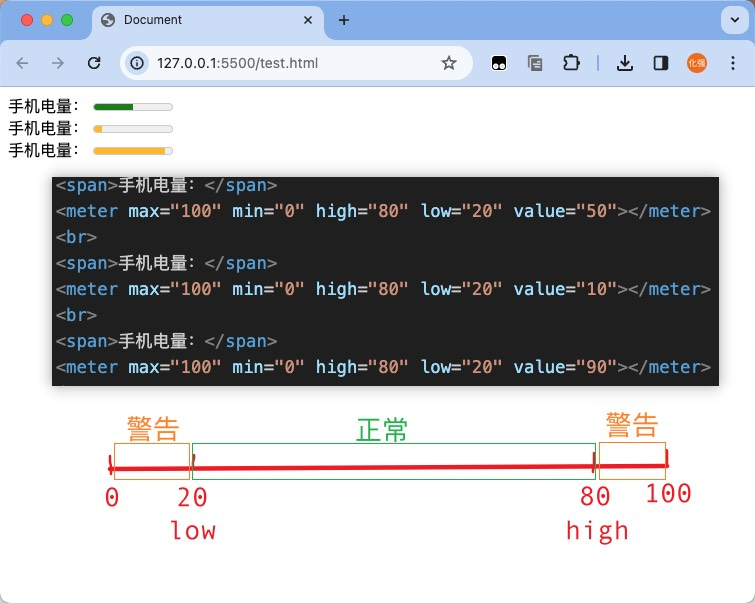
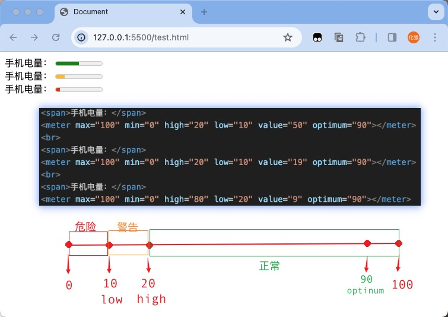
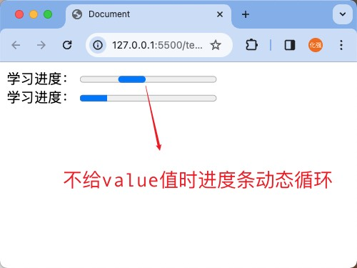
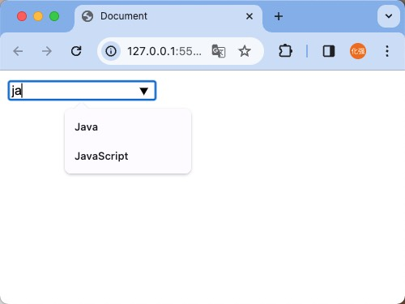
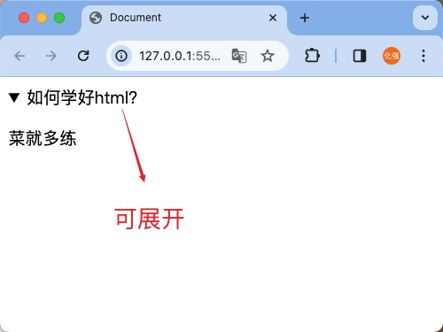
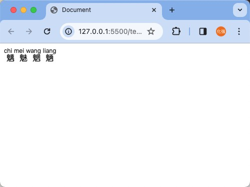
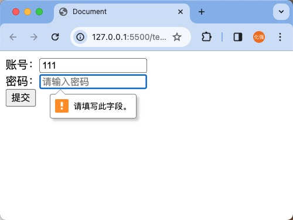
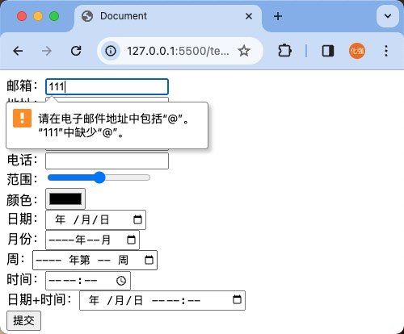

# HTML5

?> bilibili 尚硅谷 尚硅谷前端入门html+css零基础	https://www.bilibili.com/video/BV1p84y1P7Z5?p=160

## 1. 新增语义化标签

### 1.1 新增布局标签

| 标签名    | 语义                                                         | 单/双标签 |
| --------- | ------------------------------------------------------------ | --------- |
| `header`  | 整个页面，或者部分区域的头部                                 | 双标签    |
| `footer`  | 整个页面，或者部分区域的页脚/底部                            | 双标签    |
| `nav`     | 导航                                                         | 双标签    |
| `article` | 文章、帖子、杂志、新闻、博客、评论等                         | 双标签    |
| `section` | 页面中的某段文字，或文章中的某段文字（里面文字通常里面会包含标题） | 双标签    |
| `aside`   | 侧边栏                                                       | 双标签    |
| `main`    | 文档的主要内容 ( WHATWG 没有语义， IE 不支持)，几乎不用      | 双标签    |
| `haroup`  | 包裹连续的标题，如文章主标题、副标题的组合（ W3C 将其删除）  | 双标签    |

> **关于`article` 和`section`**
>
> 1. `artical` 里面可以有多个`section` 
> 2. `section`强调的是分段或分块，如果你想将一块内容分成几段的时候，可使用`section` 元素
>
> 3. `article`比`section`更强调独立性，一块内容如果比较独立、比较完整，应该使用article 元素


### 1.2 新增状态标签

#### 1.2.1  meter 标签

- 语义：定义已知范围内的标量测量。也被称为 gauge （尺度），双标签，例如：电量、磁盘用量等。

- 常用属性

  | 属性      | 值   | 描述       |
  | --------- | ---- | ---------- |
  | `high`    | 数值 | 规定高值   |
  | `low`     | 数值 | 规定低值   |
  | `max`     | 数值 | 规定最大值 |
  | `min`     | 数值 | 规定最小值 |
  | `optimum` | 数值 | 规定最优值 |
  | `value`   | 数值 | 规定当前值 |

  ```html
  <body>
    <span>手机电量：</span>
    <meter max="100" min="0" high="80" low="20" value="50"></meter>
    <br>
    <span>手机电量：</span>
    <meter max="100" min="0" high="80" low="20" value="10"></meter>
    <br>
    <span>手机电量：</span>
    <meter max="100" min="0" high="80" low="20" value="90"></meter>
  </body>
  ```

  

  

  ```html
  <body>
    <span>手机电量：</span>
    <meter max="100" min="0" high="20" low="10" value="50" optimum="90"></meter>
    <br>
    <span>手机电量：</span>
    <meter max="100" min="0" high="20" low="10" value="19" optimum="90"></meter>
    <br>
    <span>手机电量：</span>
    <meter max="100" min="0" high="80" low="20" value="9" optimum="90"></meter>
  </body>
  ```

  

  

#### 1.2.2 progress标签

- 语义：显示某个任务完成的进度的指示器，一般用于表示进度条，双标签，例如：工作完成进度等

- 常用属性如下：

  | 属性    | 值   | 描述       |
  | :------ | ---- | ---------- |
  | `max`   | 数值 | 规定目标值 |
  | `value` | 数值 | 规定目标值 |

  ```html
  <body>
    <span>学习进度：</span>
    <progress></progress>
  </body>
  ```

  

  

### 1.3 新增列表标签

| 标签名     | 语义                                        | 单双标签 |
| ---------- | ------------------------------------------- | -------- |
| `datalist` | 用于搜索框关键字的提示                      | 双标签   |
| `details`  | 用于展示问题和答案，或对专有名词进行解释    | 双标签   |
| `summary`  | 写在`details`里面，用于指定问题或者专有名词 | 双标签   |

```html
<body>
  <input type="text" list="data">
  <datalist id="data">
    <option value="Java">Java</option>
    <option value="JavaScript">JavaScript</option>
    <option value="C">C</option>
    <option value="C++">C++</option>
  </datalist>
</body>
```



```html
<body>
 <details>
  <summary>如何学好html？</summary>
  <p>菜就多练</p>
 </details>
</body>
```




### 1.4 新增文本标签

#### 1.4.1 文本注音

| 标签名称 | 语义                       | 单/双标签 |
| -------- | -------------------------- | --------- |
| `ruby`   | 包裹需要注音的文字         | 双标签    |
| `rt`     | 注音，注意要写在`ruby`里面 | 双标签    |

```html
<body>
 <ruby>
  <span>魑魅魍魉</span>
  <rt>chi mei wang liang</rt>
 </ruby>
</body>
```




#### 1.4.2 文本标记

| 标签名 | 语义 | 单双标签 |
| ------ | ---- | -------- |
| `mark` | 标记 | 双标签   |

!> 注意： W3C 建议 `mark` 用于标记搜索结果中的关键字


## 2. 新增表单功能

### 2.1 表单控件新增属性

| 属性名称       | 功能                                                         |
| -------------- | ------------------------------------------------------------ |
| `placeholder`  | 提示文字，适用于文字输入类的表单控件                         |
| `required`     | 表示该输入项必填， 适用于除按钮外其他表单控件。              |
| `autofocus`    | 自动获取焦点，适用于所有表单控件。                           |
| `autocomplete` | 自动完成，可以设置为on 或off ，适用于文字输入类的表单控件。<br />注意：密码输入框、多行输入框不可用 |
| `pattern`      | 填写正则表达式，适用于文本输入类表单控件。<br />注意：多行输入不可用，且空的输入框不会验证，往往与 `required` 配合 |

```html
<body>
  <form action="">
    账号：<input type="text" name="name" placeholder="请输入账号" required autofocus><br>
    密码：<input type="password" name="psw" placeholder="请输入密码" required><br>
    <button>提交</button>
  </form>
</body>
```




### 2.2 input新增属性值

| 属性名           | 功能                                                         |
| ---------------- | ------------------------------------------------------------ |
| `email`          | 邮箱类型的输入框，表单提交时会验证格式，输入为空则不验证格式。 |
| `url`            | url 类型的输入框，表单提交时会验证格式，输入为空则不验证格式。 |
| `number`         | 数字类型的输入框，表单提交时会验证格式，输入为空则不验证格式。 |
| `search`         | 搜索类型的输入框，表单提交时不会验证格式。                   |
| `tel`            | 电话类型的输入框，表单提交时不会验证格式，在移动端使用时，会唤起数字键盘。 |
| `range`          | 范围选择框，默认值为50 ，表单提交时不会验证格式。            |
| `color`          | 颜色选择框，默认值为黑色，表单提交时不会验证格式。           |
| `date`           | 日期选择框，默认值为空，表单提交时不会验证格式。             |
| `month`          | 月份选择框，默认值为空，表单提交时不会验证格式。             |
| `week`           | 周选择框，默认值为空，表单提交时不会验证格式。               |
| `time`           | 时间选择框，默认值为空，表单提交时不会验证格式。             |
| `datetime-local` | 日期+时间选择框，默认值为空，表单提交时不会验证格式          |

```html
<body>
  <form action="">
    邮箱：<input type="email" name=""><br>
    地址：<input type="url" name=""><br>
    数字：<input type="number" name="" max="100" min="0"><br>
    搜索：<input type="search" name=><br>
    电话：<input type="tel" name=""><br>
    范围：<input type="range" name=""><br>
    颜色：<input type="color" name=""><br>
    日期：<input type="date" name=""><br>
    月份：<input type="month" name=""><br>
    周：<input type="week" name=""><br>
    时间：<input type="time" name=""><br>
    日期+时间：<input type="datetime-local" name=""><br>
    <button>提交</button>
  </form>
</body>
```




### 2.3 form标签新增属性

| 属性名       | 功能                                                      |
| ------------ | --------------------------------------------------------- |
| `novalidate` | 如果给form 标签设置了该属性，表单提交的时候不再进行验证。 |


## 3. 新增多媒体标签

### 3.1 视频标签

`<video>`标签用来定义视频，它是双标签。

| 属性       | 值                           | 描述                                                         |
| ---------- | ---------------------------- | ------------------------------------------------------------ |
| `src`      | URL地址                      | 视频地址                                                     |
| `width`    | 像素值                       | 设置视频播放器的宽度                                         |
| `height`   | 像素值                       | 设置视频播放器的高度                                         |
| `controls` | -                            | 向用户显示视频控件（比如播放/暂停按钮）                      |
| `muted`    | -                            | 视频静音                                                     |
| `autoplay` | -                            | 视频自动播放                                                 |
| `loop`     | -                            | 循环播放                                                     |
| `poster`   | url地址                      | 视频封面                                                     |
| `preload`  | `auto` / `metadata` / `none` | 视频预加载，如果使用`autoplay` ，则忽略该属性。<br />`none` : 不预加载视频。<br />`metadata` : 仅预先获取视频的元数据（例如长度）。<br />`auto` : 可以下载整个视频文件，即使用户不希望使用它。 |


### 3.2 音频标签

`<audio>`标签用来定义音频，它是双标签。

| 属性       | 值                           | 描述                                                         |
| ---------- | ---------------------------- | ------------------------------------------------------------ |
| `src`      | URL地址                      | 视频地址                                                     |
| `controls` | -                            | 向用户显示视频控件（比如播放/暂停按钮）                      |
| `autoplay` | -                            | 视频自动播放                                                 |
| `muted`    | -                            | 视频静音                                                     |
| `loop`     | -                            | 循环播放                                                     |
| `preload`  | `auto` / `metadata` / `none` | 视频预加载，如果使用`autoplay` ，则忽略该属性。<br />`none` : 不预加载视频。<br />`metadata` : 仅预先获取视频的元数据（例如长度）。<br />`auto` : 可以下载整个视频文件，即使用户不希望使用它。 |


### 3.4 新增全局属性

| 属性名            | 功能                                                         |
| ----------------- | ------------------------------------------------------------ |
| `contenteditable` | 表示元素是否可被用户编辑，可选值如下：<br />`true` ：可编辑<br />`false` ：不可编辑 |
| `draggable`       | 表示元素可以被拖动，可选值如下：<br />`true` ：可拖动<br />`false` ：不可拖动 |
| `spellcheck`      | 规定是否对元素进行拼写和语法检查，可选值如下：<br />`true` ：检查<br />`false` ：不检查 |
| `contextmenu`     | 规定元素的上下文菜单，在用户鼠标右键点击元素时显示。         |
| `data-*`          | 用于存储页面的私有定制数据。                                 |
| `hidden`          | 隐藏元素                                                     |


### 3.5 html5兼容性处理

- 添加元信息，让浏览器处于最优渲染模式。

  ```html
  <!--设置IE总是使用最新的文档模式进行渲染-->
  <meta http-equiv="X-UA-Compatible" content="IE=Edge">
  <!--优先使用 webkit ( Chromium ) 内核进行渲染, 针对360等壳浏览器-->
  <meta name="renderer" content="webkit">
  ```

- 使用html5shiv 让低版本浏览器认识H5 的语义化标签。

  ```html
  <!--[if lt ie 9]>
  <script src="../sources/js/html5shiv.js"></script>
  <![endif]-->
  ```

- 推展
  
  
  > `lt` 小于
  >
  > `lte` 小于等于
  >
  > `gt` 大于
  >
  > `gte` 大于等于
  >
  > `!` 逻辑非
  
  ```html
  <!--[if IE 8]>仅IE8可见<![endif]-->
  <!--[if gt IE 8]>仅IE8以上可见<![endif]—>
  <!--[if lt IE 8]>仅IE8以下可见<![endif]—>
  <!--[if gte IE 8]>IE8及以上可见<![endif]—>
  <!--[if lte IE 8]>IE8及以下可见<![endif]—>
  <!--[if !IE 8]>非IE8的IE可见<![endif]-->
  ```

